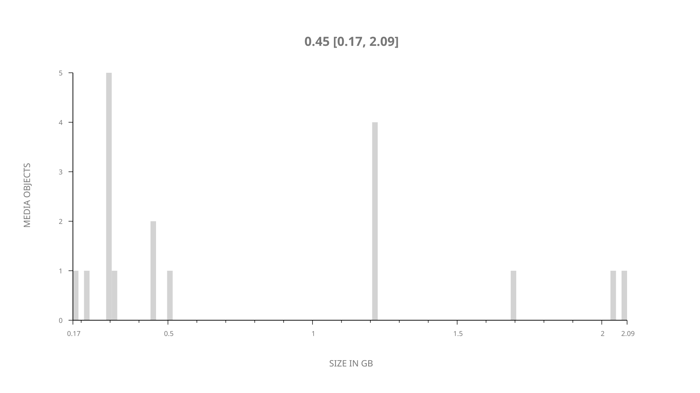
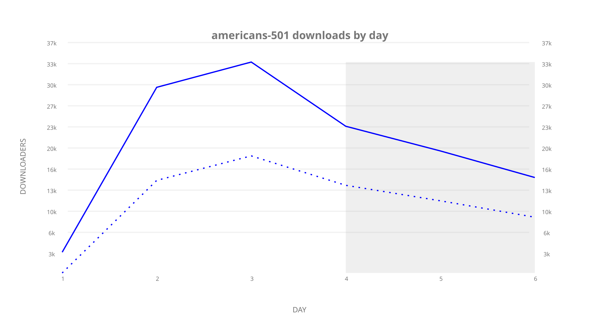
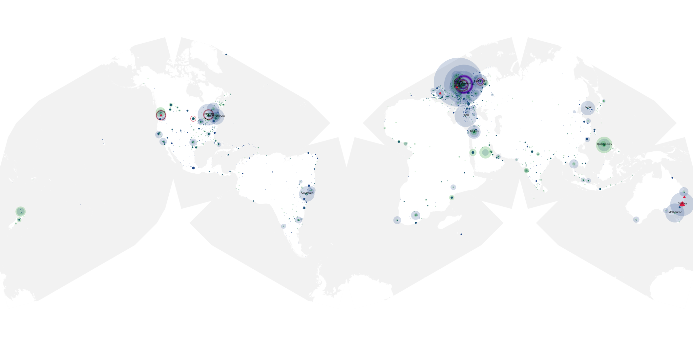
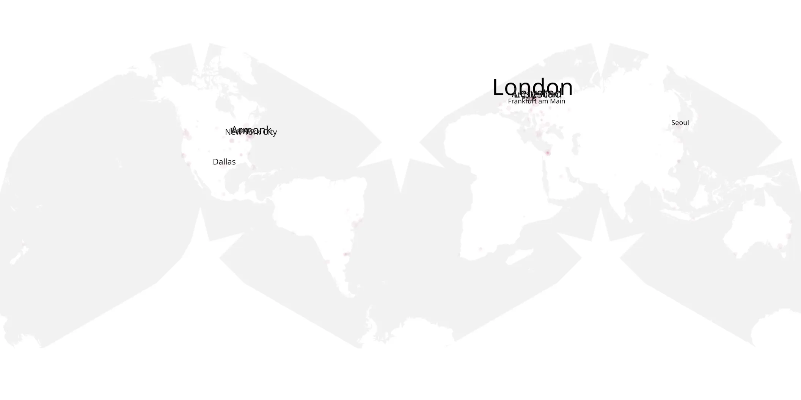
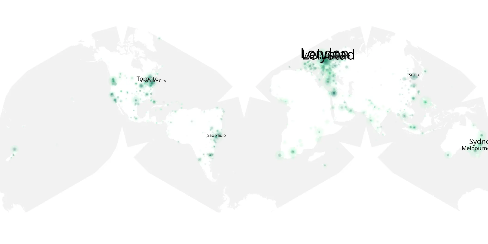

# americans-501 sample cache audit

## 1. Media object

| Field | Value |
| --- | --- |
| Media object | The Americans |
| Collection key | `americans-501` |
| imdb_id | [tt2149175](https://www.imdb.com/title/tt2149175/) |
| wikipedia_url | [The Americans](https://en.wikipedia.org/wiki/The_Americans) |
| Sample dates | 2017-03-07-to-2017-03-12 |
| Sample days | 6 |
| BTIH count | 21 |
| Unique BTIH count | 18 |
| Downloaders total | 136,253 |
| Uploaders total | 82,042 |
| Data version | `2026-08-05` |
| IP geolocation version | `6:1777968300` |

## 2. Coverage report

- Generated: 2026-09-09T01:10:35Z
- Sample archive directory: `/mnt/gold/src/alpha60-samples-raw.gold/americans-501.xz`
- Hour directories: 30
- Zero-length sample files: 0
- Other unparsable sample files: 0
- Hourly discontinuities: 29 (87 missing hours)
- Missing days: 0

### Sample archive discontinuities

- hourly gap: last `2017-03-07 23:00`, resumed `2017-03-08 03:00` — missing 3 hour(s)
- hourly gap: last `2017-03-08 03:00`, resumed `2017-03-08 07:00` — missing 3 hour(s)
- hourly gap: last `2017-03-08 07:00`, resumed `2017-03-08 11:00` — missing 3 hour(s)
- hourly gap: last `2017-03-08 11:00`, resumed `2017-03-08 15:00` — missing 3 hour(s)
- hourly gap: last `2017-03-08 15:00`, resumed `2017-03-08 19:00` — missing 3 hour(s)
- hourly gap: last `2017-03-08 19:00`, resumed `2017-03-08 23:00` — missing 3 hour(s)
- hourly gap: last `2017-03-08 23:00`, resumed `2017-03-09 03:00` — missing 3 hour(s)
- hourly gap: last `2017-03-09 03:00`, resumed `2017-03-09 07:00` — missing 3 hour(s)
- hourly gap: last `2017-03-09 07:00`, resumed `2017-03-09 11:00` — missing 3 hour(s)
- hourly gap: last `2017-03-09 11:00`, resumed `2017-03-09 15:00` — missing 3 hour(s)
- hourly gap: last `2017-03-09 15:00`, resumed `2017-03-09 19:00` — missing 3 hour(s)
- hourly gap: last `2017-03-09 19:00`, resumed `2017-03-09 23:00` — missing 3 hour(s)
- hourly gap: last `2017-03-09 23:00`, resumed `2017-03-10 03:00` — missing 3 hour(s)
- hourly gap: last `2017-03-10 03:00`, resumed `2017-03-10 07:00` — missing 3 hour(s)
- hourly gap: last `2017-03-10 07:00`, resumed `2017-03-10 11:00` — missing 3 hour(s)
- hourly gap: last `2017-03-10 11:00`, resumed `2017-03-10 15:00` — missing 3 hour(s)
- hourly gap: last `2017-03-10 15:00`, resumed `2017-03-10 19:00` — missing 3 hour(s)
- hourly gap: last `2017-03-10 19:00`, resumed `2017-03-10 23:00` — missing 3 hour(s)
- hourly gap: last `2017-03-10 23:00`, resumed `2017-03-11 03:00` — missing 3 hour(s)
- hourly gap: last `2017-03-11 03:00`, resumed `2017-03-11 07:00` — missing 3 hour(s)
- hourly gap: last `2017-03-11 07:00`, resumed `2017-03-11 11:00` — missing 3 hour(s)
- hourly gap: last `2017-03-11 11:00`, resumed `2017-03-11 15:00` — missing 3 hour(s)
- hourly gap: last `2017-03-11 15:00`, resumed `2017-03-11 19:00` — missing 3 hour(s)
- hourly gap: last `2017-03-11 19:00`, resumed `2017-03-11 23:00` — missing 3 hour(s)
- hourly gap: last `2017-03-11 23:00`, resumed `2017-03-12 04:00` — missing 4 hour(s)
- hourly gap: last `2017-03-12 04:00`, resumed `2017-03-12 08:00` — missing 3 hour(s)
- hourly gap: last `2017-03-12 08:00`, resumed `2017-03-12 12:00` — missing 3 hour(s)
- hourly gap: last `2017-03-12 12:00`, resumed `2017-03-12 16:00` — missing 3 hour(s)
- hourly gap: last `2017-03-12 16:00`, resumed `2017-03-12 19:01` — missing 2 hour(s)

## 3. File sizes histogram *median[lowest, highest]*

## 4. Graphs

### Downloads by week cumulative (normalized start)



### Downloads by day, Saturday and Sunday in gray

## 5. Cumulative Maps

<!-- https://raw.githubusercontent.com/alpha60-devops/alpha60-results-2017/refs/heads/main/data/ -->

### <a href="https://raw.githubusercontent.com/alpha60-devops/alpha60-results-2017/refs/heads/main/data/geojson.cumulative/americans-501-cumulative-aggregate.geojson.gz" data-map-title="The Americans — americans-501" onclick="leaflet_map_open_window(this.href, this.dataset.mapTitle); return false;" class="table-link" aria-label="Open The Americans (americans-501) cumulative data map in new window" title="Opens interactive map for The Americans (americans-501) data">Swarm Detail</a>

### Geographic Regions

| Africa | Americas | Asia | Europe | Oceania | Unknown |
| --- | --- | --- | --- | --- | --- |
| 2.42 | 21.45 | 10.48 | 27.17 | 4.65 | 0.37 |

### Network infrastructure

{:target="_blank" rel="noopener"}

### Resolution >= 1080p

{:target="_blank" rel="noopener"}

### Resolution < 1080p

{:target="_blank" rel="noopener"}
