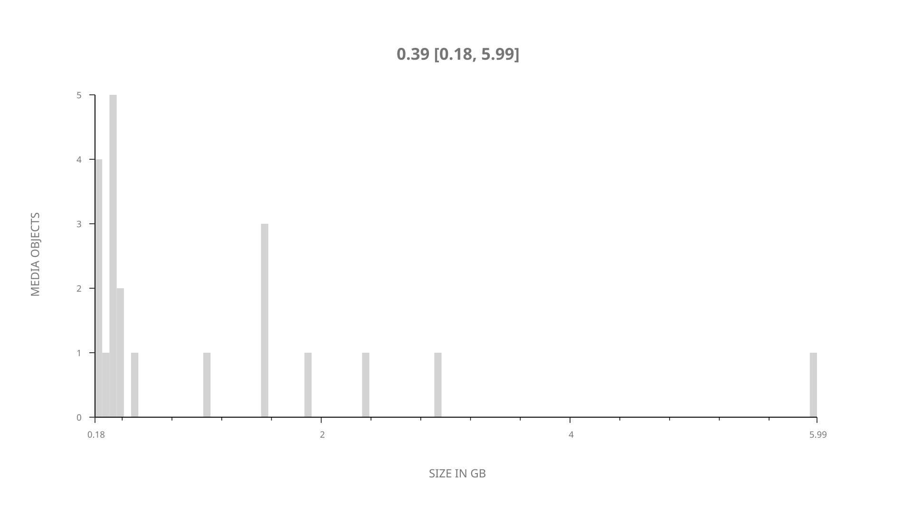
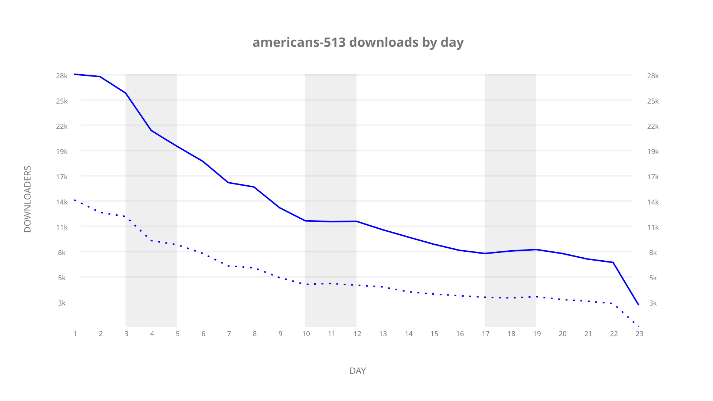
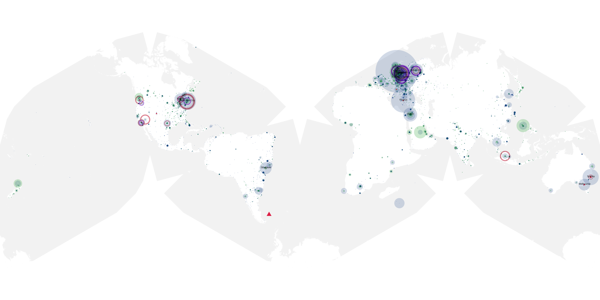
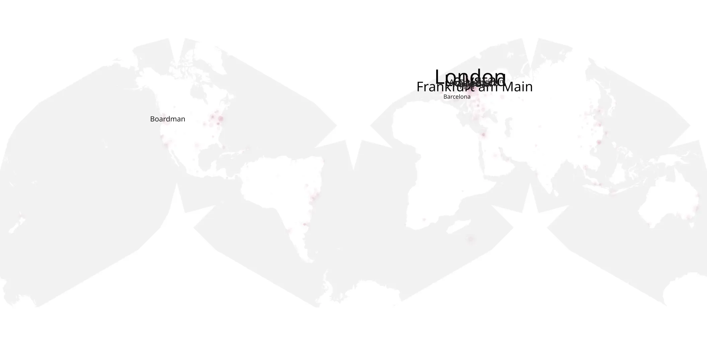
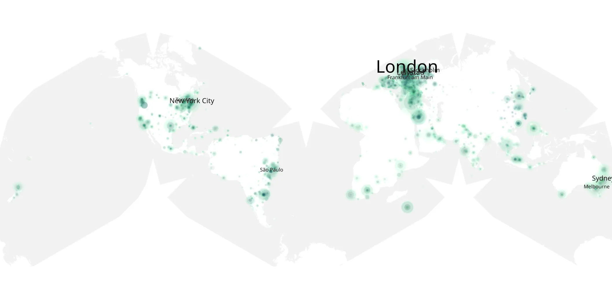

# americans-513 sample cache audit

## 1. Media object

| Field | Value |
| --- | --- |
| Media object | The Americans |
| Collection key | `americans-513` |
| imdb_id | [tt2149175](https://www.imdb.com/title/tt2149175/) |
| wikipedia_url | [The Americans](https://en.wikipedia.org/wiki/The_Americans) |
| Sample dates | 2017-05-31-to-2017-06-22 |
| Sample days | 23 |
| BTIH count | 21 |
| Unique BTIH count | 21 |
| Downloaders total | 185,284 |
| Uploaders total | 103,095 |
| Data version | `2026-08-05` |
| IP geolocation version | `6:1777968300` |

## 2. Sample coverage report

- Generated: 2026-09-09T01:10:35Z
- Sample archive directory: `/mnt/gold/src/alpha60-samples-raw.gold/americans-513.xz`
- Hour directories: 134
- Zero-length sample files: 0
- Other unparsable sample files: 0
- Hourly discontinuities: 133 (400 missing hours)
- Missing days: 0

### Sample archive discontinuities

- hourly gap: last `2017-05-31 00:00`, resumed `2017-05-31 04:00` — missing 3 hour(s)
- hourly gap: last `2017-05-31 04:00`, resumed `2017-05-31 08:00` — missing 3 hour(s)
- hourly gap: last `2017-05-31 08:00`, resumed `2017-05-31 12:00` — missing 3 hour(s)
- hourly gap: last `2017-05-31 12:00`, resumed `2017-05-31 16:00` — missing 3 hour(s)
- hourly gap: last `2017-05-31 16:00`, resumed `2017-05-31 20:00` — missing 3 hour(s)
- hourly gap: last `2017-05-31 20:00`, resumed `2017-06-01 00:00` — missing 3 hour(s)
- hourly gap: last `2017-06-01 00:00`, resumed `2017-06-01 04:00` — missing 3 hour(s)
- hourly gap: last `2017-06-01 04:00`, resumed `2017-06-01 08:00` — missing 3 hour(s)
- hourly gap: last `2017-06-01 08:00`, resumed `2017-06-01 12:00` — missing 3 hour(s)
- hourly gap: last `2017-06-01 12:00`, resumed `2017-06-01 16:00` — missing 3 hour(s)
- hourly gap: last `2017-06-01 16:00`, resumed `2017-06-01 20:00` — missing 3 hour(s)
- hourly gap: last `2017-06-01 20:00`, resumed `2017-06-02 00:00` — missing 3 hour(s)
- hourly gap: last `2017-06-02 00:00`, resumed `2017-06-02 04:00` — missing 3 hour(s)
- hourly gap: last `2017-06-02 04:00`, resumed `2017-06-02 08:00` — missing 3 hour(s)
- hourly gap: last `2017-06-02 08:00`, resumed `2017-06-02 12:00` — missing 3 hour(s)
- hourly gap: last `2017-06-02 12:00`, resumed `2017-06-02 16:00` — missing 3 hour(s)
- hourly gap: last `2017-06-02 16:00`, resumed `2017-06-02 20:00` — missing 3 hour(s)
- hourly gap: last `2017-06-02 20:00`, resumed `2017-06-03 00:00` — missing 3 hour(s)
- hourly gap: last `2017-06-03 00:00`, resumed `2017-06-03 04:00` — missing 3 hour(s)
- hourly gap: last `2017-06-03 04:00`, resumed `2017-06-03 08:00` — missing 3 hour(s)
- hourly gap: last `2017-06-03 08:00`, resumed `2017-06-03 12:00` — missing 3 hour(s)
- hourly gap: last `2017-06-03 12:00`, resumed `2017-06-03 16:00` — missing 3 hour(s)
- hourly gap: last `2017-06-03 16:00`, resumed `2017-06-03 20:00` — missing 3 hour(s)
- hourly gap: last `2017-06-03 20:00`, resumed `2017-06-04 00:00` — missing 3 hour(s)
- hourly gap: last `2017-06-04 00:00`, resumed `2017-06-04 04:00` — missing 3 hour(s)
- hourly gap: last `2017-06-04 04:00`, resumed `2017-06-04 08:00` — missing 3 hour(s)
- hourly gap: last `2017-06-04 08:00`, resumed `2017-06-04 12:00` — missing 3 hour(s)
- hourly gap: last `2017-06-04 12:00`, resumed `2017-06-04 16:00` — missing 3 hour(s)
- hourly gap: last `2017-06-04 16:00`, resumed `2017-06-04 20:00` — missing 3 hour(s)
- hourly gap: last `2017-06-04 20:00`, resumed `2017-06-05 00:00` — missing 3 hour(s)
- hourly gap: last `2017-06-05 00:00`, resumed `2017-06-05 04:00` — missing 3 hour(s)
- hourly gap: last `2017-06-05 04:00`, resumed `2017-06-05 08:00` — missing 3 hour(s)
- hourly gap: last `2017-06-05 08:00`, resumed `2017-06-05 12:00` — missing 3 hour(s)
- hourly gap: last `2017-06-05 12:00`, resumed `2017-06-05 16:00` — missing 3 hour(s)
- hourly gap: last `2017-06-05 16:00`, resumed `2017-06-05 20:00` — missing 3 hour(s)
- hourly gap: last `2017-06-05 20:00`, resumed `2017-06-06 00:00` — missing 3 hour(s)
- hourly gap: last `2017-06-06 00:00`, resumed `2017-06-06 04:00` — missing 3 hour(s)
- hourly gap: last `2017-06-06 04:00`, resumed `2017-06-06 08:00` — missing 3 hour(s)
- hourly gap: last `2017-06-06 08:00`, resumed `2017-06-06 12:00` — missing 3 hour(s)
- hourly gap: last `2017-06-06 12:00`, resumed `2017-06-06 16:00` — missing 3 hour(s)
- hourly gap: last `2017-06-06 16:00`, resumed `2017-06-06 20:00` — missing 3 hour(s)
- hourly gap: last `2017-06-06 20:00`, resumed `2017-06-07 00:00` — missing 3 hour(s)
- hourly gap: last `2017-06-07 00:00`, resumed `2017-06-07 04:00` — missing 3 hour(s)
- hourly gap: last `2017-06-07 04:00`, resumed `2017-06-07 08:00` — missing 3 hour(s)
- hourly gap: last `2017-06-07 08:00`, resumed `2017-06-07 12:00` — missing 3 hour(s)
- hourly gap: last `2017-06-07 12:00`, resumed `2017-06-07 16:00` — missing 3 hour(s)
- hourly gap: last `2017-06-07 16:00`, resumed `2017-06-07 20:00` — missing 3 hour(s)
- hourly gap: last `2017-06-07 20:00`, resumed `2017-06-08 00:00` — missing 3 hour(s)
- hourly gap: last `2017-06-08 00:00`, resumed `2017-06-08 04:00` — missing 3 hour(s)
- hourly gap: last `2017-06-08 04:00`, resumed `2017-06-08 09:00` — missing 4 hour(s)
- hourly gap: last `2017-06-08 09:00`, resumed `2017-06-08 13:00` — missing 3 hour(s)
- hourly gap: last `2017-06-08 13:00`, resumed `2017-06-08 17:00` — missing 3 hour(s)
- hourly gap: last `2017-06-08 17:00`, resumed `2017-06-08 21:00` — missing 3 hour(s)
- hourly gap: last `2017-06-08 21:00`, resumed `2017-06-09 01:00` — missing 3 hour(s)
- hourly gap: last `2017-06-09 01:00`, resumed `2017-06-09 05:00` — missing 3 hour(s)
- hourly gap: last `2017-06-09 05:00`, resumed `2017-06-09 09:00` — missing 3 hour(s)
- hourly gap: last `2017-06-09 09:00`, resumed `2017-06-09 13:00` — missing 3 hour(s)
- hourly gap: last `2017-06-09 13:00`, resumed `2017-06-09 17:00` — missing 3 hour(s)
- hourly gap: last `2017-06-09 17:00`, resumed `2017-06-09 21:00` — missing 3 hour(s)
- hourly gap: last `2017-06-09 21:00`, resumed `2017-06-10 01:00` — missing 3 hour(s)
- hourly gap: last `2017-06-10 01:00`, resumed `2017-06-10 05:00` — missing 3 hour(s)
- hourly gap: last `2017-06-10 05:00`, resumed `2017-06-10 09:00` — missing 3 hour(s)
- hourly gap: last `2017-06-10 09:00`, resumed `2017-06-10 13:00` — missing 3 hour(s)
- hourly gap: last `2017-06-10 13:00`, resumed `2017-06-10 17:00` — missing 3 hour(s)
- hourly gap: last `2017-06-10 17:00`, resumed `2017-06-10 21:00` — missing 3 hour(s)
- hourly gap: last `2017-06-10 21:00`, resumed `2017-06-11 01:00` — missing 3 hour(s)
- hourly gap: last `2017-06-11 01:00`, resumed `2017-06-11 05:00` — missing 3 hour(s)
- hourly gap: last `2017-06-11 05:00`, resumed `2017-06-11 09:00` — missing 3 hour(s)
- hourly gap: last `2017-06-11 09:00`, resumed `2017-06-11 13:00` — missing 3 hour(s)
- hourly gap: last `2017-06-11 13:00`, resumed `2017-06-11 17:00` — missing 3 hour(s)
- hourly gap: last `2017-06-11 17:00`, resumed `2017-06-11 21:00` — missing 3 hour(s)
- hourly gap: last `2017-06-11 21:00`, resumed `2017-06-12 01:00` — missing 3 hour(s)
- hourly gap: last `2017-06-12 01:00`, resumed `2017-06-12 05:00` — missing 3 hour(s)
- hourly gap: last `2017-06-12 05:00`, resumed `2017-06-12 09:00` — missing 3 hour(s)
- hourly gap: last `2017-06-12 09:00`, resumed `2017-06-12 13:00` — missing 3 hour(s)
- hourly gap: last `2017-06-12 13:00`, resumed `2017-06-12 17:00` — missing 3 hour(s)
- hourly gap: last `2017-06-12 17:00`, resumed `2017-06-12 21:00` — missing 3 hour(s)
- hourly gap: last `2017-06-12 21:00`, resumed `2017-06-13 01:00` — missing 3 hour(s)
- hourly gap: last `2017-06-13 01:00`, resumed `2017-06-13 05:00` — missing 3 hour(s)
- hourly gap: last `2017-06-13 05:00`, resumed `2017-06-13 09:00` — missing 3 hour(s)
- hourly gap: last `2017-06-13 09:00`, resumed `2017-06-13 13:00` — missing 3 hour(s)
- hourly gap: last `2017-06-13 13:00`, resumed `2017-06-13 17:00` — missing 3 hour(s)
- hourly gap: last `2017-06-13 17:00`, resumed `2017-06-13 21:00` — missing 3 hour(s)
- hourly gap: last `2017-06-13 21:00`, resumed `2017-06-14 01:00` — missing 3 hour(s)
- hourly gap: last `2017-06-14 01:00`, resumed `2017-06-14 05:00` — missing 3 hour(s)
- hourly gap: last `2017-06-14 05:00`, resumed `2017-06-14 09:00` — missing 3 hour(s)
- hourly gap: last `2017-06-14 09:00`, resumed `2017-06-14 13:00` — missing 3 hour(s)
- hourly gap: last `2017-06-14 13:00`, resumed `2017-06-14 17:00` — missing 3 hour(s)
- hourly gap: last `2017-06-14 17:00`, resumed `2017-06-14 21:00` — missing 3 hour(s)
- hourly gap: last `2017-06-14 21:00`, resumed `2017-06-15 01:00` — missing 3 hour(s)
- hourly gap: last `2017-06-15 01:00`, resumed `2017-06-15 05:00` — missing 3 hour(s)
- hourly gap: last `2017-06-15 05:00`, resumed `2017-06-15 09:00` — missing 3 hour(s)
- hourly gap: last `2017-06-15 09:00`, resumed `2017-06-15 13:00` — missing 3 hour(s)
- hourly gap: last `2017-06-15 13:00`, resumed `2017-06-15 17:00` — missing 3 hour(s)
- hourly gap: last `2017-06-15 17:00`, resumed `2017-06-15 21:00` — missing 3 hour(s)
- hourly gap: last `2017-06-15 21:00`, resumed `2017-06-16 01:00` — missing 3 hour(s)
- hourly gap: last `2017-06-16 01:00`, resumed `2017-06-16 05:00` — missing 3 hour(s)
- hourly gap: last `2017-06-16 05:00`, resumed `2017-06-16 09:00` — missing 3 hour(s)
- hourly gap: last `2017-06-16 09:00`, resumed `2017-06-16 13:00` — missing 3 hour(s)
- hourly gap: last `2017-06-16 13:00`, resumed `2017-06-16 17:00` — missing 3 hour(s)
- hourly gap: last `2017-06-16 17:00`, resumed `2017-06-16 21:00` — missing 3 hour(s)
- hourly gap: last `2017-06-16 21:00`, resumed `2017-06-17 01:00` — missing 3 hour(s)
- hourly gap: last `2017-06-17 01:00`, resumed `2017-06-17 05:00` — missing 3 hour(s)
- hourly gap: last `2017-06-17 05:00`, resumed `2017-06-17 09:00` — missing 3 hour(s)
- hourly gap: last `2017-06-17 09:00`, resumed `2017-06-17 13:00` — missing 3 hour(s)
- hourly gap: last `2017-06-17 13:00`, resumed `2017-06-17 17:00` — missing 3 hour(s)
- hourly gap: last `2017-06-17 17:00`, resumed `2017-06-17 21:00` — missing 3 hour(s)
- hourly gap: last `2017-06-17 21:00`, resumed `2017-06-18 01:00` — missing 3 hour(s)
- hourly gap: last `2017-06-18 01:00`, resumed `2017-06-18 05:00` — missing 3 hour(s)
- hourly gap: last `2017-06-18 05:00`, resumed `2017-06-18 09:00` — missing 3 hour(s)
- hourly gap: last `2017-06-18 09:00`, resumed `2017-06-18 13:00` — missing 3 hour(s)
- hourly gap: last `2017-06-18 13:00`, resumed `2017-06-18 17:00` — missing 3 hour(s)
- hourly gap: last `2017-06-18 17:00`, resumed `2017-06-18 21:00` — missing 3 hour(s)
- hourly gap: last `2017-06-18 21:00`, resumed `2017-06-19 01:00` — missing 3 hour(s)
- hourly gap: last `2017-06-19 01:00`, resumed `2017-06-19 05:00` — missing 3 hour(s)
- hourly gap: last `2017-06-19 05:00`, resumed `2017-06-19 09:00` — missing 3 hour(s)
- hourly gap: last `2017-06-19 09:00`, resumed `2017-06-19 13:00` — missing 3 hour(s)
- hourly gap: last `2017-06-19 13:00`, resumed `2017-06-19 17:00` — missing 3 hour(s)
- hourly gap: last `2017-06-19 17:00`, resumed `2017-06-19 21:00` — missing 3 hour(s)
- hourly gap: last `2017-06-19 21:00`, resumed `2017-06-20 01:00` — missing 3 hour(s)
- hourly gap: last `2017-06-20 01:00`, resumed `2017-06-20 05:00` — missing 3 hour(s)
- hourly gap: last `2017-06-20 05:00`, resumed `2017-06-20 09:00` — missing 3 hour(s)
- hourly gap: last `2017-06-20 09:00`, resumed `2017-06-20 13:00` — missing 3 hour(s)
- hourly gap: last `2017-06-20 13:00`, resumed `2017-06-20 17:00` — missing 3 hour(s)
- hourly gap: last `2017-06-20 17:00`, resumed `2017-06-20 21:00` — missing 3 hour(s)
- hourly gap: last `2017-06-20 21:00`, resumed `2017-06-21 01:00` — missing 3 hour(s)
- hourly gap: last `2017-06-21 01:00`, resumed `2017-06-21 05:00` — missing 3 hour(s)
- hourly gap: last `2017-06-21 05:00`, resumed `2017-06-21 09:00` — missing 3 hour(s)
- hourly gap: last `2017-06-21 09:00`, resumed `2017-06-21 13:00` — missing 3 hour(s)
- hourly gap: last `2017-06-21 13:00`, resumed `2017-06-21 17:00` — missing 3 hour(s)
- hourly gap: last `2017-06-21 17:00`, resumed `2017-06-21 21:00` — missing 3 hour(s)
- hourly gap: last `2017-06-21 21:00`, resumed `2017-06-22 01:00` — missing 3 hour(s)
- hourly gap: last `2017-06-22 01:00`, resumed `2017-06-22 05:00` — missing 3 hour(s)

## 3. Media objects file size histogram

## 4. Visualization pass — graphs

### Downloads by week cumulative (normalized start)



### Downloads by day, Saturday and Sunday in gray

## 5. Visualization pass — maps

### Cumulative geographic slices

| Africa | Americas | Asia | Europe | Oceania | Unknown |
| --- | --- | --- | --- | --- | --- |
| 4.29 | 23.35 | 15.02 | 34.17 | 4.32 | 0.54 |

### Cumulative network infrastructure

{:target="_blank" rel="noopener"}

### Cumulative data maps

**Cumulative >= 1080p**

{:target="_blank" rel="noopener"}

**Cumulative < 1080p**

{:target="_blank" rel="noopener"}
