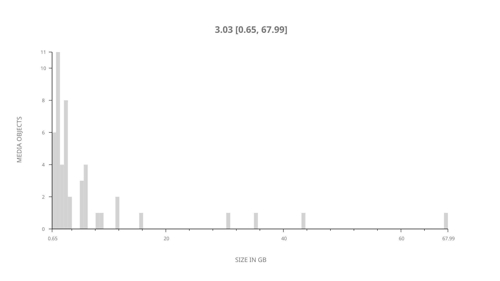
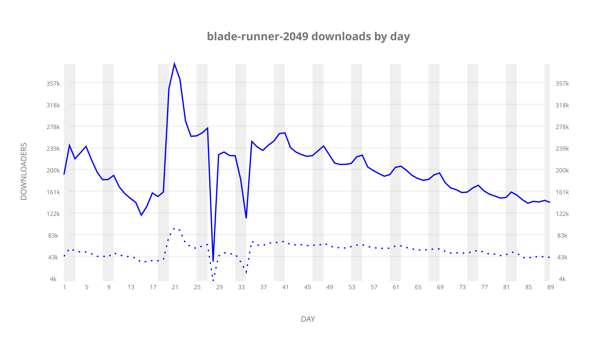
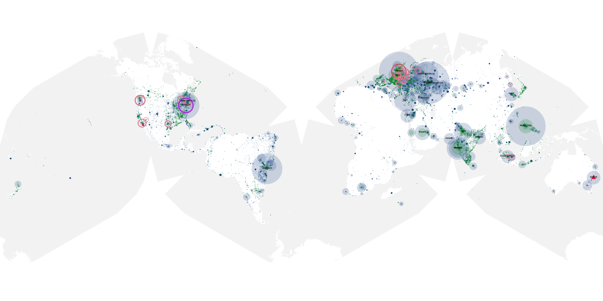
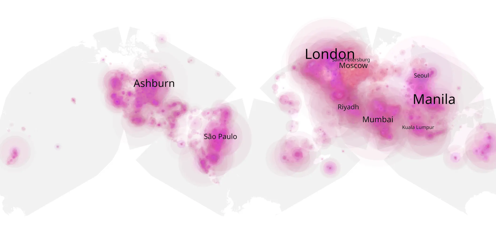
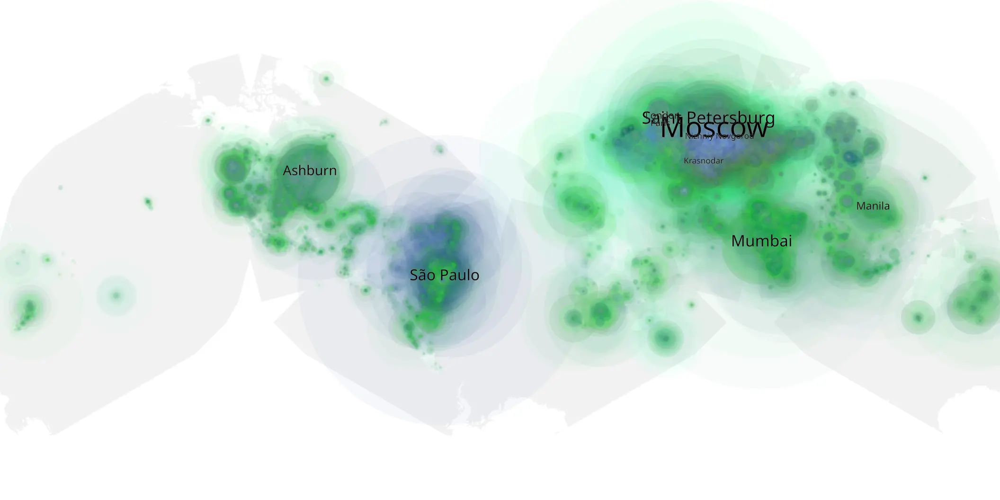

# blade-runner-2049 sample cache audit

## 1. Media object

| Field | Value |
| --- | --- |
| Media object | Blade Runner 2049 |
| Collection key | `blade-runner-2049` |
| imdb_id | [tt1856101](https://www.imdb.com/title/tt1856101/) |
| wikipedia_url | [Blade Runner 2049](https://en.wikipedia.org/wiki/Blade_Runner_2049) |
| Sample dates | 2017-12-29-to-2018-03-31 |
| Sample days | 93 |
| BTIH count | 47 |
| Unique BTIH count | 47 |
| Downloaders total | 8,193,457 |
| Uploaders total | 2,336,428 |
| Data version | `2026-08-05` |
| IP geolocation version | `6:1777968300` |

## 2. Coverage report

- Generated: 2026-09-08T01:09:42Z
- Sample archive directory: `/mnt/gold/src/alpha60-samples-raw.gold/eoy-2017-2018.xz`
- Hour directories: 3575
- Zero-length sample files: 0
- Other unparsable sample files: 0
- Hourly discontinuities: 2 (125 missing hours)
- Missing days: 4

### Sample archive discontinuities

- hourly gap: last `2018-01-12 19:00`, resumed `2018-01-17 01:34` — missing 101 hour(s)
- hourly gap: last `2018-01-28 22:00`, resumed `2018-01-29 23:00` — missing 24 hour(s)
- missing day: `2018-01-13`
- missing day: `2018-01-14`
- missing day: `2018-01-15`
- missing day: `2018-01-16`

## 3. File sizes histogram *median[lowest, highest]*

## 4. Graphs

### Downloads by week cumulative (normalized start)



### Downloads by day, Saturday and Sunday in gray

## 5. Cumulative Maps

<!-- https://raw.githubusercontent.com/alpha60-devops/alpha60-results-2017/refs/heads/main/data/ -->

### <a href="https://raw.githubusercontent.com/alpha60-devops/alpha60-results-2017/refs/heads/main/data/geojson.cumulative/blade-runner-2049-cumulative-aggregate.geojson.gz" data-map-title="Blade Runner 2049 — blade-runner-2049" onclick="leaflet_map_open_window(this.href, this.dataset.mapTitle); return false;" class="table-link" aria-label="Open Blade Runner 2049 (blade-runner-2049) cumulative data map in new window" title="Opens interactive map for Blade Runner 2049 (blade-runner-2049) data">Swarm Detail</a>

### Geographic Regions

| Africa | Americas | Asia | Europe | Oceania | Unknown |
| --- | --- | --- | --- | --- | --- |
| 7.47 | 19.64 | 21.88 | 34.57 | 1.83 | 0.83 |

### Network infrastructure

{:target="_blank" rel="noopener"}

### Resolution >= 1080p

{:target="_blank" rel="noopener"}

### Resolution < 1080p

{:target="_blank" rel="noopener"}
