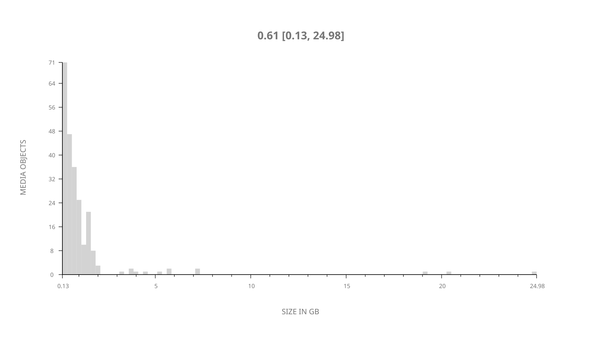
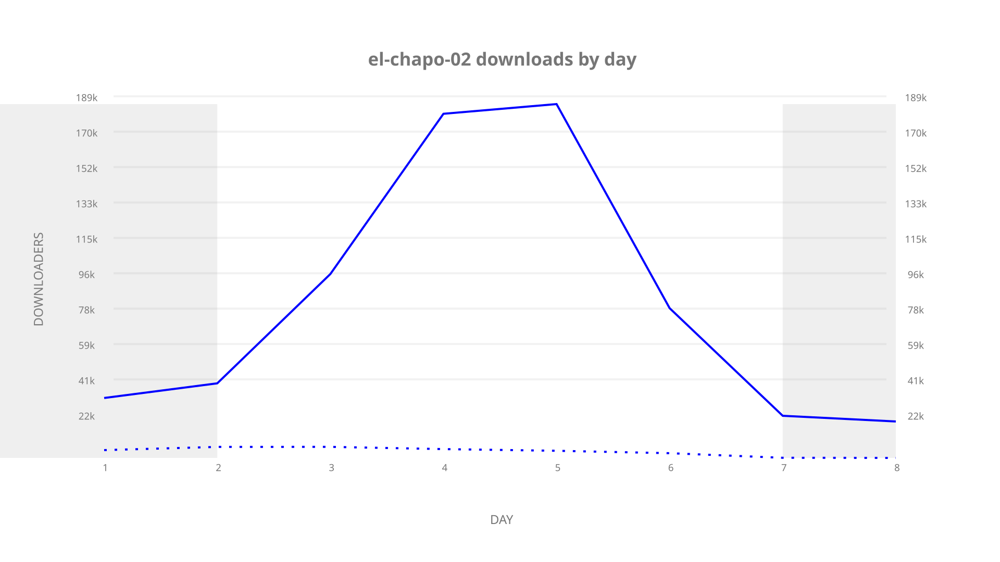
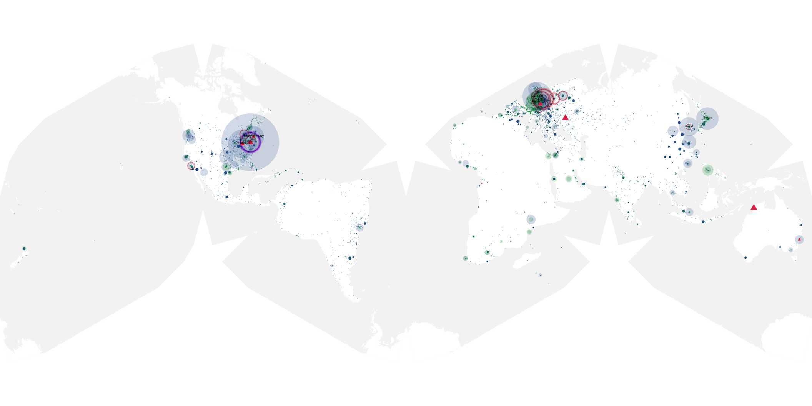
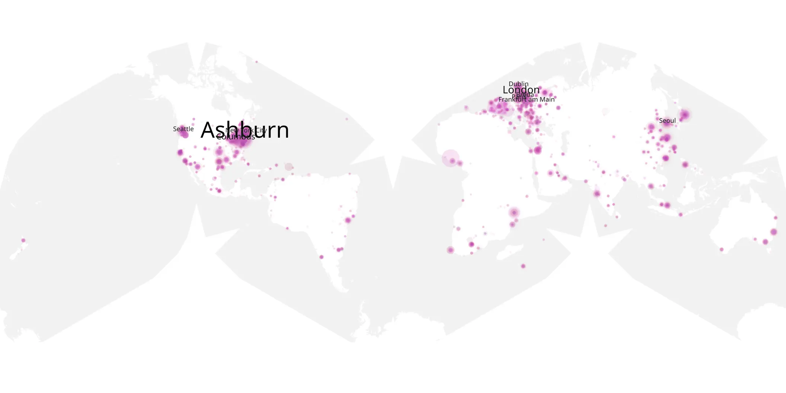
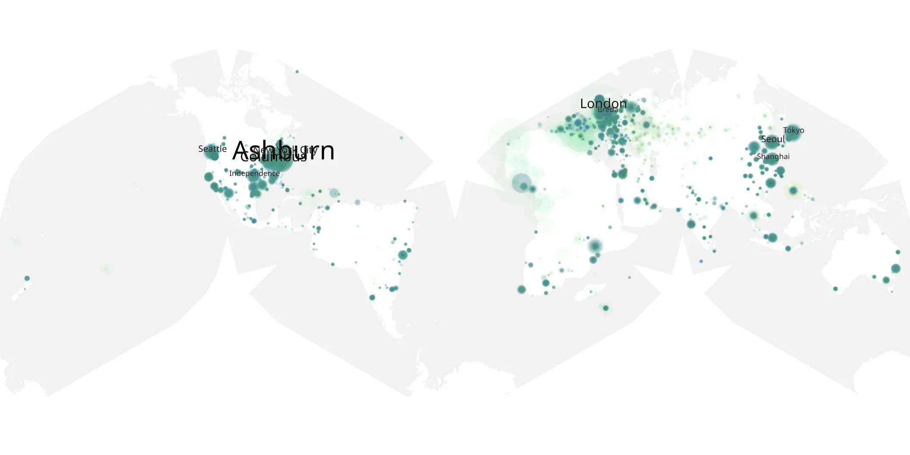

# el-chapo-02 sample cache audit

## 1. Media object

| Field | Value |
| --- | --- |
| Media object | El Chapo |
| Collection key | `el-chapo-02` |
| imdb_id | [tt6692188](https://www.imdb.com/title/tt6692188/) |
| wikipedia_url | [El Chapo (TV series)](https://en.wikipedia.org/wiki/El_Chapo_(TV_series)) |
| Sample dates | 2017-12-16-to-2017-12-23 |
| Sample days | 8 |
| BTIH count | 246 |
| Unique BTIH count | 234 |
| Downloaders total | 705,862 |
| Uploaders total | 153,326 |
| Data version | `2026-08-05` |
| IP geolocation version | `6:1777968300` |

## 2. Coverage report

- Generated: 2026-09-08T01:09:20Z
- Sample archive directory: `/mnt/gold/src/alpha60-samples-raw.gold/el-chapo-02.xz`
- Hour directories: 497
- Zero-length sample files: 0
- Other unparsable sample files: 0
- Hourly discontinuities: 0 (0 missing hours)
- Missing days: 0

### Sample archive discontinuities

None detected.

## 3. File sizes histogram *median[lowest, highest]*

## 4. Graphs

### Downloads by week cumulative (normalized start)



### Downloads by day, Saturday and Sunday in gray

## 5. Cumulative Maps

<!-- https://raw.githubusercontent.com/alpha60-devops/alpha60-results-2017/refs/heads/main/data/ -->

### <a href="https://raw.githubusercontent.com/alpha60-devops/alpha60-results-2017/refs/heads/main/data/geojson.cumulative/el-chapo-02-cumulative-aggregate.geojson.gz" data-map-title="El Chapo — el-chapo-02" onclick="leaflet_map_open_window(this.href, this.dataset.mapTitle); return false;" class="table-link" aria-label="Open El Chapo (el-chapo-02) cumulative data map in new window" title="Opens interactive map for El Chapo (el-chapo-02) data">Swarm Detail</a>

### Geographic Regions

| Africa | Americas | Asia | Europe | Oceania | Unknown |
| --- | --- | --- | --- | --- | --- |
| 4.89 | 33.51 | 19.02 | 27.11 | 1.66 | 8.76 |

### Network infrastructure

{:target="_blank" rel="noopener"}

### Resolution >= 1080p

{:target="_blank" rel="noopener"}

### Resolution < 1080p

{:target="_blank" rel="noopener"}
