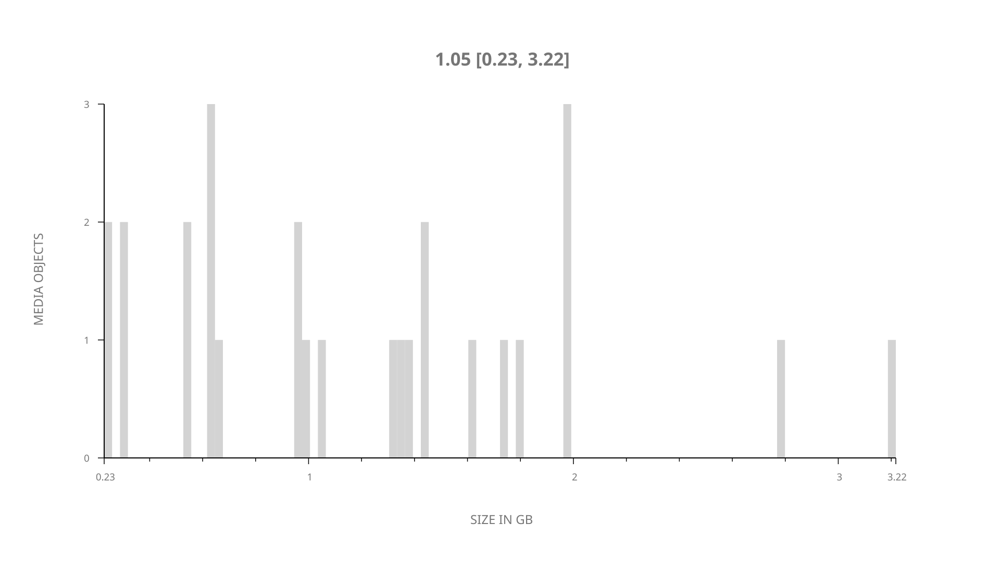
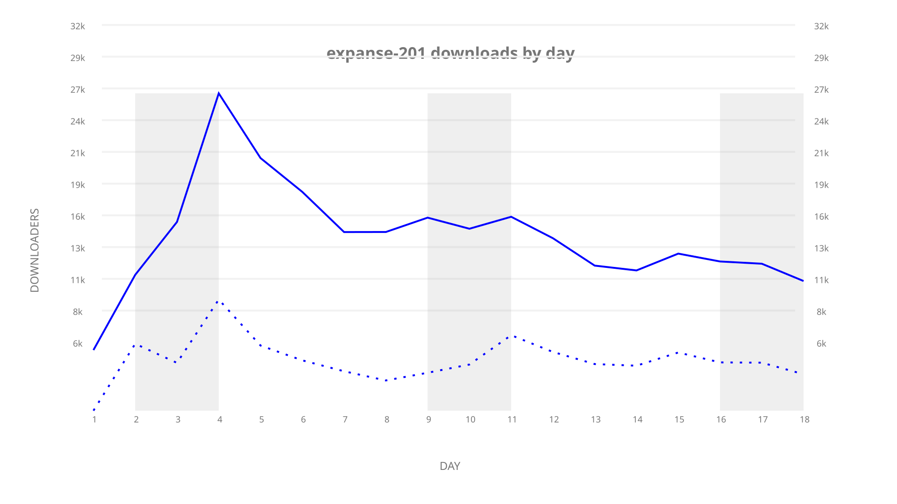
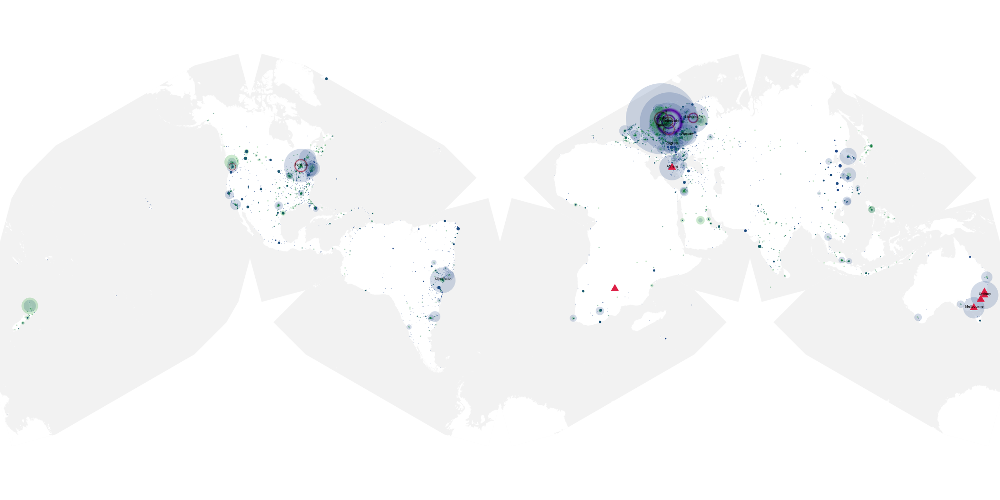
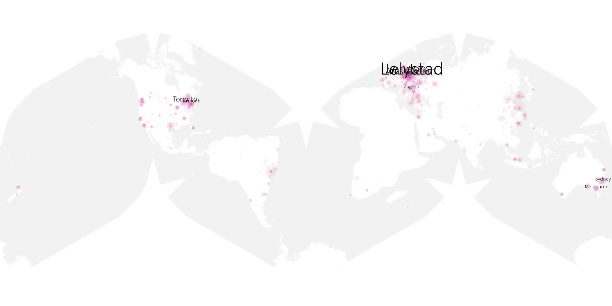
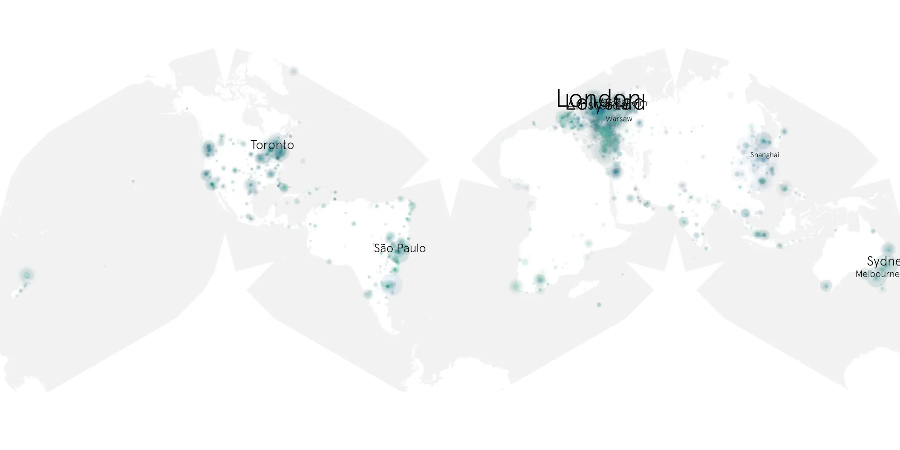

# expanse-201 sample cache audit

## 1. Media object

| Field | Value |
| --- | --- |
| Media object | The Expanse |
| Collection key | `expanse-201` |
| imdb_id | [tt3230854](https://www.imdb.com/title/tt3230854/) |
| wikipedia_url | [The Expanse (TV series)](https://en.wikipedia.org/wiki/The_Expanse_(TV_series)) |
| Sample dates | 2017-02-01-to-2017-02-19 |
| Sample days | 19 |
| BTIH count | 27 |
| Unique BTIH count | 27 |
| Downloaders total | 175,227 |
| Uploaders total | 90,705 |
| Data version | `2026-08-05` |
| IP geolocation version | `6:1777968300` |

## 2. Sample coverage report

- Generated: 2026-09-09T01:10:35Z
- Sample archive directory: `/mnt/gold/src/alpha60-samples-raw.gold/expanse-201.xz`
- Hour directories: 96
- Zero-length sample files: 0
- Other unparsable sample files: 0
- Hourly discontinuities: 95 (331 missing hours)
- Missing days: 1

### Sample archive discontinuities

- hourly gap: last `2017-02-01 22:00`, resumed `2017-02-02 02:00` — missing 3 hour(s)
- hourly gap: last `2017-02-02 02:00`, resumed `2017-02-02 06:00` — missing 3 hour(s)
- hourly gap: last `2017-02-02 06:00`, resumed `2017-02-02 10:00` — missing 3 hour(s)
- hourly gap: last `2017-02-02 10:00`, resumed `2017-02-02 14:00` — missing 3 hour(s)
- hourly gap: last `2017-02-02 14:00`, resumed `2017-02-02 18:00` — missing 3 hour(s)
- hourly gap: last `2017-02-02 18:00`, resumed `2017-02-02 22:00` — missing 3 hour(s)
- hourly gap: last `2017-02-02 22:00`, resumed `2017-02-04 14:11` — missing 39 hour(s)
- hourly gap: last `2017-02-04 14:11`, resumed `2017-02-04 18:11` — missing 3 hour(s)
- hourly gap: last `2017-02-04 18:11`, resumed `2017-02-04 22:11` — missing 3 hour(s)
- hourly gap: last `2017-02-04 22:11`, resumed `2017-02-05 02:11` — missing 3 hour(s)
- hourly gap: last `2017-02-05 02:11`, resumed `2017-02-05 06:11` — missing 3 hour(s)
- hourly gap: last `2017-02-05 06:11`, resumed `2017-02-05 10:11` — missing 3 hour(s)
- hourly gap: last `2017-02-05 10:11`, resumed `2017-02-05 14:11` — missing 3 hour(s)
- hourly gap: last `2017-02-05 14:11`, resumed `2017-02-05 18:11` — missing 3 hour(s)
- hourly gap: last `2017-02-05 18:11`, resumed `2017-02-05 22:11` — missing 3 hour(s)
- hourly gap: last `2017-02-05 22:11`, resumed `2017-02-06 02:11` — missing 3 hour(s)
- hourly gap: last `2017-02-06 02:11`, resumed `2017-02-06 06:11` — missing 3 hour(s)
- hourly gap: last `2017-02-06 06:11`, resumed `2017-02-06 10:11` — missing 3 hour(s)
- hourly gap: last `2017-02-06 10:11`, resumed `2017-02-06 14:11` — missing 3 hour(s)
- hourly gap: last `2017-02-06 14:11`, resumed `2017-02-06 18:11` — missing 3 hour(s)
- hourly gap: last `2017-02-06 18:11`, resumed `2017-02-06 22:11` — missing 3 hour(s)
- hourly gap: last `2017-02-06 22:11`, resumed `2017-02-07 02:11` — missing 3 hour(s)
- hourly gap: last `2017-02-07 02:11`, resumed `2017-02-07 06:11` — missing 3 hour(s)
- hourly gap: last `2017-02-07 06:11`, resumed `2017-02-07 10:11` — missing 3 hour(s)
- hourly gap: last `2017-02-07 10:11`, resumed `2017-02-07 14:11` — missing 3 hour(s)
- hourly gap: last `2017-02-07 14:11`, resumed `2017-02-07 18:11` — missing 3 hour(s)
- hourly gap: last `2017-02-07 18:11`, resumed `2017-02-07 22:11` — missing 3 hour(s)
- hourly gap: last `2017-02-07 22:11`, resumed `2017-02-08 02:11` — missing 3 hour(s)
- hourly gap: last `2017-02-08 02:11`, resumed `2017-02-08 06:11` — missing 3 hour(s)
- hourly gap: last `2017-02-08 06:11`, resumed `2017-02-08 10:11` — missing 3 hour(s)
- hourly gap: last `2017-02-08 10:11`, resumed `2017-02-08 14:11` — missing 3 hour(s)
- hourly gap: last `2017-02-08 14:11`, resumed `2017-02-08 18:11` — missing 3 hour(s)
- hourly gap: last `2017-02-08 18:11`, resumed `2017-02-09 10:01` — missing 14 hour(s)
- hourly gap: last `2017-02-09 10:01`, resumed `2017-02-09 14:01` — missing 3 hour(s)
- hourly gap: last `2017-02-09 14:01`, resumed `2017-02-09 18:01` — missing 3 hour(s)
- hourly gap: last `2017-02-09 18:01`, resumed `2017-02-09 22:01` — missing 3 hour(s)
- hourly gap: last `2017-02-09 22:01`, resumed `2017-02-10 02:01` — missing 3 hour(s)
- hourly gap: last `2017-02-10 02:01`, resumed `2017-02-10 06:01` — missing 3 hour(s)
- hourly gap: last `2017-02-10 06:01`, resumed `2017-02-10 10:01` — missing 3 hour(s)
- hourly gap: last `2017-02-10 10:01`, resumed `2017-02-10 14:01` — missing 3 hour(s)
- hourly gap: last `2017-02-10 14:01`, resumed `2017-02-10 18:01` — missing 3 hour(s)
- hourly gap: last `2017-02-10 18:01`, resumed `2017-02-10 22:01` — missing 3 hour(s)
- hourly gap: last `2017-02-10 22:01`, resumed `2017-02-11 02:01` — missing 3 hour(s)
- hourly gap: last `2017-02-11 02:01`, resumed `2017-02-11 06:01` — missing 3 hour(s)
- hourly gap: last `2017-02-11 06:01`, resumed `2017-02-11 10:01` — missing 3 hour(s)
- hourly gap: last `2017-02-11 10:01`, resumed `2017-02-11 14:01` — missing 3 hour(s)
- hourly gap: last `2017-02-11 14:01`, resumed `2017-02-11 18:01` — missing 3 hour(s)
- hourly gap: last `2017-02-11 18:01`, resumed `2017-02-11 22:00` — missing 2 hour(s)
- hourly gap: last `2017-02-11 22:00`, resumed `2017-02-12 02:00` — missing 3 hour(s)
- hourly gap: last `2017-02-12 02:00`, resumed `2017-02-12 06:00` — missing 3 hour(s)
- hourly gap: last `2017-02-12 06:00`, resumed `2017-02-12 10:00` — missing 3 hour(s)
- hourly gap: last `2017-02-12 10:00`, resumed `2017-02-12 14:00` — missing 3 hour(s)
- hourly gap: last `2017-02-12 14:00`, resumed `2017-02-12 18:00` — missing 3 hour(s)
- hourly gap: last `2017-02-12 18:00`, resumed `2017-02-12 22:00` — missing 3 hour(s)
- hourly gap: last `2017-02-12 22:00`, resumed `2017-02-13 02:00` — missing 3 hour(s)
- hourly gap: last `2017-02-13 02:00`, resumed `2017-02-13 06:00` — missing 3 hour(s)
- hourly gap: last `2017-02-13 06:00`, resumed `2017-02-13 10:00` — missing 3 hour(s)
- hourly gap: last `2017-02-13 10:00`, resumed `2017-02-13 14:00` — missing 3 hour(s)
- hourly gap: last `2017-02-13 14:00`, resumed `2017-02-13 18:00` — missing 3 hour(s)
- hourly gap: last `2017-02-13 18:00`, resumed `2017-02-13 22:00` — missing 3 hour(s)
- hourly gap: last `2017-02-13 22:00`, resumed `2017-02-14 02:00` — missing 3 hour(s)
- hourly gap: last `2017-02-14 02:00`, resumed `2017-02-14 06:00` — missing 3 hour(s)
- hourly gap: last `2017-02-14 06:00`, resumed `2017-02-14 10:00` — missing 3 hour(s)
- hourly gap: last `2017-02-14 10:00`, resumed `2017-02-14 14:00` — missing 3 hour(s)
- hourly gap: last `2017-02-14 14:00`, resumed `2017-02-14 18:00` — missing 3 hour(s)
- hourly gap: last `2017-02-14 18:00`, resumed `2017-02-14 22:00` — missing 3 hour(s)
- hourly gap: last `2017-02-14 22:00`, resumed `2017-02-15 02:00` — missing 3 hour(s)
- hourly gap: last `2017-02-15 02:00`, resumed `2017-02-15 06:00` — missing 3 hour(s)
- hourly gap: last `2017-02-15 06:00`, resumed `2017-02-15 10:00` — missing 3 hour(s)
- hourly gap: last `2017-02-15 10:00`, resumed `2017-02-15 14:00` — missing 3 hour(s)
- hourly gap: last `2017-02-15 14:00`, resumed `2017-02-15 18:00` — missing 3 hour(s)
- hourly gap: last `2017-02-15 18:00`, resumed `2017-02-15 22:00` — missing 3 hour(s)
- hourly gap: last `2017-02-15 22:00`, resumed `2017-02-16 02:00` — missing 3 hour(s)
- hourly gap: last `2017-02-16 02:00`, resumed `2017-02-16 06:00` — missing 3 hour(s)
- hourly gap: last `2017-02-16 06:00`, resumed `2017-02-16 10:00` — missing 3 hour(s)
- hourly gap: last `2017-02-16 10:00`, resumed `2017-02-16 14:00` — missing 3 hour(s)
- hourly gap: last `2017-02-16 14:00`, resumed `2017-02-16 18:00` — missing 3 hour(s)
- hourly gap: last `2017-02-16 18:00`, resumed `2017-02-16 22:00` — missing 3 hour(s)
- hourly gap: last `2017-02-16 22:00`, resumed `2017-02-17 02:00` — missing 3 hour(s)
- hourly gap: last `2017-02-17 02:00`, resumed `2017-02-17 06:00` — missing 3 hour(s)
- hourly gap: last `2017-02-17 06:00`, resumed `2017-02-17 10:00` — missing 3 hour(s)
- hourly gap: last `2017-02-17 10:00`, resumed `2017-02-17 14:00` — missing 3 hour(s)
- hourly gap: last `2017-02-17 14:00`, resumed `2017-02-17 18:00` — missing 3 hour(s)
- hourly gap: last `2017-02-17 18:00`, resumed `2017-02-17 22:00` — missing 3 hour(s)
- hourly gap: last `2017-02-17 22:00`, resumed `2017-02-18 02:00` — missing 3 hour(s)
- hourly gap: last `2017-02-18 02:00`, resumed `2017-02-18 06:00` — missing 3 hour(s)
- hourly gap: last `2017-02-18 06:00`, resumed `2017-02-18 10:00` — missing 3 hour(s)
- hourly gap: last `2017-02-18 10:00`, resumed `2017-02-18 14:00` — missing 3 hour(s)
- hourly gap: last `2017-02-18 14:00`, resumed `2017-02-18 18:00` — missing 3 hour(s)
- hourly gap: last `2017-02-18 18:00`, resumed `2017-02-18 22:00` — missing 3 hour(s)
- hourly gap: last `2017-02-18 22:00`, resumed `2017-02-19 02:00` — missing 3 hour(s)
- hourly gap: last `2017-02-19 02:00`, resumed `2017-02-19 06:00` — missing 3 hour(s)
- hourly gap: last `2017-02-19 06:00`, resumed `2017-02-19 10:00` — missing 3 hour(s)
- hourly gap: last `2017-02-19 10:00`, resumed `2017-02-19 14:00` — missing 3 hour(s)
- hourly gap: last `2017-02-19 14:00`, resumed `2017-02-19 18:00` — missing 3 hour(s)
- missing day: `2017-02-03`

## 3. Media objects file size histogram

## 4. Visualization pass — graphs

### Downloads by week cumulative (normalized start)



### Downloads by day, Saturday and Sunday in gray

## 5. Visualization pass — maps

### Cumulative geographic slices

| Africa | Americas | Asia | Europe | Oceania | Unknown |
| --- | --- | --- | --- | --- | --- |
| 2.14 | 23.91 | 12.20 | 35.95 | 4.69 | 0.64 |

### Cumulative network infrastructure

{:target="_blank" rel="noopener"}

### Cumulative data maps

**Cumulative >= 1080p**

{:target="_blank" rel="noopener"}

**Cumulative < 1080p**

{:target="_blank" rel="noopener"}
