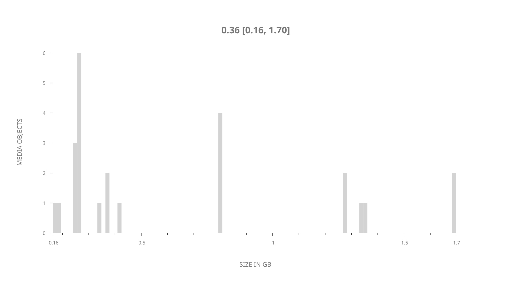
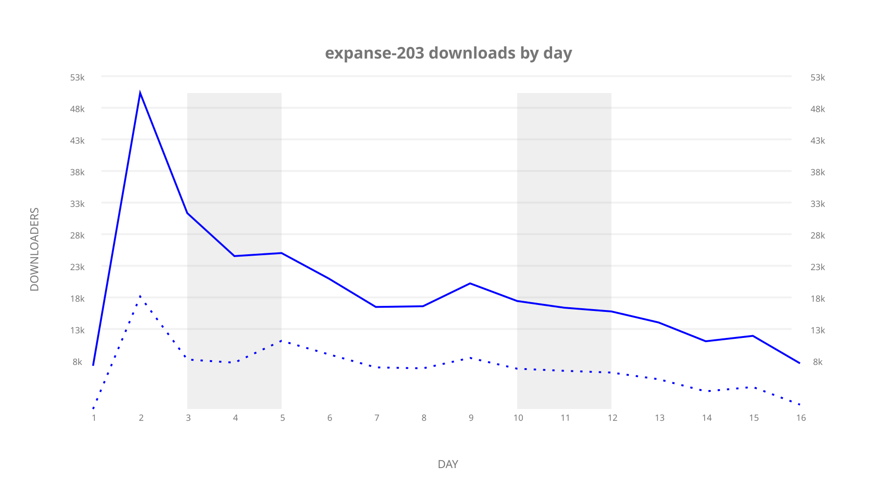
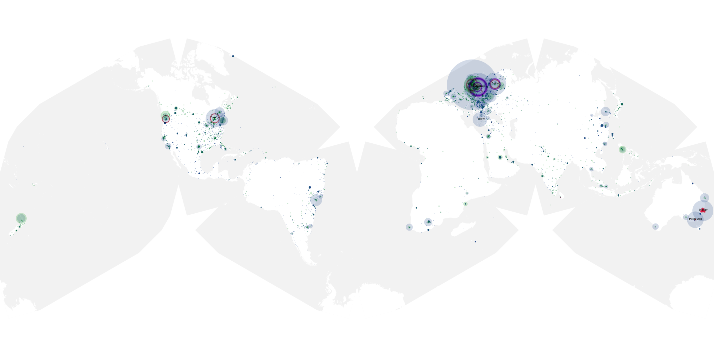
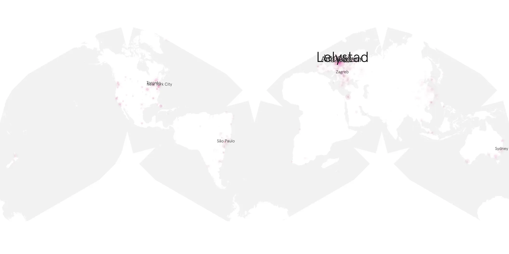
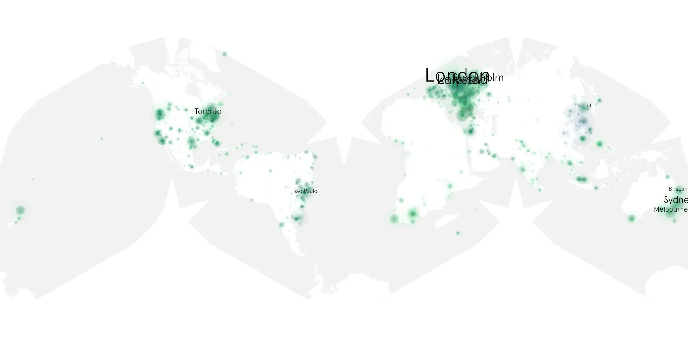

# expanse-203 sample cache audit

## 1. Media object

| Field | Value |
| --- | --- |
| Media object | The Expanse |
| Collection key | `expanse-203` |
| imdb_id | [tt3230854](https://www.imdb.com/title/tt3230854/) |
| wikipedia_url | [The Expanse (TV series)](https://en.wikipedia.org/wiki/The_Expanse_(TV_series)) |
| Sample dates | 2017-02-08-to-2017-02-23 |
| Sample days | 16 |
| BTIH count | 25 |
| Unique BTIH count | 25 |
| Downloaders total | 218,303 |
| Uploaders total | 120,460 |
| Data version | `2026-08-05` |
| IP geolocation version | `6:1777968300` |

## 2. Sample coverage report

- Generated: 2026-09-09T01:10:35Z
- Sample archive directory: `/mnt/gold/src/alpha60-samples-raw.gold/expanse-203.xz`
- Hour directories: 87
- Zero-length sample files: 0
- Other unparsable sample files: 0
- Hourly discontinuities: 86 (260 missing hours)
- Missing days: 0

### Sample archive discontinuities

- hourly gap: last `2017-02-08 23:12`, resumed `2017-02-09 03:12` — missing 3 hour(s)
- hourly gap: last `2017-02-09 03:12`, resumed `2017-02-09 07:12` — missing 3 hour(s)
- hourly gap: last `2017-02-09 07:12`, resumed `2017-02-09 11:03` — missing 2 hour(s)
- hourly gap: last `2017-02-09 11:03`, resumed `2017-02-09 15:03` — missing 3 hour(s)
- hourly gap: last `2017-02-09 15:03`, resumed `2017-02-09 19:03` — missing 3 hour(s)
- hourly gap: last `2017-02-09 19:03`, resumed `2017-02-09 23:03` — missing 3 hour(s)
- hourly gap: last `2017-02-09 23:03`, resumed `2017-02-10 03:03` — missing 3 hour(s)
- hourly gap: last `2017-02-10 03:03`, resumed `2017-02-10 07:03` — missing 3 hour(s)
- hourly gap: last `2017-02-10 07:03`, resumed `2017-02-10 11:03` — missing 3 hour(s)
- hourly gap: last `2017-02-10 11:03`, resumed `2017-02-10 15:03` — missing 3 hour(s)
- hourly gap: last `2017-02-10 15:03`, resumed `2017-02-10 19:03` — missing 3 hour(s)
- hourly gap: last `2017-02-10 19:03`, resumed `2017-02-10 23:03` — missing 3 hour(s)
- hourly gap: last `2017-02-10 23:03`, resumed `2017-02-11 03:03` — missing 3 hour(s)
- hourly gap: last `2017-02-11 03:03`, resumed `2017-02-11 07:03` — missing 3 hour(s)
- hourly gap: last `2017-02-11 07:03`, resumed `2017-02-11 11:03` — missing 3 hour(s)
- hourly gap: last `2017-02-11 11:03`, resumed `2017-02-11 15:03` — missing 3 hour(s)
- hourly gap: last `2017-02-11 15:03`, resumed `2017-02-11 19:03` — missing 3 hour(s)
- hourly gap: last `2017-02-11 19:03`, resumed `2017-02-11 23:00` — missing 2 hour(s)
- hourly gap: last `2017-02-11 23:00`, resumed `2017-02-12 03:00` — missing 3 hour(s)
- hourly gap: last `2017-02-12 03:00`, resumed `2017-02-12 07:00` — missing 3 hour(s)
- hourly gap: last `2017-02-12 07:00`, resumed `2017-02-12 11:00` — missing 3 hour(s)
- hourly gap: last `2017-02-12 11:00`, resumed `2017-02-12 15:00` — missing 3 hour(s)
- hourly gap: last `2017-02-12 15:00`, resumed `2017-02-12 19:00` — missing 3 hour(s)
- hourly gap: last `2017-02-12 19:00`, resumed `2017-02-12 23:00` — missing 3 hour(s)
- hourly gap: last `2017-02-12 23:00`, resumed `2017-02-13 03:00` — missing 3 hour(s)
- hourly gap: last `2017-02-13 03:00`, resumed `2017-02-13 07:00` — missing 3 hour(s)
- hourly gap: last `2017-02-13 07:00`, resumed `2017-02-13 11:00` — missing 3 hour(s)
- hourly gap: last `2017-02-13 11:00`, resumed `2017-02-13 15:00` — missing 3 hour(s)
- hourly gap: last `2017-02-13 15:00`, resumed `2017-02-13 19:00` — missing 3 hour(s)
- hourly gap: last `2017-02-13 19:00`, resumed `2017-02-13 23:00` — missing 3 hour(s)
- hourly gap: last `2017-02-13 23:00`, resumed `2017-02-14 03:00` — missing 3 hour(s)
- hourly gap: last `2017-02-14 03:00`, resumed `2017-02-14 07:00` — missing 3 hour(s)
- hourly gap: last `2017-02-14 07:00`, resumed `2017-02-14 11:00` — missing 3 hour(s)
- hourly gap: last `2017-02-14 11:00`, resumed `2017-02-14 15:00` — missing 3 hour(s)
- hourly gap: last `2017-02-14 15:00`, resumed `2017-02-14 19:00` — missing 3 hour(s)
- hourly gap: last `2017-02-14 19:00`, resumed `2017-02-14 23:00` — missing 3 hour(s)
- hourly gap: last `2017-02-14 23:00`, resumed `2017-02-15 03:00` — missing 3 hour(s)
- hourly gap: last `2017-02-15 03:00`, resumed `2017-02-15 07:00` — missing 3 hour(s)
- hourly gap: last `2017-02-15 07:00`, resumed `2017-02-15 11:00` — missing 3 hour(s)
- hourly gap: last `2017-02-15 11:00`, resumed `2017-02-15 15:00` — missing 3 hour(s)
- hourly gap: last `2017-02-15 15:00`, resumed `2017-02-15 19:00` — missing 3 hour(s)
- hourly gap: last `2017-02-15 19:00`, resumed `2017-02-15 23:00` — missing 3 hour(s)
- hourly gap: last `2017-02-15 23:00`, resumed `2017-02-16 03:00` — missing 3 hour(s)
- hourly gap: last `2017-02-16 03:00`, resumed `2017-02-16 07:00` — missing 3 hour(s)
- hourly gap: last `2017-02-16 07:00`, resumed `2017-02-16 11:00` — missing 3 hour(s)
- hourly gap: last `2017-02-16 11:00`, resumed `2017-02-16 15:00` — missing 3 hour(s)
- hourly gap: last `2017-02-16 15:00`, resumed `2017-02-16 19:00` — missing 3 hour(s)
- hourly gap: last `2017-02-16 19:00`, resumed `2017-02-16 23:00` — missing 3 hour(s)
- hourly gap: last `2017-02-16 23:00`, resumed `2017-02-17 03:00` — missing 3 hour(s)
- hourly gap: last `2017-02-17 03:00`, resumed `2017-02-17 07:00` — missing 3 hour(s)
- hourly gap: last `2017-02-17 07:00`, resumed `2017-02-17 11:00` — missing 3 hour(s)
- hourly gap: last `2017-02-17 11:00`, resumed `2017-02-17 15:00` — missing 3 hour(s)
- hourly gap: last `2017-02-17 15:00`, resumed `2017-02-17 19:00` — missing 3 hour(s)
- hourly gap: last `2017-02-17 19:00`, resumed `2017-02-17 23:00` — missing 3 hour(s)
- hourly gap: last `2017-02-17 23:00`, resumed `2017-02-18 03:00` — missing 3 hour(s)
- hourly gap: last `2017-02-18 03:00`, resumed `2017-02-18 07:00` — missing 3 hour(s)
- hourly gap: last `2017-02-18 07:00`, resumed `2017-02-18 11:00` — missing 3 hour(s)
- hourly gap: last `2017-02-18 11:00`, resumed `2017-02-18 15:00` — missing 3 hour(s)
- hourly gap: last `2017-02-18 15:00`, resumed `2017-02-18 19:00` — missing 3 hour(s)
- hourly gap: last `2017-02-18 19:00`, resumed `2017-02-18 23:00` — missing 3 hour(s)
- hourly gap: last `2017-02-18 23:00`, resumed `2017-02-19 03:00` — missing 3 hour(s)
- hourly gap: last `2017-02-19 03:00`, resumed `2017-02-19 07:00` — missing 3 hour(s)
- hourly gap: last `2017-02-19 07:00`, resumed `2017-02-19 11:00` — missing 3 hour(s)
- hourly gap: last `2017-02-19 11:00`, resumed `2017-02-19 15:00` — missing 3 hour(s)
- hourly gap: last `2017-02-19 15:00`, resumed `2017-02-19 19:00` — missing 3 hour(s)
- hourly gap: last `2017-02-19 19:00`, resumed `2017-02-19 23:00` — missing 3 hour(s)
- hourly gap: last `2017-02-19 23:00`, resumed `2017-02-20 03:00` — missing 3 hour(s)
- hourly gap: last `2017-02-20 03:00`, resumed `2017-02-20 07:00` — missing 3 hour(s)
- hourly gap: last `2017-02-20 07:00`, resumed `2017-02-20 11:00` — missing 3 hour(s)
- hourly gap: last `2017-02-20 11:00`, resumed `2017-02-20 15:00` — missing 3 hour(s)
- hourly gap: last `2017-02-20 15:00`, resumed `2017-02-20 19:00` — missing 3 hour(s)
- hourly gap: last `2017-02-20 19:00`, resumed `2017-02-20 23:00` — missing 3 hour(s)
- hourly gap: last `2017-02-20 23:00`, resumed `2017-02-21 03:00` — missing 3 hour(s)
- hourly gap: last `2017-02-21 03:00`, resumed `2017-02-21 07:00` — missing 3 hour(s)
- hourly gap: last `2017-02-21 07:00`, resumed `2017-02-21 11:00` — missing 3 hour(s)
- hourly gap: last `2017-02-21 11:00`, resumed `2017-02-21 15:00` — missing 3 hour(s)
- hourly gap: last `2017-02-21 15:00`, resumed `2017-02-21 19:00` — missing 3 hour(s)
- hourly gap: last `2017-02-21 19:00`, resumed `2017-02-22 03:00` — missing 7 hour(s)
- hourly gap: last `2017-02-22 03:00`, resumed `2017-02-22 07:00` — missing 3 hour(s)
- hourly gap: last `2017-02-22 07:00`, resumed `2017-02-22 11:00` — missing 3 hour(s)
- hourly gap: last `2017-02-22 11:00`, resumed `2017-02-22 15:00` — missing 3 hour(s)
- hourly gap: last `2017-02-22 15:00`, resumed `2017-02-22 19:00` — missing 3 hour(s)
- hourly gap: last `2017-02-22 19:00`, resumed `2017-02-22 23:00` — missing 3 hour(s)
- hourly gap: last `2017-02-22 23:00`, resumed `2017-02-23 03:00` — missing 3 hour(s)
- hourly gap: last `2017-02-23 03:00`, resumed `2017-02-23 07:00` — missing 3 hour(s)
- hourly gap: last `2017-02-23 07:00`, resumed `2017-02-23 11:00` — missing 3 hour(s)

## 3. Media objects file size histogram

## 4. Visualization pass — graphs

### Downloads by week cumulative (normalized start)



### Downloads by day, Saturday and Sunday in gray

## 5. Visualization pass — maps

### Cumulative geographic slices

| Africa | Americas | Asia | Europe | Oceania | Unknown |
| --- | --- | --- | --- | --- | --- |
| 2.24 | 20.33 | 9.63 | 30.98 | 5.22 | 0.39 |

### Cumulative network infrastructure

{:target="_blank" rel="noopener"}

### Cumulative data maps

**Cumulative >= 1080p**

{:target="_blank" rel="noopener"}

**Cumulative < 1080p**

{:target="_blank" rel="noopener"}
