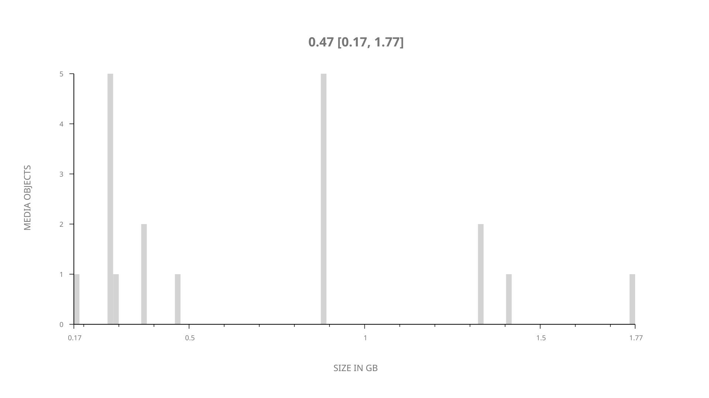
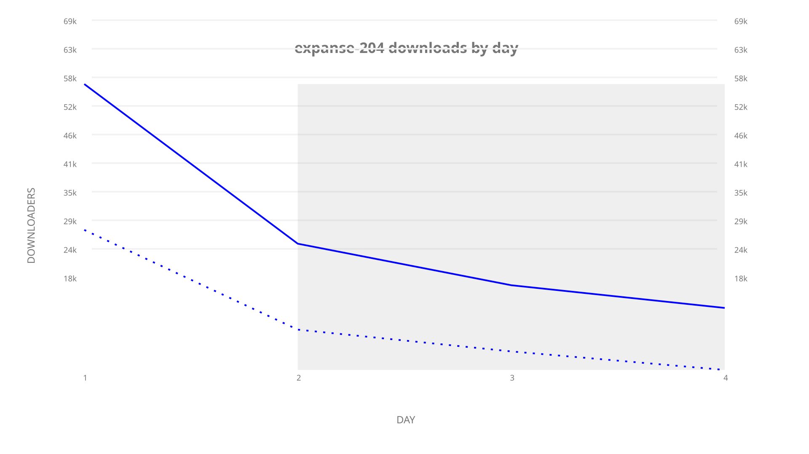
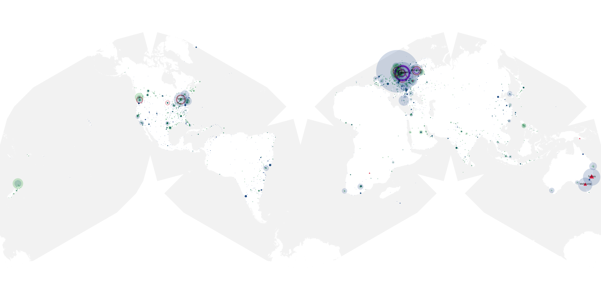
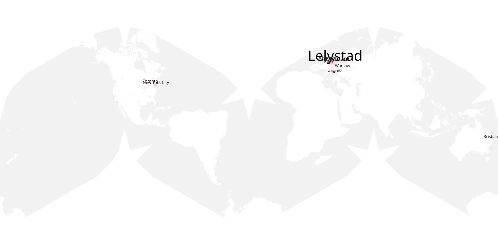
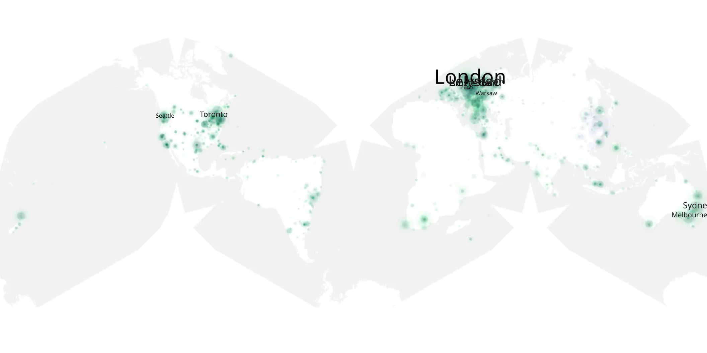

# expanse-204 sample cache audit

## 1. Media object

| Field | Value |
| --- | --- |
| Media object | The Expanse |
| Collection key | `expanse-204` |
| imdb_id | [tt3230854](https://www.imdb.com/title/tt3230854/) |
| wikipedia_url | [The Expanse (TV series)](https://en.wikipedia.org/wiki/The_Expanse_(TV_series)) |
| Sample dates | 2017-02-16-to-2017-02-19 |
| Sample days | 4 |
| BTIH count | 19 |
| Unique BTIH count | 19 |
| Downloaders total | 134,036 |
| Uploaders total | 84,830 |
| Data version | `2026-08-05` |
| IP geolocation version | `6:1777968300` |

## 2. Coverage report

- Generated: 2026-09-09T01:10:35Z
- Sample archive directory: `/mnt/gold/src/alpha60-samples-raw.gold/expanse-204.xz`
- Hour directories: 24
- Zero-length sample files: 0
- Other unparsable sample files: 0
- Hourly discontinuities: 23 (69 missing hours)
- Missing days: 0

### Sample archive discontinuities

- hourly gap: last `2017-02-16 00:00`, resumed `2017-02-16 04:00` — missing 3 hour(s)
- hourly gap: last `2017-02-16 04:00`, resumed `2017-02-16 08:00` — missing 3 hour(s)
- hourly gap: last `2017-02-16 08:00`, resumed `2017-02-16 12:00` — missing 3 hour(s)
- hourly gap: last `2017-02-16 12:00`, resumed `2017-02-16 16:00` — missing 3 hour(s)
- hourly gap: last `2017-02-16 16:00`, resumed `2017-02-16 20:00` — missing 3 hour(s)
- hourly gap: last `2017-02-16 20:00`, resumed `2017-02-17 00:00` — missing 3 hour(s)
- hourly gap: last `2017-02-17 00:00`, resumed `2017-02-17 04:00` — missing 3 hour(s)
- hourly gap: last `2017-02-17 04:00`, resumed `2017-02-17 08:00` — missing 3 hour(s)
- hourly gap: last `2017-02-17 08:00`, resumed `2017-02-17 12:00` — missing 3 hour(s)
- hourly gap: last `2017-02-17 12:00`, resumed `2017-02-17 16:00` — missing 3 hour(s)
- hourly gap: last `2017-02-17 16:00`, resumed `2017-02-17 20:00` — missing 3 hour(s)
- hourly gap: last `2017-02-17 20:00`, resumed `2017-02-18 00:00` — missing 3 hour(s)
- hourly gap: last `2017-02-18 00:00`, resumed `2017-02-18 04:00` — missing 3 hour(s)
- hourly gap: last `2017-02-18 04:00`, resumed `2017-02-18 08:00` — missing 3 hour(s)
- hourly gap: last `2017-02-18 08:00`, resumed `2017-02-18 12:00` — missing 3 hour(s)
- hourly gap: last `2017-02-18 12:00`, resumed `2017-02-18 16:00` — missing 3 hour(s)
- hourly gap: last `2017-02-18 16:00`, resumed `2017-02-18 20:00` — missing 3 hour(s)
- hourly gap: last `2017-02-18 20:00`, resumed `2017-02-19 00:00` — missing 3 hour(s)
- hourly gap: last `2017-02-19 00:00`, resumed `2017-02-19 04:00` — missing 3 hour(s)
- hourly gap: last `2017-02-19 04:00`, resumed `2017-02-19 08:00` — missing 3 hour(s)
- hourly gap: last `2017-02-19 08:00`, resumed `2017-02-19 12:00` — missing 3 hour(s)
- hourly gap: last `2017-02-19 12:00`, resumed `2017-02-19 16:00` — missing 3 hour(s)
- hourly gap: last `2017-02-19 16:00`, resumed `2017-02-19 20:00` — missing 3 hour(s)

## 3. File sizes histogram *median[lowest, highest]*

## 4. Graphs

### Downloads by week cumulative (normalized start)



### Downloads by day, Saturday and Sunday in gray

## 5. Cumulative Maps

<!-- https://raw.githubusercontent.com/alpha60-devops/alpha60-results-2017/refs/heads/main/data/ -->

### <a href="https://raw.githubusercontent.com/alpha60-devops/alpha60-results-2017/refs/heads/main/data/geojson.cumulative/expanse-204-cumulative-aggregate.geojson.gz" data-map-title="The Expanse — expanse-204" onclick="leaflet_map_open_window(this.href, this.dataset.mapTitle); return false;" class="table-link" aria-label="Open The Expanse (expanse-204) cumulative data map in new window" title="Opens interactive map for The Expanse (expanse-204) data">Swarm Detail</a>

### Geographic Regions

| Africa | Americas | Asia | Europe | Oceania | Unknown |
| --- | --- | --- | --- | --- | --- |
| 1.97 | 20.12 | 7.95 | 31.30 | 5.10 | 0.29 |

### Network infrastructure

{:target="_blank" rel="noopener"}

### Resolution >= 1080p

{:target="_blank" rel="noopener"}

### Resolution < 1080p

{:target="_blank" rel="noopener"}
