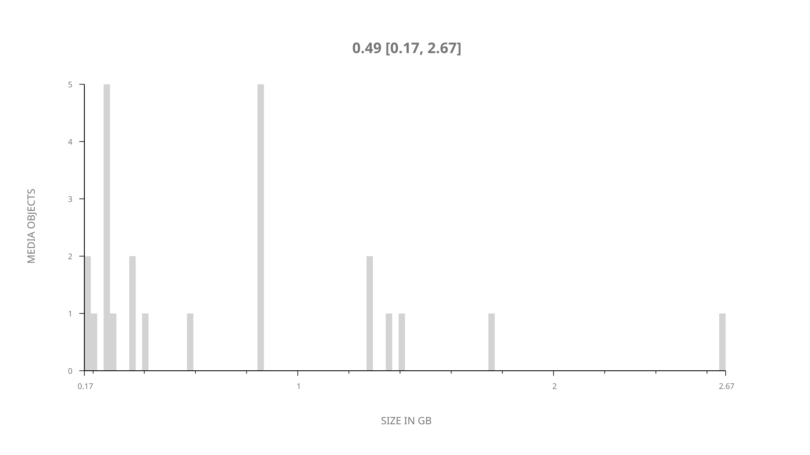
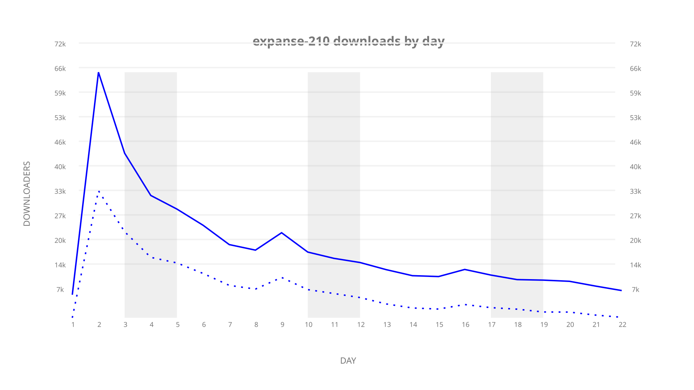
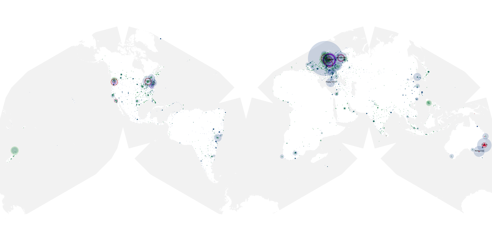
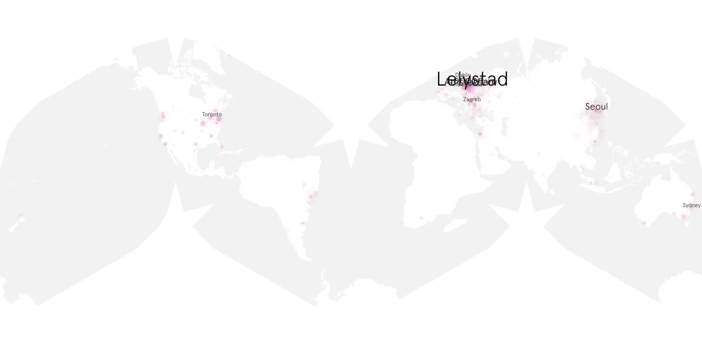
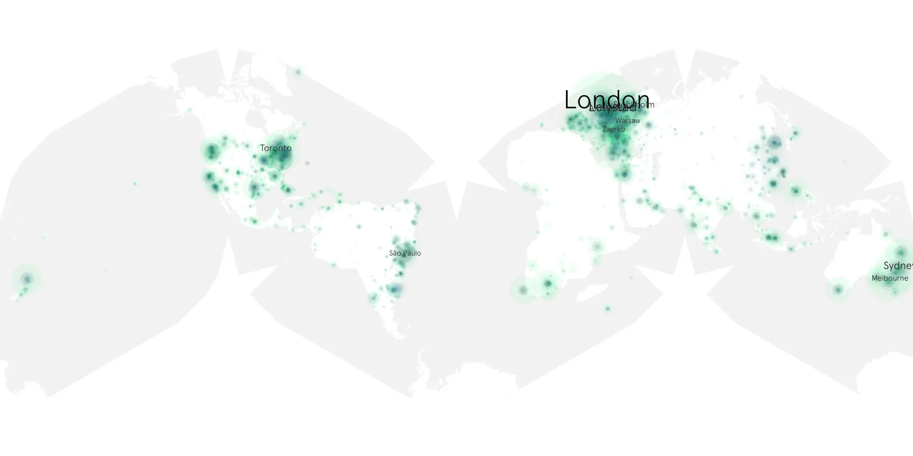

# expanse-210 sample cache audit

## 1. Media object

| Field | Value |
| --- | --- |
| Media object | The Expanse |
| Collection key | `expanse-210` |
| imdb_id | [tt3230854](https://www.imdb.com/title/tt3230854/) |
| wikipedia_url | [The Expanse (TV series)](https://en.wikipedia.org/wiki/The_Expanse_(TV_series)) |
| Sample dates | 2017-03-29-to-2017-04-19 |
| Sample days | 22 |
| BTIH count | 25 |
| Unique BTIH count | 24 |
| Downloaders total | 332,695 |
| Uploaders total | 206,401 |
| Data version | `2026-08-05` |
| IP geolocation version | `6:1777968300` |

## 2. Coverage report

- Generated: 2026-09-09T01:10:35Z
- Sample archive directory: `/mnt/gold/src/alpha60-samples-raw.gold/expanse-210.xz`
- Hour directories: 126
- Zero-length sample files: 0
- Other unparsable sample files: 0
- Hourly discontinuities: 125 (373 missing hours)
- Missing days: 0

### Sample archive discontinuities

- hourly gap: last `2017-03-29 22:00`, resumed `2017-03-30 02:00` — missing 3 hour(s)
- hourly gap: last `2017-03-30 02:00`, resumed `2017-03-30 06:00` — missing 3 hour(s)
- hourly gap: last `2017-03-30 06:00`, resumed `2017-03-30 10:00` — missing 3 hour(s)
- hourly gap: last `2017-03-30 10:00`, resumed `2017-03-30 14:00` — missing 3 hour(s)
- hourly gap: last `2017-03-30 14:00`, resumed `2017-03-30 18:00` — missing 3 hour(s)
- hourly gap: last `2017-03-30 18:00`, resumed `2017-03-30 22:00` — missing 3 hour(s)
- hourly gap: last `2017-03-30 22:00`, resumed `2017-03-31 02:00` — missing 3 hour(s)
- hourly gap: last `2017-03-31 02:00`, resumed `2017-03-31 06:00` — missing 3 hour(s)
- hourly gap: last `2017-03-31 06:00`, resumed `2017-03-31 10:00` — missing 3 hour(s)
- hourly gap: last `2017-03-31 10:00`, resumed `2017-03-31 14:00` — missing 3 hour(s)
- hourly gap: last `2017-03-31 14:00`, resumed `2017-03-31 18:00` — missing 3 hour(s)
- hourly gap: last `2017-03-31 18:00`, resumed `2017-03-31 22:00` — missing 3 hour(s)
- hourly gap: last `2017-03-31 22:00`, resumed `2017-04-01 02:00` — missing 3 hour(s)
- hourly gap: last `2017-04-01 02:00`, resumed `2017-04-01 06:00` — missing 3 hour(s)
- hourly gap: last `2017-04-01 06:00`, resumed `2017-04-01 10:00` — missing 3 hour(s)
- hourly gap: last `2017-04-01 10:00`, resumed `2017-04-01 14:00` — missing 3 hour(s)
- hourly gap: last `2017-04-01 14:00`, resumed `2017-04-01 18:00` — missing 3 hour(s)
- hourly gap: last `2017-04-01 18:00`, resumed `2017-04-01 22:00` — missing 3 hour(s)
- hourly gap: last `2017-04-01 22:00`, resumed `2017-04-02 02:00` — missing 3 hour(s)
- hourly gap: last `2017-04-02 02:00`, resumed `2017-04-02 06:00` — missing 3 hour(s)
- hourly gap: last `2017-04-02 06:00`, resumed `2017-04-02 10:00` — missing 3 hour(s)
- hourly gap: last `2017-04-02 10:00`, resumed `2017-04-02 14:00` — missing 3 hour(s)
- hourly gap: last `2017-04-02 14:00`, resumed `2017-04-02 18:00` — missing 3 hour(s)
- hourly gap: last `2017-04-02 18:00`, resumed `2017-04-02 22:00` — missing 3 hour(s)
- hourly gap: last `2017-04-02 22:00`, resumed `2017-04-03 02:00` — missing 3 hour(s)
- hourly gap: last `2017-04-03 02:00`, resumed `2017-04-03 06:00` — missing 3 hour(s)
- hourly gap: last `2017-04-03 06:00`, resumed `2017-04-03 10:00` — missing 3 hour(s)
- hourly gap: last `2017-04-03 10:00`, resumed `2017-04-03 14:00` — missing 3 hour(s)
- hourly gap: last `2017-04-03 14:00`, resumed `2017-04-03 18:00` — missing 3 hour(s)
- hourly gap: last `2017-04-03 18:00`, resumed `2017-04-03 22:00` — missing 3 hour(s)
- hourly gap: last `2017-04-03 22:00`, resumed `2017-04-04 02:00` — missing 3 hour(s)
- hourly gap: last `2017-04-04 02:00`, resumed `2017-04-04 06:00` — missing 3 hour(s)
- hourly gap: last `2017-04-04 06:00`, resumed `2017-04-04 10:01` — missing 3 hour(s)
- hourly gap: last `2017-04-04 10:01`, resumed `2017-04-04 14:01` — missing 3 hour(s)
- hourly gap: last `2017-04-04 14:01`, resumed `2017-04-04 18:01` — missing 3 hour(s)
- hourly gap: last `2017-04-04 18:01`, resumed `2017-04-04 22:01` — missing 3 hour(s)
- hourly gap: last `2017-04-04 22:01`, resumed `2017-04-05 02:01` — missing 3 hour(s)
- hourly gap: last `2017-04-05 02:01`, resumed `2017-04-05 06:01` — missing 3 hour(s)
- hourly gap: last `2017-04-05 06:01`, resumed `2017-04-05 10:01` — missing 3 hour(s)
- hourly gap: last `2017-04-05 10:01`, resumed `2017-04-05 14:01` — missing 3 hour(s)
- hourly gap: last `2017-04-05 14:01`, resumed `2017-04-05 18:01` — missing 3 hour(s)
- hourly gap: last `2017-04-05 18:01`, resumed `2017-04-05 22:01` — missing 3 hour(s)
- hourly gap: last `2017-04-05 22:01`, resumed `2017-04-06 02:01` — missing 3 hour(s)
- hourly gap: last `2017-04-06 02:01`, resumed `2017-04-06 06:01` — missing 3 hour(s)
- hourly gap: last `2017-04-06 06:01`, resumed `2017-04-06 10:01` — missing 3 hour(s)
- hourly gap: last `2017-04-06 10:01`, resumed `2017-04-06 14:01` — missing 3 hour(s)
- hourly gap: last `2017-04-06 14:01`, resumed `2017-04-06 18:01` — missing 3 hour(s)
- hourly gap: last `2017-04-06 18:01`, resumed `2017-04-06 22:01` — missing 3 hour(s)
- hourly gap: last `2017-04-06 22:01`, resumed `2017-04-07 02:01` — missing 3 hour(s)
- hourly gap: last `2017-04-07 02:01`, resumed `2017-04-07 06:01` — missing 3 hour(s)
- hourly gap: last `2017-04-07 06:01`, resumed `2017-04-07 10:01` — missing 3 hour(s)
- hourly gap: last `2017-04-07 10:01`, resumed `2017-04-07 14:01` — missing 3 hour(s)
- hourly gap: last `2017-04-07 14:01`, resumed `2017-04-07 18:01` — missing 3 hour(s)
- hourly gap: last `2017-04-07 18:01`, resumed `2017-04-07 22:01` — missing 3 hour(s)
- hourly gap: last `2017-04-07 22:01`, resumed `2017-04-08 02:01` — missing 3 hour(s)
- hourly gap: last `2017-04-08 02:01`, resumed `2017-04-08 06:01` — missing 3 hour(s)
- hourly gap: last `2017-04-08 06:01`, resumed `2017-04-08 10:01` — missing 3 hour(s)
- hourly gap: last `2017-04-08 10:01`, resumed `2017-04-08 14:01` — missing 3 hour(s)
- hourly gap: last `2017-04-08 14:01`, resumed `2017-04-08 18:01` — missing 3 hour(s)
- hourly gap: last `2017-04-08 18:01`, resumed `2017-04-08 22:01` — missing 3 hour(s)
- hourly gap: last `2017-04-08 22:01`, resumed `2017-04-09 02:01` — missing 3 hour(s)
- hourly gap: last `2017-04-09 02:01`, resumed `2017-04-09 06:01` — missing 3 hour(s)
- hourly gap: last `2017-04-09 06:01`, resumed `2017-04-09 10:01` — missing 3 hour(s)
- hourly gap: last `2017-04-09 10:01`, resumed `2017-04-09 14:01` — missing 3 hour(s)
- hourly gap: last `2017-04-09 14:01`, resumed `2017-04-09 18:01` — missing 3 hour(s)
- hourly gap: last `2017-04-09 18:01`, resumed `2017-04-09 22:01` — missing 3 hour(s)
- hourly gap: last `2017-04-09 22:01`, resumed `2017-04-10 02:01` — missing 3 hour(s)
- hourly gap: last `2017-04-10 02:01`, resumed `2017-04-10 06:01` — missing 3 hour(s)
- hourly gap: last `2017-04-10 06:01`, resumed `2017-04-10 10:01` — missing 3 hour(s)
- hourly gap: last `2017-04-10 10:01`, resumed `2017-04-10 14:01` — missing 3 hour(s)
- hourly gap: last `2017-04-10 14:01`, resumed `2017-04-10 18:01` — missing 3 hour(s)
- hourly gap: last `2017-04-10 18:01`, resumed `2017-04-10 22:01` — missing 3 hour(s)
- hourly gap: last `2017-04-10 22:01`, resumed `2017-04-11 02:01` — missing 3 hour(s)
- hourly gap: last `2017-04-11 02:01`, resumed `2017-04-11 06:01` — missing 3 hour(s)
- hourly gap: last `2017-04-11 06:01`, resumed `2017-04-11 10:01` — missing 3 hour(s)
- hourly gap: last `2017-04-11 10:01`, resumed `2017-04-11 14:01` — missing 3 hour(s)
- hourly gap: last `2017-04-11 14:01`, resumed `2017-04-11 18:01` — missing 3 hour(s)
- hourly gap: last `2017-04-11 18:01`, resumed `2017-04-11 22:01` — missing 3 hour(s)
- hourly gap: last `2017-04-11 22:01`, resumed `2017-04-12 02:01` — missing 3 hour(s)
- hourly gap: last `2017-04-12 02:01`, resumed `2017-04-12 06:01` — missing 3 hour(s)
- hourly gap: last `2017-04-12 06:01`, resumed `2017-04-12 10:01` — missing 3 hour(s)
- hourly gap: last `2017-04-12 10:01`, resumed `2017-04-12 14:01` — missing 3 hour(s)
- hourly gap: last `2017-04-12 14:01`, resumed `2017-04-12 18:01` — missing 3 hour(s)
- hourly gap: last `2017-04-12 18:01`, resumed `2017-04-12 22:01` — missing 3 hour(s)
- hourly gap: last `2017-04-12 22:01`, resumed `2017-04-13 02:01` — missing 3 hour(s)
- hourly gap: last `2017-04-13 02:01`, resumed `2017-04-13 06:01` — missing 3 hour(s)
- hourly gap: last `2017-04-13 06:01`, resumed `2017-04-13 10:01` — missing 3 hour(s)
- hourly gap: last `2017-04-13 10:01`, resumed `2017-04-13 14:01` — missing 3 hour(s)
- hourly gap: last `2017-04-13 14:01`, resumed `2017-04-13 18:01` — missing 3 hour(s)
- hourly gap: last `2017-04-13 18:01`, resumed `2017-04-13 22:34` — missing 3 hour(s)
- hourly gap: last `2017-04-13 22:34`, resumed `2017-04-14 02:34` — missing 3 hour(s)
- hourly gap: last `2017-04-14 02:34`, resumed `2017-04-14 06:34` — missing 3 hour(s)
- hourly gap: last `2017-04-14 06:34`, resumed `2017-04-14 10:34` — missing 3 hour(s)
- hourly gap: last `2017-04-14 10:34`, resumed `2017-04-14 14:34` — missing 3 hour(s)
- hourly gap: last `2017-04-14 14:34`, resumed `2017-04-14 18:34` — missing 3 hour(s)
- hourly gap: last `2017-04-14 18:34`, resumed `2017-04-14 22:34` — missing 3 hour(s)
- hourly gap: last `2017-04-14 22:34`, resumed `2017-04-15 02:34` — missing 3 hour(s)
- hourly gap: last `2017-04-15 02:34`, resumed `2017-04-15 06:34` — missing 3 hour(s)
- hourly gap: last `2017-04-15 06:34`, resumed `2017-04-15 10:34` — missing 3 hour(s)
- hourly gap: last `2017-04-15 10:34`, resumed `2017-04-15 14:21` — missing 2 hour(s)
- hourly gap: last `2017-04-15 14:21`, resumed `2017-04-15 18:21` — missing 3 hour(s)
- hourly gap: last `2017-04-15 18:21`, resumed `2017-04-15 22:21` — missing 3 hour(s)
- hourly gap: last `2017-04-15 22:21`, resumed `2017-04-16 02:21` — missing 3 hour(s)
- hourly gap: last `2017-04-16 02:21`, resumed `2017-04-16 06:21` — missing 3 hour(s)
- hourly gap: last `2017-04-16 06:21`, resumed `2017-04-16 10:21` — missing 3 hour(s)
- hourly gap: last `2017-04-16 10:21`, resumed `2017-04-16 14:21` — missing 3 hour(s)
- hourly gap: last `2017-04-16 14:21`, resumed `2017-04-16 18:21` — missing 3 hour(s)
- hourly gap: last `2017-04-16 18:21`, resumed `2017-04-16 22:00` — missing 2 hour(s)
- hourly gap: last `2017-04-16 22:00`, resumed `2017-04-17 02:00` — missing 3 hour(s)
- hourly gap: last `2017-04-17 02:00`, resumed `2017-04-17 06:00` — missing 3 hour(s)
- hourly gap: last `2017-04-17 06:00`, resumed `2017-04-17 10:00` — missing 3 hour(s)
- hourly gap: last `2017-04-17 10:00`, resumed `2017-04-17 14:00` — missing 3 hour(s)
- hourly gap: last `2017-04-17 14:00`, resumed `2017-04-17 18:00` — missing 3 hour(s)
- hourly gap: last `2017-04-17 18:00`, resumed `2017-04-17 22:00` — missing 3 hour(s)
- hourly gap: last `2017-04-17 22:00`, resumed `2017-04-18 02:00` — missing 3 hour(s)
- hourly gap: last `2017-04-18 02:00`, resumed `2017-04-18 06:00` — missing 3 hour(s)
- hourly gap: last `2017-04-18 06:00`, resumed `2017-04-18 10:00` — missing 3 hour(s)
- hourly gap: last `2017-04-18 10:00`, resumed `2017-04-18 14:00` — missing 3 hour(s)
- hourly gap: last `2017-04-18 14:00`, resumed `2017-04-18 18:00` — missing 3 hour(s)
- hourly gap: last `2017-04-18 18:00`, resumed `2017-04-18 22:00` — missing 3 hour(s)
- hourly gap: last `2017-04-18 22:00`, resumed `2017-04-19 02:00` — missing 3 hour(s)
- hourly gap: last `2017-04-19 02:00`, resumed `2017-04-19 06:00` — missing 3 hour(s)
- hourly gap: last `2017-04-19 06:00`, resumed `2017-04-19 10:00` — missing 3 hour(s)
- hourly gap: last `2017-04-19 10:00`, resumed `2017-04-19 14:00` — missing 3 hour(s)
- hourly gap: last `2017-04-19 14:00`, resumed `2017-04-19 18:00` — missing 3 hour(s)

## 3. File sizes histogram *median[lowest, highest]*

## 4. Graphs

### Downloads by week cumulative (normalized start)



### Downloads by day, Saturday and Sunday in gray

## 5. Cumulative Maps

<!-- https://raw.githubusercontent.com/alpha60-devops/alpha60-results-2017/refs/heads/main/data/ -->

### <a href="https://raw.githubusercontent.com/alpha60-devops/alpha60-results-2017/refs/heads/main/data/geojson.cumulative/expanse-210-cumulative-aggregate.geojson.gz" data-map-title="The Expanse — expanse-210" onclick="leaflet_map_open_window(this.href, this.dataset.mapTitle); return false;" class="table-link" aria-label="Open The Expanse (expanse-210) cumulative data map in new window" title="Opens interactive map for The Expanse (expanse-210) data">Swarm Detail</a>

### Geographic Regions

| Africa | Americas | Asia | Europe | Oceania | Unknown |
| --- | --- | --- | --- | --- | --- |
| 2.00 | 21.80 | 10.53 | 31.99 | 5.11 | 0.44 |

### Network infrastructure

{:target="_blank" rel="noopener"}

### Resolution >= 1080p

{:target="_blank" rel="noopener"}

### Resolution < 1080p

{:target="_blank" rel="noopener"}
