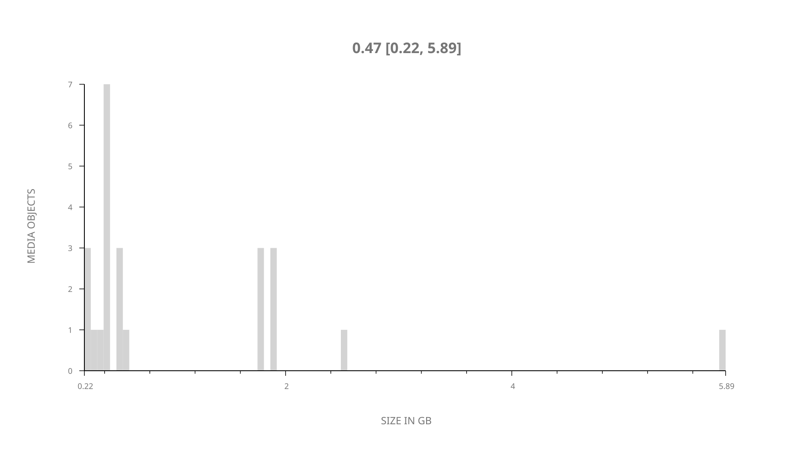
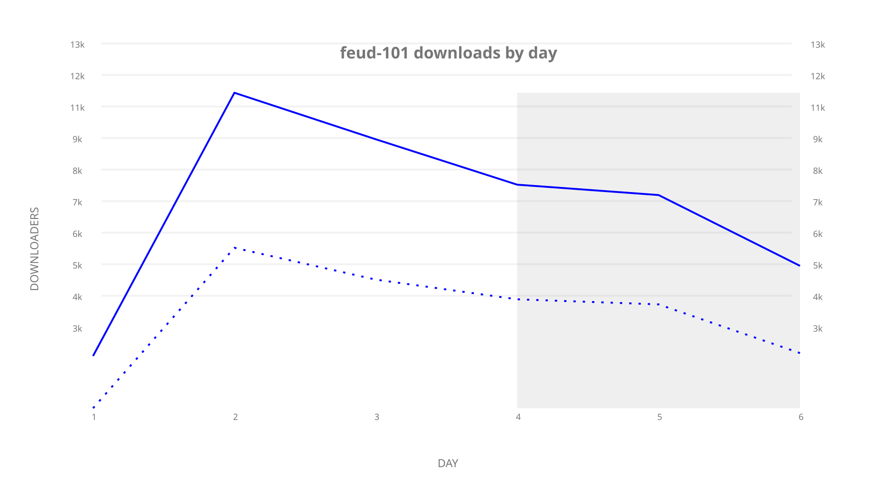
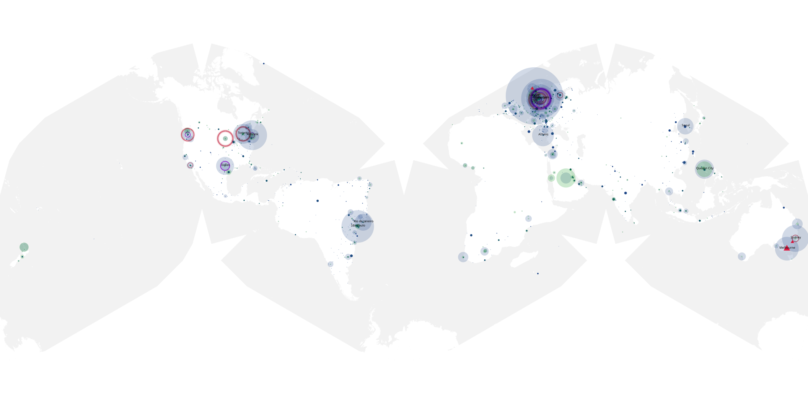
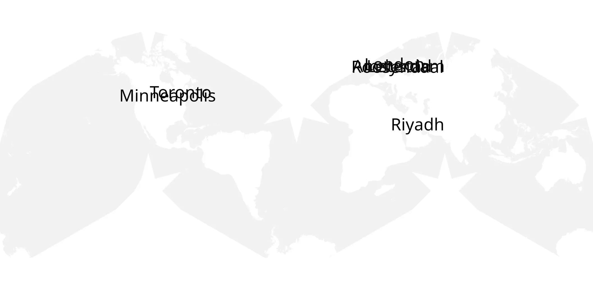
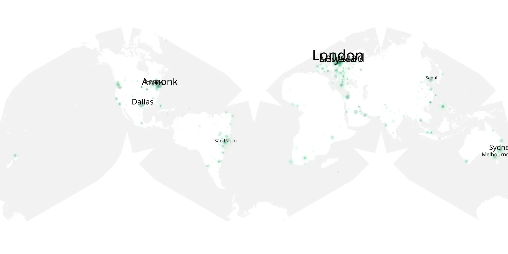

# feud-101 sample cache audit

## 1. Media object

| Field | Value |
| --- | --- |
| Media object | Feud |
| Collection key | `feud-101` |
| imdb_id | [tt1984119](https://www.imdb.com/title/tt1984119/) |
| wikipedia_url | [Feud (TV series)](https://en.wikipedia.org/wiki/Feud_(TV_series)) |
| Sample dates | 2017-03-07-to-2017-03-12 |
| Sample days | 6 |
| BTIH count | 28 |
| Unique BTIH count | 24 |
| Downloaders total | 47,740 |
| Uploaders total | 28,075 |
| Data version | `2026-08-05` |
| IP geolocation version | `6:1777968300` |

## 2. Sample coverage report

- Generated: 2026-09-09T01:10:35Z
- Sample archive directory: `/mnt/gold/src/alpha60-samples-raw.gold/feud-101.xz`
- Hour directories: 29
- Zero-length sample files: 0
- Other unparsable sample files: 0
- Hourly discontinuities: 28 (88 missing hours)
- Missing days: 0

### Sample archive discontinuities

- hourly gap: last `2017-03-07 22:00`, resumed `2017-03-08 02:00` — missing 3 hour(s)
- hourly gap: last `2017-03-08 02:00`, resumed `2017-03-08 06:00` — missing 3 hour(s)
- hourly gap: last `2017-03-08 06:00`, resumed `2017-03-08 10:00` — missing 3 hour(s)
- hourly gap: last `2017-03-08 10:00`, resumed `2017-03-08 14:00` — missing 3 hour(s)
- hourly gap: last `2017-03-08 14:00`, resumed `2017-03-08 18:00` — missing 3 hour(s)
- hourly gap: last `2017-03-08 18:00`, resumed `2017-03-08 22:00` — missing 3 hour(s)
- hourly gap: last `2017-03-08 22:00`, resumed `2017-03-09 02:00` — missing 3 hour(s)
- hourly gap: last `2017-03-09 02:00`, resumed `2017-03-09 06:00` — missing 3 hour(s)
- hourly gap: last `2017-03-09 06:00`, resumed `2017-03-09 10:00` — missing 3 hour(s)
- hourly gap: last `2017-03-09 10:00`, resumed `2017-03-09 14:00` — missing 3 hour(s)
- hourly gap: last `2017-03-09 14:00`, resumed `2017-03-09 18:00` — missing 3 hour(s)
- hourly gap: last `2017-03-09 18:00`, resumed `2017-03-09 22:00` — missing 3 hour(s)
- hourly gap: last `2017-03-09 22:00`, resumed `2017-03-10 02:00` — missing 3 hour(s)
- hourly gap: last `2017-03-10 02:00`, resumed `2017-03-10 06:00` — missing 3 hour(s)
- hourly gap: last `2017-03-10 06:00`, resumed `2017-03-10 10:00` — missing 3 hour(s)
- hourly gap: last `2017-03-10 10:00`, resumed `2017-03-10 14:00` — missing 3 hour(s)
- hourly gap: last `2017-03-10 14:00`, resumed `2017-03-10 18:00` — missing 3 hour(s)
- hourly gap: last `2017-03-10 18:00`, resumed `2017-03-10 22:00` — missing 3 hour(s)
- hourly gap: last `2017-03-10 22:00`, resumed `2017-03-11 02:00` — missing 3 hour(s)
- hourly gap: last `2017-03-11 02:00`, resumed `2017-03-11 06:00` — missing 3 hour(s)
- hourly gap: last `2017-03-11 06:00`, resumed `2017-03-11 10:00` — missing 3 hour(s)
- hourly gap: last `2017-03-11 10:00`, resumed `2017-03-11 14:00` — missing 3 hour(s)
- hourly gap: last `2017-03-11 14:00`, resumed `2017-03-11 18:00` — missing 3 hour(s)
- hourly gap: last `2017-03-11 18:00`, resumed `2017-03-11 22:00` — missing 3 hour(s)
- hourly gap: last `2017-03-11 22:00`, resumed `2017-03-12 03:00` — missing 4 hour(s)
- hourly gap: last `2017-03-12 03:00`, resumed `2017-03-12 07:00` — missing 3 hour(s)
- hourly gap: last `2017-03-12 07:00`, resumed `2017-03-12 11:00` — missing 3 hour(s)
- hourly gap: last `2017-03-12 11:00`, resumed `2017-03-12 18:00` — missing 6 hour(s)

## 3. Media objects file size histogram

## 4. Visualization pass — graphs

### Downloads by week cumulative (normalized start)



### Downloads by day, Saturday and Sunday in gray

## 5. Visualization pass — maps

### Cumulative geographic slices

| Africa | Americas | Asia | Europe | Oceania | Unknown |
| --- | --- | --- | --- | --- | --- |
| 3.19 | 20.10 | 10.94 | 23.17 | 4.78 | 0.58 |

### Cumulative network infrastructure

{:target="_blank" rel="noopener"}

### Cumulative data maps

**Cumulative >= 1080p**

{:target="_blank" rel="noopener"}

**Cumulative < 1080p**

{:target="_blank" rel="noopener"}
