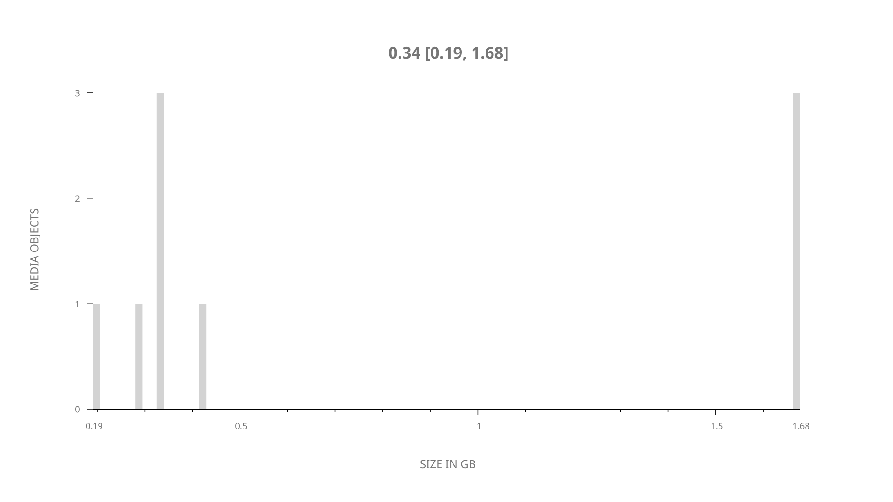
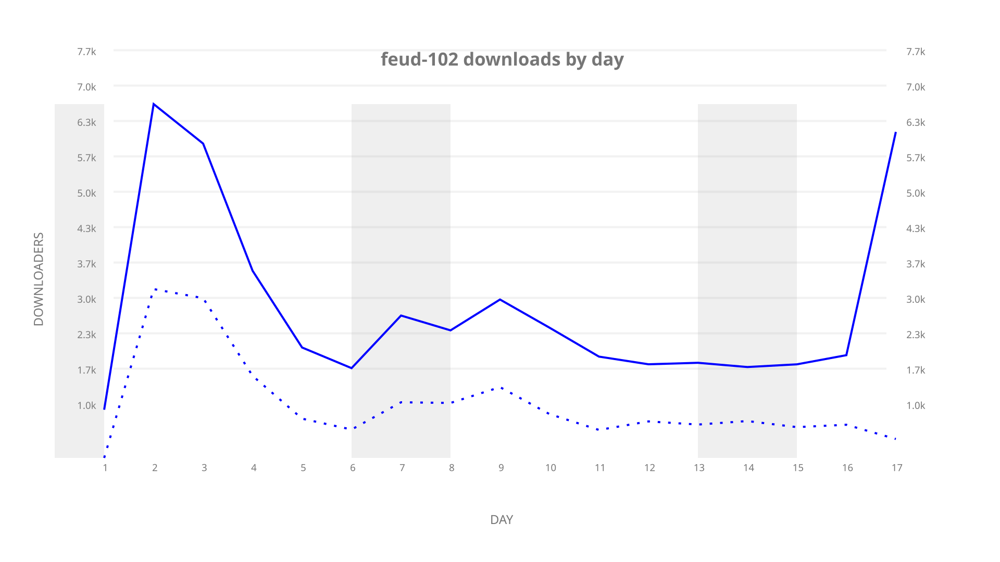
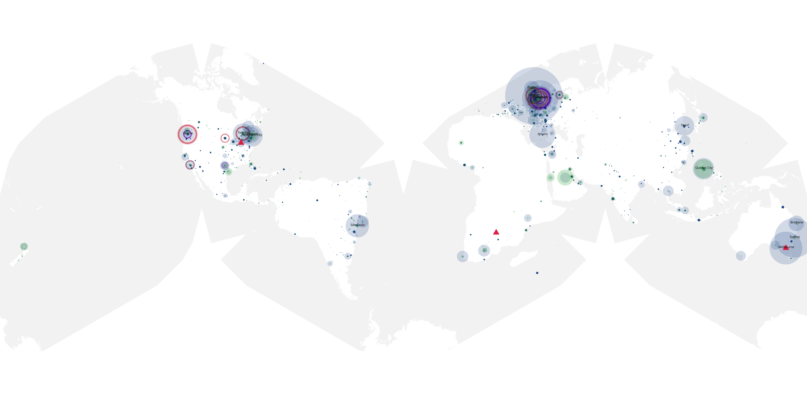
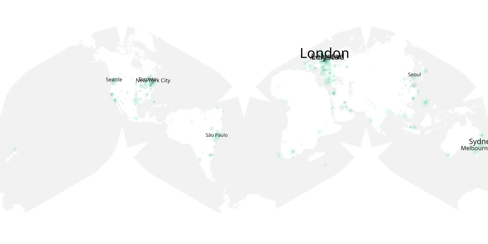

# feud-102 sample cache audit

## 1. Media object

| Field | Value |
| --- | --- |
| Media object | Feud |
| Collection key | `feud-102` |
| imdb_id | [tt1984119](https://www.imdb.com/title/tt1984119/) |
| wikipedia_url | [Feud (TV series)](https://en.wikipedia.org/wiki/Feud_(TV_series)) |
| Sample dates | 2017-03-12-to-2017-03-28 |
| Sample days | 17 |
| BTIH count | 9 |
| Unique BTIH count | 9 |
| Downloaders total | 37,442 |
| Uploaders total | 19,001 |
| Data version | `2026-08-05` |
| IP geolocation version | `6:1777968300` |

## 2. Sample coverage report

- Generated: 2026-09-09T01:10:35Z
- Sample archive directory: `/mnt/gold/src/alpha60-samples-raw.gold/feud-102.xz`
- Hour directories: 93
- Zero-length sample files: 0
- Other unparsable sample files: 0
- Hourly discontinuities: 92 (288 missing hours)
- Missing days: 0

### Sample archive discontinuities

- hourly gap: last `2017-03-12 22:00`, resumed `2017-03-13 02:00` — missing 3 hour(s)
- hourly gap: last `2017-03-13 02:00`, resumed `2017-03-13 06:00` — missing 3 hour(s)
- hourly gap: last `2017-03-13 06:00`, resumed `2017-03-13 10:00` — missing 3 hour(s)
- hourly gap: last `2017-03-13 10:00`, resumed `2017-03-13 14:00` — missing 3 hour(s)
- hourly gap: last `2017-03-13 14:00`, resumed `2017-03-13 18:00` — missing 3 hour(s)
- hourly gap: last `2017-03-13 18:00`, resumed `2017-03-13 22:00` — missing 3 hour(s)
- hourly gap: last `2017-03-13 22:00`, resumed `2017-03-14 02:00` — missing 3 hour(s)
- hourly gap: last `2017-03-14 02:00`, resumed `2017-03-14 06:00` — missing 3 hour(s)
- hourly gap: last `2017-03-14 06:00`, resumed `2017-03-14 10:00` — missing 3 hour(s)
- hourly gap: last `2017-03-14 10:00`, resumed `2017-03-14 14:00` — missing 3 hour(s)
- hourly gap: last `2017-03-14 14:00`, resumed `2017-03-14 18:00` — missing 3 hour(s)
- hourly gap: last `2017-03-14 18:00`, resumed `2017-03-14 22:00` — missing 3 hour(s)
- hourly gap: last `2017-03-14 22:00`, resumed `2017-03-15 02:00` — missing 3 hour(s)
- hourly gap: last `2017-03-15 02:00`, resumed `2017-03-15 06:00` — missing 3 hour(s)
- hourly gap: last `2017-03-15 06:00`, resumed `2017-03-15 10:00` — missing 3 hour(s)
- hourly gap: last `2017-03-15 10:00`, resumed `2017-03-15 14:00` — missing 3 hour(s)
- hourly gap: last `2017-03-15 14:00`, resumed `2017-03-15 18:00` — missing 3 hour(s)
- hourly gap: last `2017-03-15 18:00`, resumed `2017-03-16 02:00` — missing 7 hour(s)
- hourly gap: last `2017-03-16 02:00`, resumed `2017-03-16 06:00` — missing 3 hour(s)
- hourly gap: last `2017-03-16 06:00`, resumed `2017-03-16 10:00` — missing 3 hour(s)
- hourly gap: last `2017-03-16 10:00`, resumed `2017-03-16 14:00` — missing 3 hour(s)
- hourly gap: last `2017-03-16 14:00`, resumed `2017-03-17 02:00` — missing 11 hour(s)
- hourly gap: last `2017-03-17 02:00`, resumed `2017-03-17 06:00` — missing 3 hour(s)
- hourly gap: last `2017-03-17 06:00`, resumed `2017-03-17 10:00` — missing 3 hour(s)
- hourly gap: last `2017-03-17 10:00`, resumed `2017-03-17 14:00` — missing 3 hour(s)
- hourly gap: last `2017-03-17 14:00`, resumed `2017-03-17 18:00` — missing 3 hour(s)
- hourly gap: last `2017-03-17 18:00`, resumed `2017-03-17 22:00` — missing 3 hour(s)
- hourly gap: last `2017-03-17 22:00`, resumed `2017-03-18 02:00` — missing 3 hour(s)
- hourly gap: last `2017-03-18 02:00`, resumed `2017-03-18 06:00` — missing 3 hour(s)
- hourly gap: last `2017-03-18 06:00`, resumed `2017-03-18 10:00` — missing 3 hour(s)
- hourly gap: last `2017-03-18 10:00`, resumed `2017-03-18 14:00` — missing 3 hour(s)
- hourly gap: last `2017-03-18 14:00`, resumed `2017-03-18 18:00` — missing 3 hour(s)
- hourly gap: last `2017-03-18 18:00`, resumed `2017-03-18 22:00` — missing 3 hour(s)
- hourly gap: last `2017-03-18 22:00`, resumed `2017-03-19 02:00` — missing 3 hour(s)
- hourly gap: last `2017-03-19 02:00`, resumed `2017-03-19 06:00` — missing 3 hour(s)
- hourly gap: last `2017-03-19 06:00`, resumed `2017-03-19 10:00` — missing 3 hour(s)
- hourly gap: last `2017-03-19 10:00`, resumed `2017-03-19 14:00` — missing 3 hour(s)
- hourly gap: last `2017-03-19 14:00`, resumed `2017-03-19 18:00` — missing 3 hour(s)
- hourly gap: last `2017-03-19 18:00`, resumed `2017-03-19 22:00` — missing 3 hour(s)
- hourly gap: last `2017-03-19 22:00`, resumed `2017-03-20 02:00` — missing 3 hour(s)
- hourly gap: last `2017-03-20 02:00`, resumed `2017-03-20 06:00` — missing 3 hour(s)
- hourly gap: last `2017-03-20 06:00`, resumed `2017-03-20 10:00` — missing 3 hour(s)
- hourly gap: last `2017-03-20 10:00`, resumed `2017-03-20 14:00` — missing 3 hour(s)
- hourly gap: last `2017-03-20 14:00`, resumed `2017-03-20 18:00` — missing 3 hour(s)
- hourly gap: last `2017-03-20 18:00`, resumed `2017-03-20 22:00` — missing 3 hour(s)
- hourly gap: last `2017-03-20 22:00`, resumed `2017-03-21 02:00` — missing 3 hour(s)
- hourly gap: last `2017-03-21 02:00`, resumed `2017-03-21 06:00` — missing 3 hour(s)
- hourly gap: last `2017-03-21 06:00`, resumed `2017-03-21 10:00` — missing 3 hour(s)
- hourly gap: last `2017-03-21 10:00`, resumed `2017-03-21 14:00` — missing 3 hour(s)
- hourly gap: last `2017-03-21 14:00`, resumed `2017-03-21 18:00` — missing 3 hour(s)
- hourly gap: last `2017-03-21 18:00`, resumed `2017-03-21 22:00` — missing 3 hour(s)
- hourly gap: last `2017-03-21 22:00`, resumed `2017-03-22 02:00` — missing 3 hour(s)
- hourly gap: last `2017-03-22 02:00`, resumed `2017-03-22 06:00` — missing 3 hour(s)
- hourly gap: last `2017-03-22 06:00`, resumed `2017-03-22 10:00` — missing 3 hour(s)
- hourly gap: last `2017-03-22 10:00`, resumed `2017-03-22 14:00` — missing 3 hour(s)
- hourly gap: last `2017-03-22 14:00`, resumed `2017-03-22 18:00` — missing 3 hour(s)
- hourly gap: last `2017-03-22 18:00`, resumed `2017-03-22 22:00` — missing 3 hour(s)
- hourly gap: last `2017-03-22 22:00`, resumed `2017-03-23 02:00` — missing 3 hour(s)
- hourly gap: last `2017-03-23 02:00`, resumed `2017-03-23 06:00` — missing 3 hour(s)
- hourly gap: last `2017-03-23 06:00`, resumed `2017-03-23 10:00` — missing 3 hour(s)
- hourly gap: last `2017-03-23 10:00`, resumed `2017-03-23 14:00` — missing 3 hour(s)
- hourly gap: last `2017-03-23 14:00`, resumed `2017-03-23 18:00` — missing 3 hour(s)
- hourly gap: last `2017-03-23 18:00`, resumed `2017-03-23 22:00` — missing 3 hour(s)
- hourly gap: last `2017-03-23 22:00`, resumed `2017-03-24 02:00` — missing 3 hour(s)
- hourly gap: last `2017-03-24 02:00`, resumed `2017-03-24 06:00` — missing 3 hour(s)
- hourly gap: last `2017-03-24 06:00`, resumed `2017-03-24 10:00` — missing 3 hour(s)
- hourly gap: last `2017-03-24 10:00`, resumed `2017-03-24 14:00` — missing 3 hour(s)
- hourly gap: last `2017-03-24 14:00`, resumed `2017-03-24 18:00` — missing 3 hour(s)
- hourly gap: last `2017-03-24 18:00`, resumed `2017-03-24 22:00` — missing 3 hour(s)
- hourly gap: last `2017-03-24 22:00`, resumed `2017-03-25 02:00` — missing 3 hour(s)
- hourly gap: last `2017-03-25 02:00`, resumed `2017-03-25 06:00` — missing 3 hour(s)
- hourly gap: last `2017-03-25 06:00`, resumed `2017-03-25 10:00` — missing 3 hour(s)
- hourly gap: last `2017-03-25 10:00`, resumed `2017-03-25 14:00` — missing 3 hour(s)
- hourly gap: last `2017-03-25 14:00`, resumed `2017-03-25 18:00` — missing 3 hour(s)
- hourly gap: last `2017-03-25 18:00`, resumed `2017-03-25 22:00` — missing 3 hour(s)
- hourly gap: last `2017-03-25 22:00`, resumed `2017-03-26 02:00` — missing 3 hour(s)
- hourly gap: last `2017-03-26 02:00`, resumed `2017-03-26 06:00` — missing 3 hour(s)
- hourly gap: last `2017-03-26 06:00`, resumed `2017-03-26 10:00` — missing 3 hour(s)
- hourly gap: last `2017-03-26 10:00`, resumed `2017-03-26 14:00` — missing 3 hour(s)
- hourly gap: last `2017-03-26 14:00`, resumed `2017-03-26 18:00` — missing 3 hour(s)
- hourly gap: last `2017-03-26 18:00`, resumed `2017-03-26 22:00` — missing 3 hour(s)
- hourly gap: last `2017-03-26 22:00`, resumed `2017-03-27 02:00` — missing 3 hour(s)
- hourly gap: last `2017-03-27 02:00`, resumed `2017-03-27 06:00` — missing 3 hour(s)
- hourly gap: last `2017-03-27 06:00`, resumed `2017-03-27 10:00` — missing 3 hour(s)
- hourly gap: last `2017-03-27 10:00`, resumed `2017-03-27 14:00` — missing 3 hour(s)
- hourly gap: last `2017-03-27 14:00`, resumed `2017-03-27 18:00` — missing 3 hour(s)
- hourly gap: last `2017-03-27 18:00`, resumed `2017-03-27 22:00` — missing 3 hour(s)
- hourly gap: last `2017-03-27 22:00`, resumed `2017-03-28 02:00` — missing 3 hour(s)
- hourly gap: last `2017-03-28 02:00`, resumed `2017-03-28 06:00` — missing 3 hour(s)
- hourly gap: last `2017-03-28 06:00`, resumed `2017-03-28 10:00` — missing 3 hour(s)
- hourly gap: last `2017-03-28 10:00`, resumed `2017-03-28 14:00` — missing 3 hour(s)
- hourly gap: last `2017-03-28 14:00`, resumed `2017-03-28 18:00` — missing 3 hour(s)

## 3. Media objects file size histogram

## 4. Visualization pass — graphs

### Downloads by week cumulative (normalized start)



### Downloads by day, Saturday and Sunday in gray

## 5. Visualization pass — maps

### Cumulative geographic slices

| Africa | Americas | Asia | Europe | Oceania | Unknown |
| --- | --- | --- | --- | --- | --- |
| 2.31 | 23.89 | 10.77 | 22.29 | 4.49 | 1.82 |

### Cumulative network infrastructure

{:target="_blank" rel="noopener"}

### Cumulative data maps

**Cumulative >= 1080p**

UNAVAILABLE — no collection members at 1080p or 2160 resolution.

**Cumulative < 1080p**

{:target="_blank" rel="noopener"}
