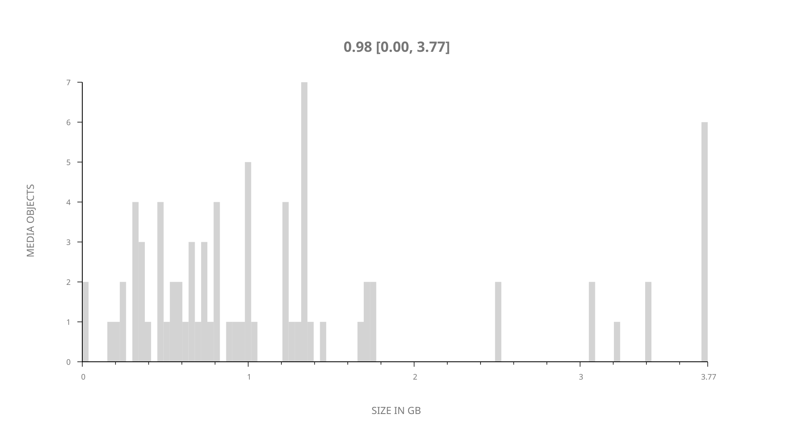
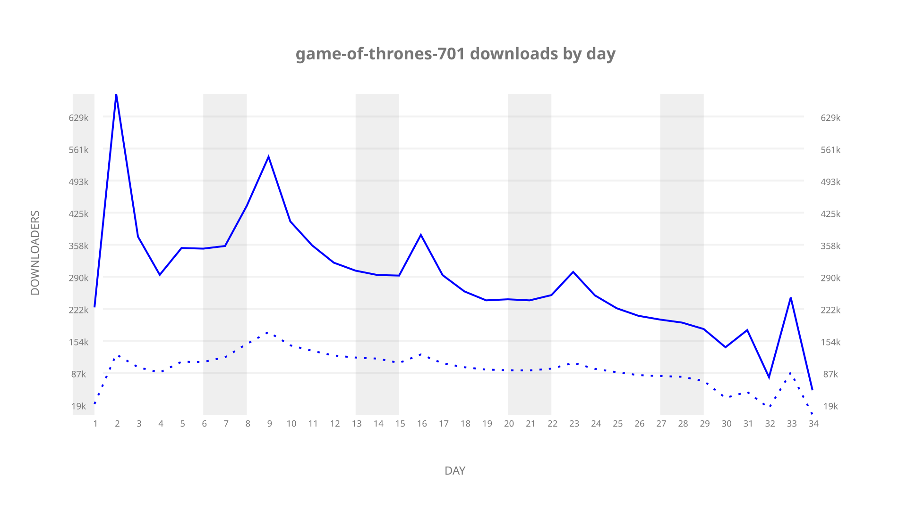
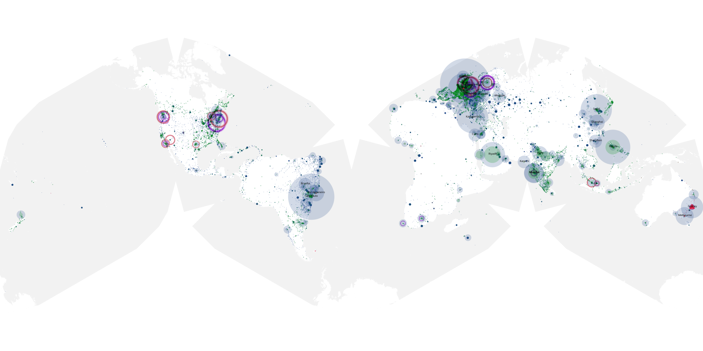
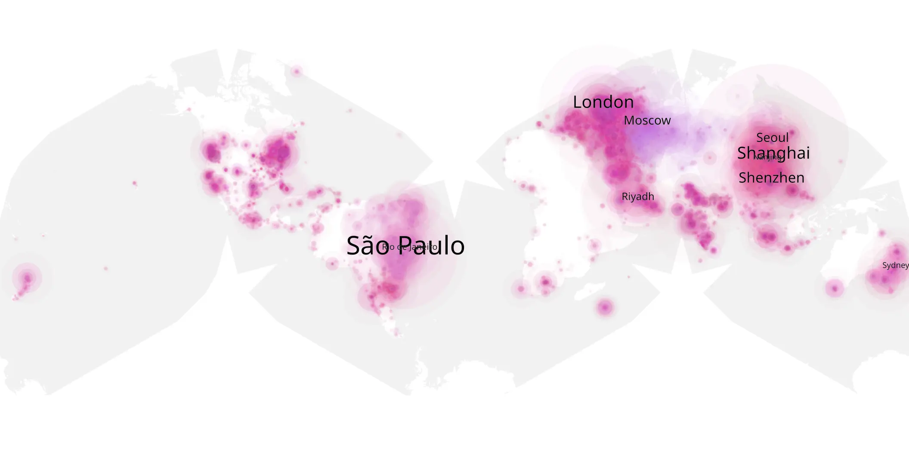
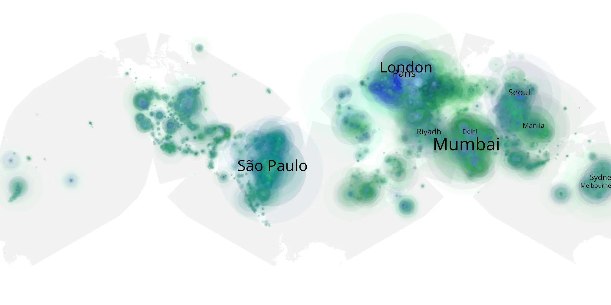

# game-of-thrones-701 sample cache audit

## 1. Media object

| Field | Value |
| --- | --- |
| Media object | Game of Thrones |
| Collection key | `game-of-thrones-701` |
| imdb_id | [tt0944947](https://www.imdb.com/title/tt0944947/) |
| wikipedia_url | [Game of Thrones](https://en.wikipedia.org/wiki/Game_of_Thrones) |
| Sample dates | 2017-07-16-to-2017-09-01 |
| Sample days | 48 |
| BTIH count | 82 |
| Unique BTIH count | 78 |
| Downloaders total | 5,765,516 |
| Uploaders total | 2,064,914 |
| Data version | `2026-08-05` |
| IP geolocation version | `6:1777968300` |

## 2. Sample coverage report

- Generated: 2026-09-09T01:10:35Z
- Sample archive directory: `/mnt/gold/src/alpha60-samples-raw.gold/game-of-thrones-701.xz`
- Hour directories: 203
- Zero-length sample files: 0
- Other unparsable sample files: 0
- Hourly discontinuities: 182 (904 missing hours)
- Missing days: 14

### Sample archive discontinuities

- hourly gap: last `2017-07-16 19:00`, resumed `2017-07-16 23:00` — missing 3 hour(s)
- hourly gap: last `2017-07-16 23:00`, resumed `2017-07-17 03:00` — missing 3 hour(s)
- hourly gap: last `2017-07-17 03:00`, resumed `2017-07-17 07:00` — missing 3 hour(s)
- hourly gap: last `2017-07-17 07:00`, resumed `2017-07-17 11:00` — missing 3 hour(s)
- hourly gap: last `2017-07-17 11:00`, resumed `2017-07-17 15:00` — missing 3 hour(s)
- hourly gap: last `2017-07-17 15:00`, resumed `2017-07-17 19:00` — missing 3 hour(s)
- hourly gap: last `2017-07-17 19:00`, resumed `2017-07-17 23:00` — missing 3 hour(s)
- hourly gap: last `2017-07-17 23:00`, resumed `2017-07-18 03:00` — missing 3 hour(s)
- hourly gap: last `2017-07-18 03:00`, resumed `2017-07-18 07:00` — missing 3 hour(s)
- hourly gap: last `2017-07-18 07:00`, resumed `2017-07-18 11:00` — missing 3 hour(s)
- hourly gap: last `2017-07-18 11:00`, resumed `2017-07-18 15:00` — missing 3 hour(s)
- hourly gap: last `2017-07-18 15:00`, resumed `2017-07-18 19:00` — missing 3 hour(s)
- hourly gap: last `2017-07-18 19:00`, resumed `2017-07-18 23:00` — missing 3 hour(s)
- hourly gap: last `2017-07-18 23:00`, resumed `2017-07-19 03:00` — missing 3 hour(s)
- hourly gap: last `2017-07-19 03:00`, resumed `2017-07-19 07:00` — missing 3 hour(s)
- hourly gap: last `2017-07-19 07:00`, resumed `2017-07-19 11:00` — missing 3 hour(s)
- hourly gap: last `2017-07-19 11:00`, resumed `2017-07-19 15:00` — missing 3 hour(s)
- hourly gap: last `2017-07-19 15:00`, resumed `2017-07-19 19:00` — missing 3 hour(s)
- hourly gap: last `2017-07-19 19:00`, resumed `2017-07-19 23:00` — missing 3 hour(s)
- hourly gap: last `2017-07-19 23:00`, resumed `2017-07-20 03:00` — missing 3 hour(s)
- hourly gap: last `2017-07-20 03:00`, resumed `2017-07-20 07:00` — missing 3 hour(s)
- hourly gap: last `2017-07-20 07:00`, resumed `2017-07-20 11:00` — missing 3 hour(s)
- hourly gap: last `2017-07-20 11:00`, resumed `2017-07-20 15:00` — missing 3 hour(s)
- hourly gap: last `2017-07-20 15:00`, resumed `2017-07-20 19:00` — missing 3 hour(s)
- hourly gap: last `2017-07-20 19:00`, resumed `2017-07-20 23:00` — missing 3 hour(s)
- hourly gap: last `2017-07-20 23:00`, resumed `2017-07-21 03:00` — missing 3 hour(s)
- hourly gap: last `2017-07-21 03:00`, resumed `2017-07-21 07:00` — missing 3 hour(s)
- hourly gap: last `2017-07-21 07:00`, resumed `2017-07-21 11:00` — missing 3 hour(s)
- hourly gap: last `2017-07-21 11:00`, resumed `2017-07-21 15:00` — missing 3 hour(s)
- hourly gap: last `2017-07-21 15:00`, resumed `2017-07-21 19:00` — missing 3 hour(s)
- hourly gap: last `2017-07-21 19:00`, resumed `2017-07-21 23:00` — missing 3 hour(s)
- hourly gap: last `2017-07-21 23:00`, resumed `2017-07-22 03:00` — missing 3 hour(s)
- hourly gap: last `2017-07-22 03:00`, resumed `2017-07-22 07:00` — missing 3 hour(s)
- hourly gap: last `2017-07-22 07:00`, resumed `2017-07-22 11:00` — missing 3 hour(s)
- hourly gap: last `2017-07-22 11:00`, resumed `2017-07-22 15:04` — missing 3 hour(s)
- hourly gap: last `2017-07-22 15:04`, resumed `2017-07-22 19:04` — missing 3 hour(s)
- hourly gap: last `2017-07-22 19:04`, resumed `2017-07-22 23:04` — missing 3 hour(s)
- hourly gap: last `2017-07-22 23:04`, resumed `2017-07-23 03:04` — missing 3 hour(s)
- hourly gap: last `2017-07-23 03:04`, resumed `2017-07-23 07:04` — missing 3 hour(s)
- hourly gap: last `2017-07-23 07:04`, resumed `2017-07-23 11:04` — missing 3 hour(s)
- hourly gap: last `2017-07-23 11:04`, resumed `2017-07-23 15:04` — missing 3 hour(s)
- hourly gap: last `2017-07-23 15:04`, resumed `2017-07-23 19:00` — missing 2 hour(s)
- hourly gap: last `2017-07-23 19:00`, resumed `2017-07-23 23:00` — missing 3 hour(s)
- hourly gap: last `2017-07-23 23:00`, resumed `2017-07-24 03:00` — missing 3 hour(s)
- hourly gap: last `2017-07-24 03:00`, resumed `2017-07-24 07:00` — missing 3 hour(s)
- hourly gap: last `2017-07-24 07:00`, resumed `2017-07-24 11:00` — missing 3 hour(s)
- hourly gap: last `2017-07-24 11:00`, resumed `2017-07-24 15:00` — missing 3 hour(s)
- hourly gap: last `2017-07-24 15:00`, resumed `2017-07-24 19:00` — missing 3 hour(s)
- hourly gap: last `2017-07-24 19:00`, resumed `2017-07-24 23:00` — missing 3 hour(s)
- hourly gap: last `2017-07-24 23:00`, resumed `2017-07-25 03:00` — missing 3 hour(s)
- hourly gap: last `2017-07-25 03:00`, resumed `2017-07-25 07:00` — missing 3 hour(s)
- hourly gap: last `2017-07-25 07:00`, resumed `2017-07-25 11:00` — missing 3 hour(s)
- hourly gap: last `2017-07-25 11:00`, resumed `2017-07-25 15:00` — missing 3 hour(s)
- hourly gap: last `2017-07-25 15:00`, resumed `2017-07-25 19:00` — missing 3 hour(s)
- hourly gap: last `2017-07-25 19:00`, resumed `2017-07-25 23:00` — missing 3 hour(s)
- hourly gap: last `2017-07-25 23:00`, resumed `2017-07-26 03:00` — missing 3 hour(s)
- hourly gap: last `2017-07-26 03:00`, resumed `2017-07-26 07:00` — missing 3 hour(s)
- hourly gap: last `2017-07-26 07:00`, resumed `2017-07-26 11:00` — missing 3 hour(s)
- hourly gap: last `2017-07-26 11:00`, resumed `2017-07-26 15:00` — missing 3 hour(s)
- hourly gap: last `2017-07-26 15:00`, resumed `2017-07-26 19:00` — missing 3 hour(s)
- hourly gap: last `2017-07-26 19:00`, resumed `2017-07-26 23:00` — missing 3 hour(s)
- hourly gap: last `2017-07-26 23:00`, resumed `2017-07-27 03:00` — missing 3 hour(s)
- hourly gap: last `2017-07-27 03:00`, resumed `2017-07-27 07:00` — missing 3 hour(s)
- hourly gap: last `2017-07-27 07:00`, resumed `2017-07-27 11:00` — missing 3 hour(s)
- hourly gap: last `2017-07-27 11:00`, resumed `2017-07-27 15:00` — missing 3 hour(s)
- hourly gap: last `2017-07-27 15:00`, resumed `2017-07-27 19:00` — missing 3 hour(s)
- hourly gap: last `2017-07-27 19:00`, resumed `2017-07-27 23:00` — missing 3 hour(s)
- hourly gap: last `2017-07-27 23:00`, resumed `2017-07-28 03:00` — missing 3 hour(s)
- hourly gap: last `2017-07-28 03:00`, resumed `2017-07-28 07:00` — missing 3 hour(s)
- hourly gap: last `2017-07-28 07:00`, resumed `2017-07-28 11:00` — missing 3 hour(s)
- hourly gap: last `2017-07-28 11:00`, resumed `2017-07-28 15:00` — missing 3 hour(s)
- hourly gap: last `2017-07-28 15:00`, resumed `2017-07-28 19:00` — missing 3 hour(s)
- hourly gap: last `2017-07-28 19:00`, resumed `2017-07-28 23:00` — missing 3 hour(s)
- hourly gap: last `2017-07-28 23:00`, resumed `2017-07-29 03:00` — missing 3 hour(s)
- hourly gap: last `2017-07-29 03:00`, resumed `2017-07-29 07:00` — missing 3 hour(s)
- hourly gap: last `2017-07-29 07:00`, resumed `2017-07-29 11:00` — missing 3 hour(s)
- hourly gap: last `2017-07-29 11:00`, resumed `2017-07-29 15:00` — missing 3 hour(s)
- hourly gap: last `2017-07-29 15:00`, resumed `2017-07-29 19:00` — missing 3 hour(s)
- hourly gap: last `2017-07-29 19:00`, resumed `2017-07-29 23:00` — missing 3 hour(s)
- hourly gap: last `2017-07-29 23:00`, resumed `2017-07-30 03:00` — missing 3 hour(s)
- hourly gap: last `2017-07-30 03:00`, resumed `2017-07-30 07:00` — missing 3 hour(s)
- hourly gap: last `2017-07-30 07:00`, resumed `2017-07-30 11:00` — missing 3 hour(s)
- hourly gap: last `2017-07-30 11:00`, resumed `2017-07-30 15:00` — missing 3 hour(s)
- hourly gap: last `2017-07-30 15:00`, resumed `2017-07-30 21:30` — missing 5 hour(s)
- hourly gap: last `2017-07-30 21:30`, resumed `2017-07-31 01:30` — missing 3 hour(s)
- hourly gap: last `2017-07-31 01:30`, resumed `2017-07-31 05:30` — missing 3 hour(s)
- hourly gap: last `2017-07-31 05:30`, resumed `2017-07-31 09:30` — missing 3 hour(s)
- hourly gap: last `2017-07-31 09:30`, resumed `2017-07-31 13:30` — missing 3 hour(s)
- hourly gap: last `2017-07-31 13:30`, resumed `2017-07-31 17:30` — missing 3 hour(s)
- hourly gap: last `2017-07-31 17:30`, resumed `2017-07-31 21:30` — missing 3 hour(s)
- hourly gap: last `2017-07-31 21:30`, resumed `2017-08-01 01:30` — missing 3 hour(s)
- hourly gap: last `2017-08-01 01:30`, resumed `2017-08-01 05:30` — missing 3 hour(s)
- hourly gap: last `2017-08-01 05:30`, resumed `2017-08-01 09:30` — missing 3 hour(s)
- hourly gap: last `2017-08-01 09:30`, resumed `2017-08-01 13:30` — missing 3 hour(s)
- hourly gap: last `2017-08-01 13:30`, resumed `2017-08-01 17:30` — missing 3 hour(s)
- hourly gap: last `2017-08-01 17:30`, resumed `2017-08-01 21:30` — missing 3 hour(s)
- hourly gap: last `2017-08-01 21:30`, resumed `2017-08-02 01:30` — missing 3 hour(s)
- hourly gap: last `2017-08-02 01:30`, resumed `2017-08-02 05:30` — missing 3 hour(s)
- hourly gap: last `2017-08-02 05:30`, resumed `2017-08-02 09:30` — missing 3 hour(s)
- hourly gap: last `2017-08-02 09:30`, resumed `2017-08-02 13:30` — missing 3 hour(s)
- hourly gap: last `2017-08-02 13:30`, resumed `2017-08-02 17:30` — missing 3 hour(s)
- hourly gap: last `2017-08-02 17:30`, resumed `2017-08-02 21:30` — missing 3 hour(s)
- hourly gap: last `2017-08-02 21:30`, resumed `2017-08-03 01:30` — missing 3 hour(s)
- hourly gap: last `2017-08-03 01:30`, resumed `2017-08-03 05:30` — missing 3 hour(s)
- hourly gap: last `2017-08-03 05:30`, resumed `2017-08-03 09:30` — missing 3 hour(s)
- hourly gap: last `2017-08-03 09:30`, resumed `2017-08-03 13:30` — missing 3 hour(s)
- hourly gap: last `2017-08-03 13:30`, resumed `2017-08-03 17:30` — missing 3 hour(s)
- hourly gap: last `2017-08-03 17:30`, resumed `2017-08-03 21:30` — missing 3 hour(s)
- hourly gap: last `2017-08-03 21:30`, resumed `2017-08-04 01:30` — missing 3 hour(s)
- hourly gap: last `2017-08-04 01:30`, resumed `2017-08-04 05:30` — missing 3 hour(s)
- hourly gap: last `2017-08-04 05:30`, resumed `2017-08-04 09:30` — missing 3 hour(s)
- hourly gap: last `2017-08-04 09:30`, resumed `2017-08-04 13:30` — missing 3 hour(s)
- hourly gap: last `2017-08-04 13:30`, resumed `2017-08-04 17:30` — missing 3 hour(s)
- hourly gap: last `2017-08-04 17:30`, resumed `2017-08-04 21:30` — missing 3 hour(s)
- hourly gap: last `2017-08-04 21:30`, resumed `2017-08-05 01:30` — missing 3 hour(s)
- hourly gap: last `2017-08-05 01:30`, resumed `2017-08-05 05:30` — missing 3 hour(s)
- hourly gap: last `2017-08-05 05:30`, resumed `2017-08-05 09:30` — missing 3 hour(s)
- hourly gap: last `2017-08-05 09:30`, resumed `2017-08-05 13:30` — missing 3 hour(s)
- hourly gap: last `2017-08-05 13:30`, resumed `2017-08-05 17:30` — missing 3 hour(s)
- hourly gap: last `2017-08-05 17:30`, resumed `2017-08-05 21:30` — missing 3 hour(s)
- hourly gap: last `2017-08-05 21:30`, resumed `2017-08-06 01:30` — missing 3 hour(s)
- hourly gap: last `2017-08-06 01:30`, resumed `2017-08-06 05:30` — missing 3 hour(s)
- hourly gap: last `2017-08-06 05:30`, resumed `2017-08-06 09:30` — missing 3 hour(s)
- hourly gap: last `2017-08-06 09:30`, resumed `2017-08-06 13:30` — missing 3 hour(s)
- hourly gap: last `2017-08-06 13:30`, resumed `2017-08-06 17:30` — missing 3 hour(s)
- hourly gap: last `2017-08-06 17:30`, resumed `2017-08-06 21:30` — missing 3 hour(s)
- hourly gap: last `2017-08-06 21:30`, resumed `2017-08-07 01:30` — missing 3 hour(s)
- hourly gap: last `2017-08-07 01:30`, resumed `2017-08-07 05:30` — missing 3 hour(s)
- hourly gap: last `2017-08-07 05:30`, resumed `2017-08-07 09:30` — missing 3 hour(s)
- hourly gap: last `2017-08-07 09:30`, resumed `2017-08-07 13:30` — missing 3 hour(s)
- hourly gap: last `2017-08-07 13:30`, resumed `2017-08-07 17:30` — missing 3 hour(s)
- hourly gap: last `2017-08-07 17:30`, resumed `2017-08-07 21:30` — missing 3 hour(s)
- hourly gap: last `2017-08-07 21:30`, resumed `2017-08-08 01:30` — missing 3 hour(s)
- hourly gap: last `2017-08-08 01:30`, resumed `2017-08-08 05:30` — missing 3 hour(s)
- hourly gap: last `2017-08-08 05:30`, resumed `2017-08-08 09:30` — missing 3 hour(s)
- hourly gap: last `2017-08-08 09:30`, resumed `2017-08-08 13:30` — missing 3 hour(s)
- hourly gap: last `2017-08-08 13:30`, resumed `2017-08-08 17:30` — missing 3 hour(s)
- hourly gap: last `2017-08-08 17:30`, resumed `2017-08-08 21:30` — missing 3 hour(s)
- hourly gap: last `2017-08-08 21:30`, resumed `2017-08-09 01:30` — missing 3 hour(s)
- hourly gap: last `2017-08-09 01:30`, resumed `2017-08-09 05:30` — missing 3 hour(s)
- hourly gap: last `2017-08-09 05:30`, resumed `2017-08-09 09:30` — missing 3 hour(s)
- hourly gap: last `2017-08-09 09:30`, resumed `2017-08-09 13:30` — missing 3 hour(s)
- hourly gap: last `2017-08-09 13:30`, resumed `2017-08-09 17:30` — missing 3 hour(s)
- hourly gap: last `2017-08-09 17:30`, resumed `2017-08-09 21:30` — missing 3 hour(s)
- hourly gap: last `2017-08-09 21:30`, resumed `2017-08-10 01:30` — missing 3 hour(s)
- hourly gap: last `2017-08-10 01:30`, resumed `2017-08-10 05:30` — missing 3 hour(s)
- hourly gap: last `2017-08-10 05:30`, resumed `2017-08-10 09:30` — missing 3 hour(s)
- hourly gap: last `2017-08-10 09:30`, resumed `2017-08-10 13:30` — missing 3 hour(s)
- hourly gap: last `2017-08-10 13:30`, resumed `2017-08-10 17:30` — missing 3 hour(s)
- hourly gap: last `2017-08-10 17:30`, resumed `2017-08-10 21:30` — missing 3 hour(s)
- hourly gap: last `2017-08-10 21:30`, resumed `2017-08-11 01:30` — missing 3 hour(s)
- hourly gap: last `2017-08-11 01:30`, resumed `2017-08-11 05:30` — missing 3 hour(s)
- hourly gap: last `2017-08-11 05:30`, resumed `2017-08-11 09:30` — missing 3 hour(s)
- hourly gap: last `2017-08-11 09:30`, resumed `2017-08-11 13:30` — missing 3 hour(s)
- hourly gap: last `2017-08-11 13:30`, resumed `2017-08-11 17:30` — missing 3 hour(s)
- hourly gap: last `2017-08-11 17:30`, resumed `2017-08-11 21:30` — missing 3 hour(s)
- hourly gap: last `2017-08-11 21:30`, resumed `2017-08-12 01:30` — missing 3 hour(s)
- hourly gap: last `2017-08-12 01:30`, resumed `2017-08-12 05:30` — missing 3 hour(s)
- hourly gap: last `2017-08-12 05:30`, resumed `2017-08-12 09:30` — missing 3 hour(s)
- hourly gap: last `2017-08-12 09:30`, resumed `2017-08-12 13:30` — missing 3 hour(s)
- hourly gap: last `2017-08-12 13:30`, resumed `2017-08-12 17:30` — missing 3 hour(s)
- hourly gap: last `2017-08-12 17:30`, resumed `2017-08-12 21:30` — missing 3 hour(s)
- hourly gap: last `2017-08-12 21:30`, resumed `2017-08-13 01:30` — missing 3 hour(s)
- hourly gap: last `2017-08-13 01:30`, resumed `2017-08-13 05:30` — missing 3 hour(s)
- hourly gap: last `2017-08-13 05:30`, resumed `2017-08-13 09:30` — missing 3 hour(s)
- hourly gap: last `2017-08-13 09:30`, resumed `2017-08-13 13:30` — missing 3 hour(s)
- hourly gap: last `2017-08-13 13:30`, resumed `2017-08-13 17:30` — missing 3 hour(s)
- hourly gap: last `2017-08-13 17:30`, resumed `2017-08-23 08:26` — missing 229 hour(s)
- hourly gap: last `2017-08-23 08:26`, resumed `2017-08-23 12:26` — missing 3 hour(s)
- hourly gap: last `2017-08-23 12:26`, resumed `2017-08-23 16:26` — missing 3 hour(s)
- hourly gap: last `2017-08-23 16:26`, resumed `2017-08-23 20:26` — missing 3 hour(s)
- hourly gap: last `2017-08-23 20:26`, resumed `2017-08-24 00:26` — missing 3 hour(s)
- hourly gap: last `2017-08-24 00:26`, resumed `2017-08-24 04:26` — missing 3 hour(s)
- hourly gap: last `2017-08-24 04:26`, resumed `2017-08-24 08:26` — missing 3 hour(s)
- hourly gap: last `2017-08-24 08:26`, resumed `2017-08-24 12:26` — missing 3 hour(s)
- hourly gap: last `2017-08-24 12:26`, resumed `2017-08-24 16:26` — missing 3 hour(s)
- hourly gap: last `2017-08-24 16:26`, resumed `2017-08-24 20:26` — missing 3 hour(s)
- hourly gap: last `2017-08-24 20:26`, resumed `2017-08-25 00:26` — missing 3 hour(s)
- hourly gap: last `2017-08-25 00:26`, resumed `2017-08-25 04:26` — missing 3 hour(s)
- hourly gap: last `2017-08-25 04:26`, resumed `2017-08-31 00:00` — missing 138 hour(s)
- hourly gap: last `2017-08-31 00:00`, resumed `2017-08-31 02:05` — missing 1 hour(s)
- hourly gap: last `2017-08-31 03:00`, resumed `2017-08-31 05:00` — missing 1 hour(s)
- missing day: `2017-08-14`
- missing day: `2017-08-15`
- missing day: `2017-08-16`
- missing day: `2017-08-17`
- missing day: `2017-08-18`
- missing day: `2017-08-19`
- missing day: `2017-08-20`
- missing day: `2017-08-21`
- missing day: `2017-08-22`
- missing day: `2017-08-26`
- missing day: `2017-08-27`
- missing day: `2017-08-28`
- missing day: `2017-08-29`
- missing day: `2017-08-30`

## 3. Media objects file size histogram

## 4. Visualization pass — graphs

### Downloads by week cumulative (normalized start)



### Downloads by day, Saturday and Sunday in gray

## 5. Visualization pass — maps

### Cumulative geographic slices

| Africa | Americas | Asia | Europe | Oceania | Unknown |
| --- | --- | --- | --- | --- | --- |
| 7.37 | 21.82 | 26.13 | 27.44 | 3.07 | 0.42 |

### Cumulative network infrastructure

{:target="_blank" rel="noopener"}

### Cumulative data maps

**Cumulative >= 1080p**

{:target="_blank" rel="noopener"}

**Cumulative < 1080p**

{:target="_blank" rel="noopener"}
