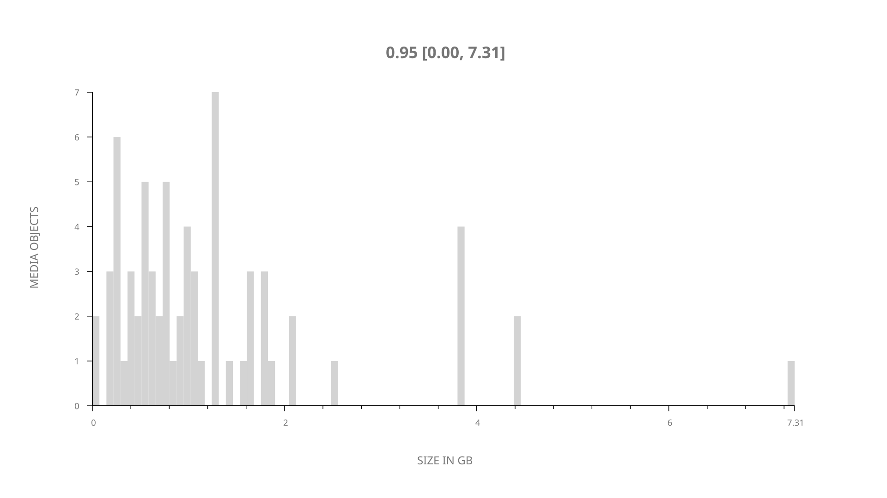
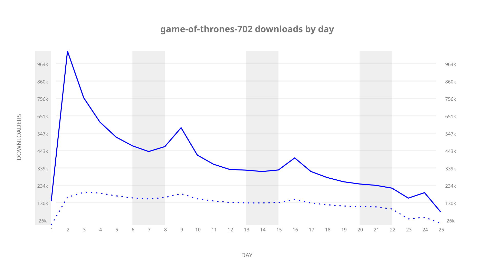
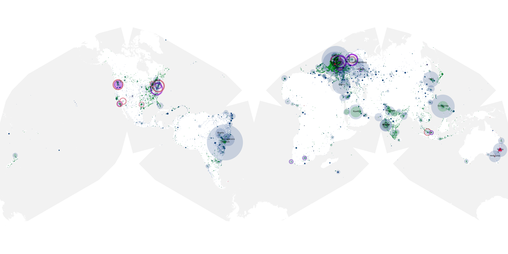
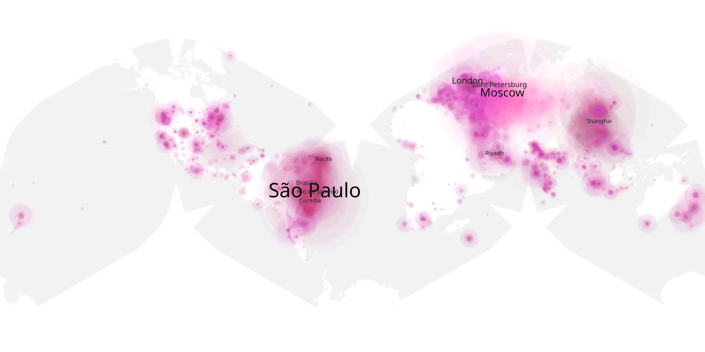
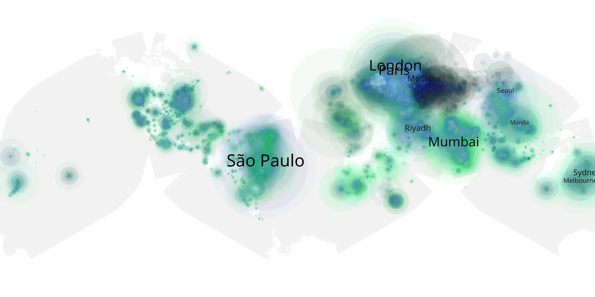

# game-of-thrones-702 sample cache audit

## 1. Media object

| Field | Value |
| --- | --- |
| Media object | Game of Thrones |
| Collection key | `game-of-thrones-702` |
| imdb_id | [tt0944947](https://www.imdb.com/title/tt0944947/) |
| wikipedia_url | [Game of Thrones](https://en.wikipedia.org/wiki/Game_of_Thrones) |
| Sample dates | 2017-07-23-to-2017-08-25 |
| Sample days | 34 |
| BTIH count | 71 |
| Unique BTIH count | 69 |
| Downloaders total | 5,638,020 |
| Uploaders total | 2,068,776 |
| Data version | `2026-08-05` |
| IP geolocation version | `6:1777968300` |

## 2. Sample coverage report

- Generated: 2026-09-09T01:10:36Z
- Sample archive directory: `/mnt/gold/src/alpha60-samples-raw.gold/game-of-thrones-702.xz`
- Hour directories: 138
- Zero-length sample files: 0
- Other unparsable sample files: 0
- Hourly discontinuities: 137 (639 missing hours)
- Missing days: 9

### Sample archive discontinuities

- hourly gap: last `2017-07-23 20:30`, resumed `2017-07-24 00:30` — missing 3 hour(s)
- hourly gap: last `2017-07-24 00:30`, resumed `2017-07-24 04:30` — missing 3 hour(s)
- hourly gap: last `2017-07-24 04:30`, resumed `2017-07-24 08:30` — missing 3 hour(s)
- hourly gap: last `2017-07-24 08:30`, resumed `2017-07-24 12:30` — missing 3 hour(s)
- hourly gap: last `2017-07-24 12:30`, resumed `2017-07-24 16:30` — missing 3 hour(s)
- hourly gap: last `2017-07-24 16:30`, resumed `2017-07-24 20:30` — missing 3 hour(s)
- hourly gap: last `2017-07-24 20:30`, resumed `2017-07-25 00:30` — missing 3 hour(s)
- hourly gap: last `2017-07-25 00:30`, resumed `2017-07-25 04:30` — missing 3 hour(s)
- hourly gap: last `2017-07-25 04:30`, resumed `2017-07-25 08:30` — missing 3 hour(s)
- hourly gap: last `2017-07-25 08:30`, resumed `2017-07-25 12:30` — missing 3 hour(s)
- hourly gap: last `2017-07-25 12:30`, resumed `2017-07-25 16:30` — missing 3 hour(s)
- hourly gap: last `2017-07-25 16:30`, resumed `2017-07-25 20:30` — missing 3 hour(s)
- hourly gap: last `2017-07-25 20:30`, resumed `2017-07-26 00:30` — missing 3 hour(s)
- hourly gap: last `2017-07-26 00:30`, resumed `2017-07-26 04:30` — missing 3 hour(s)
- hourly gap: last `2017-07-26 04:30`, resumed `2017-07-26 08:30` — missing 3 hour(s)
- hourly gap: last `2017-07-26 08:30`, resumed `2017-07-26 12:30` — missing 3 hour(s)
- hourly gap: last `2017-07-26 12:30`, resumed `2017-07-26 16:30` — missing 3 hour(s)
- hourly gap: last `2017-07-26 16:30`, resumed `2017-07-26 20:30` — missing 3 hour(s)
- hourly gap: last `2017-07-26 20:30`, resumed `2017-07-27 00:30` — missing 3 hour(s)
- hourly gap: last `2017-07-27 00:30`, resumed `2017-07-27 04:30` — missing 3 hour(s)
- hourly gap: last `2017-07-27 04:30`, resumed `2017-07-27 08:30` — missing 3 hour(s)
- hourly gap: last `2017-07-27 08:30`, resumed `2017-07-27 12:30` — missing 3 hour(s)
- hourly gap: last `2017-07-27 12:30`, resumed `2017-07-27 16:30` — missing 3 hour(s)
- hourly gap: last `2017-07-27 16:30`, resumed `2017-07-27 20:30` — missing 3 hour(s)
- hourly gap: last `2017-07-27 20:30`, resumed `2017-07-28 00:30` — missing 3 hour(s)
- hourly gap: last `2017-07-28 00:30`, resumed `2017-07-28 04:30` — missing 3 hour(s)
- hourly gap: last `2017-07-28 04:30`, resumed `2017-07-28 08:30` — missing 3 hour(s)
- hourly gap: last `2017-07-28 08:30`, resumed `2017-07-28 12:30` — missing 3 hour(s)
- hourly gap: last `2017-07-28 12:30`, resumed `2017-07-28 16:30` — missing 3 hour(s)
- hourly gap: last `2017-07-28 16:30`, resumed `2017-07-28 20:30` — missing 3 hour(s)
- hourly gap: last `2017-07-28 20:30`, resumed `2017-07-29 00:30` — missing 3 hour(s)
- hourly gap: last `2017-07-29 00:30`, resumed `2017-07-29 04:30` — missing 3 hour(s)
- hourly gap: last `2017-07-29 04:30`, resumed `2017-07-29 08:30` — missing 3 hour(s)
- hourly gap: last `2017-07-29 08:30`, resumed `2017-07-29 12:30` — missing 3 hour(s)
- hourly gap: last `2017-07-29 12:30`, resumed `2017-07-29 16:30` — missing 3 hour(s)
- hourly gap: last `2017-07-29 16:30`, resumed `2017-07-29 20:30` — missing 3 hour(s)
- hourly gap: last `2017-07-29 20:30`, resumed `2017-07-30 00:30` — missing 3 hour(s)
- hourly gap: last `2017-07-30 00:30`, resumed `2017-07-30 04:30` — missing 3 hour(s)
- hourly gap: last `2017-07-30 04:30`, resumed `2017-07-30 08:30` — missing 3 hour(s)
- hourly gap: last `2017-07-30 08:30`, resumed `2017-07-30 12:30` — missing 3 hour(s)
- hourly gap: last `2017-07-30 12:30`, resumed `2017-07-30 16:30` — missing 3 hour(s)
- hourly gap: last `2017-07-30 16:30`, resumed `2017-07-30 20:00` — missing 2 hour(s)
- hourly gap: last `2017-07-30 20:00`, resumed `2017-07-31 00:00` — missing 3 hour(s)
- hourly gap: last `2017-07-31 00:00`, resumed `2017-07-31 04:00` — missing 3 hour(s)
- hourly gap: last `2017-07-31 04:00`, resumed `2017-07-31 08:00` — missing 3 hour(s)
- hourly gap: last `2017-07-31 08:00`, resumed `2017-07-31 12:00` — missing 3 hour(s)
- hourly gap: last `2017-07-31 12:00`, resumed `2017-07-31 16:00` — missing 3 hour(s)
- hourly gap: last `2017-07-31 16:00`, resumed `2017-07-31 20:00` — missing 3 hour(s)
- hourly gap: last `2017-07-31 20:00`, resumed `2017-08-01 00:00` — missing 3 hour(s)
- hourly gap: last `2017-08-01 00:00`, resumed `2017-08-01 04:00` — missing 3 hour(s)
- hourly gap: last `2017-08-01 04:00`, resumed `2017-08-01 08:00` — missing 3 hour(s)
- hourly gap: last `2017-08-01 08:00`, resumed `2017-08-01 12:00` — missing 3 hour(s)
- hourly gap: last `2017-08-01 12:00`, resumed `2017-08-01 16:00` — missing 3 hour(s)
- hourly gap: last `2017-08-01 16:00`, resumed `2017-08-01 20:00` — missing 3 hour(s)
- hourly gap: last `2017-08-01 20:00`, resumed `2017-08-02 00:00` — missing 3 hour(s)
- hourly gap: last `2017-08-02 00:00`, resumed `2017-08-02 04:00` — missing 3 hour(s)
- hourly gap: last `2017-08-02 04:00`, resumed `2017-08-02 08:00` — missing 3 hour(s)
- hourly gap: last `2017-08-02 08:00`, resumed `2017-08-02 12:00` — missing 3 hour(s)
- hourly gap: last `2017-08-02 12:00`, resumed `2017-08-02 16:00` — missing 3 hour(s)
- hourly gap: last `2017-08-02 16:00`, resumed `2017-08-02 20:00` — missing 3 hour(s)
- hourly gap: last `2017-08-02 20:00`, resumed `2017-08-03 00:00` — missing 3 hour(s)
- hourly gap: last `2017-08-03 00:00`, resumed `2017-08-03 04:00` — missing 3 hour(s)
- hourly gap: last `2017-08-03 04:00`, resumed `2017-08-03 08:00` — missing 3 hour(s)
- hourly gap: last `2017-08-03 08:00`, resumed `2017-08-03 12:00` — missing 3 hour(s)
- hourly gap: last `2017-08-03 12:00`, resumed `2017-08-03 16:00` — missing 3 hour(s)
- hourly gap: last `2017-08-03 16:00`, resumed `2017-08-03 20:00` — missing 3 hour(s)
- hourly gap: last `2017-08-03 20:00`, resumed `2017-08-04 00:00` — missing 3 hour(s)
- hourly gap: last `2017-08-04 00:00`, resumed `2017-08-04 04:00` — missing 3 hour(s)
- hourly gap: last `2017-08-04 04:00`, resumed `2017-08-04 08:00` — missing 3 hour(s)
- hourly gap: last `2017-08-04 08:00`, resumed `2017-08-04 12:00` — missing 3 hour(s)
- hourly gap: last `2017-08-04 12:00`, resumed `2017-08-04 16:00` — missing 3 hour(s)
- hourly gap: last `2017-08-04 16:00`, resumed `2017-08-04 20:00` — missing 3 hour(s)
- hourly gap: last `2017-08-04 20:00`, resumed `2017-08-05 00:00` — missing 3 hour(s)
- hourly gap: last `2017-08-05 00:00`, resumed `2017-08-05 04:00` — missing 3 hour(s)
- hourly gap: last `2017-08-05 04:00`, resumed `2017-08-05 08:00` — missing 3 hour(s)
- hourly gap: last `2017-08-05 08:00`, resumed `2017-08-05 12:00` — missing 3 hour(s)
- hourly gap: last `2017-08-05 12:00`, resumed `2017-08-05 16:00` — missing 3 hour(s)
- hourly gap: last `2017-08-05 16:00`, resumed `2017-08-05 20:00` — missing 3 hour(s)
- hourly gap: last `2017-08-05 20:00`, resumed `2017-08-06 00:00` — missing 3 hour(s)
- hourly gap: last `2017-08-06 00:00`, resumed `2017-08-06 04:00` — missing 3 hour(s)
- hourly gap: last `2017-08-06 04:00`, resumed `2017-08-06 08:00` — missing 3 hour(s)
- hourly gap: last `2017-08-06 08:00`, resumed `2017-08-06 12:00` — missing 3 hour(s)
- hourly gap: last `2017-08-06 12:00`, resumed `2017-08-06 16:00` — missing 3 hour(s)
- hourly gap: last `2017-08-06 16:00`, resumed `2017-08-06 20:00` — missing 3 hour(s)
- hourly gap: last `2017-08-06 20:00`, resumed `2017-08-07 00:00` — missing 3 hour(s)
- hourly gap: last `2017-08-07 00:00`, resumed `2017-08-07 04:00` — missing 3 hour(s)
- hourly gap: last `2017-08-07 04:00`, resumed `2017-08-07 08:00` — missing 3 hour(s)
- hourly gap: last `2017-08-07 08:00`, resumed `2017-08-07 12:00` — missing 3 hour(s)
- hourly gap: last `2017-08-07 12:00`, resumed `2017-08-07 16:00` — missing 3 hour(s)
- hourly gap: last `2017-08-07 16:00`, resumed `2017-08-07 20:00` — missing 3 hour(s)
- hourly gap: last `2017-08-07 20:00`, resumed `2017-08-08 00:00` — missing 3 hour(s)
- hourly gap: last `2017-08-08 00:00`, resumed `2017-08-08 04:00` — missing 3 hour(s)
- hourly gap: last `2017-08-08 04:00`, resumed `2017-08-08 08:00` — missing 3 hour(s)
- hourly gap: last `2017-08-08 08:00`, resumed `2017-08-08 12:00` — missing 3 hour(s)
- hourly gap: last `2017-08-08 12:00`, resumed `2017-08-08 16:00` — missing 3 hour(s)
- hourly gap: last `2017-08-08 16:00`, resumed `2017-08-08 20:00` — missing 3 hour(s)
- hourly gap: last `2017-08-08 20:00`, resumed `2017-08-09 00:00` — missing 3 hour(s)
- hourly gap: last `2017-08-09 00:00`, resumed `2017-08-09 04:00` — missing 3 hour(s)
- hourly gap: last `2017-08-09 04:00`, resumed `2017-08-09 08:00` — missing 3 hour(s)
- hourly gap: last `2017-08-09 08:00`, resumed `2017-08-09 12:00` — missing 3 hour(s)
- hourly gap: last `2017-08-09 12:00`, resumed `2017-08-09 16:00` — missing 3 hour(s)
- hourly gap: last `2017-08-09 16:00`, resumed `2017-08-09 20:00` — missing 3 hour(s)
- hourly gap: last `2017-08-09 20:00`, resumed `2017-08-10 00:00` — missing 3 hour(s)
- hourly gap: last `2017-08-10 00:00`, resumed `2017-08-10 04:00` — missing 3 hour(s)
- hourly gap: last `2017-08-10 04:00`, resumed `2017-08-10 08:00` — missing 3 hour(s)
- hourly gap: last `2017-08-10 08:00`, resumed `2017-08-10 12:00` — missing 3 hour(s)
- hourly gap: last `2017-08-10 12:00`, resumed `2017-08-10 16:00` — missing 3 hour(s)
- hourly gap: last `2017-08-10 16:00`, resumed `2017-08-10 20:00` — missing 3 hour(s)
- hourly gap: last `2017-08-10 20:00`, resumed `2017-08-11 00:00` — missing 3 hour(s)
- hourly gap: last `2017-08-11 00:00`, resumed `2017-08-11 04:00` — missing 3 hour(s)
- hourly gap: last `2017-08-11 04:00`, resumed `2017-08-11 08:00` — missing 3 hour(s)
- hourly gap: last `2017-08-11 08:00`, resumed `2017-08-11 12:00` — missing 3 hour(s)
- hourly gap: last `2017-08-11 12:00`, resumed `2017-08-11 16:00` — missing 3 hour(s)
- hourly gap: last `2017-08-11 16:00`, resumed `2017-08-11 20:00` — missing 3 hour(s)
- hourly gap: last `2017-08-11 20:00`, resumed `2017-08-12 00:00` — missing 3 hour(s)
- hourly gap: last `2017-08-12 00:00`, resumed `2017-08-12 04:00` — missing 3 hour(s)
- hourly gap: last `2017-08-12 04:00`, resumed `2017-08-12 08:00` — missing 3 hour(s)
- hourly gap: last `2017-08-12 08:00`, resumed `2017-08-12 12:00` — missing 3 hour(s)
- hourly gap: last `2017-08-12 12:00`, resumed `2017-08-12 16:00` — missing 3 hour(s)
- hourly gap: last `2017-08-12 16:00`, resumed `2017-08-12 20:00` — missing 3 hour(s)
- hourly gap: last `2017-08-12 20:00`, resumed `2017-08-13 00:00` — missing 3 hour(s)
- hourly gap: last `2017-08-13 00:00`, resumed `2017-08-13 04:00` — missing 3 hour(s)
- hourly gap: last `2017-08-13 04:00`, resumed `2017-08-13 08:00` — missing 3 hour(s)
- hourly gap: last `2017-08-13 08:00`, resumed `2017-08-13 12:00` — missing 3 hour(s)
- hourly gap: last `2017-08-13 12:00`, resumed `2017-08-13 16:00` — missing 3 hour(s)
- hourly gap: last `2017-08-13 16:00`, resumed `2017-08-23 09:25` — missing 232 hour(s)
- hourly gap: last `2017-08-23 09:25`, resumed `2017-08-23 13:25` — missing 3 hour(s)
- hourly gap: last `2017-08-23 13:25`, resumed `2017-08-23 17:25` — missing 3 hour(s)
- hourly gap: last `2017-08-23 17:25`, resumed `2017-08-23 21:25` — missing 3 hour(s)
- hourly gap: last `2017-08-23 21:25`, resumed `2017-08-24 01:25` — missing 3 hour(s)
- hourly gap: last `2017-08-24 01:25`, resumed `2017-08-24 05:25` — missing 3 hour(s)
- hourly gap: last `2017-08-24 05:25`, resumed `2017-08-24 09:26` — missing 3 hour(s)
- hourly gap: last `2017-08-24 09:26`, resumed `2017-08-24 13:26` — missing 3 hour(s)
- hourly gap: last `2017-08-24 13:26`, resumed `2017-08-24 17:26` — missing 3 hour(s)
- hourly gap: last `2017-08-24 17:26`, resumed `2017-08-24 21:26` — missing 3 hour(s)
- hourly gap: last `2017-08-24 21:26`, resumed `2017-08-25 01:26` — missing 3 hour(s)
- hourly gap: last `2017-08-25 01:26`, resumed `2017-08-25 05:26` — missing 3 hour(s)
- missing day: `2017-08-14`
- missing day: `2017-08-15`
- missing day: `2017-08-16`
- missing day: `2017-08-17`
- missing day: `2017-08-18`
- missing day: `2017-08-19`
- missing day: `2017-08-20`
- missing day: `2017-08-21`
- missing day: `2017-08-22`

## 3. Media objects file size histogram

## 4. Visualization pass — graphs

### Downloads by week cumulative (normalized start)



### Downloads by day, Saturday and Sunday in gray

## 5. Visualization pass — maps

### Cumulative geographic slices

| Africa | Americas | Asia | Europe | Oceania | Unknown |
| --- | --- | --- | --- | --- | --- |
| 7.68 | 22.87 | 23.71 | 31.47 | 3.11 | 0.35 |

### Cumulative network infrastructure

{:target="_blank" rel="noopener"}

### Cumulative data maps

**Cumulative >= 1080p**

{:target="_blank" rel="noopener"}

**Cumulative < 1080p**

{:target="_blank" rel="noopener"}
