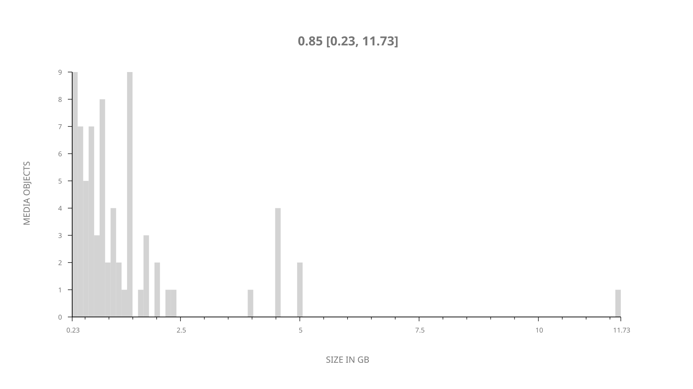
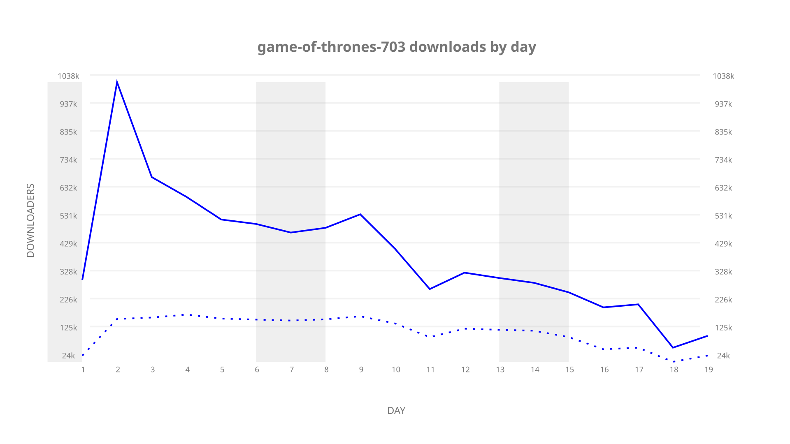
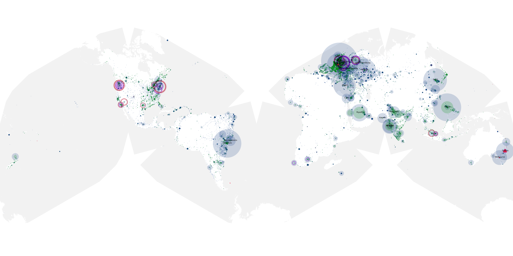
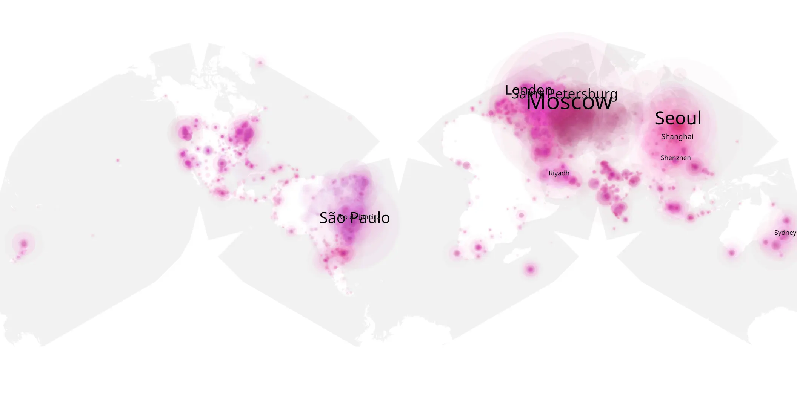
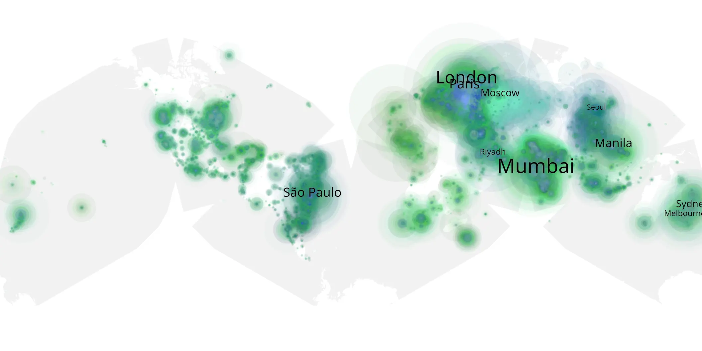

# game-of-thrones-703 sample cache audit

## 1. Media object

| Field | Value |
| --- | --- |
| Media object | Game of Thrones |
| Collection key | `game-of-thrones-703` |
| imdb_id | [tt0944947](https://www.imdb.com/title/tt0944947/) |
| wikipedia_url | [Game of Thrones](https://en.wikipedia.org/wiki/Game_of_Thrones) |
| Sample dates | 2017-07-30-to-2017-09-01 |
| Sample days | 34 |
| BTIH count | 73 |
| Unique BTIH count | 73 |
| Downloaders total | 4,659,517 |
| Uploaders total | 1,471,437 |
| Data version | `2026-08-05` |
| IP geolocation version | `6:1777968300` |

## 2. Sample coverage report

- Generated: 2026-09-09T01:10:36Z
- Sample archive directory: `/mnt/gold/src/alpha60-samples-raw.gold/game-of-thrones-703.xz`
- Hour directories: 101
- Zero-length sample files: 0
- Other unparsable sample files: 0
- Hourly discontinuities: 95 (681 missing hours)
- Missing days: 15

### Sample archive discontinuities

- hourly gap: last `2017-07-30 18:30`, resumed `2017-07-30 22:30` — missing 3 hour(s)
- hourly gap: last `2017-07-30 22:30`, resumed `2017-07-31 02:30` — missing 3 hour(s)
- hourly gap: last `2017-07-31 02:30`, resumed `2017-07-31 06:30` — missing 3 hour(s)
- hourly gap: last `2017-07-31 06:30`, resumed `2017-07-31 10:30` — missing 3 hour(s)
- hourly gap: last `2017-07-31 10:30`, resumed `2017-07-31 14:30` — missing 3 hour(s)
- hourly gap: last `2017-07-31 14:30`, resumed `2017-07-31 18:30` — missing 3 hour(s)
- hourly gap: last `2017-07-31 18:30`, resumed `2017-07-31 22:30` — missing 3 hour(s)
- hourly gap: last `2017-07-31 22:30`, resumed `2017-08-01 02:30` — missing 3 hour(s)
- hourly gap: last `2017-08-01 02:30`, resumed `2017-08-01 06:30` — missing 3 hour(s)
- hourly gap: last `2017-08-01 06:30`, resumed `2017-08-01 10:30` — missing 3 hour(s)
- hourly gap: last `2017-08-01 10:30`, resumed `2017-08-01 14:30` — missing 3 hour(s)
- hourly gap: last `2017-08-01 14:30`, resumed `2017-08-01 18:30` — missing 3 hour(s)
- hourly gap: last `2017-08-01 18:30`, resumed `2017-08-01 22:30` — missing 3 hour(s)
- hourly gap: last `2017-08-01 22:30`, resumed `2017-08-02 02:30` — missing 3 hour(s)
- hourly gap: last `2017-08-02 02:30`, resumed `2017-08-02 06:30` — missing 3 hour(s)
- hourly gap: last `2017-08-02 06:30`, resumed `2017-08-02 10:30` — missing 3 hour(s)
- hourly gap: last `2017-08-02 10:30`, resumed `2017-08-02 14:30` — missing 3 hour(s)
- hourly gap: last `2017-08-02 14:30`, resumed `2017-08-02 18:30` — missing 3 hour(s)
- hourly gap: last `2017-08-02 18:30`, resumed `2017-08-02 22:30` — missing 3 hour(s)
- hourly gap: last `2017-08-02 22:30`, resumed `2017-08-03 02:30` — missing 3 hour(s)
- hourly gap: last `2017-08-03 02:30`, resumed `2017-08-03 06:30` — missing 3 hour(s)
- hourly gap: last `2017-08-03 06:30`, resumed `2017-08-03 10:30` — missing 3 hour(s)
- hourly gap: last `2017-08-03 10:30`, resumed `2017-08-03 14:30` — missing 3 hour(s)
- hourly gap: last `2017-08-03 14:30`, resumed `2017-08-03 18:30` — missing 3 hour(s)
- hourly gap: last `2017-08-03 18:30`, resumed `2017-08-03 22:30` — missing 3 hour(s)
- hourly gap: last `2017-08-03 22:30`, resumed `2017-08-04 02:30` — missing 3 hour(s)
- hourly gap: last `2017-08-04 02:30`, resumed `2017-08-04 06:30` — missing 3 hour(s)
- hourly gap: last `2017-08-04 06:30`, resumed `2017-08-04 10:30` — missing 3 hour(s)
- hourly gap: last `2017-08-04 10:30`, resumed `2017-08-04 14:30` — missing 3 hour(s)
- hourly gap: last `2017-08-04 14:30`, resumed `2017-08-04 18:30` — missing 3 hour(s)
- hourly gap: last `2017-08-04 18:30`, resumed `2017-08-04 22:30` — missing 3 hour(s)
- hourly gap: last `2017-08-04 22:30`, resumed `2017-08-05 02:30` — missing 3 hour(s)
- hourly gap: last `2017-08-05 02:30`, resumed `2017-08-05 06:30` — missing 3 hour(s)
- hourly gap: last `2017-08-05 06:30`, resumed `2017-08-05 10:30` — missing 3 hour(s)
- hourly gap: last `2017-08-05 10:30`, resumed `2017-08-05 14:30` — missing 3 hour(s)
- hourly gap: last `2017-08-05 14:30`, resumed `2017-08-05 18:30` — missing 3 hour(s)
- hourly gap: last `2017-08-05 18:30`, resumed `2017-08-05 22:30` — missing 3 hour(s)
- hourly gap: last `2017-08-05 22:30`, resumed `2017-08-06 02:30` — missing 3 hour(s)
- hourly gap: last `2017-08-06 02:30`, resumed `2017-08-06 06:30` — missing 3 hour(s)
- hourly gap: last `2017-08-06 06:30`, resumed `2017-08-06 10:30` — missing 3 hour(s)
- hourly gap: last `2017-08-06 10:30`, resumed `2017-08-06 14:30` — missing 3 hour(s)
- hourly gap: last `2017-08-06 14:30`, resumed `2017-08-06 18:30` — missing 3 hour(s)
- hourly gap: last `2017-08-06 18:30`, resumed `2017-08-06 22:30` — missing 3 hour(s)
- hourly gap: last `2017-08-06 22:30`, resumed `2017-08-07 02:30` — missing 3 hour(s)
- hourly gap: last `2017-08-07 02:30`, resumed `2017-08-07 06:30` — missing 3 hour(s)
- hourly gap: last `2017-08-07 06:30`, resumed `2017-08-07 10:30` — missing 3 hour(s)
- hourly gap: last `2017-08-07 10:30`, resumed `2017-08-07 14:30` — missing 3 hour(s)
- hourly gap: last `2017-08-07 14:30`, resumed `2017-08-07 18:30` — missing 3 hour(s)
- hourly gap: last `2017-08-07 18:30`, resumed `2017-08-07 22:30` — missing 3 hour(s)
- hourly gap: last `2017-08-07 22:30`, resumed `2017-08-08 02:30` — missing 3 hour(s)
- hourly gap: last `2017-08-08 02:30`, resumed `2017-08-08 06:30` — missing 3 hour(s)
- hourly gap: last `2017-08-08 06:30`, resumed `2017-08-08 10:30` — missing 3 hour(s)
- hourly gap: last `2017-08-08 10:30`, resumed `2017-08-08 14:30` — missing 3 hour(s)
- hourly gap: last `2017-08-08 14:30`, resumed `2017-08-08 18:30` — missing 3 hour(s)
- hourly gap: last `2017-08-08 18:30`, resumed `2017-08-08 22:30` — missing 3 hour(s)
- hourly gap: last `2017-08-08 22:30`, resumed `2017-08-09 10:45` — missing 11 hour(s)
- hourly gap: last `2017-08-09 10:45`, resumed `2017-08-09 14:45` — missing 3 hour(s)
- hourly gap: last `2017-08-09 14:45`, resumed `2017-08-09 18:45` — missing 3 hour(s)
- hourly gap: last `2017-08-09 18:45`, resumed `2017-08-09 22:45` — missing 3 hour(s)
- hourly gap: last `2017-08-09 22:45`, resumed `2017-08-10 02:45` — missing 3 hour(s)
- hourly gap: last `2017-08-10 02:45`, resumed `2017-08-10 06:45` — missing 3 hour(s)
- hourly gap: last `2017-08-10 06:45`, resumed `2017-08-10 10:45` — missing 3 hour(s)
- hourly gap: last `2017-08-10 10:45`, resumed `2017-08-10 14:45` — missing 3 hour(s)
- hourly gap: last `2017-08-10 14:45`, resumed `2017-08-10 18:45` — missing 3 hour(s)
- hourly gap: last `2017-08-10 18:45`, resumed `2017-08-10 22:45` — missing 3 hour(s)
- hourly gap: last `2017-08-10 22:45`, resumed `2017-08-11 02:45` — missing 3 hour(s)
- hourly gap: last `2017-08-11 02:45`, resumed `2017-08-11 06:45` — missing 3 hour(s)
- hourly gap: last `2017-08-11 06:45`, resumed `2017-08-11 10:45` — missing 3 hour(s)
- hourly gap: last `2017-08-11 10:45`, resumed `2017-08-11 14:45` — missing 3 hour(s)
- hourly gap: last `2017-08-11 14:45`, resumed `2017-08-11 18:45` — missing 3 hour(s)
- hourly gap: last `2017-08-11 18:45`, resumed `2017-08-11 22:45` — missing 3 hour(s)
- hourly gap: last `2017-08-11 22:45`, resumed `2017-08-12 02:45` — missing 3 hour(s)
- hourly gap: last `2017-08-12 02:45`, resumed `2017-08-12 06:45` — missing 3 hour(s)
- hourly gap: last `2017-08-12 06:45`, resumed `2017-08-12 10:45` — missing 3 hour(s)
- hourly gap: last `2017-08-12 10:45`, resumed `2017-08-12 14:45` — missing 3 hour(s)
- hourly gap: last `2017-08-12 14:45`, resumed `2017-08-12 18:45` — missing 3 hour(s)
- hourly gap: last `2017-08-12 18:45`, resumed `2017-08-12 22:45` — missing 3 hour(s)
- hourly gap: last `2017-08-12 22:45`, resumed `2017-08-13 02:45` — missing 3 hour(s)
- hourly gap: last `2017-08-13 02:45`, resumed `2017-08-13 06:45` — missing 3 hour(s)
- hourly gap: last `2017-08-13 06:45`, resumed `2017-08-13 10:45` — missing 3 hour(s)
- hourly gap: last `2017-08-13 10:45`, resumed `2017-08-13 14:45` — missing 3 hour(s)
- hourly gap: last `2017-08-13 14:45`, resumed `2017-08-13 18:45` — missing 3 hour(s)
- hourly gap: last `2017-08-13 18:45`, resumed `2017-08-23 07:27` — missing 227 hour(s)
- hourly gap: last `2017-08-23 07:27`, resumed `2017-08-23 11:27` — missing 3 hour(s)
- hourly gap: last `2017-08-23 11:27`, resumed `2017-08-23 15:27` — missing 3 hour(s)
- hourly gap: last `2017-08-23 15:27`, resumed `2017-08-23 19:27` — missing 3 hour(s)
- hourly gap: last `2017-08-23 19:27`, resumed `2017-08-23 23:27` — missing 3 hour(s)
- hourly gap: last `2017-08-23 23:27`, resumed `2017-08-24 03:27` — missing 3 hour(s)
- hourly gap: last `2017-08-24 03:27`, resumed `2017-08-24 07:27` — missing 3 hour(s)
- hourly gap: last `2017-08-24 07:27`, resumed `2017-08-24 11:27` — missing 3 hour(s)
- hourly gap: last `2017-08-24 11:27`, resumed `2017-08-24 15:27` — missing 3 hour(s)
- hourly gap: last `2017-08-24 15:27`, resumed `2017-08-24 19:27` — missing 3 hour(s)
- hourly gap: last `2017-08-24 19:27`, resumed `2017-08-24 23:27` — missing 3 hour(s)
- hourly gap: last `2017-08-24 23:27`, resumed `2017-08-25 03:27` — missing 3 hour(s)
- hourly gap: last `2017-08-25 03:27`, resumed `2017-09-01 04:00` — missing 167 hour(s)
- missing day: `2017-08-14`
- missing day: `2017-08-15`
- missing day: `2017-08-16`
- missing day: `2017-08-17`
- missing day: `2017-08-18`
- missing day: `2017-08-19`
- missing day: `2017-08-20`
- missing day: `2017-08-21`
- missing day: `2017-08-22`
- missing day: `2017-08-26`
- missing day: `2017-08-27`
- missing day: `2017-08-28`
- missing day: `2017-08-29`
- missing day: `2017-08-30`
- missing day: `2017-08-31`

## 3. Media objects file size histogram

## 4. Visualization pass — graphs

### Downloads by week cumulative (normalized start)



### Downloads by day, Saturday and Sunday in gray

## 5. Visualization pass — maps

### Cumulative geographic slices

| Africa | Americas | Asia | Europe | Oceania | Unknown |
| --- | --- | --- | --- | --- | --- |
| 6.96 | 18.85 | 26.19 | 32.43 | 3.37 | 0.38 |

### Cumulative network infrastructure

{:target="_blank" rel="noopener"}

### Cumulative data maps

**Cumulative >= 1080p**

{:target="_blank" rel="noopener"}

**Cumulative < 1080p**

{:target="_blank" rel="noopener"}
