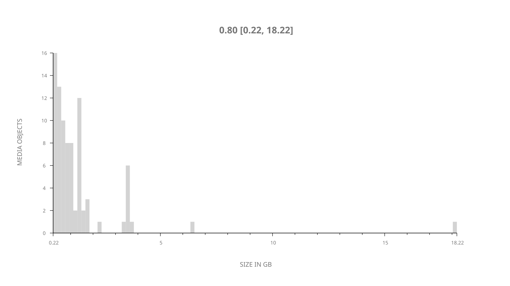
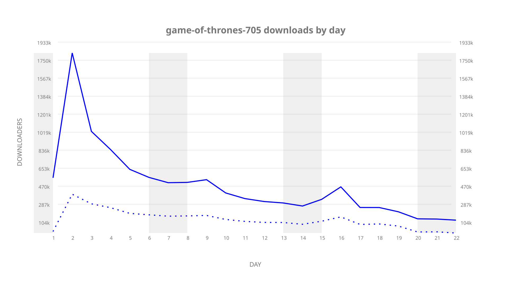
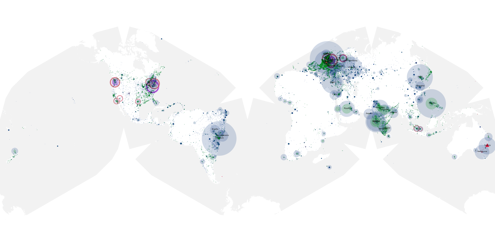
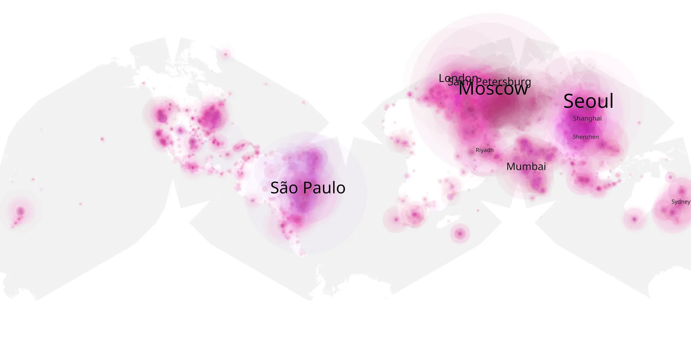
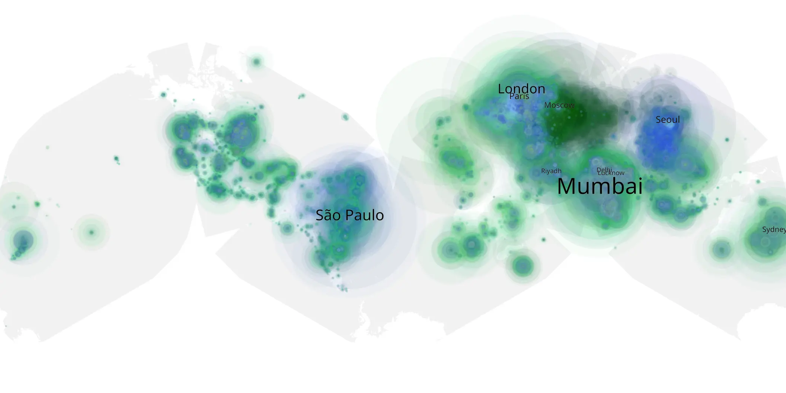

# game-of-thrones-705 sample cache audit

## 1. Media object

| Field | Value |
| --- | --- |
| Media object | Game of Thrones |
| Collection key | `game-of-thrones-705` |
| imdb_id | [tt0944947](https://www.imdb.com/title/tt0944947/) |
| wikipedia_url | [Game of Thrones](https://en.wikipedia.org/wiki/Game_of_Thrones) |
| Sample dates | 2017-08-13-to-2017-09-03 |
| Sample days | 22 |
| BTIH count | 101 |
| Unique BTIH count | 85 |
| Downloaders total | 9,356,766 |
| Uploaders total | 3,523,985 |
| Data version | `2026-08-05` |
| IP geolocation version | `6:1777968300` |

## 2. Sample coverage report

- Generated: 2026-09-09T01:10:36Z
- Sample archive directory: `/mnt/gold/src/alpha60-samples-raw.gold/game-of-thrones-705.xz`
- Hour directories: 251
- Zero-length sample files: 0
- Other unparsable sample files: 0
- Hourly discontinuities: 236 (242 missing hours)
- Missing days: 0

### Sample archive discontinuities

- hourly gap: last `2017-08-13 19:00`, resumed `2017-08-13 21:00` — missing 1 hour(s)
- hourly gap: last `2017-08-13 21:00`, resumed `2017-08-13 23:00` — missing 1 hour(s)
- hourly gap: last `2017-08-13 23:00`, resumed `2017-08-14 01:00` — missing 1 hour(s)
- hourly gap: last `2017-08-14 01:00`, resumed `2017-08-14 03:00` — missing 1 hour(s)
- hourly gap: last `2017-08-14 03:00`, resumed `2017-08-14 05:00` — missing 1 hour(s)
- hourly gap: last `2017-08-14 05:00`, resumed `2017-08-14 07:00` — missing 1 hour(s)
- hourly gap: last `2017-08-14 07:00`, resumed `2017-08-14 09:00` — missing 1 hour(s)
- hourly gap: last `2017-08-14 09:00`, resumed `2017-08-14 11:00` — missing 1 hour(s)
- hourly gap: last `2017-08-14 11:00`, resumed `2017-08-14 13:00` — missing 1 hour(s)
- hourly gap: last `2017-08-14 13:00`, resumed `2017-08-14 15:00` — missing 1 hour(s)
- hourly gap: last `2017-08-14 15:00`, resumed `2017-08-14 17:00` — missing 1 hour(s)
- hourly gap: last `2017-08-14 17:00`, resumed `2017-08-14 19:00` — missing 1 hour(s)
- hourly gap: last `2017-08-14 19:00`, resumed `2017-08-14 21:00` — missing 1 hour(s)
- hourly gap: last `2017-08-14 21:00`, resumed `2017-08-14 23:00` — missing 1 hour(s)
- hourly gap: last `2017-08-14 23:00`, resumed `2017-08-15 01:00` — missing 1 hour(s)
- hourly gap: last `2017-08-15 01:00`, resumed `2017-08-15 03:00` — missing 1 hour(s)
- hourly gap: last `2017-08-15 03:00`, resumed `2017-08-15 05:00` — missing 1 hour(s)
- hourly gap: last `2017-08-15 05:00`, resumed `2017-08-15 07:00` — missing 1 hour(s)
- hourly gap: last `2017-08-15 07:00`, resumed `2017-08-15 09:00` — missing 1 hour(s)
- hourly gap: last `2017-08-15 09:00`, resumed `2017-08-15 11:00` — missing 1 hour(s)
- hourly gap: last `2017-08-15 11:00`, resumed `2017-08-15 13:00` — missing 1 hour(s)
- hourly gap: last `2017-08-15 13:00`, resumed `2017-08-15 15:00` — missing 1 hour(s)
- hourly gap: last `2017-08-15 15:00`, resumed `2017-08-15 17:00` — missing 1 hour(s)
- hourly gap: last `2017-08-15 17:00`, resumed `2017-08-15 19:00` — missing 1 hour(s)
- hourly gap: last `2017-08-15 19:00`, resumed `2017-08-15 21:00` — missing 1 hour(s)
- hourly gap: last `2017-08-15 21:00`, resumed `2017-08-15 23:00` — missing 1 hour(s)
- hourly gap: last `2017-08-15 23:00`, resumed `2017-08-16 01:00` — missing 1 hour(s)
- hourly gap: last `2017-08-16 01:00`, resumed `2017-08-16 03:00` — missing 1 hour(s)
- hourly gap: last `2017-08-16 03:00`, resumed `2017-08-16 05:00` — missing 1 hour(s)
- hourly gap: last `2017-08-16 05:00`, resumed `2017-08-16 07:00` — missing 1 hour(s)
- hourly gap: last `2017-08-16 07:00`, resumed `2017-08-16 09:00` — missing 1 hour(s)
- hourly gap: last `2017-08-16 09:00`, resumed `2017-08-16 11:00` — missing 1 hour(s)
- hourly gap: last `2017-08-16 11:00`, resumed `2017-08-16 13:00` — missing 1 hour(s)
- hourly gap: last `2017-08-16 13:00`, resumed `2017-08-16 15:00` — missing 1 hour(s)
- hourly gap: last `2017-08-16 15:00`, resumed `2017-08-16 17:00` — missing 1 hour(s)
- hourly gap: last `2017-08-16 17:00`, resumed `2017-08-16 19:00` — missing 1 hour(s)
- hourly gap: last `2017-08-16 19:00`, resumed `2017-08-16 21:00` — missing 1 hour(s)
- hourly gap: last `2017-08-16 21:00`, resumed `2017-08-16 23:00` — missing 1 hour(s)
- hourly gap: last `2017-08-16 23:00`, resumed `2017-08-17 01:00` — missing 1 hour(s)
- hourly gap: last `2017-08-17 01:00`, resumed `2017-08-17 03:00` — missing 1 hour(s)
- hourly gap: last `2017-08-17 03:00`, resumed `2017-08-17 05:00` — missing 1 hour(s)
- hourly gap: last `2017-08-17 05:00`, resumed `2017-08-17 07:00` — missing 1 hour(s)
- hourly gap: last `2017-08-17 07:00`, resumed `2017-08-17 09:00` — missing 1 hour(s)
- hourly gap: last `2017-08-17 09:00`, resumed `2017-08-17 11:00` — missing 1 hour(s)
- hourly gap: last `2017-08-17 11:00`, resumed `2017-08-17 13:00` — missing 1 hour(s)
- hourly gap: last `2017-08-17 13:00`, resumed `2017-08-17 15:00` — missing 1 hour(s)
- hourly gap: last `2017-08-17 15:00`, resumed `2017-08-17 17:00` — missing 1 hour(s)
- hourly gap: last `2017-08-17 17:00`, resumed `2017-08-17 19:00` — missing 1 hour(s)
- hourly gap: last `2017-08-17 19:00`, resumed `2017-08-17 21:00` — missing 1 hour(s)
- hourly gap: last `2017-08-17 21:00`, resumed `2017-08-17 23:00` — missing 1 hour(s)
- hourly gap: last `2017-08-17 23:00`, resumed `2017-08-18 01:00` — missing 1 hour(s)
- hourly gap: last `2017-08-18 01:00`, resumed `2017-08-18 03:00` — missing 1 hour(s)
- hourly gap: last `2017-08-18 03:00`, resumed `2017-08-18 05:00` — missing 1 hour(s)
- hourly gap: last `2017-08-18 05:00`, resumed `2017-08-18 07:00` — missing 1 hour(s)
- hourly gap: last `2017-08-18 07:00`, resumed `2017-08-18 09:00` — missing 1 hour(s)
- hourly gap: last `2017-08-18 09:00`, resumed `2017-08-18 11:00` — missing 1 hour(s)
- hourly gap: last `2017-08-18 11:00`, resumed `2017-08-18 13:00` — missing 1 hour(s)
- hourly gap: last `2017-08-18 13:00`, resumed `2017-08-18 15:00` — missing 1 hour(s)
- hourly gap: last `2017-08-18 15:00`, resumed `2017-08-18 17:00` — missing 1 hour(s)
- hourly gap: last `2017-08-18 17:00`, resumed `2017-08-18 19:00` — missing 1 hour(s)
- hourly gap: last `2017-08-18 19:00`, resumed `2017-08-18 21:00` — missing 1 hour(s)
- hourly gap: last `2017-08-18 21:00`, resumed `2017-08-18 23:00` — missing 1 hour(s)
- hourly gap: last `2017-08-18 23:00`, resumed `2017-08-19 01:00` — missing 1 hour(s)
- hourly gap: last `2017-08-19 01:00`, resumed `2017-08-19 03:00` — missing 1 hour(s)
- hourly gap: last `2017-08-19 03:00`, resumed `2017-08-19 05:00` — missing 1 hour(s)
- hourly gap: last `2017-08-19 05:00`, resumed `2017-08-19 07:00` — missing 1 hour(s)
- hourly gap: last `2017-08-19 07:00`, resumed `2017-08-19 09:00` — missing 1 hour(s)
- hourly gap: last `2017-08-19 09:00`, resumed `2017-08-19 11:00` — missing 1 hour(s)
- hourly gap: last `2017-08-19 11:00`, resumed `2017-08-19 13:00` — missing 1 hour(s)
- hourly gap: last `2017-08-19 13:00`, resumed `2017-08-19 15:00` — missing 1 hour(s)
- hourly gap: last `2017-08-19 15:00`, resumed `2017-08-19 17:00` — missing 1 hour(s)
- hourly gap: last `2017-08-19 17:00`, resumed `2017-08-19 19:00` — missing 1 hour(s)
- hourly gap: last `2017-08-19 19:00`, resumed `2017-08-19 21:00` — missing 1 hour(s)
- hourly gap: last `2017-08-19 21:00`, resumed `2017-08-19 23:00` — missing 1 hour(s)
- hourly gap: last `2017-08-19 23:00`, resumed `2017-08-20 01:00` — missing 1 hour(s)
- hourly gap: last `2017-08-20 01:00`, resumed `2017-08-20 03:00` — missing 1 hour(s)
- hourly gap: last `2017-08-20 03:00`, resumed `2017-08-20 05:00` — missing 1 hour(s)
- hourly gap: last `2017-08-20 05:00`, resumed `2017-08-20 07:00` — missing 1 hour(s)
- hourly gap: last `2017-08-20 07:00`, resumed `2017-08-20 09:00` — missing 1 hour(s)
- hourly gap: last `2017-08-20 09:00`, resumed `2017-08-20 11:00` — missing 1 hour(s)
- hourly gap: last `2017-08-20 11:00`, resumed `2017-08-20 13:00` — missing 1 hour(s)
- hourly gap: last `2017-08-20 13:00`, resumed `2017-08-20 15:00` — missing 1 hour(s)
- hourly gap: last `2017-08-20 15:00`, resumed `2017-08-20 17:00` — missing 1 hour(s)
- hourly gap: last `2017-08-20 17:00`, resumed `2017-08-20 19:00` — missing 1 hour(s)
- hourly gap: last `2017-08-20 19:00`, resumed `2017-08-20 21:00` — missing 1 hour(s)
- hourly gap: last `2017-08-20 21:00`, resumed `2017-08-20 23:00` — missing 1 hour(s)
- hourly gap: last `2017-08-20 23:00`, resumed `2017-08-21 01:00` — missing 1 hour(s)
- hourly gap: last `2017-08-21 01:00`, resumed `2017-08-21 03:00` — missing 1 hour(s)
- hourly gap: last `2017-08-21 03:00`, resumed `2017-08-21 05:00` — missing 1 hour(s)
- hourly gap: last `2017-08-21 05:00`, resumed `2017-08-21 07:00` — missing 1 hour(s)
- hourly gap: last `2017-08-21 07:00`, resumed `2017-08-21 09:00` — missing 1 hour(s)
- hourly gap: last `2017-08-21 09:00`, resumed `2017-08-21 11:00` — missing 1 hour(s)
- hourly gap: last `2017-08-21 11:00`, resumed `2017-08-21 13:00` — missing 1 hour(s)
- hourly gap: last `2017-08-21 13:00`, resumed `2017-08-21 15:00` — missing 1 hour(s)
- hourly gap: last `2017-08-21 15:00`, resumed `2017-08-21 17:00` — missing 1 hour(s)
- hourly gap: last `2017-08-21 17:00`, resumed `2017-08-21 19:00` — missing 1 hour(s)
- hourly gap: last `2017-08-21 19:00`, resumed `2017-08-21 21:00` — missing 1 hour(s)
- hourly gap: last `2017-08-21 21:00`, resumed `2017-08-21 23:00` — missing 1 hour(s)
- hourly gap: last `2017-08-21 23:00`, resumed `2017-08-22 01:00` — missing 1 hour(s)
- hourly gap: last `2017-08-22 01:00`, resumed `2017-08-22 03:00` — missing 1 hour(s)
- hourly gap: last `2017-08-22 03:00`, resumed `2017-08-22 05:00` — missing 1 hour(s)
- hourly gap: last `2017-08-22 05:00`, resumed `2017-08-22 07:00` — missing 1 hour(s)
- hourly gap: last `2017-08-22 07:00`, resumed `2017-08-22 09:00` — missing 1 hour(s)
- hourly gap: last `2017-08-22 09:00`, resumed `2017-08-22 11:00` — missing 1 hour(s)
- hourly gap: last `2017-08-22 11:00`, resumed `2017-08-22 13:00` — missing 1 hour(s)
- hourly gap: last `2017-08-22 13:00`, resumed `2017-08-22 15:00` — missing 1 hour(s)
- hourly gap: last `2017-08-22 15:00`, resumed `2017-08-22 17:00` — missing 1 hour(s)
- hourly gap: last `2017-08-22 17:00`, resumed `2017-08-22 19:00` — missing 1 hour(s)
- hourly gap: last `2017-08-22 19:00`, resumed `2017-08-22 21:00` — missing 1 hour(s)
- hourly gap: last `2017-08-22 21:00`, resumed `2017-08-22 23:00` — missing 1 hour(s)
- hourly gap: last `2017-08-22 23:00`, resumed `2017-08-23 01:00` — missing 1 hour(s)
- hourly gap: last `2017-08-23 01:00`, resumed `2017-08-23 03:00` — missing 1 hour(s)
- hourly gap: last `2017-08-23 03:00`, resumed `2017-08-23 05:00` — missing 1 hour(s)
- hourly gap: last `2017-08-23 05:00`, resumed `2017-08-23 07:00` — missing 1 hour(s)
- hourly gap: last `2017-08-23 07:00`, resumed `2017-08-23 09:00` — missing 1 hour(s)
- hourly gap: last `2017-08-23 09:00`, resumed `2017-08-23 11:00` — missing 1 hour(s)
- hourly gap: last `2017-08-23 11:00`, resumed `2017-08-23 13:00` — missing 1 hour(s)
- hourly gap: last `2017-08-23 13:00`, resumed `2017-08-23 15:00` — missing 1 hour(s)
- hourly gap: last `2017-08-23 15:00`, resumed `2017-08-23 17:00` — missing 1 hour(s)
- hourly gap: last `2017-08-23 17:00`, resumed `2017-08-23 19:00` — missing 1 hour(s)
- hourly gap: last `2017-08-23 19:00`, resumed `2017-08-23 21:00` — missing 1 hour(s)
- hourly gap: last `2017-08-23 21:00`, resumed `2017-08-23 23:00` — missing 1 hour(s)
- hourly gap: last `2017-08-23 23:00`, resumed `2017-08-24 01:00` — missing 1 hour(s)
- hourly gap: last `2017-08-24 01:00`, resumed `2017-08-24 03:00` — missing 1 hour(s)
- hourly gap: last `2017-08-24 03:00`, resumed `2017-08-24 05:00` — missing 1 hour(s)
- hourly gap: last `2017-08-24 05:00`, resumed `2017-08-24 07:00` — missing 1 hour(s)
- hourly gap: last `2017-08-24 07:00`, resumed `2017-08-24 09:00` — missing 1 hour(s)
- hourly gap: last `2017-08-24 09:00`, resumed `2017-08-24 11:00` — missing 1 hour(s)
- hourly gap: last `2017-08-24 11:00`, resumed `2017-08-24 13:00` — missing 1 hour(s)
- hourly gap: last `2017-08-24 13:00`, resumed `2017-08-24 15:00` — missing 1 hour(s)
- hourly gap: last `2017-08-24 15:00`, resumed `2017-08-24 17:00` — missing 1 hour(s)
- hourly gap: last `2017-08-24 17:00`, resumed `2017-08-24 19:00` — missing 1 hour(s)
- hourly gap: last `2017-08-24 19:00`, resumed `2017-08-24 21:00` — missing 1 hour(s)
- hourly gap: last `2017-08-24 21:00`, resumed `2017-08-24 23:00` — missing 1 hour(s)
- hourly gap: last `2017-08-24 23:00`, resumed `2017-08-25 01:00` — missing 1 hour(s)
- hourly gap: last `2017-08-25 01:00`, resumed `2017-08-25 03:00` — missing 1 hour(s)
- hourly gap: last `2017-08-25 03:00`, resumed `2017-08-25 05:00` — missing 1 hour(s)
- hourly gap: last `2017-08-25 05:00`, resumed `2017-08-25 07:00` — missing 1 hour(s)
- hourly gap: last `2017-08-25 07:00`, resumed `2017-08-25 09:00` — missing 1 hour(s)
- hourly gap: last `2017-08-25 09:00`, resumed `2017-08-25 11:00` — missing 1 hour(s)
- hourly gap: last `2017-08-25 11:00`, resumed `2017-08-25 13:00` — missing 1 hour(s)
- hourly gap: last `2017-08-25 13:00`, resumed `2017-08-25 15:00` — missing 1 hour(s)
- hourly gap: last `2017-08-25 15:00`, resumed `2017-08-25 17:00` — missing 1 hour(s)
- hourly gap: last `2017-08-25 17:00`, resumed `2017-08-25 19:00` — missing 1 hour(s)
- hourly gap: last `2017-08-25 19:00`, resumed `2017-08-25 21:00` — missing 1 hour(s)
- hourly gap: last `2017-08-25 21:00`, resumed `2017-08-25 23:00` — missing 1 hour(s)
- hourly gap: last `2017-08-25 23:00`, resumed `2017-08-26 01:00` — missing 1 hour(s)
- hourly gap: last `2017-08-26 01:00`, resumed `2017-08-26 03:00` — missing 1 hour(s)
- hourly gap: last `2017-08-26 03:00`, resumed `2017-08-26 05:00` — missing 1 hour(s)
- hourly gap: last `2017-08-26 05:00`, resumed `2017-08-26 07:00` — missing 1 hour(s)
- hourly gap: last `2017-08-26 07:00`, resumed `2017-08-26 09:00` — missing 1 hour(s)
- hourly gap: last `2017-08-26 09:00`, resumed `2017-08-26 12:20` — missing 2 hour(s)
- hourly gap: last `2017-08-26 12:20`, resumed `2017-08-26 14:20` — missing 1 hour(s)
- hourly gap: last `2017-08-26 14:20`, resumed `2017-08-26 16:20` — missing 1 hour(s)
- hourly gap: last `2017-08-26 16:20`, resumed `2017-08-26 18:20` — missing 1 hour(s)
- hourly gap: last `2017-08-26 18:20`, resumed `2017-08-26 20:20` — missing 1 hour(s)
- hourly gap: last `2017-08-26 20:20`, resumed `2017-08-26 22:20` — missing 1 hour(s)
- hourly gap: last `2017-08-26 22:20`, resumed `2017-08-27 00:20` — missing 1 hour(s)
- hourly gap: last `2017-08-27 00:20`, resumed `2017-08-27 02:20` — missing 1 hour(s)
- hourly gap: last `2017-08-27 02:20`, resumed `2017-08-27 04:20` — missing 1 hour(s)
- hourly gap: last `2017-08-27 04:20`, resumed `2017-08-27 06:20` — missing 1 hour(s)
- hourly gap: last `2017-08-27 06:20`, resumed `2017-08-27 08:20` — missing 1 hour(s)
- hourly gap: last `2017-08-27 08:20`, resumed `2017-08-27 10:20` — missing 1 hour(s)
- hourly gap: last `2017-08-27 10:20`, resumed `2017-08-27 12:20` — missing 1 hour(s)
- hourly gap: last `2017-08-27 12:20`, resumed `2017-08-27 14:20` — missing 1 hour(s)
- hourly gap: last `2017-08-27 14:20`, resumed `2017-08-27 16:20` — missing 1 hour(s)
- hourly gap: last `2017-08-27 16:20`, resumed `2017-08-27 18:20` — missing 1 hour(s)
- hourly gap: last `2017-08-27 18:20`, resumed `2017-08-27 20:20` — missing 1 hour(s)
- hourly gap: last `2017-08-27 20:20`, resumed `2017-08-27 22:20` — missing 1 hour(s)
- hourly gap: last `2017-08-27 22:20`, resumed `2017-08-28 00:20` — missing 1 hour(s)
- hourly gap: last `2017-08-28 00:20`, resumed `2017-08-28 02:20` — missing 1 hour(s)
- hourly gap: last `2017-08-28 02:20`, resumed `2017-08-28 04:20` — missing 1 hour(s)
- hourly gap: last `2017-08-28 04:20`, resumed `2017-08-28 06:20` — missing 1 hour(s)
- hourly gap: last `2017-08-28 06:20`, resumed `2017-08-28 08:20` — missing 1 hour(s)
- hourly gap: last `2017-08-28 08:20`, resumed `2017-08-28 10:20` — missing 1 hour(s)
- hourly gap: last `2017-08-28 10:20`, resumed `2017-08-28 12:20` — missing 1 hour(s)
- hourly gap: last `2017-08-28 12:20`, resumed `2017-08-28 14:20` — missing 1 hour(s)
- hourly gap: last `2017-08-28 14:20`, resumed `2017-08-28 16:20` — missing 1 hour(s)
- hourly gap: last `2017-08-28 16:20`, resumed `2017-08-28 18:20` — missing 1 hour(s)
- hourly gap: last `2017-08-28 18:20`, resumed `2017-08-28 20:20` — missing 1 hour(s)
- hourly gap: last `2017-08-28 20:20`, resumed `2017-08-28 22:20` — missing 1 hour(s)
- hourly gap: last `2017-08-28 22:20`, resumed `2017-08-29 00:20` — missing 1 hour(s)
- hourly gap: last `2017-08-29 00:20`, resumed `2017-08-29 02:20` — missing 1 hour(s)
- hourly gap: last `2017-08-29 02:20`, resumed `2017-08-29 04:20` — missing 1 hour(s)
- hourly gap: last `2017-08-29 04:20`, resumed `2017-08-29 06:20` — missing 1 hour(s)
- hourly gap: last `2017-08-29 06:20`, resumed `2017-08-29 08:20` — missing 1 hour(s)
- hourly gap: last `2017-08-29 08:20`, resumed `2017-08-29 14:30` — missing 5 hour(s)
- hourly gap: last `2017-08-29 16:20`, resumed `2017-08-29 18:30` — missing 1 hour(s)
- hourly gap: last `2017-08-29 20:20`, resumed `2017-08-29 22:29` — missing 1 hour(s)
- hourly gap: last `2017-08-30 00:20`, resumed `2017-08-30 02:29` — missing 1 hour(s)
- hourly gap: last `2017-08-30 04:20`, resumed `2017-08-30 06:29` — missing 1 hour(s)
- hourly gap: last `2017-08-30 08:20`, resumed `2017-08-30 10:29` — missing 1 hour(s)
- hourly gap: last `2017-08-30 12:20`, resumed `2017-08-30 14:29` — missing 1 hour(s)
- hourly gap: last `2017-08-30 16:20`, resumed `2017-08-30 18:29` — missing 1 hour(s)
- hourly gap: last `2017-08-30 20:20`, resumed `2017-08-30 22:29` — missing 1 hour(s)
- hourly gap: last `2017-08-31 00:20`, resumed `2017-08-31 02:29` — missing 1 hour(s)
- hourly gap: last `2017-08-31 04:20`, resumed `2017-08-31 06:29` — missing 1 hour(s)
- hourly gap: last `2017-08-31 08:20`, resumed `2017-08-31 10:29` — missing 1 hour(s)
- hourly gap: last `2017-08-31 12:20`, resumed `2017-08-31 14:29` — missing 1 hour(s)
- hourly gap: last `2017-08-31 16:20`, resumed `2017-08-31 18:29` — missing 1 hour(s)
- hourly gap: last `2017-08-31 20:20`, resumed `2017-09-01 00:00` — missing 2 hour(s)
- hourly gap: last `2017-09-01 00:00`, resumed `2017-09-01 02:00` — missing 1 hour(s)
- hourly gap: last `2017-09-01 02:00`, resumed `2017-09-01 04:00` — missing 1 hour(s)
- hourly gap: last `2017-09-01 04:00`, resumed `2017-09-01 06:00` — missing 1 hour(s)
- hourly gap: last `2017-09-01 06:00`, resumed `2017-09-01 08:00` — missing 1 hour(s)
- hourly gap: last `2017-09-01 08:00`, resumed `2017-09-01 10:00` — missing 1 hour(s)
- hourly gap: last `2017-09-01 10:00`, resumed `2017-09-01 12:00` — missing 1 hour(s)
- hourly gap: last `2017-09-01 12:00`, resumed `2017-09-01 14:00` — missing 1 hour(s)
- hourly gap: last `2017-09-01 14:00`, resumed `2017-09-01 16:00` — missing 1 hour(s)
- hourly gap: last `2017-09-01 16:00`, resumed `2017-09-01 18:00` — missing 1 hour(s)
- hourly gap: last `2017-09-01 18:00`, resumed `2017-09-01 20:00` — missing 1 hour(s)
- hourly gap: last `2017-09-01 20:00`, resumed `2017-09-01 22:00` — missing 1 hour(s)
- hourly gap: last `2017-09-01 22:00`, resumed `2017-09-02 00:00` — missing 1 hour(s)
- hourly gap: last `2017-09-02 00:00`, resumed `2017-09-02 02:00` — missing 1 hour(s)
- hourly gap: last `2017-09-02 02:00`, resumed `2017-09-02 04:00` — missing 1 hour(s)
- hourly gap: last `2017-09-02 04:00`, resumed `2017-09-02 06:00` — missing 1 hour(s)
- hourly gap: last `2017-09-02 06:00`, resumed `2017-09-02 08:00` — missing 1 hour(s)
- hourly gap: last `2017-09-02 08:00`, resumed `2017-09-02 10:00` — missing 1 hour(s)
- hourly gap: last `2017-09-02 10:00`, resumed `2017-09-02 12:00` — missing 1 hour(s)
- hourly gap: last `2017-09-02 12:00`, resumed `2017-09-02 14:00` — missing 1 hour(s)
- hourly gap: last `2017-09-02 14:00`, resumed `2017-09-02 16:00` — missing 1 hour(s)
- hourly gap: last `2017-09-02 16:00`, resumed `2017-09-02 18:00` — missing 1 hour(s)
- hourly gap: last `2017-09-02 18:00`, resumed `2017-09-02 20:00` — missing 1 hour(s)
- hourly gap: last `2017-09-02 20:00`, resumed `2017-09-02 22:00` — missing 1 hour(s)
- hourly gap: last `2017-09-02 22:00`, resumed `2017-09-03 00:00` — missing 1 hour(s)
- hourly gap: last `2017-09-03 00:00`, resumed `2017-09-03 02:00` — missing 1 hour(s)
- hourly gap: last `2017-09-03 02:00`, resumed `2017-09-03 04:00` — missing 1 hour(s)
- hourly gap: last `2017-09-03 04:00`, resumed `2017-09-03 06:00` — missing 1 hour(s)
- hourly gap: last `2017-09-03 06:00`, resumed `2017-09-03 08:00` — missing 1 hour(s)
- hourly gap: last `2017-09-03 08:00`, resumed `2017-09-03 10:00` — missing 1 hour(s)
- hourly gap: last `2017-09-03 10:00`, resumed `2017-09-03 12:00` — missing 1 hour(s)
- hourly gap: last `2017-09-03 12:00`, resumed `2017-09-03 14:00` — missing 1 hour(s)
- hourly gap: last `2017-09-03 14:00`, resumed `2017-09-03 16:00` — missing 1 hour(s)
- hourly gap: last `2017-09-03 16:00`, resumed `2017-09-03 18:00` — missing 1 hour(s)
- hourly gap: last `2017-09-03 18:00`, resumed `2017-09-03 20:00` — missing 1 hour(s)
- hourly gap: last `2017-09-03 20:00`, resumed `2017-09-03 22:00` — missing 1 hour(s)

## 3. Media objects file size histogram

## 4. Visualization pass — graphs

### Downloads by week cumulative (normalized start)



### Downloads by day, Saturday and Sunday in gray

## 5. Visualization pass — maps

### Cumulative geographic slices

| Africa | Americas | Asia | Europe | Oceania | Unknown |
| --- | --- | --- | --- | --- | --- |
| 7.05 | 19.99 | 28.50 | 29.76 | 3.18 | 0.40 |

### Cumulative network infrastructure

{:target="_blank" rel="noopener"}

### Cumulative data maps

**Cumulative >= 1080p**

{:target="_blank" rel="noopener"}

**Cumulative < 1080p**

{:target="_blank" rel="noopener"}
