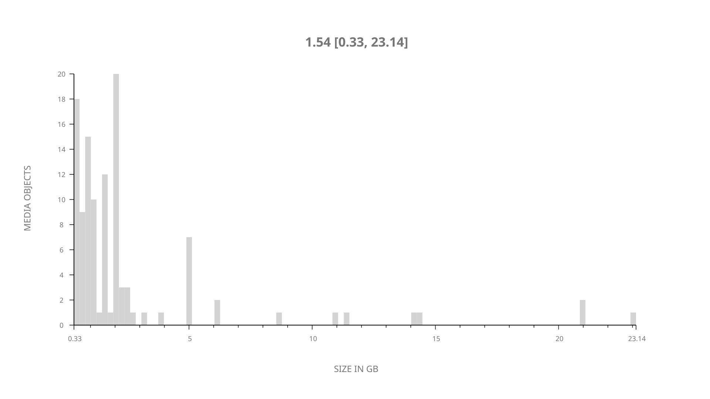
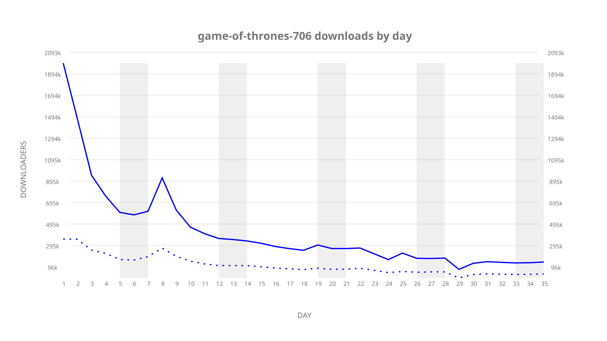
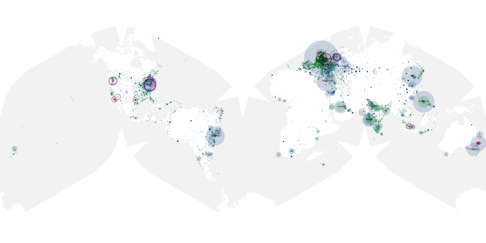
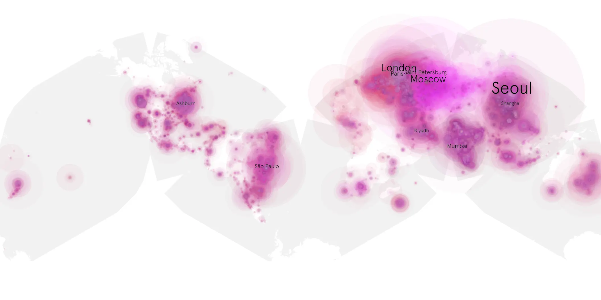
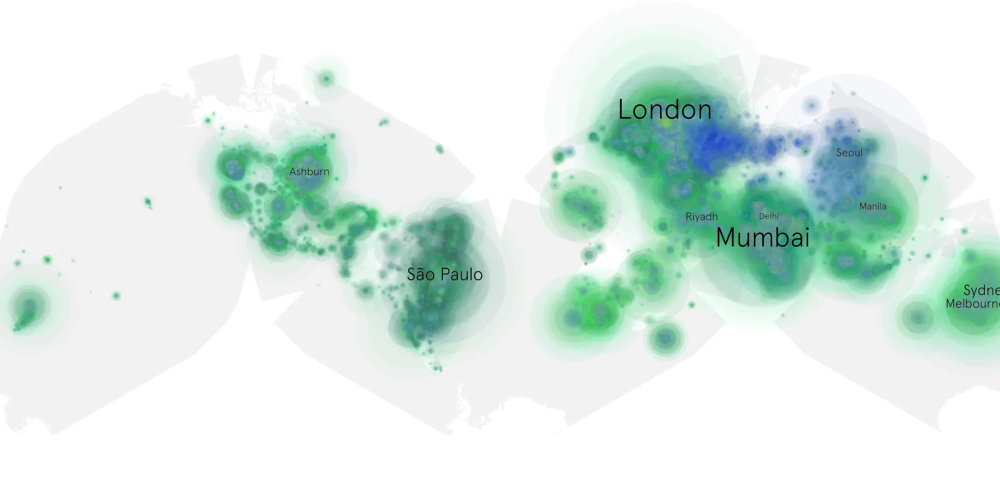

# game-of-thrones-706 sample cache audit

## 1. Media object

| Field | Value |
| --- | --- |
| Media object | Game of Thrones |
| Collection key | `game-of-thrones-706` |
| imdb_id | [tt0944947](https://www.imdb.com/title/tt0944947/) |
| wikipedia_url | [Game of Thrones](https://en.wikipedia.org/wiki/Game_of_Thrones) |
| Sample dates | 2017-08-21-to-2017-09-24 |
| Sample days | 35 |
| BTIH count | 127 |
| Unique BTIH count | 112 |
| Downloaders total | 11,274,053 |
| Uploaders total | 3,936,718 |
| Data version | `2026-08-05` |
| IP geolocation version | `6:1777968300` |

## 2. Sample coverage report

- Generated: 2026-09-08T01:09:21Z
- Sample archive directory: `/mnt/gold/src/alpha60-samples-raw.gold/game-of-thrones-706.xz`
- Hour directories: 810
- Zero-length sample files: 0
- Other unparsable sample files: 0
- Hourly discontinuities: 11 (27 missing hours)
- Missing days: 0

### Sample archive discontinuities

- hourly gap: last `2017-08-25 16:03`, resumed `2017-08-25 18:03` — missing 1 hour(s)
- hourly gap: last `2017-08-25 18:03`, resumed `2017-08-25 20:03` — missing 1 hour(s)
- hourly gap: last `2017-08-25 20:03`, resumed `2017-08-25 22:03` — missing 1 hour(s)
- hourly gap: last `2017-08-25 22:03`, resumed `2017-08-26 00:03` — missing 1 hour(s)
- hourly gap: last `2017-08-26 00:03`, resumed `2017-08-26 02:06` — missing 1 hour(s)
- hourly gap: last `2017-08-26 15:11`, resumed `2017-08-26 17:11` — missing 1 hour(s)
- hourly gap: last `2017-08-26 17:11`, resumed `2017-08-26 19:11` — missing 1 hour(s)
- hourly gap: last `2017-08-26 19:11`, resumed `2017-08-26 21:11` — missing 1 hour(s)
- hourly gap: last `2017-08-26 21:11`, resumed `2017-08-26 23:11` — missing 1 hour(s)
- hourly gap: last `2017-09-12 16:00`, resumed `2017-09-12 18:00` — missing 1 hour(s)
- hourly gap: last `2017-09-18 10:00`, resumed `2017-09-19 04:00` — missing 17 hour(s)

## 3. Media objects file size histogram

## 4. Visualization pass — graphs

### Downloads by week cumulative (normalized start)



### Downloads by day, Saturday and Sunday in gray

## 5. Visualization pass — maps

### Cumulative geographic slices

| Africa | Americas | Asia | Europe | Oceania | Unknown |
| --- | --- | --- | --- | --- | --- |
| 5.93 | 18.82 | 28.02 | 30.99 | 3.86 | 0.51 |

### Cumulative network infrastructure

{:target="_blank" rel="noopener"}

### Cumulative data maps

**Cumulative >= 1080p**

{:target="_blank" rel="noopener"}

**Cumulative < 1080p**

{:target="_blank" rel="noopener"}
