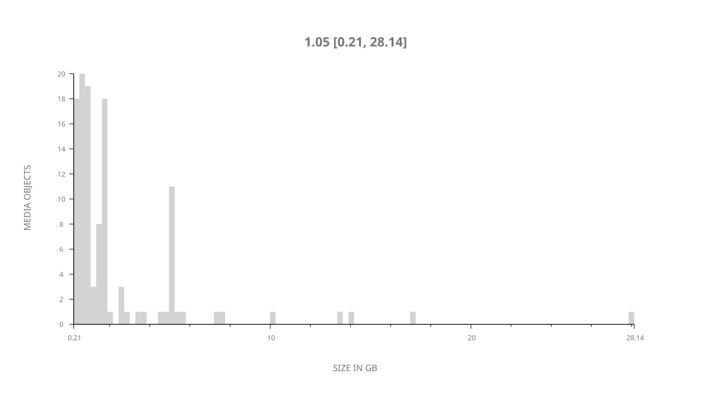
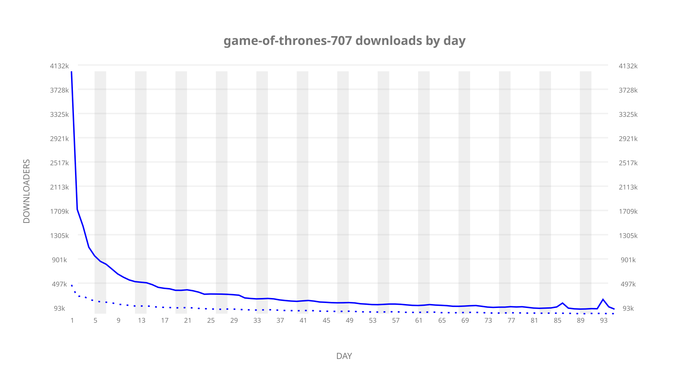
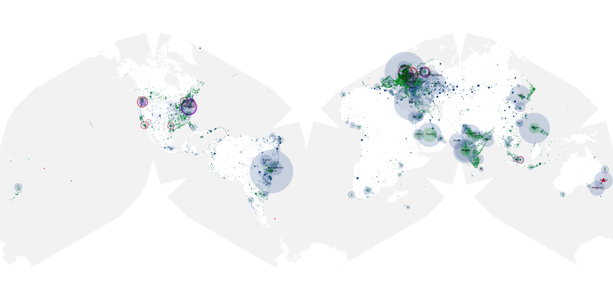
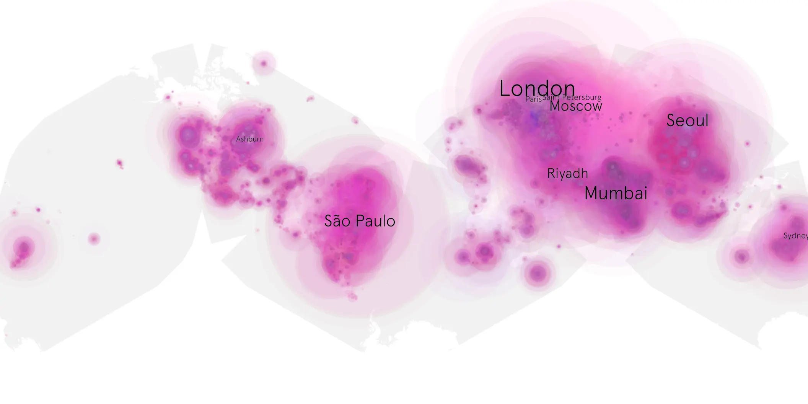
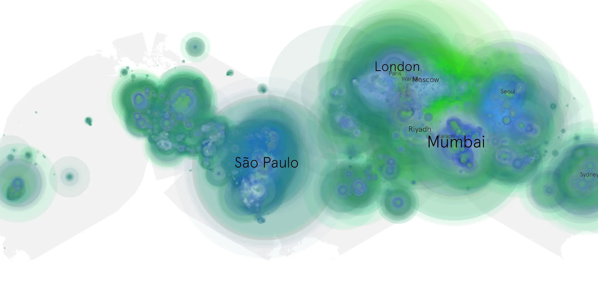

# game-of-thrones-707 sample cache audit

## 1. Media object

| Field | Value |
| --- | --- |
| Media object | Game of Thrones |
| Collection key | `game-of-thrones-707` |
| imdb_id | [tt0944947](https://www.imdb.com/title/tt0944947/) |
| wikipedia_url | [Game of Thrones](https://en.wikipedia.org/wiki/Game_of_Thrones) |
| Sample dates | 2017-08-28-to-2017-11-30 |
| Sample days | 95 |
| BTIH count | 148 |
| Unique BTIH count | 115 |
| Downloaders total | 33,824,621 |
| Uploaders total | 9,440,677 |
| Data version | `2026-08-05` |
| IP geolocation version | `6:1777968300` |

## 2. Sample coverage report

- Generated: 2026-09-08T01:09:26Z
- Sample archive directory: `/mnt/gold/src/alpha60-samples-raw.gold/game-of-thrones-707.xz`
- Hour directories: 2270
- Zero-length sample files: 0
- Other unparsable sample files: 0
- Hourly discontinuities: 3 (6 missing hours)
- Missing days: 0

### Sample archive discontinuities

- hourly gap: last `2017-08-28 23:30`, resumed `2017-08-29 05:17` — missing 4 hour(s)
- hourly gap: last `2017-08-29 13:17`, resumed `2017-08-29 15:17` — missing 1 hour(s)
- hourly gap: last `2017-08-30 12:20`, resumed `2017-08-30 14:20` — missing 1 hour(s)

## 3. Media objects file size histogram

## 4. Visualization pass — graphs

### Downloads by week cumulative (normalized start)



### Downloads by day, Saturday and Sunday in gray

## 5. Visualization pass — maps

### Cumulative geographic slices

| Africa | Americas | Asia | Europe | Oceania | Unknown |
| --- | --- | --- | --- | --- | --- |
| 7.18 | 21.36 | 29.34 | 32.30 | 3.15 | 0.65 |

### Cumulative network infrastructure

{:target="_blank" rel="noopener"}

### Cumulative data maps

**Cumulative >= 1080p**

{:target="_blank" rel="noopener"}

**Cumulative < 1080p**

{:target="_blank" rel="noopener"}
