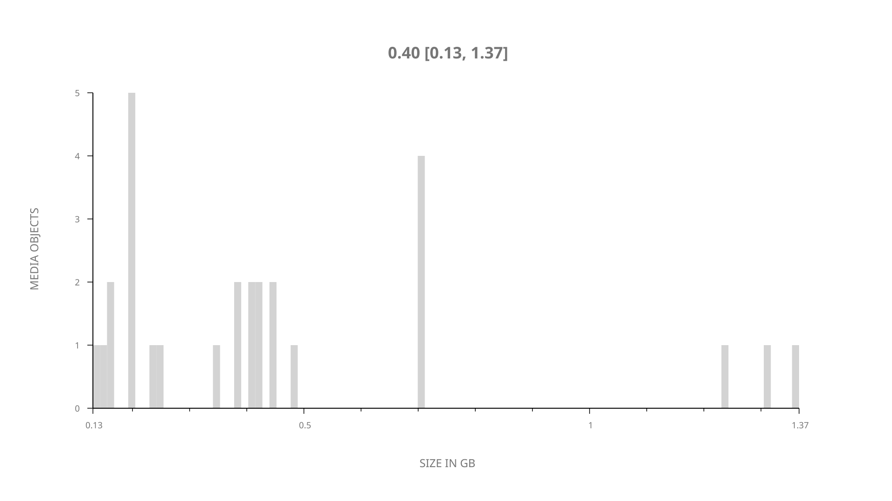
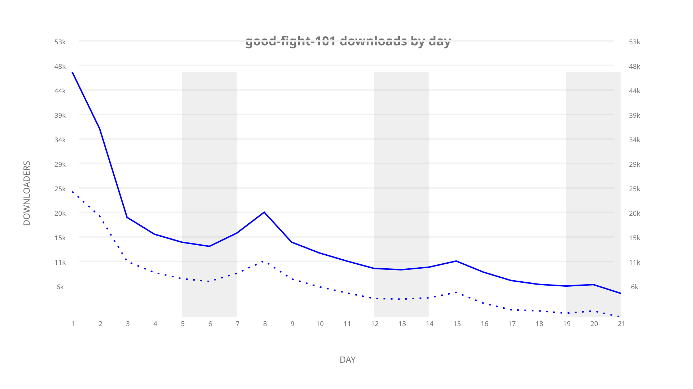
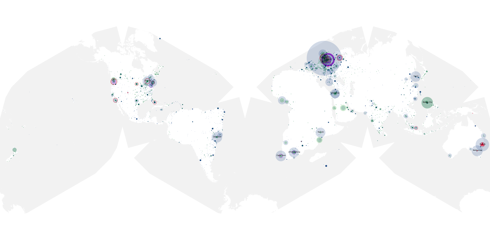
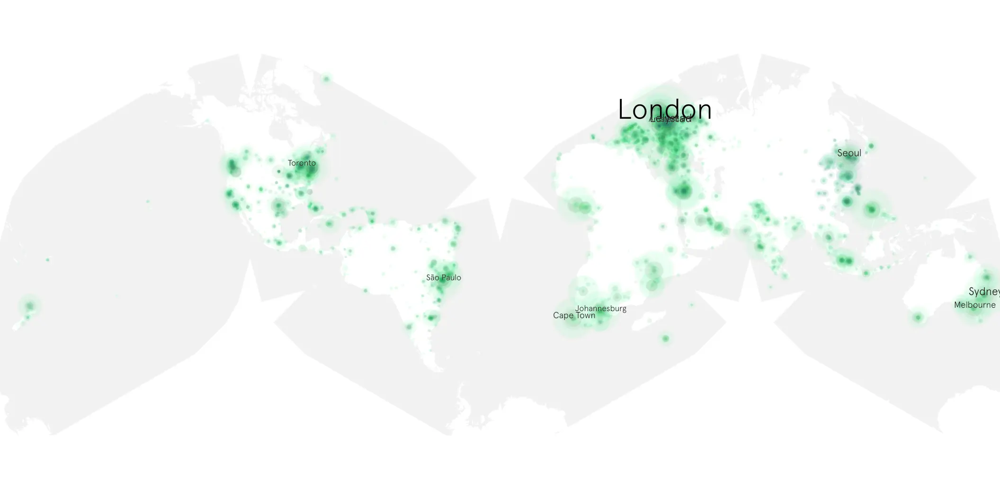

# good-fight-101 sample cache audit

## 1. Media object

| Field | Value |
| --- | --- |
| Media object | The Good Fight |
| Collection key | `good-fight-101` |
| imdb_id | [tt5853176](https://www.imdb.com/title/tt5853176/) |
| wikipedia_url | [The Good Fight](https://en.wikipedia.org/wiki/The_Good_Fight) |
| Sample dates | 2017-02-20-to-2017-03-12 |
| Sample days | 21 |
| BTIH count | 28 |
| Unique BTIH count | 28 |
| Downloaders total | 239,192 |
| Uploaders total | 152,800 |
| Data version | `2026-08-05` |
| IP geolocation version | `6:1777968300` |

## 2. Sample coverage report

- Generated: 2026-09-09T01:10:36Z
- Sample archive directory: `/mnt/gold/src/alpha60-samples-raw.gold/good-fight-101.xz`
- Hour directories: 124
- Zero-length sample files: 0
- Other unparsable sample files: 0
- Hourly discontinuities: 123 (370 missing hours)
- Missing days: 0

### Sample archive discontinuities

- hourly gap: last `2017-02-20 00:00`, resumed `2017-02-20 04:00` — missing 3 hour(s)
- hourly gap: last `2017-02-20 04:00`, resumed `2017-02-20 08:00` — missing 3 hour(s)
- hourly gap: last `2017-02-20 08:00`, resumed `2017-02-20 12:00` — missing 3 hour(s)
- hourly gap: last `2017-02-20 12:00`, resumed `2017-02-20 16:00` — missing 3 hour(s)
- hourly gap: last `2017-02-20 16:00`, resumed `2017-02-20 20:00` — missing 3 hour(s)
- hourly gap: last `2017-02-20 20:00`, resumed `2017-02-21 00:00` — missing 3 hour(s)
- hourly gap: last `2017-02-21 00:00`, resumed `2017-02-21 04:00` — missing 3 hour(s)
- hourly gap: last `2017-02-21 04:00`, resumed `2017-02-21 08:00` — missing 3 hour(s)
- hourly gap: last `2017-02-21 08:00`, resumed `2017-02-21 12:00` — missing 3 hour(s)
- hourly gap: last `2017-02-21 12:00`, resumed `2017-02-21 16:00` — missing 3 hour(s)
- hourly gap: last `2017-02-21 16:00`, resumed `2017-02-21 20:00` — missing 3 hour(s)
- hourly gap: last `2017-02-21 20:00`, resumed `2017-02-22 00:00` — missing 3 hour(s)
- hourly gap: last `2017-02-22 00:00`, resumed `2017-02-22 04:00` — missing 3 hour(s)
- hourly gap: last `2017-02-22 04:00`, resumed `2017-02-22 08:00` — missing 3 hour(s)
- hourly gap: last `2017-02-22 08:00`, resumed `2017-02-22 12:00` — missing 3 hour(s)
- hourly gap: last `2017-02-22 12:00`, resumed `2017-02-22 16:00` — missing 3 hour(s)
- hourly gap: last `2017-02-22 16:00`, resumed `2017-02-22 20:00` — missing 3 hour(s)
- hourly gap: last `2017-02-22 20:00`, resumed `2017-02-23 00:00` — missing 3 hour(s)
- hourly gap: last `2017-02-23 00:00`, resumed `2017-02-23 04:00` — missing 3 hour(s)
- hourly gap: last `2017-02-23 04:00`, resumed `2017-02-23 08:00` — missing 3 hour(s)
- hourly gap: last `2017-02-23 08:00`, resumed `2017-02-23 12:00` — missing 3 hour(s)
- hourly gap: last `2017-02-23 12:00`, resumed `2017-02-23 16:00` — missing 3 hour(s)
- hourly gap: last `2017-02-23 16:00`, resumed `2017-02-23 20:00` — missing 3 hour(s)
- hourly gap: last `2017-02-23 20:00`, resumed `2017-02-24 00:00` — missing 3 hour(s)
- hourly gap: last `2017-02-24 00:00`, resumed `2017-02-24 04:00` — missing 3 hour(s)
- hourly gap: last `2017-02-24 04:00`, resumed `2017-02-24 08:00` — missing 3 hour(s)
- hourly gap: last `2017-02-24 08:00`, resumed `2017-02-24 12:00` — missing 3 hour(s)
- hourly gap: last `2017-02-24 12:00`, resumed `2017-02-24 16:00` — missing 3 hour(s)
- hourly gap: last `2017-02-24 16:00`, resumed `2017-02-24 20:00` — missing 3 hour(s)
- hourly gap: last `2017-02-24 20:00`, resumed `2017-02-25 00:00` — missing 3 hour(s)
- hourly gap: last `2017-02-25 00:00`, resumed `2017-02-25 04:00` — missing 3 hour(s)
- hourly gap: last `2017-02-25 04:00`, resumed `2017-02-25 08:00` — missing 3 hour(s)
- hourly gap: last `2017-02-25 08:00`, resumed `2017-02-25 12:00` — missing 3 hour(s)
- hourly gap: last `2017-02-25 12:00`, resumed `2017-02-25 16:00` — missing 3 hour(s)
- hourly gap: last `2017-02-25 16:00`, resumed `2017-02-25 20:00` — missing 3 hour(s)
- hourly gap: last `2017-02-25 20:00`, resumed `2017-02-26 00:00` — missing 3 hour(s)
- hourly gap: last `2017-02-26 00:00`, resumed `2017-02-26 04:00` — missing 3 hour(s)
- hourly gap: last `2017-02-26 04:00`, resumed `2017-02-26 08:00` — missing 3 hour(s)
- hourly gap: last `2017-02-26 08:00`, resumed `2017-02-26 12:00` — missing 3 hour(s)
- hourly gap: last `2017-02-26 12:00`, resumed `2017-02-26 16:00` — missing 3 hour(s)
- hourly gap: last `2017-02-26 16:00`, resumed `2017-02-26 20:00` — missing 3 hour(s)
- hourly gap: last `2017-02-26 20:00`, resumed `2017-02-27 00:00` — missing 3 hour(s)
- hourly gap: last `2017-02-27 00:00`, resumed `2017-02-27 04:00` — missing 3 hour(s)
- hourly gap: last `2017-02-27 04:00`, resumed `2017-02-27 08:00` — missing 3 hour(s)
- hourly gap: last `2017-02-27 08:00`, resumed `2017-02-27 12:00` — missing 3 hour(s)
- hourly gap: last `2017-02-27 12:00`, resumed `2017-02-27 16:00` — missing 3 hour(s)
- hourly gap: last `2017-02-27 16:00`, resumed `2017-02-27 20:00` — missing 3 hour(s)
- hourly gap: last `2017-02-27 20:00`, resumed `2017-02-28 00:00` — missing 3 hour(s)
- hourly gap: last `2017-02-28 00:00`, resumed `2017-02-28 04:00` — missing 3 hour(s)
- hourly gap: last `2017-02-28 04:00`, resumed `2017-02-28 08:00` — missing 3 hour(s)
- hourly gap: last `2017-02-28 08:00`, resumed `2017-02-28 12:00` — missing 3 hour(s)
- hourly gap: last `2017-02-28 12:00`, resumed `2017-02-28 16:00` — missing 3 hour(s)
- hourly gap: last `2017-02-28 16:00`, resumed `2017-02-28 20:00` — missing 3 hour(s)
- hourly gap: last `2017-02-28 20:00`, resumed `2017-03-01 00:00` — missing 3 hour(s)
- hourly gap: last `2017-03-01 00:00`, resumed `2017-03-01 04:00` — missing 3 hour(s)
- hourly gap: last `2017-03-01 04:00`, resumed `2017-03-01 08:00` — missing 3 hour(s)
- hourly gap: last `2017-03-01 08:00`, resumed `2017-03-01 12:00` — missing 3 hour(s)
- hourly gap: last `2017-03-01 12:00`, resumed `2017-03-01 16:00` — missing 3 hour(s)
- hourly gap: last `2017-03-01 16:00`, resumed `2017-03-01 20:00` — missing 3 hour(s)
- hourly gap: last `2017-03-01 20:00`, resumed `2017-03-02 00:00` — missing 3 hour(s)
- hourly gap: last `2017-03-02 00:00`, resumed `2017-03-02 04:00` — missing 3 hour(s)
- hourly gap: last `2017-03-02 04:00`, resumed `2017-03-02 08:00` — missing 3 hour(s)
- hourly gap: last `2017-03-02 08:00`, resumed `2017-03-02 12:00` — missing 3 hour(s)
- hourly gap: last `2017-03-02 12:00`, resumed `2017-03-02 16:00` — missing 3 hour(s)
- hourly gap: last `2017-03-02 16:00`, resumed `2017-03-02 20:00` — missing 3 hour(s)
- hourly gap: last `2017-03-02 20:00`, resumed `2017-03-03 00:00` — missing 3 hour(s)
- hourly gap: last `2017-03-03 00:00`, resumed `2017-03-03 04:00` — missing 3 hour(s)
- hourly gap: last `2017-03-03 04:00`, resumed `2017-03-03 08:00` — missing 3 hour(s)
- hourly gap: last `2017-03-03 08:00`, resumed `2017-03-03 12:00` — missing 3 hour(s)
- hourly gap: last `2017-03-03 12:00`, resumed `2017-03-03 16:00` — missing 3 hour(s)
- hourly gap: last `2017-03-03 16:00`, resumed `2017-03-03 20:00` — missing 3 hour(s)
- hourly gap: last `2017-03-03 20:00`, resumed `2017-03-04 00:00` — missing 3 hour(s)
- hourly gap: last `2017-03-04 00:00`, resumed `2017-03-04 04:00` — missing 3 hour(s)
- hourly gap: last `2017-03-04 04:00`, resumed `2017-03-04 08:00` — missing 3 hour(s)
- hourly gap: last `2017-03-04 08:00`, resumed `2017-03-04 12:00` — missing 3 hour(s)
- hourly gap: last `2017-03-04 12:00`, resumed `2017-03-04 16:00` — missing 3 hour(s)
- hourly gap: last `2017-03-04 16:00`, resumed `2017-03-04 20:00` — missing 3 hour(s)
- hourly gap: last `2017-03-04 20:00`, resumed `2017-03-05 00:00` — missing 3 hour(s)
- hourly gap: last `2017-03-05 00:00`, resumed `2017-03-05 04:00` — missing 3 hour(s)
- hourly gap: last `2017-03-05 04:00`, resumed `2017-03-05 08:00` — missing 3 hour(s)
- hourly gap: last `2017-03-05 08:00`, resumed `2017-03-05 12:00` — missing 3 hour(s)
- hourly gap: last `2017-03-05 12:00`, resumed `2017-03-05 16:00` — missing 3 hour(s)
- hourly gap: last `2017-03-05 16:00`, resumed `2017-03-05 20:00` — missing 3 hour(s)
- hourly gap: last `2017-03-05 20:00`, resumed `2017-03-06 00:00` — missing 3 hour(s)
- hourly gap: last `2017-03-06 00:00`, resumed `2017-03-06 04:00` — missing 3 hour(s)
- hourly gap: last `2017-03-06 04:00`, resumed `2017-03-06 08:00` — missing 3 hour(s)
- hourly gap: last `2017-03-06 08:00`, resumed `2017-03-06 12:00` — missing 3 hour(s)
- hourly gap: last `2017-03-06 12:00`, resumed `2017-03-06 16:00` — missing 3 hour(s)
- hourly gap: last `2017-03-06 16:00`, resumed `2017-03-06 20:00` — missing 3 hour(s)
- hourly gap: last `2017-03-06 20:00`, resumed `2017-03-07 00:00` — missing 3 hour(s)
- hourly gap: last `2017-03-07 00:00`, resumed `2017-03-07 04:00` — missing 3 hour(s)
- hourly gap: last `2017-03-07 04:00`, resumed `2017-03-07 08:00` — missing 3 hour(s)
- hourly gap: last `2017-03-07 08:00`, resumed `2017-03-07 12:00` — missing 3 hour(s)
- hourly gap: last `2017-03-07 12:00`, resumed `2017-03-07 16:00` — missing 3 hour(s)
- hourly gap: last `2017-03-07 16:00`, resumed `2017-03-07 20:00` — missing 3 hour(s)
- hourly gap: last `2017-03-07 20:00`, resumed `2017-03-08 00:00` — missing 3 hour(s)
- hourly gap: last `2017-03-08 00:00`, resumed `2017-03-08 04:00` — missing 3 hour(s)
- hourly gap: last `2017-03-08 04:00`, resumed `2017-03-08 08:00` — missing 3 hour(s)
- hourly gap: last `2017-03-08 08:00`, resumed `2017-03-08 12:00` — missing 3 hour(s)
- hourly gap: last `2017-03-08 12:00`, resumed `2017-03-08 16:00` — missing 3 hour(s)
- hourly gap: last `2017-03-08 16:00`, resumed `2017-03-08 20:00` — missing 3 hour(s)
- hourly gap: last `2017-03-08 20:00`, resumed `2017-03-09 00:00` — missing 3 hour(s)
- hourly gap: last `2017-03-09 00:00`, resumed `2017-03-09 04:00` — missing 3 hour(s)
- hourly gap: last `2017-03-09 04:00`, resumed `2017-03-09 08:00` — missing 3 hour(s)
- hourly gap: last `2017-03-09 08:00`, resumed `2017-03-09 12:00` — missing 3 hour(s)
- hourly gap: last `2017-03-09 12:00`, resumed `2017-03-09 16:00` — missing 3 hour(s)
- hourly gap: last `2017-03-09 16:00`, resumed `2017-03-09 20:00` — missing 3 hour(s)
- hourly gap: last `2017-03-09 20:00`, resumed `2017-03-10 00:00` — missing 3 hour(s)
- hourly gap: last `2017-03-10 00:00`, resumed `2017-03-10 04:00` — missing 3 hour(s)
- hourly gap: last `2017-03-10 04:00`, resumed `2017-03-10 08:00` — missing 3 hour(s)
- hourly gap: last `2017-03-10 08:00`, resumed `2017-03-10 12:00` — missing 3 hour(s)
- hourly gap: last `2017-03-10 12:00`, resumed `2017-03-10 16:00` — missing 3 hour(s)
- hourly gap: last `2017-03-10 16:00`, resumed `2017-03-10 20:00` — missing 3 hour(s)
- hourly gap: last `2017-03-10 20:00`, resumed `2017-03-11 00:00` — missing 3 hour(s)
- hourly gap: last `2017-03-11 00:00`, resumed `2017-03-11 04:00` — missing 3 hour(s)
- hourly gap: last `2017-03-11 04:00`, resumed `2017-03-11 08:00` — missing 3 hour(s)
- hourly gap: last `2017-03-11 08:00`, resumed `2017-03-11 12:00` — missing 3 hour(s)
- hourly gap: last `2017-03-11 12:00`, resumed `2017-03-11 16:00` — missing 3 hour(s)
- hourly gap: last `2017-03-11 16:00`, resumed `2017-03-11 20:00` — missing 3 hour(s)
- hourly gap: last `2017-03-11 20:00`, resumed `2017-03-12 00:00` — missing 3 hour(s)
- hourly gap: last `2017-03-12 00:00`, resumed `2017-03-12 05:00` — missing 4 hour(s)
- hourly gap: last `2017-03-12 05:00`, resumed `2017-03-12 09:00` — missing 3 hour(s)
- hourly gap: last `2017-03-12 09:00`, resumed `2017-03-12 13:00` — missing 3 hour(s)

## 3. Media objects file size histogram

## 4. Visualization pass — graphs

### Downloads by week cumulative (normalized start)



### Downloads by day, Saturday and Sunday in gray

## 5. Visualization pass — maps

### Cumulative geographic slices

| Africa | Americas | Asia | Europe | Oceania | Unknown |
| --- | --- | --- | --- | --- | --- |
| 7.19 | 17.96 | 15.64 | 22.68 | 4.10 | 0.38 |

### Cumulative network infrastructure

{:target="_blank" rel="noopener"}

### Cumulative data maps

**Cumulative >= 1080p**

UNAVAILABLE — no collection members at 1080p or 2160 resolution.

**Cumulative < 1080p**

{:target="_blank" rel="noopener"}
