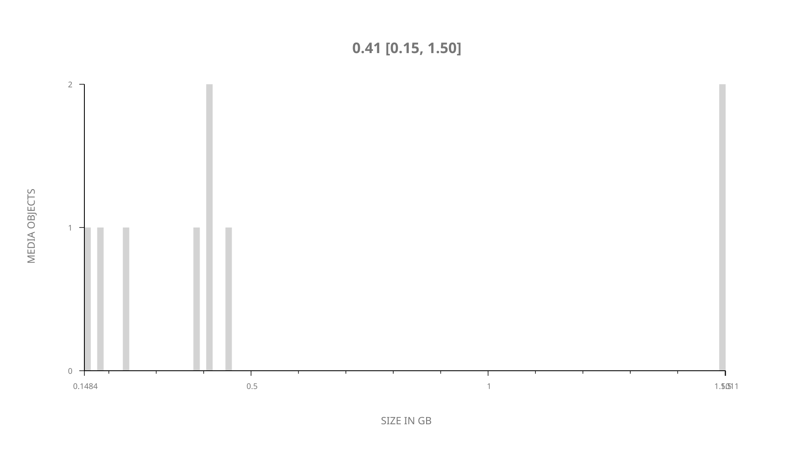
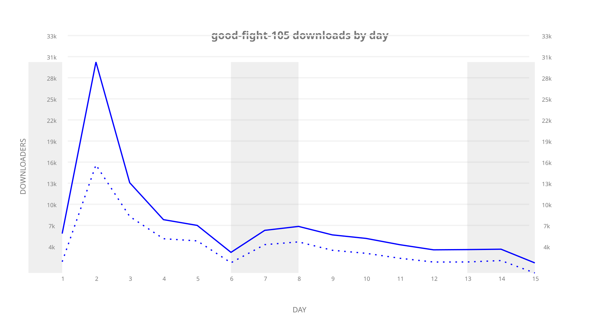
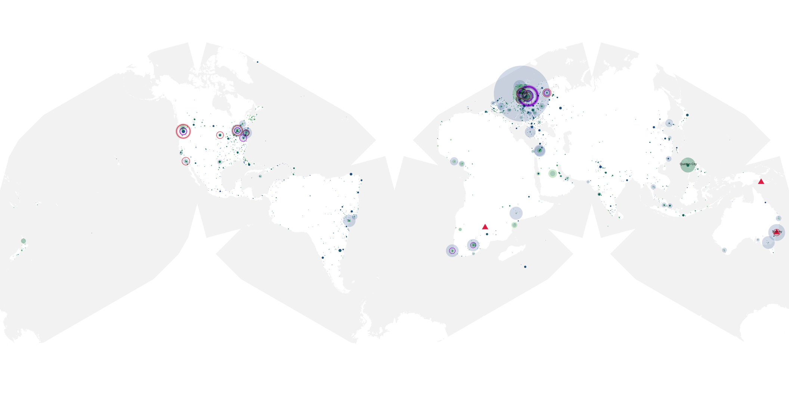
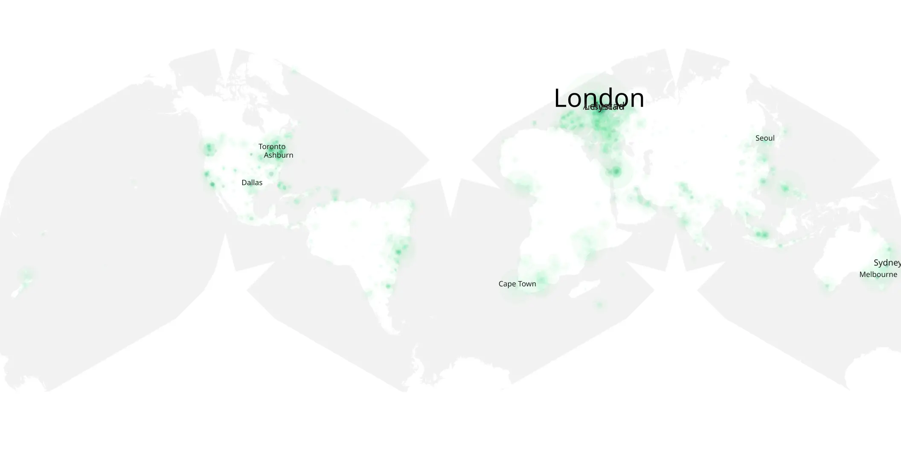

# good-fight-105 sample cache audit

## 1. Media object

| Field | Value |
| --- | --- |
| Media object | The Good Fight |
| Collection key | `good-fight-105` |
| imdb_id | [tt5853176](https://www.imdb.com/title/tt5853176/) |
| wikipedia_url | [The Good Fight](https://en.wikipedia.org/wiki/The_Good_Fight) |
| Sample dates | 2017-03-12-to-2017-03-26 |
| Sample days | 15 |
| BTIH count | 12 |
| Unique BTIH count | 9 |
| Downloaders total | 152,064 |
| Uploaders total | 106,050 |
| Data version | `2026-08-05` |
| IP geolocation version | `6:1777968300` |

## 2. Sample coverage report

- Generated: 2026-09-09T01:10:36Z
- Sample archive directory: `/mnt/gold/src/alpha60-samples-raw.gold/good-fight-105.xz`
- Hour directories: 80
- Zero-length sample files: 0
- Other unparsable sample files: 0
- Hourly discontinuities: 79 (245 missing hours)
- Missing days: 0

### Sample archive discontinuities

- hourly gap: last `2017-03-12 23:00`, resumed `2017-03-13 03:00` — missing 3 hour(s)
- hourly gap: last `2017-03-13 03:00`, resumed `2017-03-13 07:00` — missing 3 hour(s)
- hourly gap: last `2017-03-13 07:00`, resumed `2017-03-13 11:00` — missing 3 hour(s)
- hourly gap: last `2017-03-13 11:00`, resumed `2017-03-13 15:00` — missing 3 hour(s)
- hourly gap: last `2017-03-13 15:00`, resumed `2017-03-13 19:00` — missing 3 hour(s)
- hourly gap: last `2017-03-13 19:00`, resumed `2017-03-13 23:00` — missing 3 hour(s)
- hourly gap: last `2017-03-13 23:00`, resumed `2017-03-14 03:00` — missing 3 hour(s)
- hourly gap: last `2017-03-14 03:00`, resumed `2017-03-14 07:00` — missing 3 hour(s)
- hourly gap: last `2017-03-14 07:00`, resumed `2017-03-14 11:00` — missing 3 hour(s)
- hourly gap: last `2017-03-14 11:00`, resumed `2017-03-14 15:00` — missing 3 hour(s)
- hourly gap: last `2017-03-14 15:00`, resumed `2017-03-14 19:00` — missing 3 hour(s)
- hourly gap: last `2017-03-14 19:00`, resumed `2017-03-14 23:00` — missing 3 hour(s)
- hourly gap: last `2017-03-14 23:00`, resumed `2017-03-15 03:00` — missing 3 hour(s)
- hourly gap: last `2017-03-15 03:00`, resumed `2017-03-15 07:00` — missing 3 hour(s)
- hourly gap: last `2017-03-15 07:00`, resumed `2017-03-15 11:00` — missing 3 hour(s)
- hourly gap: last `2017-03-15 11:00`, resumed `2017-03-15 15:00` — missing 3 hour(s)
- hourly gap: last `2017-03-15 15:00`, resumed `2017-03-15 19:00` — missing 3 hour(s)
- hourly gap: last `2017-03-15 19:00`, resumed `2017-03-16 03:00` — missing 7 hour(s)
- hourly gap: last `2017-03-16 03:00`, resumed `2017-03-16 07:00` — missing 3 hour(s)
- hourly gap: last `2017-03-16 07:00`, resumed `2017-03-16 11:00` — missing 3 hour(s)
- hourly gap: last `2017-03-16 11:00`, resumed `2017-03-16 15:00` — missing 3 hour(s)
- hourly gap: last `2017-03-16 15:00`, resumed `2017-03-16 19:00` — missing 3 hour(s)
- hourly gap: last `2017-03-16 19:00`, resumed `2017-03-16 23:00` — missing 3 hour(s)
- hourly gap: last `2017-03-16 23:00`, resumed `2017-03-17 03:00` — missing 3 hour(s)
- hourly gap: last `2017-03-17 03:00`, resumed `2017-03-17 07:00` — missing 3 hour(s)
- hourly gap: last `2017-03-17 07:00`, resumed `2017-03-17 11:00` — missing 3 hour(s)
- hourly gap: last `2017-03-17 11:00`, resumed `2017-03-17 15:00` — missing 3 hour(s)
- hourly gap: last `2017-03-17 15:00`, resumed `2017-03-17 19:00` — missing 3 hour(s)
- hourly gap: last `2017-03-17 19:00`, resumed `2017-03-17 23:00` — missing 3 hour(s)
- hourly gap: last `2017-03-17 23:00`, resumed `2017-03-18 03:00` — missing 3 hour(s)
- hourly gap: last `2017-03-18 03:00`, resumed `2017-03-18 07:00` — missing 3 hour(s)
- hourly gap: last `2017-03-18 07:00`, resumed `2017-03-18 11:00` — missing 3 hour(s)
- hourly gap: last `2017-03-18 11:00`, resumed `2017-03-18 15:00` — missing 3 hour(s)
- hourly gap: last `2017-03-18 15:00`, resumed `2017-03-18 19:00` — missing 3 hour(s)
- hourly gap: last `2017-03-18 19:00`, resumed `2017-03-18 23:00` — missing 3 hour(s)
- hourly gap: last `2017-03-18 23:00`, resumed `2017-03-19 03:00` — missing 3 hour(s)
- hourly gap: last `2017-03-19 03:00`, resumed `2017-03-19 07:00` — missing 3 hour(s)
- hourly gap: last `2017-03-19 07:00`, resumed `2017-03-19 11:00` — missing 3 hour(s)
- hourly gap: last `2017-03-19 11:00`, resumed `2017-03-19 15:00` — missing 3 hour(s)
- hourly gap: last `2017-03-19 15:00`, resumed `2017-03-19 19:00` — missing 3 hour(s)
- hourly gap: last `2017-03-19 19:00`, resumed `2017-03-19 23:00` — missing 3 hour(s)
- hourly gap: last `2017-03-19 23:00`, resumed `2017-03-20 03:00` — missing 3 hour(s)
- hourly gap: last `2017-03-20 03:00`, resumed `2017-03-20 11:00` — missing 7 hour(s)
- hourly gap: last `2017-03-20 11:00`, resumed `2017-03-20 15:00` — missing 3 hour(s)
- hourly gap: last `2017-03-20 15:00`, resumed `2017-03-20 19:00` — missing 3 hour(s)
- hourly gap: last `2017-03-20 19:00`, resumed `2017-03-20 23:00` — missing 3 hour(s)
- hourly gap: last `2017-03-20 23:00`, resumed `2017-03-21 03:00` — missing 3 hour(s)
- hourly gap: last `2017-03-21 03:00`, resumed `2017-03-21 07:00` — missing 3 hour(s)
- hourly gap: last `2017-03-21 07:00`, resumed `2017-03-21 11:00` — missing 3 hour(s)
- hourly gap: last `2017-03-21 11:00`, resumed `2017-03-21 15:00` — missing 3 hour(s)
- hourly gap: last `2017-03-21 15:00`, resumed `2017-03-21 19:00` — missing 3 hour(s)
- hourly gap: last `2017-03-21 19:00`, resumed `2017-03-21 23:00` — missing 3 hour(s)
- hourly gap: last `2017-03-21 23:00`, resumed `2017-03-22 03:00` — missing 3 hour(s)
- hourly gap: last `2017-03-22 03:00`, resumed `2017-03-22 07:00` — missing 3 hour(s)
- hourly gap: last `2017-03-22 07:00`, resumed `2017-03-22 11:00` — missing 3 hour(s)
- hourly gap: last `2017-03-22 11:00`, resumed `2017-03-22 15:00` — missing 3 hour(s)
- hourly gap: last `2017-03-22 15:00`, resumed `2017-03-22 19:00` — missing 3 hour(s)
- hourly gap: last `2017-03-22 19:00`, resumed `2017-03-22 23:00` — missing 3 hour(s)
- hourly gap: last `2017-03-22 23:00`, resumed `2017-03-23 03:00` — missing 3 hour(s)
- hourly gap: last `2017-03-23 03:00`, resumed `2017-03-23 07:00` — missing 3 hour(s)
- hourly gap: last `2017-03-23 07:00`, resumed `2017-03-23 11:00` — missing 3 hour(s)
- hourly gap: last `2017-03-23 11:00`, resumed `2017-03-23 15:00` — missing 3 hour(s)
- hourly gap: last `2017-03-23 15:00`, resumed `2017-03-23 19:00` — missing 3 hour(s)
- hourly gap: last `2017-03-23 19:00`, resumed `2017-03-23 23:00` — missing 3 hour(s)
- hourly gap: last `2017-03-23 23:00`, resumed `2017-03-24 03:00` — missing 3 hour(s)
- hourly gap: last `2017-03-24 03:00`, resumed `2017-03-24 07:00` — missing 3 hour(s)
- hourly gap: last `2017-03-24 07:00`, resumed `2017-03-24 11:00` — missing 3 hour(s)
- hourly gap: last `2017-03-24 11:00`, resumed `2017-03-24 15:00` — missing 3 hour(s)
- hourly gap: last `2017-03-24 15:00`, resumed `2017-03-24 19:00` — missing 3 hour(s)
- hourly gap: last `2017-03-24 19:00`, resumed `2017-03-24 23:00` — missing 3 hour(s)
- hourly gap: last `2017-03-24 23:00`, resumed `2017-03-25 03:00` — missing 3 hour(s)
- hourly gap: last `2017-03-25 03:00`, resumed `2017-03-25 07:00` — missing 3 hour(s)
- hourly gap: last `2017-03-25 07:00`, resumed `2017-03-25 11:00` — missing 3 hour(s)
- hourly gap: last `2017-03-25 11:00`, resumed `2017-03-25 15:00` — missing 3 hour(s)
- hourly gap: last `2017-03-25 15:00`, resumed `2017-03-25 19:00` — missing 3 hour(s)
- hourly gap: last `2017-03-25 19:00`, resumed `2017-03-25 23:00` — missing 3 hour(s)
- hourly gap: last `2017-03-25 23:00`, resumed `2017-03-26 03:00` — missing 3 hour(s)
- hourly gap: last `2017-03-26 03:00`, resumed `2017-03-26 07:00` — missing 3 hour(s)
- hourly gap: last `2017-03-26 07:00`, resumed `2017-03-26 11:00` — missing 3 hour(s)

## 3. Media objects file size histogram

## 4. Visualization pass — graphs

### Downloads by week cumulative (normalized start)



### Downloads by day, Saturday and Sunday in gray

## 5. Visualization pass — maps

### Cumulative geographic slices

| Africa | Americas | Asia | Europe | Oceania | Unknown |
| --- | --- | --- | --- | --- | --- |
| 1.93 | 8.24 | 4.56 | 10.15 | 1.90 | 0.18 |

### Cumulative network infrastructure

{:target="_blank" rel="noopener"}

### Cumulative data maps

**Cumulative >= 1080p**

UNAVAILABLE — no collection members at 1080p or 2160 resolution.

**Cumulative < 1080p**

{:target="_blank" rel="noopener"}
