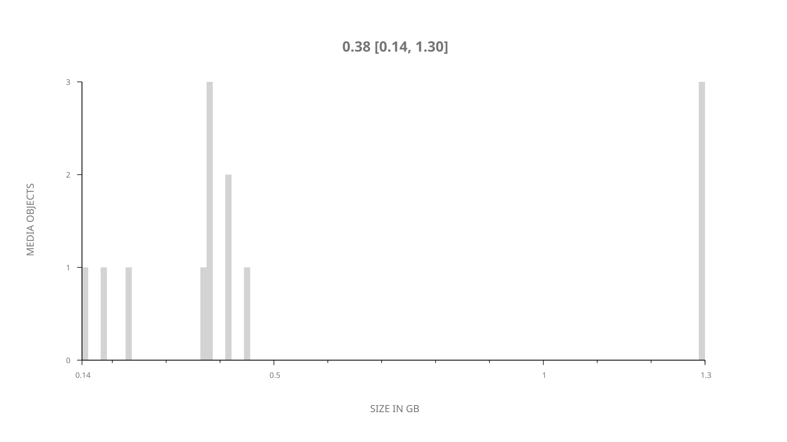
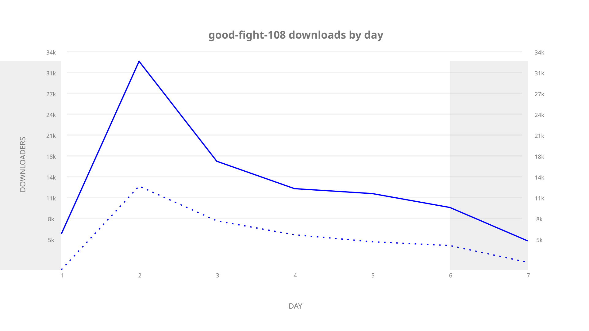
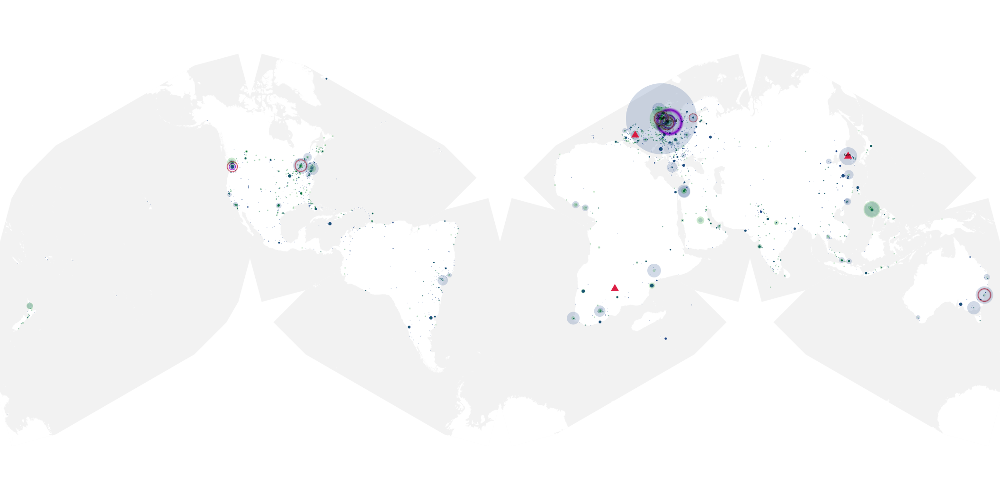
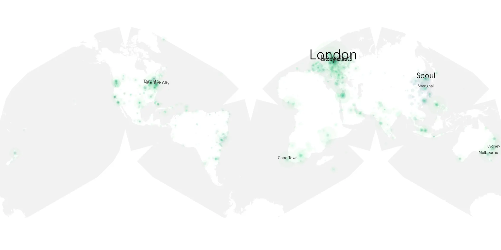

# good-fight-108 sample cache audit

## 1. Media object

| Field | Value |
| --- | --- |
| Media object | The Good Fight |
| Collection key | `good-fight-108` |
| imdb_id | [tt5853176](https://www.imdb.com/title/tt5853176/) |
| wikipedia_url | [The Good Fight](https://en.wikipedia.org/wiki/The_Good_Fight) |
| Sample dates | 2017-04-02-to-2017-04-08 |
| Sample days | 7 |
| BTIH count | 13 |
| Unique BTIH count | 13 |
| Downloaders total | 80,810 |
| Uploaders total | 45,887 |
| Data version | `2026-08-05` |
| IP geolocation version | `6:1777968300` |

## 2. Sample coverage report

- Generated: 2026-09-09T01:10:36Z
- Sample archive directory: `/mnt/gold/src/alpha60-samples-raw.gold/good-fight-108.xz`
- Hour directories: 35
- Zero-length sample files: 0
- Other unparsable sample files: 0
- Hourly discontinuities: 34 (102 missing hours)
- Missing days: 0

### Sample archive discontinuities

- hourly gap: last `2017-04-02 23:00`, resumed `2017-04-03 03:00` — missing 3 hour(s)
- hourly gap: last `2017-04-03 03:00`, resumed `2017-04-03 07:00` — missing 3 hour(s)
- hourly gap: last `2017-04-03 07:00`, resumed `2017-04-03 11:00` — missing 3 hour(s)
- hourly gap: last `2017-04-03 11:00`, resumed `2017-04-03 15:00` — missing 3 hour(s)
- hourly gap: last `2017-04-03 15:00`, resumed `2017-04-03 19:00` — missing 3 hour(s)
- hourly gap: last `2017-04-03 19:00`, resumed `2017-04-03 23:00` — missing 3 hour(s)
- hourly gap: last `2017-04-03 23:00`, resumed `2017-04-04 03:00` — missing 3 hour(s)
- hourly gap: last `2017-04-04 03:00`, resumed `2017-04-04 07:00` — missing 3 hour(s)
- hourly gap: last `2017-04-04 07:00`, resumed `2017-04-04 11:00` — missing 3 hour(s)
- hourly gap: last `2017-04-04 11:00`, resumed `2017-04-04 15:00` — missing 3 hour(s)
- hourly gap: last `2017-04-04 15:00`, resumed `2017-04-04 19:00` — missing 3 hour(s)
- hourly gap: last `2017-04-04 19:00`, resumed `2017-04-04 23:00` — missing 3 hour(s)
- hourly gap: last `2017-04-04 23:00`, resumed `2017-04-05 03:00` — missing 3 hour(s)
- hourly gap: last `2017-04-05 03:00`, resumed `2017-04-05 07:00` — missing 3 hour(s)
- hourly gap: last `2017-04-05 07:00`, resumed `2017-04-05 11:00` — missing 3 hour(s)
- hourly gap: last `2017-04-05 11:00`, resumed `2017-04-05 15:00` — missing 3 hour(s)
- hourly gap: last `2017-04-05 15:00`, resumed `2017-04-05 19:00` — missing 3 hour(s)
- hourly gap: last `2017-04-05 19:00`, resumed `2017-04-05 23:00` — missing 3 hour(s)
- hourly gap: last `2017-04-05 23:00`, resumed `2017-04-06 03:00` — missing 3 hour(s)
- hourly gap: last `2017-04-06 03:00`, resumed `2017-04-06 07:00` — missing 3 hour(s)
- hourly gap: last `2017-04-06 07:00`, resumed `2017-04-06 11:00` — missing 3 hour(s)
- hourly gap: last `2017-04-06 11:00`, resumed `2017-04-06 15:00` — missing 3 hour(s)
- hourly gap: last `2017-04-06 15:00`, resumed `2017-04-06 19:00` — missing 3 hour(s)
- hourly gap: last `2017-04-06 19:00`, resumed `2017-04-06 23:00` — missing 3 hour(s)
- hourly gap: last `2017-04-06 23:00`, resumed `2017-04-07 03:00` — missing 3 hour(s)
- hourly gap: last `2017-04-07 03:00`, resumed `2017-04-07 07:00` — missing 3 hour(s)
- hourly gap: last `2017-04-07 07:00`, resumed `2017-04-07 11:00` — missing 3 hour(s)
- hourly gap: last `2017-04-07 11:00`, resumed `2017-04-07 15:00` — missing 3 hour(s)
- hourly gap: last `2017-04-07 15:00`, resumed `2017-04-07 19:00` — missing 3 hour(s)
- hourly gap: last `2017-04-07 19:00`, resumed `2017-04-07 23:00` — missing 3 hour(s)
- hourly gap: last `2017-04-07 23:00`, resumed `2017-04-08 03:00` — missing 3 hour(s)
- hourly gap: last `2017-04-08 03:00`, resumed `2017-04-08 07:00` — missing 3 hour(s)
- hourly gap: last `2017-04-08 07:00`, resumed `2017-04-08 11:00` — missing 3 hour(s)
- hourly gap: last `2017-04-08 11:00`, resumed `2017-04-08 15:00` — missing 3 hour(s)

## 3. Media objects file size histogram

## 4. Visualization pass — graphs

### Downloads by week cumulative (normalized start)



### Downloads by day, Saturday and Sunday in gray

## 5. Visualization pass — maps

### Cumulative geographic slices

| Africa | Americas | Asia | Europe | Oceania | Unknown |
| --- | --- | --- | --- | --- | --- |
| 1.93 | 9.60 | 8.93 | 14.02 | 1.74 | 0.37 |

### Cumulative network infrastructure

{:target="_blank" rel="noopener"}

### Cumulative data maps

**Cumulative >= 1080p**

UNAVAILABLE — no collection members at 1080p or 2160 resolution.

**Cumulative < 1080p**

{:target="_blank" rel="noopener"}
