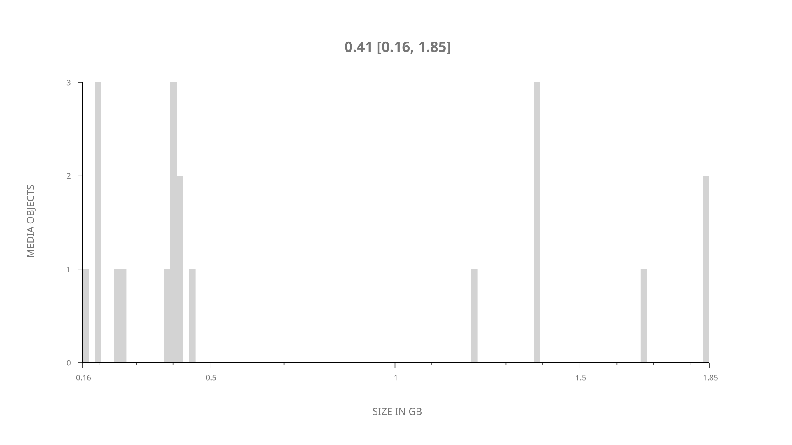
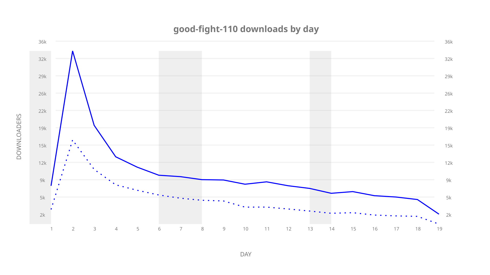
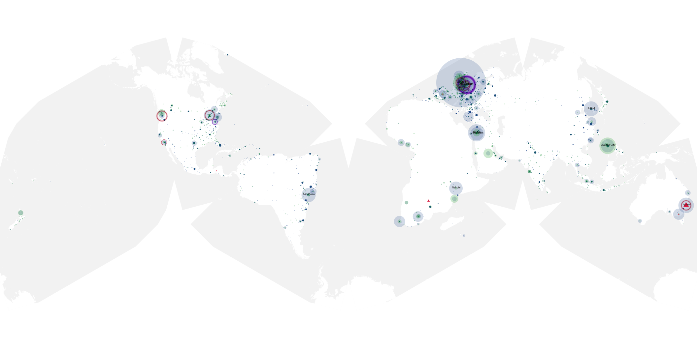
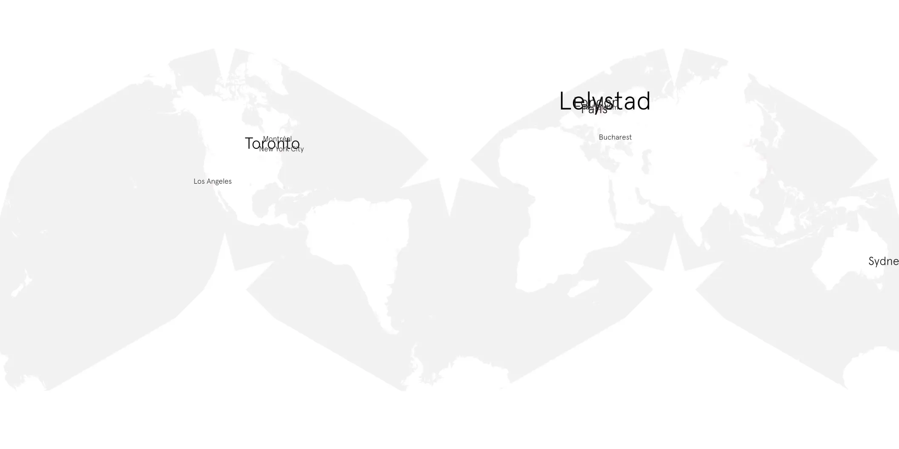
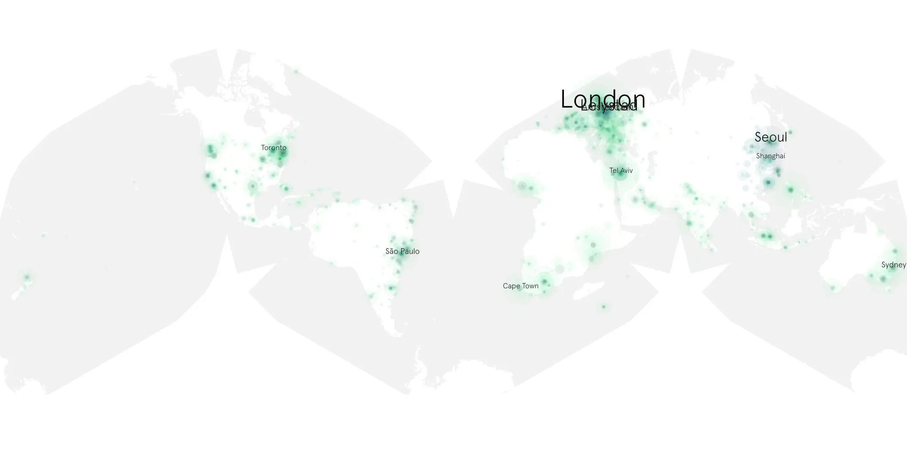

# good-fight-110 sample cache audit

## 1. Media object

| Field | Value |
| --- | --- |
| Media object | The Good Fight |
| Collection key | `good-fight-110` |
| imdb_id | [tt5853176](https://www.imdb.com/title/tt5853176/) |
| wikipedia_url | [The Good Fight](https://en.wikipedia.org/wiki/The_Good_Fight) |
| Sample dates | 2017-04-16-to-2017-05-05 |
| Sample days | 20 |
| BTIH count | 20 |
| Unique BTIH count | 20 |
| Downloaders total | 119,563 |
| Uploaders total | 68,506 |
| Data version | `2026-08-05` |
| IP geolocation version | `6:1777968300` |

## 2. Sample coverage report

- Generated: 2026-09-09T01:10:36Z
- Sample archive directory: `/mnt/gold/src/alpha60-samples-raw.gold/good-fight-110.xz`
- Hour directories: 104
- Zero-length sample files: 0
- Other unparsable sample files: 0
- Hourly discontinuities: 103 (336 missing hours)
- Missing days: 1

### Sample archive discontinuities

- hourly gap: last `2017-04-16 23:00`, resumed `2017-04-17 03:00` — missing 3 hour(s)
- hourly gap: last `2017-04-17 03:00`, resumed `2017-04-17 07:00` — missing 3 hour(s)
- hourly gap: last `2017-04-17 07:00`, resumed `2017-04-17 11:00` — missing 3 hour(s)
- hourly gap: last `2017-04-17 11:00`, resumed `2017-04-17 15:00` — missing 3 hour(s)
- hourly gap: last `2017-04-17 15:00`, resumed `2017-04-17 19:00` — missing 3 hour(s)
- hourly gap: last `2017-04-17 19:00`, resumed `2017-04-17 23:00` — missing 3 hour(s)
- hourly gap: last `2017-04-17 23:00`, resumed `2017-04-18 03:00` — missing 3 hour(s)
- hourly gap: last `2017-04-18 03:00`, resumed `2017-04-18 07:00` — missing 3 hour(s)
- hourly gap: last `2017-04-18 07:00`, resumed `2017-04-18 11:00` — missing 3 hour(s)
- hourly gap: last `2017-04-18 11:00`, resumed `2017-04-18 15:00` — missing 3 hour(s)
- hourly gap: last `2017-04-18 15:00`, resumed `2017-04-18 19:00` — missing 3 hour(s)
- hourly gap: last `2017-04-18 19:00`, resumed `2017-04-18 23:00` — missing 3 hour(s)
- hourly gap: last `2017-04-18 23:00`, resumed `2017-04-19 03:00` — missing 3 hour(s)
- hourly gap: last `2017-04-19 03:00`, resumed `2017-04-19 07:00` — missing 3 hour(s)
- hourly gap: last `2017-04-19 07:00`, resumed `2017-04-19 11:00` — missing 3 hour(s)
- hourly gap: last `2017-04-19 11:00`, resumed `2017-04-19 15:00` — missing 3 hour(s)
- hourly gap: last `2017-04-19 15:00`, resumed `2017-04-19 19:00` — missing 3 hour(s)
- hourly gap: last `2017-04-19 19:00`, resumed `2017-04-19 23:00` — missing 3 hour(s)
- hourly gap: last `2017-04-19 23:00`, resumed `2017-04-20 03:00` — missing 3 hour(s)
- hourly gap: last `2017-04-20 03:00`, resumed `2017-04-20 07:00` — missing 3 hour(s)
- hourly gap: last `2017-04-20 07:00`, resumed `2017-04-20 11:00` — missing 3 hour(s)
- hourly gap: last `2017-04-20 11:00`, resumed `2017-04-20 15:00` — missing 3 hour(s)
- hourly gap: last `2017-04-20 15:00`, resumed `2017-04-20 19:00` — missing 3 hour(s)
- hourly gap: last `2017-04-20 19:00`, resumed `2017-04-20 23:00` — missing 3 hour(s)
- hourly gap: last `2017-04-20 23:00`, resumed `2017-04-21 03:00` — missing 3 hour(s)
- hourly gap: last `2017-04-21 03:00`, resumed `2017-04-21 07:00` — missing 3 hour(s)
- hourly gap: last `2017-04-21 07:00`, resumed `2017-04-21 11:00` — missing 3 hour(s)
- hourly gap: last `2017-04-21 11:00`, resumed `2017-04-21 15:00` — missing 3 hour(s)
- hourly gap: last `2017-04-21 15:00`, resumed `2017-04-21 23:01` — missing 7 hour(s)
- hourly gap: last `2017-04-21 23:01`, resumed `2017-04-22 03:01` — missing 3 hour(s)
- hourly gap: last `2017-04-22 03:01`, resumed `2017-04-22 07:01` — missing 3 hour(s)
- hourly gap: last `2017-04-22 07:01`, resumed `2017-04-22 11:01` — missing 3 hour(s)
- hourly gap: last `2017-04-22 11:01`, resumed `2017-04-22 15:01` — missing 3 hour(s)
- hourly gap: last `2017-04-22 15:01`, resumed `2017-04-22 19:01` — missing 3 hour(s)
- hourly gap: last `2017-04-22 19:01`, resumed `2017-04-22 23:01` — missing 3 hour(s)
- hourly gap: last `2017-04-22 23:01`, resumed `2017-04-23 03:01` — missing 3 hour(s)
- hourly gap: last `2017-04-23 03:01`, resumed `2017-04-23 07:01` — missing 3 hour(s)
- hourly gap: last `2017-04-23 07:01`, resumed `2017-04-23 11:01` — missing 3 hour(s)
- hourly gap: last `2017-04-23 11:01`, resumed `2017-04-23 15:01` — missing 3 hour(s)
- hourly gap: last `2017-04-23 15:01`, resumed `2017-04-23 19:01` — missing 3 hour(s)
- hourly gap: last `2017-04-23 19:01`, resumed `2017-04-23 23:01` — missing 3 hour(s)
- hourly gap: last `2017-04-23 23:01`, resumed `2017-04-24 03:01` — missing 3 hour(s)
- hourly gap: last `2017-04-24 03:01`, resumed `2017-04-24 07:01` — missing 3 hour(s)
- hourly gap: last `2017-04-24 07:01`, resumed `2017-04-24 11:01` — missing 3 hour(s)
- hourly gap: last `2017-04-24 11:01`, resumed `2017-04-24 15:01` — missing 3 hour(s)
- hourly gap: last `2017-04-24 15:01`, resumed `2017-04-24 19:01` — missing 3 hour(s)
- hourly gap: last `2017-04-24 19:01`, resumed `2017-04-24 23:01` — missing 3 hour(s)
- hourly gap: last `2017-04-24 23:01`, resumed `2017-04-25 03:01` — missing 3 hour(s)
- hourly gap: last `2017-04-25 03:01`, resumed `2017-04-25 07:01` — missing 3 hour(s)
- hourly gap: last `2017-04-25 07:01`, resumed `2017-04-25 11:01` — missing 3 hour(s)
- hourly gap: last `2017-04-25 11:01`, resumed `2017-04-25 15:01` — missing 3 hour(s)
- hourly gap: last `2017-04-25 15:01`, resumed `2017-04-25 19:01` — missing 3 hour(s)
- hourly gap: last `2017-04-25 19:01`, resumed `2017-04-25 23:01` — missing 3 hour(s)
- hourly gap: last `2017-04-25 23:01`, resumed `2017-04-26 03:01` — missing 3 hour(s)
- hourly gap: last `2017-04-26 03:01`, resumed `2017-04-26 07:01` — missing 3 hour(s)
- hourly gap: last `2017-04-26 07:01`, resumed `2017-04-26 11:01` — missing 3 hour(s)
- hourly gap: last `2017-04-26 11:01`, resumed `2017-04-26 15:01` — missing 3 hour(s)
- hourly gap: last `2017-04-26 15:01`, resumed `2017-04-26 19:00` — missing 2 hour(s)
- hourly gap: last `2017-04-26 19:00`, resumed `2017-04-26 23:00` — missing 3 hour(s)
- hourly gap: last `2017-04-26 23:00`, resumed `2017-04-27 03:00` — missing 3 hour(s)
- hourly gap: last `2017-04-27 03:00`, resumed `2017-04-27 07:00` — missing 3 hour(s)
- hourly gap: last `2017-04-27 07:00`, resumed `2017-04-27 11:00` — missing 3 hour(s)
- hourly gap: last `2017-04-27 11:00`, resumed `2017-04-27 15:00` — missing 3 hour(s)
- hourly gap: last `2017-04-27 15:00`, resumed `2017-04-27 19:00` — missing 3 hour(s)
- hourly gap: last `2017-04-27 19:00`, resumed `2017-04-27 23:00` — missing 3 hour(s)
- hourly gap: last `2017-04-27 23:00`, resumed `2017-04-28 03:00` — missing 3 hour(s)
- hourly gap: last `2017-04-28 03:00`, resumed `2017-04-28 07:00` — missing 3 hour(s)
- hourly gap: last `2017-04-28 07:00`, resumed `2017-04-28 11:00` — missing 3 hour(s)
- hourly gap: last `2017-04-28 11:00`, resumed `2017-04-28 15:00` — missing 3 hour(s)
- hourly gap: last `2017-04-28 15:00`, resumed `2017-04-28 19:00` — missing 3 hour(s)
- hourly gap: last `2017-04-28 19:00`, resumed `2017-04-28 23:00` — missing 3 hour(s)
- hourly gap: last `2017-04-28 23:00`, resumed `2017-04-29 03:00` — missing 3 hour(s)
- hourly gap: last `2017-04-29 03:00`, resumed `2017-04-29 07:00` — missing 3 hour(s)
- hourly gap: last `2017-04-29 07:00`, resumed `2017-04-29 11:00` — missing 3 hour(s)
- hourly gap: last `2017-04-29 11:00`, resumed `2017-04-29 15:00` — missing 3 hour(s)
- hourly gap: last `2017-04-29 15:00`, resumed `2017-04-29 19:00` — missing 3 hour(s)
- hourly gap: last `2017-04-29 19:00`, resumed `2017-04-29 23:00` — missing 3 hour(s)
- hourly gap: last `2017-04-29 23:00`, resumed `2017-05-01 03:00` — missing 27 hour(s)
- hourly gap: last `2017-05-01 03:00`, resumed `2017-05-01 07:00` — missing 3 hour(s)
- hourly gap: last `2017-05-01 07:00`, resumed `2017-05-01 11:00` — missing 3 hour(s)
- hourly gap: last `2017-05-01 11:00`, resumed `2017-05-01 15:00` — missing 3 hour(s)
- hourly gap: last `2017-05-01 15:00`, resumed `2017-05-01 19:00` — missing 3 hour(s)
- hourly gap: last `2017-05-01 19:00`, resumed `2017-05-01 23:00` — missing 3 hour(s)
- hourly gap: last `2017-05-01 23:00`, resumed `2017-05-02 03:00` — missing 3 hour(s)
- hourly gap: last `2017-05-02 03:00`, resumed `2017-05-02 07:00` — missing 3 hour(s)
- hourly gap: last `2017-05-02 07:00`, resumed `2017-05-02 11:00` — missing 3 hour(s)
- hourly gap: last `2017-05-02 11:00`, resumed `2017-05-02 15:00` — missing 3 hour(s)
- hourly gap: last `2017-05-02 15:00`, resumed `2017-05-02 19:00` — missing 3 hour(s)
- hourly gap: last `2017-05-02 19:00`, resumed `2017-05-02 23:00` — missing 3 hour(s)
- hourly gap: last `2017-05-02 23:00`, resumed `2017-05-03 03:00` — missing 3 hour(s)
- hourly gap: last `2017-05-03 03:00`, resumed `2017-05-03 07:00` — missing 3 hour(s)
- hourly gap: last `2017-05-03 07:00`, resumed `2017-05-03 11:00` — missing 3 hour(s)
- hourly gap: last `2017-05-03 11:00`, resumed `2017-05-03 15:00` — missing 3 hour(s)
- hourly gap: last `2017-05-03 15:00`, resumed `2017-05-03 19:00` — missing 3 hour(s)
- hourly gap: last `2017-05-03 19:00`, resumed `2017-05-03 23:00` — missing 3 hour(s)
- hourly gap: last `2017-05-03 23:00`, resumed `2017-05-04 03:00` — missing 3 hour(s)
- hourly gap: last `2017-05-04 03:00`, resumed `2017-05-04 07:00` — missing 3 hour(s)
- hourly gap: last `2017-05-04 07:00`, resumed `2017-05-04 11:00` — missing 3 hour(s)
- hourly gap: last `2017-05-04 11:00`, resumed `2017-05-04 15:00` — missing 3 hour(s)
- hourly gap: last `2017-05-04 15:00`, resumed `2017-05-04 19:00` — missing 3 hour(s)
- hourly gap: last `2017-05-04 19:00`, resumed `2017-05-04 23:00` — missing 3 hour(s)
- hourly gap: last `2017-05-04 23:00`, resumed `2017-05-05 03:00` — missing 3 hour(s)
- hourly gap: last `2017-05-05 03:00`, resumed `2017-05-05 07:00` — missing 3 hour(s)
- missing day: `2017-04-30`

## 3. Media objects file size histogram

## 4. Visualization pass — graphs

### Downloads by week cumulative (normalized start)



### Downloads by day, Saturday and Sunday in gray

## 5. Visualization pass — maps

### Cumulative geographic slices

| Africa | Americas | Asia | Europe | Oceania | Unknown |
| --- | --- | --- | --- | --- | --- |
| 3.24 | 12.25 | 10.77 | 16.21 | 2.04 | 0.56 |

### Cumulative network infrastructure

{:target="_blank" rel="noopener"}

### Cumulative data maps

**Cumulative >= 1080p**

{:target="_blank" rel="noopener"}

**Cumulative < 1080p**

{:target="_blank" rel="noopener"}
