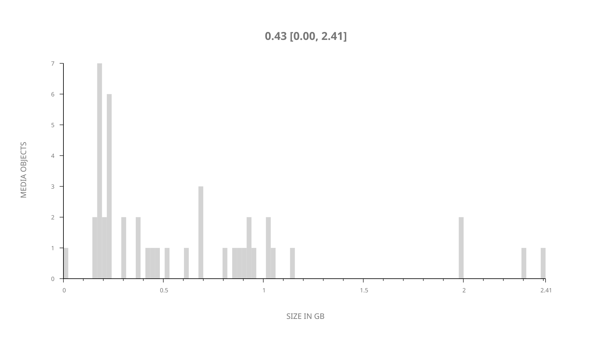
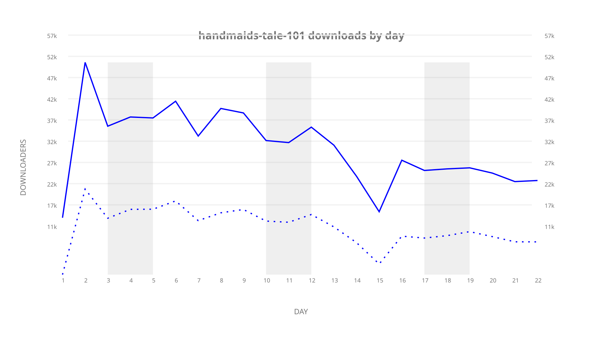
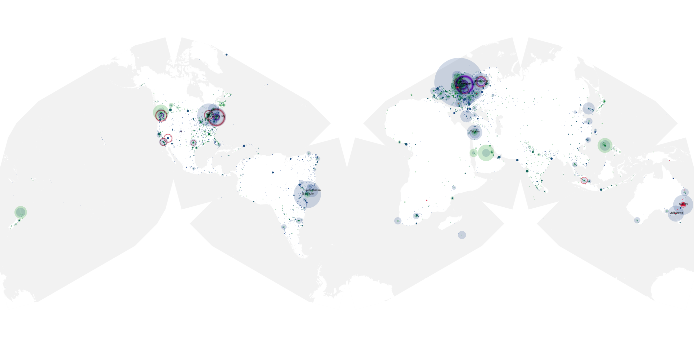
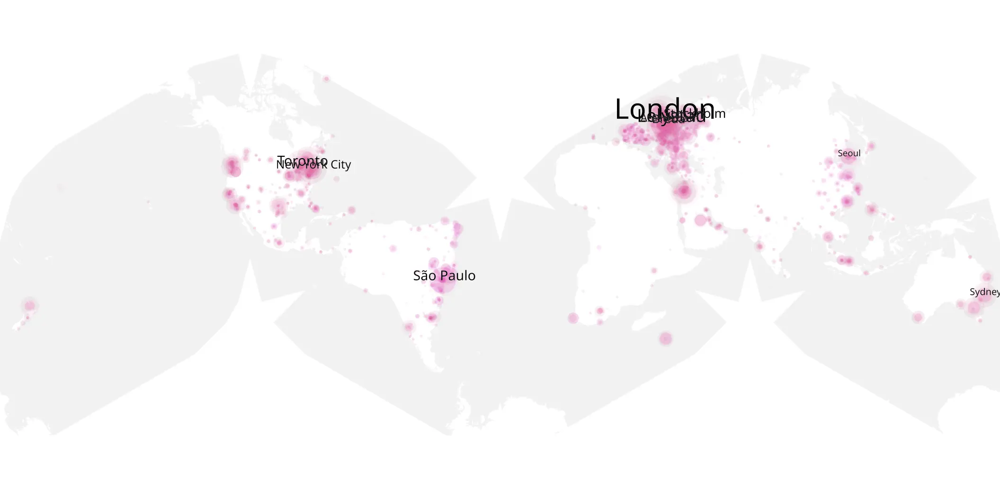
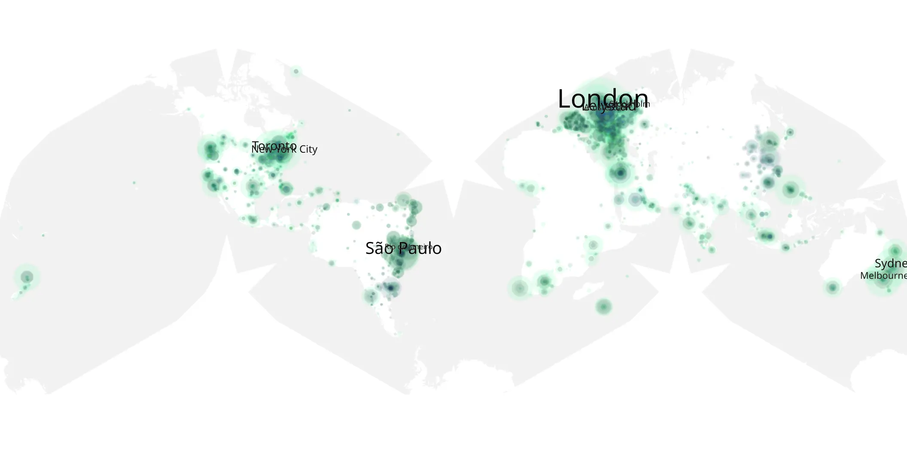

# handmaids-tale-101 sample cache audit

## 1. Media object

| Field | Value |
| --- | --- |
| Media object | The Handmaid's Tale |
| Collection key | `handmaids-tale-101` |
| imdb_id | [tt5834204](https://www.imdb.com/title/tt5834204/) |
| wikipedia_url | [The Handmaid's Tale (TV series)](https://en.wikipedia.org/wiki/The_Handmaid's_Tale_(TV_series)) |
| Sample dates | 2017-04-26-to-2017-05-17 |
| Sample days | 22 |
| BTIH count | 45 |
| Unique BTIH count | 45 |
| Downloaders total | 488,638 |
| Uploaders total | 280,481 |
| Data version | `2026-08-05` |
| IP geolocation version | `6:1777968300` |

## 2. Sample coverage report

- Generated: 2026-09-09T01:10:36Z
- Sample archive directory: `/mnt/gold/src/alpha60-samples-raw.gold/handmaids-tale-101.xz`
- Hour directories: 124
- Zero-length sample files: 0
- Other unparsable sample files: 0
- Hourly discontinuities: 123 (385 missing hours)
- Missing days: 0

### Sample archive discontinuities

- hourly gap: last `2017-04-26 17:00`, resumed `2017-04-26 21:00` — missing 3 hour(s)
- hourly gap: last `2017-04-26 21:00`, resumed `2017-04-27 01:00` — missing 3 hour(s)
- hourly gap: last `2017-04-27 01:00`, resumed `2017-04-27 05:00` — missing 3 hour(s)
- hourly gap: last `2017-04-27 05:00`, resumed `2017-04-27 09:00` — missing 3 hour(s)
- hourly gap: last `2017-04-27 09:00`, resumed `2017-04-27 13:00` — missing 3 hour(s)
- hourly gap: last `2017-04-27 13:00`, resumed `2017-04-27 17:00` — missing 3 hour(s)
- hourly gap: last `2017-04-27 17:00`, resumed `2017-04-27 21:00` — missing 3 hour(s)
- hourly gap: last `2017-04-27 21:00`, resumed `2017-04-28 01:00` — missing 3 hour(s)
- hourly gap: last `2017-04-28 01:00`, resumed `2017-04-28 05:00` — missing 3 hour(s)
- hourly gap: last `2017-04-28 05:00`, resumed `2017-04-28 09:00` — missing 3 hour(s)
- hourly gap: last `2017-04-28 09:00`, resumed `2017-04-28 13:00` — missing 3 hour(s)
- hourly gap: last `2017-04-28 13:00`, resumed `2017-04-28 17:00` — missing 3 hour(s)
- hourly gap: last `2017-04-28 17:00`, resumed `2017-04-28 21:00` — missing 3 hour(s)
- hourly gap: last `2017-04-28 21:00`, resumed `2017-04-29 01:00` — missing 3 hour(s)
- hourly gap: last `2017-04-29 01:00`, resumed `2017-04-29 05:00` — missing 3 hour(s)
- hourly gap: last `2017-04-29 05:00`, resumed `2017-04-29 09:00` — missing 3 hour(s)
- hourly gap: last `2017-04-29 09:00`, resumed `2017-04-29 13:00` — missing 3 hour(s)
- hourly gap: last `2017-04-29 13:00`, resumed `2017-04-29 17:00` — missing 3 hour(s)
- hourly gap: last `2017-04-29 17:00`, resumed `2017-04-29 21:00` — missing 3 hour(s)
- hourly gap: last `2017-04-29 21:00`, resumed `2017-04-30 01:00` — missing 3 hour(s)
- hourly gap: last `2017-04-30 01:00`, resumed `2017-04-30 05:00` — missing 3 hour(s)
- hourly gap: last `2017-04-30 05:00`, resumed `2017-04-30 09:00` — missing 3 hour(s)
- hourly gap: last `2017-04-30 09:00`, resumed `2017-04-30 13:00` — missing 3 hour(s)
- hourly gap: last `2017-04-30 13:00`, resumed `2017-04-30 17:00` — missing 3 hour(s)
- hourly gap: last `2017-04-30 17:00`, resumed `2017-04-30 21:00` — missing 3 hour(s)
- hourly gap: last `2017-04-30 21:00`, resumed `2017-05-01 01:00` — missing 3 hour(s)
- hourly gap: last `2017-05-01 01:00`, resumed `2017-05-01 05:00` — missing 3 hour(s)
- hourly gap: last `2017-05-01 05:00`, resumed `2017-05-01 09:00` — missing 3 hour(s)
- hourly gap: last `2017-05-01 09:00`, resumed `2017-05-01 13:00` — missing 3 hour(s)
- hourly gap: last `2017-05-01 13:00`, resumed `2017-05-01 17:00` — missing 3 hour(s)
- hourly gap: last `2017-05-01 17:00`, resumed `2017-05-01 21:00` — missing 3 hour(s)
- hourly gap: last `2017-05-01 21:00`, resumed `2017-05-02 01:00` — missing 3 hour(s)
- hourly gap: last `2017-05-02 01:00`, resumed `2017-05-02 05:00` — missing 3 hour(s)
- hourly gap: last `2017-05-02 05:00`, resumed `2017-05-02 09:00` — missing 3 hour(s)
- hourly gap: last `2017-05-02 09:00`, resumed `2017-05-02 13:00` — missing 3 hour(s)
- hourly gap: last `2017-05-02 13:00`, resumed `2017-05-02 17:00` — missing 3 hour(s)
- hourly gap: last `2017-05-02 17:00`, resumed `2017-05-02 21:00` — missing 3 hour(s)
- hourly gap: last `2017-05-02 21:00`, resumed `2017-05-03 01:00` — missing 3 hour(s)
- hourly gap: last `2017-05-03 01:00`, resumed `2017-05-03 05:00` — missing 3 hour(s)
- hourly gap: last `2017-05-03 05:00`, resumed `2017-05-03 09:00` — missing 3 hour(s)
- hourly gap: last `2017-05-03 09:00`, resumed `2017-05-03 13:00` — missing 3 hour(s)
- hourly gap: last `2017-05-03 13:00`, resumed `2017-05-03 17:00` — missing 3 hour(s)
- hourly gap: last `2017-05-03 17:00`, resumed `2017-05-03 21:00` — missing 3 hour(s)
- hourly gap: last `2017-05-03 21:00`, resumed `2017-05-04 01:00` — missing 3 hour(s)
- hourly gap: last `2017-05-04 01:00`, resumed `2017-05-04 05:00` — missing 3 hour(s)
- hourly gap: last `2017-05-04 05:00`, resumed `2017-05-04 09:00` — missing 3 hour(s)
- hourly gap: last `2017-05-04 09:00`, resumed `2017-05-04 13:00` — missing 3 hour(s)
- hourly gap: last `2017-05-04 13:00`, resumed `2017-05-04 17:00` — missing 3 hour(s)
- hourly gap: last `2017-05-04 17:00`, resumed `2017-05-04 21:00` — missing 3 hour(s)
- hourly gap: last `2017-05-04 21:00`, resumed `2017-05-05 01:00` — missing 3 hour(s)
- hourly gap: last `2017-05-05 01:00`, resumed `2017-05-05 05:00` — missing 3 hour(s)
- hourly gap: last `2017-05-05 05:00`, resumed `2017-05-05 09:00` — missing 3 hour(s)
- hourly gap: last `2017-05-05 09:00`, resumed `2017-05-05 13:00` — missing 3 hour(s)
- hourly gap: last `2017-05-05 13:00`, resumed `2017-05-05 17:00` — missing 3 hour(s)
- hourly gap: last `2017-05-05 17:00`, resumed `2017-05-05 21:00` — missing 3 hour(s)
- hourly gap: last `2017-05-05 21:00`, resumed `2017-05-06 01:00` — missing 3 hour(s)
- hourly gap: last `2017-05-06 01:00`, resumed `2017-05-06 05:00` — missing 3 hour(s)
- hourly gap: last `2017-05-06 05:00`, resumed `2017-05-06 09:00` — missing 3 hour(s)
- hourly gap: last `2017-05-06 09:00`, resumed `2017-05-06 13:00` — missing 3 hour(s)
- hourly gap: last `2017-05-06 13:00`, resumed `2017-05-06 17:00` — missing 3 hour(s)
- hourly gap: last `2017-05-06 17:00`, resumed `2017-05-06 21:00` — missing 3 hour(s)
- hourly gap: last `2017-05-06 21:00`, resumed `2017-05-07 01:00` — missing 3 hour(s)
- hourly gap: last `2017-05-07 01:00`, resumed `2017-05-07 05:00` — missing 3 hour(s)
- hourly gap: last `2017-05-07 05:00`, resumed `2017-05-07 09:00` — missing 3 hour(s)
- hourly gap: last `2017-05-07 09:00`, resumed `2017-05-07 13:00` — missing 3 hour(s)
- hourly gap: last `2017-05-07 13:00`, resumed `2017-05-07 17:00` — missing 3 hour(s)
- hourly gap: last `2017-05-07 17:00`, resumed `2017-05-07 21:00` — missing 3 hour(s)
- hourly gap: last `2017-05-07 21:00`, resumed `2017-05-08 01:00` — missing 3 hour(s)
- hourly gap: last `2017-05-08 01:00`, resumed `2017-05-08 05:00` — missing 3 hour(s)
- hourly gap: last `2017-05-08 05:00`, resumed `2017-05-08 09:00` — missing 3 hour(s)
- hourly gap: last `2017-05-08 09:00`, resumed `2017-05-08 13:00` — missing 3 hour(s)
- hourly gap: last `2017-05-08 13:00`, resumed `2017-05-08 17:00` — missing 3 hour(s)
- hourly gap: last `2017-05-08 17:00`, resumed `2017-05-08 21:00` — missing 3 hour(s)
- hourly gap: last `2017-05-08 21:00`, resumed `2017-05-09 01:00` — missing 3 hour(s)
- hourly gap: last `2017-05-09 01:00`, resumed `2017-05-09 05:00` — missing 3 hour(s)
- hourly gap: last `2017-05-09 05:00`, resumed `2017-05-09 09:00` — missing 3 hour(s)
- hourly gap: last `2017-05-09 09:00`, resumed `2017-05-09 13:00` — missing 3 hour(s)
- hourly gap: last `2017-05-09 13:00`, resumed `2017-05-09 17:00` — missing 3 hour(s)
- hourly gap: last `2017-05-09 17:00`, resumed `2017-05-10 13:00` — missing 19 hour(s)
- hourly gap: last `2017-05-10 13:00`, resumed `2017-05-10 17:00` — missing 3 hour(s)
- hourly gap: last `2017-05-10 17:00`, resumed `2017-05-10 21:00` — missing 3 hour(s)
- hourly gap: last `2017-05-10 21:00`, resumed `2017-05-11 01:00` — missing 3 hour(s)
- hourly gap: last `2017-05-11 01:00`, resumed `2017-05-11 05:00` — missing 3 hour(s)
- hourly gap: last `2017-05-11 05:00`, resumed `2017-05-11 09:00` — missing 3 hour(s)
- hourly gap: last `2017-05-11 09:00`, resumed `2017-05-11 13:00` — missing 3 hour(s)
- hourly gap: last `2017-05-11 13:00`, resumed `2017-05-11 17:00` — missing 3 hour(s)
- hourly gap: last `2017-05-11 17:00`, resumed `2017-05-11 21:00` — missing 3 hour(s)
- hourly gap: last `2017-05-11 21:00`, resumed `2017-05-12 01:00` — missing 3 hour(s)
- hourly gap: last `2017-05-12 01:00`, resumed `2017-05-12 05:00` — missing 3 hour(s)
- hourly gap: last `2017-05-12 05:00`, resumed `2017-05-12 09:00` — missing 3 hour(s)
- hourly gap: last `2017-05-12 09:00`, resumed `2017-05-12 13:00` — missing 3 hour(s)
- hourly gap: last `2017-05-12 13:00`, resumed `2017-05-12 17:00` — missing 3 hour(s)
- hourly gap: last `2017-05-12 17:00`, resumed `2017-05-12 21:00` — missing 3 hour(s)
- hourly gap: last `2017-05-12 21:00`, resumed `2017-05-13 01:00` — missing 3 hour(s)
- hourly gap: last `2017-05-13 01:00`, resumed `2017-05-13 05:00` — missing 3 hour(s)
- hourly gap: last `2017-05-13 05:00`, resumed `2017-05-13 09:00` — missing 3 hour(s)
- hourly gap: last `2017-05-13 09:00`, resumed `2017-05-13 13:00` — missing 3 hour(s)
- hourly gap: last `2017-05-13 13:00`, resumed `2017-05-13 17:00` — missing 3 hour(s)
- hourly gap: last `2017-05-13 17:00`, resumed `2017-05-13 21:00` — missing 3 hour(s)
- hourly gap: last `2017-05-13 21:00`, resumed `2017-05-14 01:00` — missing 3 hour(s)
- hourly gap: last `2017-05-14 01:00`, resumed `2017-05-14 05:00` — missing 3 hour(s)
- hourly gap: last `2017-05-14 05:00`, resumed `2017-05-14 09:00` — missing 3 hour(s)
- hourly gap: last `2017-05-14 09:00`, resumed `2017-05-14 13:00` — missing 3 hour(s)
- hourly gap: last `2017-05-14 13:00`, resumed `2017-05-14 17:00` — missing 3 hour(s)
- hourly gap: last `2017-05-14 17:00`, resumed `2017-05-14 21:00` — missing 3 hour(s)
- hourly gap: last `2017-05-14 21:00`, resumed `2017-05-15 01:00` — missing 3 hour(s)
- hourly gap: last `2017-05-15 01:00`, resumed `2017-05-15 05:00` — missing 3 hour(s)
- hourly gap: last `2017-05-15 05:00`, resumed `2017-05-15 09:00` — missing 3 hour(s)
- hourly gap: last `2017-05-15 09:00`, resumed `2017-05-15 13:00` — missing 3 hour(s)
- hourly gap: last `2017-05-15 13:00`, resumed `2017-05-15 17:00` — missing 3 hour(s)
- hourly gap: last `2017-05-15 17:00`, resumed `2017-05-15 21:00` — missing 3 hour(s)
- hourly gap: last `2017-05-15 21:00`, resumed `2017-05-16 01:00` — missing 3 hour(s)
- hourly gap: last `2017-05-16 01:00`, resumed `2017-05-16 05:00` — missing 3 hour(s)
- hourly gap: last `2017-05-16 05:00`, resumed `2017-05-16 09:00` — missing 3 hour(s)
- hourly gap: last `2017-05-16 09:00`, resumed `2017-05-16 13:00` — missing 3 hour(s)
- hourly gap: last `2017-05-16 13:00`, resumed `2017-05-16 17:00` — missing 3 hour(s)
- hourly gap: last `2017-05-16 17:00`, resumed `2017-05-16 21:00` — missing 3 hour(s)
- hourly gap: last `2017-05-16 21:00`, resumed `2017-05-17 01:00` — missing 3 hour(s)
- hourly gap: last `2017-05-17 01:00`, resumed `2017-05-17 05:00` — missing 3 hour(s)
- hourly gap: last `2017-05-17 05:00`, resumed `2017-05-17 09:00` — missing 3 hour(s)
- hourly gap: last `2017-05-17 09:00`, resumed `2017-05-17 13:00` — missing 3 hour(s)
- hourly gap: last `2017-05-17 13:00`, resumed `2017-05-17 17:00` — missing 3 hour(s)
- hourly gap: last `2017-05-17 17:00`, resumed `2017-05-17 21:00` — missing 3 hour(s)

## 3. Media objects file size histogram

## 4. Visualization pass — graphs

### Downloads by week cumulative (normalized start)



### Downloads by day, Saturday and Sunday in gray

## 5. Visualization pass — maps

### Cumulative geographic slices

| Africa | Americas | Asia | Europe | Oceania | Unknown |
| --- | --- | --- | --- | --- | --- |
| 3.14 | 30.83 | 13.46 | 32.48 | 4.75 | 0.47 |

### Cumulative network infrastructure

{:target="_blank" rel="noopener"}

### Cumulative data maps

**Cumulative >= 1080p**

{:target="_blank" rel="noopener"}

**Cumulative < 1080p**

{:target="_blank" rel="noopener"}
