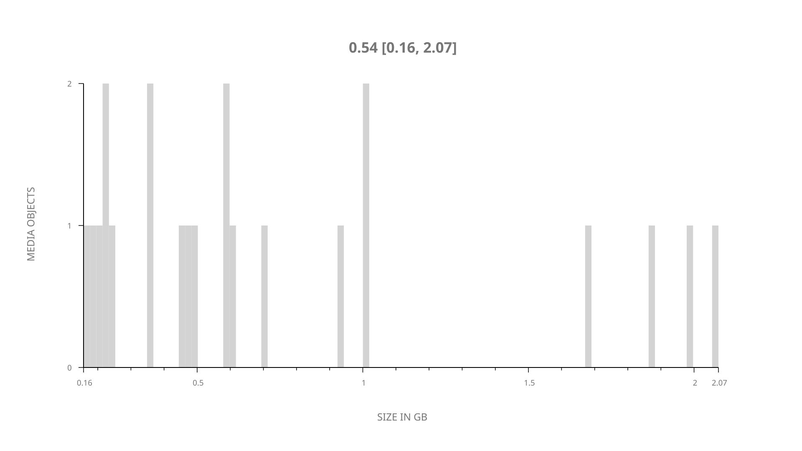
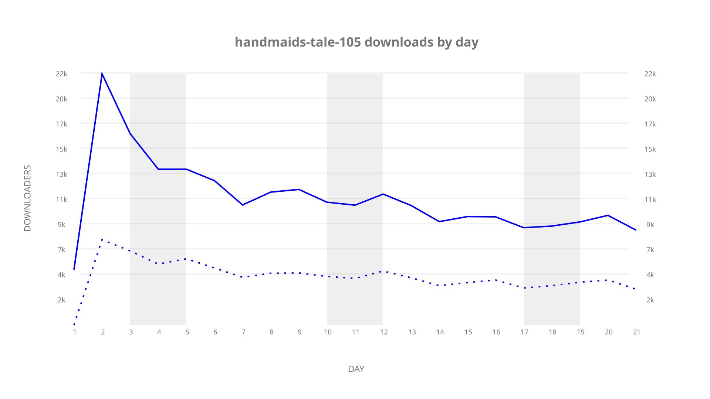
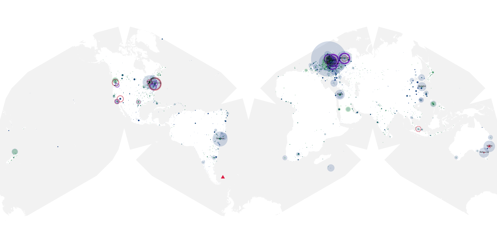
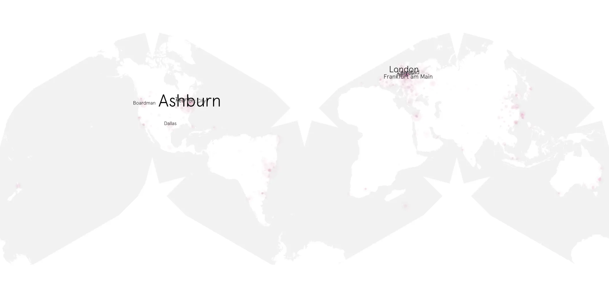
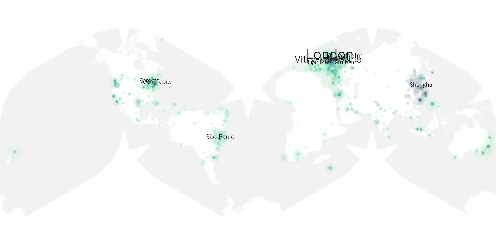

# handmaids-tale-105 sample cache audit

## 1. Media object

| Field | Value |
| --- | --- |
| Media object | The Handmaid's Tale |
| Collection key | `handmaids-tale-105` |
| imdb_id | [tt5834204](https://www.imdb.com/title/tt5834204/) |
| wikipedia_url | [The Handmaid's Tale (TV series)](https://en.wikipedia.org/wiki/The_Handmaid's_Tale_(TV_series)) |
| Sample dates | 2017-05-10-to-2017-05-30 |
| Sample days | 21 |
| BTIH count | 22 |
| Unique BTIH count | 22 |
| Downloaders total | 148,437 |
| Uploaders total | 73,356 |
| Data version | `2026-08-05` |
| IP geolocation version | `6:1777968300` |

## 2. Sample coverage report

- Generated: 2026-09-09T01:10:36Z
- Sample archive directory: `/mnt/gold/src/alpha60-samples-raw.gold/handmaids-tale-105.xz`
- Hour directories: 122
- Zero-length sample files: 0
- Other unparsable sample files: 0
- Hourly discontinuities: 121 (362 missing hours)
- Missing days: 0

### Sample archive discontinuities

- hourly gap: last `2017-05-10 16:00`, resumed `2017-05-10 20:00` — missing 3 hour(s)
- hourly gap: last `2017-05-10 20:00`, resumed `2017-05-11 00:00` — missing 3 hour(s)
- hourly gap: last `2017-05-11 00:00`, resumed `2017-05-11 04:00` — missing 3 hour(s)
- hourly gap: last `2017-05-11 04:00`, resumed `2017-05-11 08:00` — missing 3 hour(s)
- hourly gap: last `2017-05-11 08:00`, resumed `2017-05-11 12:00` — missing 3 hour(s)
- hourly gap: last `2017-05-11 12:00`, resumed `2017-05-11 16:00` — missing 3 hour(s)
- hourly gap: last `2017-05-11 16:00`, resumed `2017-05-11 20:00` — missing 3 hour(s)
- hourly gap: last `2017-05-11 20:00`, resumed `2017-05-12 00:00` — missing 3 hour(s)
- hourly gap: last `2017-05-12 00:00`, resumed `2017-05-12 04:00` — missing 3 hour(s)
- hourly gap: last `2017-05-12 04:00`, resumed `2017-05-12 08:00` — missing 3 hour(s)
- hourly gap: last `2017-05-12 08:00`, resumed `2017-05-12 12:00` — missing 3 hour(s)
- hourly gap: last `2017-05-12 12:00`, resumed `2017-05-12 16:00` — missing 3 hour(s)
- hourly gap: last `2017-05-12 16:00`, resumed `2017-05-12 20:00` — missing 3 hour(s)
- hourly gap: last `2017-05-12 20:00`, resumed `2017-05-13 00:00` — missing 3 hour(s)
- hourly gap: last `2017-05-13 00:00`, resumed `2017-05-13 04:00` — missing 3 hour(s)
- hourly gap: last `2017-05-13 04:00`, resumed `2017-05-13 08:00` — missing 3 hour(s)
- hourly gap: last `2017-05-13 08:00`, resumed `2017-05-13 12:00` — missing 3 hour(s)
- hourly gap: last `2017-05-13 12:00`, resumed `2017-05-13 16:00` — missing 3 hour(s)
- hourly gap: last `2017-05-13 16:00`, resumed `2017-05-13 20:00` — missing 3 hour(s)
- hourly gap: last `2017-05-13 20:00`, resumed `2017-05-14 00:00` — missing 3 hour(s)
- hourly gap: last `2017-05-14 00:00`, resumed `2017-05-14 04:00` — missing 3 hour(s)
- hourly gap: last `2017-05-14 04:00`, resumed `2017-05-14 08:00` — missing 3 hour(s)
- hourly gap: last `2017-05-14 08:00`, resumed `2017-05-14 12:00` — missing 3 hour(s)
- hourly gap: last `2017-05-14 12:00`, resumed `2017-05-14 16:00` — missing 3 hour(s)
- hourly gap: last `2017-05-14 16:00`, resumed `2017-05-14 20:00` — missing 3 hour(s)
- hourly gap: last `2017-05-14 20:00`, resumed `2017-05-15 00:00` — missing 3 hour(s)
- hourly gap: last `2017-05-15 00:00`, resumed `2017-05-15 04:00` — missing 3 hour(s)
- hourly gap: last `2017-05-15 04:00`, resumed `2017-05-15 08:00` — missing 3 hour(s)
- hourly gap: last `2017-05-15 08:00`, resumed `2017-05-15 12:00` — missing 3 hour(s)
- hourly gap: last `2017-05-15 12:00`, resumed `2017-05-15 16:00` — missing 3 hour(s)
- hourly gap: last `2017-05-15 16:00`, resumed `2017-05-15 20:00` — missing 3 hour(s)
- hourly gap: last `2017-05-15 20:00`, resumed `2017-05-16 00:00` — missing 3 hour(s)
- hourly gap: last `2017-05-16 00:00`, resumed `2017-05-16 04:00` — missing 3 hour(s)
- hourly gap: last `2017-05-16 04:00`, resumed `2017-05-16 08:00` — missing 3 hour(s)
- hourly gap: last `2017-05-16 08:00`, resumed `2017-05-16 12:00` — missing 3 hour(s)
- hourly gap: last `2017-05-16 12:00`, resumed `2017-05-16 16:00` — missing 3 hour(s)
- hourly gap: last `2017-05-16 16:00`, resumed `2017-05-16 20:00` — missing 3 hour(s)
- hourly gap: last `2017-05-16 20:00`, resumed `2017-05-17 00:00` — missing 3 hour(s)
- hourly gap: last `2017-05-17 00:00`, resumed `2017-05-17 04:00` — missing 3 hour(s)
- hourly gap: last `2017-05-17 04:00`, resumed `2017-05-17 08:00` — missing 3 hour(s)
- hourly gap: last `2017-05-17 08:00`, resumed `2017-05-17 12:00` — missing 3 hour(s)
- hourly gap: last `2017-05-17 12:00`, resumed `2017-05-17 16:00` — missing 3 hour(s)
- hourly gap: last `2017-05-17 16:00`, resumed `2017-05-17 20:00` — missing 3 hour(s)
- hourly gap: last `2017-05-17 20:00`, resumed `2017-05-18 00:00` — missing 3 hour(s)
- hourly gap: last `2017-05-18 00:00`, resumed `2017-05-18 04:00` — missing 3 hour(s)
- hourly gap: last `2017-05-18 04:00`, resumed `2017-05-18 08:03` — missing 3 hour(s)
- hourly gap: last `2017-05-18 08:03`, resumed `2017-05-18 12:03` — missing 3 hour(s)
- hourly gap: last `2017-05-18 12:03`, resumed `2017-05-18 16:03` — missing 3 hour(s)
- hourly gap: last `2017-05-18 16:03`, resumed `2017-05-18 20:03` — missing 3 hour(s)
- hourly gap: last `2017-05-18 20:03`, resumed `2017-05-19 00:03` — missing 3 hour(s)
- hourly gap: last `2017-05-19 00:03`, resumed `2017-05-19 04:03` — missing 3 hour(s)
- hourly gap: last `2017-05-19 04:03`, resumed `2017-05-19 08:03` — missing 3 hour(s)
- hourly gap: last `2017-05-19 08:03`, resumed `2017-05-19 12:03` — missing 3 hour(s)
- hourly gap: last `2017-05-19 12:03`, resumed `2017-05-19 16:03` — missing 3 hour(s)
- hourly gap: last `2017-05-19 16:03`, resumed `2017-05-19 20:03` — missing 3 hour(s)
- hourly gap: last `2017-05-19 20:03`, resumed `2017-05-20 00:03` — missing 3 hour(s)
- hourly gap: last `2017-05-20 00:03`, resumed `2017-05-20 04:03` — missing 3 hour(s)
- hourly gap: last `2017-05-20 04:03`, resumed `2017-05-20 08:03` — missing 3 hour(s)
- hourly gap: last `2017-05-20 08:03`, resumed `2017-05-20 12:03` — missing 3 hour(s)
- hourly gap: last `2017-05-20 12:03`, resumed `2017-05-20 16:03` — missing 3 hour(s)
- hourly gap: last `2017-05-20 16:03`, resumed `2017-05-20 20:03` — missing 3 hour(s)
- hourly gap: last `2017-05-20 20:03`, resumed `2017-05-21 00:03` — missing 3 hour(s)
- hourly gap: last `2017-05-21 00:03`, resumed `2017-05-21 04:03` — missing 3 hour(s)
- hourly gap: last `2017-05-21 04:03`, resumed `2017-05-21 08:03` — missing 3 hour(s)
- hourly gap: last `2017-05-21 08:03`, resumed `2017-05-21 12:03` — missing 3 hour(s)
- hourly gap: last `2017-05-21 12:03`, resumed `2017-05-21 16:03` — missing 3 hour(s)
- hourly gap: last `2017-05-21 16:03`, resumed `2017-05-21 20:03` — missing 3 hour(s)
- hourly gap: last `2017-05-21 20:03`, resumed `2017-05-22 00:03` — missing 3 hour(s)
- hourly gap: last `2017-05-22 00:03`, resumed `2017-05-22 04:03` — missing 3 hour(s)
- hourly gap: last `2017-05-22 04:03`, resumed `2017-05-22 08:03` — missing 3 hour(s)
- hourly gap: last `2017-05-22 08:03`, resumed `2017-05-22 12:03` — missing 3 hour(s)
- hourly gap: last `2017-05-22 12:03`, resumed `2017-05-22 16:03` — missing 3 hour(s)
- hourly gap: last `2017-05-22 16:03`, resumed `2017-05-22 20:03` — missing 3 hour(s)
- hourly gap: last `2017-05-22 20:03`, resumed `2017-05-23 00:03` — missing 3 hour(s)
- hourly gap: last `2017-05-23 00:03`, resumed `2017-05-23 04:03` — missing 3 hour(s)
- hourly gap: last `2017-05-23 04:03`, resumed `2017-05-23 08:03` — missing 3 hour(s)
- hourly gap: last `2017-05-23 08:03`, resumed `2017-05-23 12:03` — missing 3 hour(s)
- hourly gap: last `2017-05-23 12:03`, resumed `2017-05-23 16:03` — missing 3 hour(s)
- hourly gap: last `2017-05-23 16:03`, resumed `2017-05-23 20:03` — missing 3 hour(s)
- hourly gap: last `2017-05-23 20:03`, resumed `2017-05-24 00:03` — missing 3 hour(s)
- hourly gap: last `2017-05-24 00:03`, resumed `2017-05-24 04:03` — missing 3 hour(s)
- hourly gap: last `2017-05-24 04:03`, resumed `2017-05-24 08:03` — missing 3 hour(s)
- hourly gap: last `2017-05-24 08:03`, resumed `2017-05-24 12:03` — missing 3 hour(s)
- hourly gap: last `2017-05-24 12:03`, resumed `2017-05-24 16:03` — missing 3 hour(s)
- hourly gap: last `2017-05-24 16:03`, resumed `2017-05-24 20:03` — missing 3 hour(s)
- hourly gap: last `2017-05-24 20:03`, resumed `2017-05-25 00:03` — missing 3 hour(s)
- hourly gap: last `2017-05-25 00:03`, resumed `2017-05-25 04:03` — missing 3 hour(s)
- hourly gap: last `2017-05-25 04:03`, resumed `2017-05-25 08:03` — missing 3 hour(s)
- hourly gap: last `2017-05-25 08:03`, resumed `2017-05-25 12:03` — missing 3 hour(s)
- hourly gap: last `2017-05-25 12:03`, resumed `2017-05-25 16:03` — missing 3 hour(s)
- hourly gap: last `2017-05-25 16:03`, resumed `2017-05-25 20:03` — missing 3 hour(s)
- hourly gap: last `2017-05-25 20:03`, resumed `2017-05-26 00:03` — missing 3 hour(s)
- hourly gap: last `2017-05-26 00:03`, resumed `2017-05-26 04:03` — missing 3 hour(s)
- hourly gap: last `2017-05-26 04:03`, resumed `2017-05-26 08:03` — missing 3 hour(s)
- hourly gap: last `2017-05-26 08:03`, resumed `2017-05-26 12:03` — missing 3 hour(s)
- hourly gap: last `2017-05-26 12:03`, resumed `2017-05-26 16:03` — missing 3 hour(s)
- hourly gap: last `2017-05-26 16:03`, resumed `2017-05-26 20:03` — missing 3 hour(s)
- hourly gap: last `2017-05-26 20:03`, resumed `2017-05-27 00:03` — missing 3 hour(s)
- hourly gap: last `2017-05-27 00:03`, resumed `2017-05-27 04:03` — missing 3 hour(s)
- hourly gap: last `2017-05-27 04:03`, resumed `2017-05-27 08:03` — missing 3 hour(s)
- hourly gap: last `2017-05-27 08:03`, resumed `2017-05-27 12:03` — missing 3 hour(s)
- hourly gap: last `2017-05-27 12:03`, resumed `2017-05-27 16:03` — missing 3 hour(s)
- hourly gap: last `2017-05-27 16:03`, resumed `2017-05-27 20:03` — missing 3 hour(s)
- hourly gap: last `2017-05-27 20:03`, resumed `2017-05-28 00:03` — missing 3 hour(s)
- hourly gap: last `2017-05-28 00:03`, resumed `2017-05-28 04:03` — missing 3 hour(s)
- hourly gap: last `2017-05-28 04:03`, resumed `2017-05-28 08:03` — missing 3 hour(s)
- hourly gap: last `2017-05-28 08:03`, resumed `2017-05-28 12:03` — missing 3 hour(s)
- hourly gap: last `2017-05-28 12:03`, resumed `2017-05-28 16:03` — missing 3 hour(s)
- hourly gap: last `2017-05-28 16:03`, resumed `2017-05-28 20:03` — missing 3 hour(s)
- hourly gap: last `2017-05-28 20:03`, resumed `2017-05-29 00:03` — missing 3 hour(s)
- hourly gap: last `2017-05-29 00:03`, resumed `2017-05-29 04:03` — missing 3 hour(s)
- hourly gap: last `2017-05-29 04:03`, resumed `2017-05-29 08:03` — missing 3 hour(s)
- hourly gap: last `2017-05-29 08:03`, resumed `2017-05-29 12:03` — missing 3 hour(s)
- hourly gap: last `2017-05-29 12:03`, resumed `2017-05-29 16:03` — missing 3 hour(s)
- hourly gap: last `2017-05-29 16:03`, resumed `2017-05-29 20:03` — missing 3 hour(s)
- hourly gap: last `2017-05-29 20:03`, resumed `2017-05-30 00:03` — missing 3 hour(s)
- hourly gap: last `2017-05-30 00:03`, resumed `2017-05-30 04:03` — missing 3 hour(s)
- hourly gap: last `2017-05-30 04:03`, resumed `2017-05-30 08:00` — missing 2 hour(s)
- hourly gap: last `2017-05-30 08:00`, resumed `2017-05-30 12:00` — missing 3 hour(s)
- hourly gap: last `2017-05-30 12:00`, resumed `2017-05-30 16:00` — missing 3 hour(s)
- hourly gap: last `2017-05-30 16:00`, resumed `2017-05-30 20:00` — missing 3 hour(s)

## 3. Media objects file size histogram

## 4. Visualization pass — graphs

### Downloads by week cumulative (normalized start)



### Downloads by day, Saturday and Sunday in gray

## 5. Visualization pass — maps

### Cumulative geographic slices

| Africa | Americas | Asia | Europe | Oceania | Unknown |
| --- | --- | --- | --- | --- | --- |
| 3.15 | 20.86 | 13.19 | 28.65 | 3.11 | 1.28 |

### Cumulative network infrastructure

{:target="_blank" rel="noopener"}

### Cumulative data maps

**Cumulative >= 1080p**

{:target="_blank" rel="noopener"}

**Cumulative < 1080p**

{:target="_blank" rel="noopener"}
