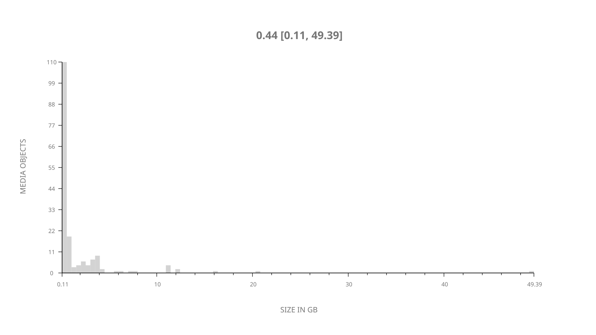
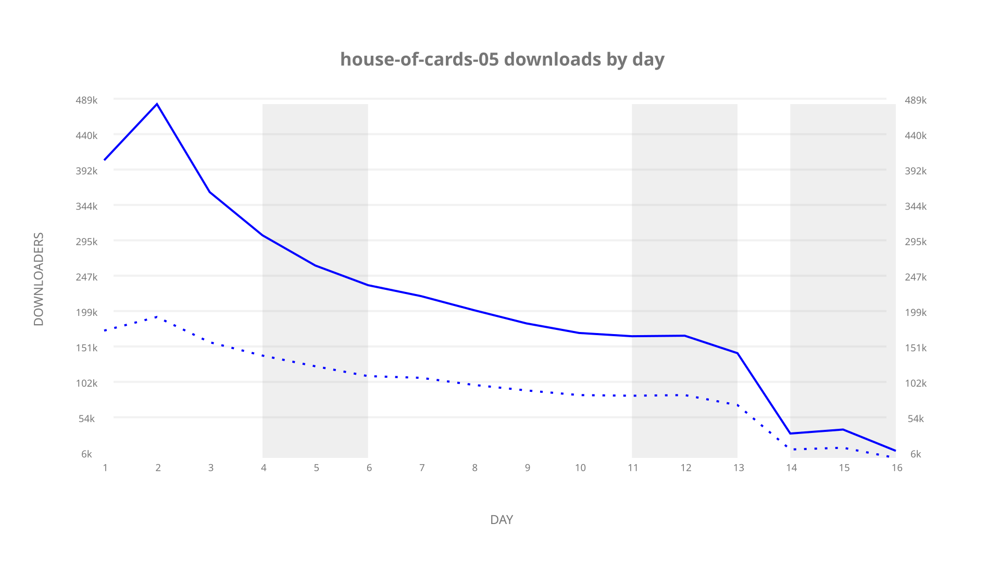
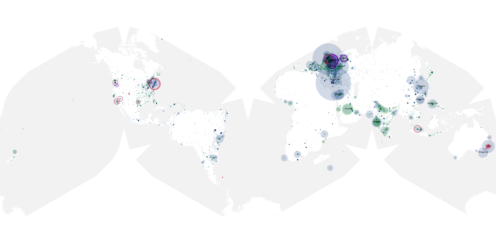
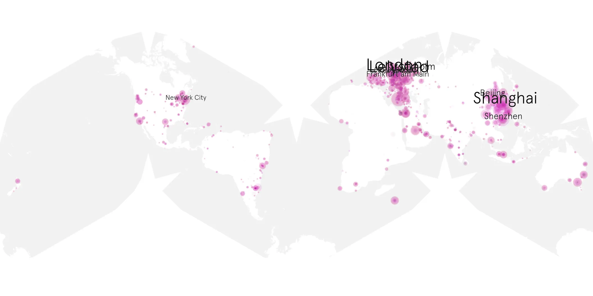
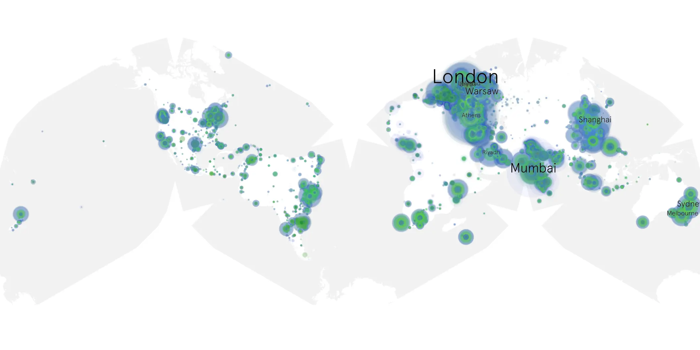

# house-of-cards-05 sample cache audit

## 1. Media object

| Field | Value |
| --- | --- |
| Media object | House of Cards |
| Collection key | `house-of-cards-05` |
| imdb_id | [tt1856010](https://www.imdb.com/title/tt1856010/) |
| wikipedia_url | [House of Cards (American TV series)](https://en.wikipedia.org/wiki/House_of_Cards_(American_TV_series)) |
| Sample dates | 2017-05-30-to-2017-08-27 |
| Sample days | 90 |
| BTIH count | 177 |
| Unique BTIH count | 177 |
| Downloaders total | 2,279,586 |
| Uploaders total | 1,122,162 |
| Data version | `2026-08-05` |
| IP geolocation version | `6:1777968300` |

## 2. Sample coverage report

- Generated: 2026-09-09T01:10:36Z
- Sample archive directory: `/mnt/gold/src/alpha60-samples-raw.gold/house-of-cards-05.xz`
- Hour directories: 88
- Zero-length sample files: 0
- Other unparsable sample files: 0
- Hourly discontinuities: 87 (2043 missing hours)
- Missing days: 74

### Sample archive discontinuities

- hourly gap: last `2017-05-30 07:00`, resumed `2017-05-30 11:00` — missing 3 hour(s)
- hourly gap: last `2017-05-30 11:00`, resumed `2017-05-30 15:00` — missing 3 hour(s)
- hourly gap: last `2017-05-30 15:00`, resumed `2017-05-30 19:00` — missing 3 hour(s)
- hourly gap: last `2017-05-30 19:00`, resumed `2017-05-30 23:00` — missing 3 hour(s)
- hourly gap: last `2017-05-30 23:00`, resumed `2017-05-31 03:00` — missing 3 hour(s)
- hourly gap: last `2017-05-31 03:00`, resumed `2017-05-31 07:00` — missing 3 hour(s)
- hourly gap: last `2017-05-31 07:00`, resumed `2017-05-31 11:00` — missing 3 hour(s)
- hourly gap: last `2017-05-31 11:00`, resumed `2017-05-31 15:00` — missing 3 hour(s)
- hourly gap: last `2017-05-31 15:00`, resumed `2017-05-31 19:00` — missing 3 hour(s)
- hourly gap: last `2017-05-31 19:00`, resumed `2017-05-31 23:00` — missing 3 hour(s)
- hourly gap: last `2017-05-31 23:00`, resumed `2017-06-01 03:00` — missing 3 hour(s)
- hourly gap: last `2017-06-01 03:00`, resumed `2017-06-01 07:00` — missing 3 hour(s)
- hourly gap: last `2017-06-01 07:00`, resumed `2017-06-01 11:00` — missing 3 hour(s)
- hourly gap: last `2017-06-01 11:00`, resumed `2017-06-01 15:00` — missing 3 hour(s)
- hourly gap: last `2017-06-01 15:00`, resumed `2017-06-01 19:00` — missing 3 hour(s)
- hourly gap: last `2017-06-01 19:00`, resumed `2017-06-01 23:00` — missing 3 hour(s)
- hourly gap: last `2017-06-01 23:00`, resumed `2017-06-02 03:00` — missing 3 hour(s)
- hourly gap: last `2017-06-02 03:00`, resumed `2017-06-02 07:00` — missing 3 hour(s)
- hourly gap: last `2017-06-02 07:00`, resumed `2017-06-02 11:00` — missing 3 hour(s)
- hourly gap: last `2017-06-02 11:00`, resumed `2017-06-02 15:00` — missing 3 hour(s)
- hourly gap: last `2017-06-02 15:00`, resumed `2017-06-02 19:00` — missing 3 hour(s)
- hourly gap: last `2017-06-02 19:00`, resumed `2017-06-02 23:00` — missing 3 hour(s)
- hourly gap: last `2017-06-02 23:00`, resumed `2017-06-03 03:00` — missing 3 hour(s)
- hourly gap: last `2017-06-03 03:00`, resumed `2017-06-03 07:00` — missing 3 hour(s)
- hourly gap: last `2017-06-03 07:00`, resumed `2017-06-03 11:00` — missing 3 hour(s)
- hourly gap: last `2017-06-03 11:00`, resumed `2017-06-03 15:00` — missing 3 hour(s)
- hourly gap: last `2017-06-03 15:00`, resumed `2017-06-03 19:00` — missing 3 hour(s)
- hourly gap: last `2017-06-03 19:00`, resumed `2017-06-03 23:00` — missing 3 hour(s)
- hourly gap: last `2017-06-03 23:00`, resumed `2017-06-04 03:00` — missing 3 hour(s)
- hourly gap: last `2017-06-04 03:00`, resumed `2017-06-04 07:00` — missing 3 hour(s)
- hourly gap: last `2017-06-04 07:00`, resumed `2017-06-04 11:00` — missing 3 hour(s)
- hourly gap: last `2017-06-04 11:00`, resumed `2017-06-04 15:00` — missing 3 hour(s)
- hourly gap: last `2017-06-04 15:00`, resumed `2017-06-04 19:00` — missing 3 hour(s)
- hourly gap: last `2017-06-04 19:00`, resumed `2017-06-04 22:57` — missing 2 hour(s)
- hourly gap: last `2017-06-04 22:57`, resumed `2017-06-05 02:57` — missing 3 hour(s)
- hourly gap: last `2017-06-05 02:57`, resumed `2017-06-05 06:57` — missing 3 hour(s)
- hourly gap: last `2017-06-05 06:57`, resumed `2017-06-05 10:57` — missing 3 hour(s)
- hourly gap: last `2017-06-05 10:57`, resumed `2017-06-05 14:57` — missing 3 hour(s)
- hourly gap: last `2017-06-05 14:57`, resumed `2017-06-05 18:57` — missing 3 hour(s)
- hourly gap: last `2017-06-05 18:57`, resumed `2017-06-05 22:57` — missing 3 hour(s)
- hourly gap: last `2017-06-05 22:57`, resumed `2017-06-06 02:57` — missing 3 hour(s)
- hourly gap: last `2017-06-06 02:57`, resumed `2017-06-06 06:57` — missing 3 hour(s)
- hourly gap: last `2017-06-06 06:57`, resumed `2017-06-06 10:57` — missing 3 hour(s)
- hourly gap: last `2017-06-06 10:57`, resumed `2017-06-06 14:57` — missing 3 hour(s)
- hourly gap: last `2017-06-06 14:57`, resumed `2017-06-06 18:57` — missing 3 hour(s)
- hourly gap: last `2017-06-06 18:57`, resumed `2017-06-06 22:57` — missing 3 hour(s)
- hourly gap: last `2017-06-06 22:57`, resumed `2017-06-07 02:57` — missing 3 hour(s)
- hourly gap: last `2017-06-07 02:57`, resumed `2017-06-07 06:57` — missing 3 hour(s)
- hourly gap: last `2017-06-07 06:57`, resumed `2017-06-07 10:57` — missing 3 hour(s)
- hourly gap: last `2017-06-07 10:57`, resumed `2017-06-07 14:57` — missing 3 hour(s)
- hourly gap: last `2017-06-07 14:57`, resumed `2017-06-07 18:57` — missing 3 hour(s)
- hourly gap: last `2017-06-07 18:57`, resumed `2017-06-07 22:57` — missing 3 hour(s)
- hourly gap: last `2017-06-07 22:57`, resumed `2017-06-08 02:57` — missing 3 hour(s)
- hourly gap: last `2017-06-08 02:57`, resumed `2017-06-08 07:00` — missing 3 hour(s)
- hourly gap: last `2017-06-08 07:00`, resumed `2017-06-08 11:00` — missing 3 hour(s)
- hourly gap: last `2017-06-08 11:00`, resumed `2017-06-08 15:00` — missing 3 hour(s)
- hourly gap: last `2017-06-08 15:00`, resumed `2017-06-08 19:00` — missing 3 hour(s)
- hourly gap: last `2017-06-08 19:00`, resumed `2017-06-08 23:00` — missing 3 hour(s)
- hourly gap: last `2017-06-08 23:00`, resumed `2017-06-09 03:00` — missing 3 hour(s)
- hourly gap: last `2017-06-09 03:00`, resumed `2017-06-09 07:00` — missing 3 hour(s)
- hourly gap: last `2017-06-09 07:00`, resumed `2017-06-09 11:00` — missing 3 hour(s)
- hourly gap: last `2017-06-09 11:00`, resumed `2017-06-09 15:00` — missing 3 hour(s)
- hourly gap: last `2017-06-09 15:00`, resumed `2017-06-09 19:00` — missing 3 hour(s)
- hourly gap: last `2017-06-09 19:00`, resumed `2017-06-09 23:00` — missing 3 hour(s)
- hourly gap: last `2017-06-09 23:00`, resumed `2017-06-10 03:00` — missing 3 hour(s)
- hourly gap: last `2017-06-10 03:00`, resumed `2017-06-10 07:00` — missing 3 hour(s)
- hourly gap: last `2017-06-10 07:00`, resumed `2017-06-10 11:00` — missing 3 hour(s)
- hourly gap: last `2017-06-10 11:00`, resumed `2017-06-10 15:00` — missing 3 hour(s)
- hourly gap: last `2017-06-10 15:00`, resumed `2017-06-10 19:00` — missing 3 hour(s)
- hourly gap: last `2017-06-10 19:00`, resumed `2017-06-10 23:00` — missing 3 hour(s)
- hourly gap: last `2017-06-10 23:00`, resumed `2017-06-11 03:00` — missing 3 hour(s)
- hourly gap: last `2017-06-11 03:00`, resumed `2017-06-11 07:00` — missing 3 hour(s)
- hourly gap: last `2017-06-11 07:00`, resumed `2017-06-11 11:00` — missing 3 hour(s)
- hourly gap: last `2017-06-11 11:00`, resumed `2017-06-11 15:00` — missing 3 hour(s)
- hourly gap: last `2017-06-11 15:00`, resumed `2017-06-11 19:00` — missing 3 hour(s)
- hourly gap: last `2017-06-11 19:00`, resumed `2017-08-25 06:22` — missing 1786 hour(s)
- hourly gap: last `2017-08-25 06:22`, resumed `2017-08-25 10:22` — missing 3 hour(s)
- hourly gap: last `2017-08-25 10:22`, resumed `2017-08-25 14:22` — missing 3 hour(s)
- hourly gap: last `2017-08-25 14:22`, resumed `2017-08-25 18:22` — missing 3 hour(s)
- hourly gap: last `2017-08-25 18:22`, resumed `2017-08-25 22:22` — missing 3 hour(s)
- hourly gap: last `2017-08-25 22:22`, resumed `2017-08-26 02:22` — missing 3 hour(s)
- hourly gap: last `2017-08-26 02:22`, resumed `2017-08-26 06:22` — missing 3 hour(s)
- hourly gap: last `2017-08-26 06:22`, resumed `2017-08-26 10:22` — missing 3 hour(s)
- hourly gap: last `2017-08-26 10:22`, resumed `2017-08-26 14:22` — missing 3 hour(s)
- hourly gap: last `2017-08-26 14:22`, resumed `2017-08-26 18:22` — missing 3 hour(s)
- hourly gap: last `2017-08-26 18:22`, resumed `2017-08-26 22:22` — missing 3 hour(s)
- hourly gap: last `2017-08-26 22:22`, resumed `2017-08-27 02:22` — missing 3 hour(s)
- missing day: `2017-06-12`
- missing day: `2017-06-13`
- missing day: `2017-06-14`
- missing day: `2017-06-15`
- missing day: `2017-06-16`
- missing day: `2017-06-17`
- missing day: `2017-06-18`
- missing day: `2017-06-19`
- missing day: `2017-06-20`
- missing day: `2017-06-21`
- missing day: `2017-06-22`
- missing day: `2017-06-23`
- missing day: `2017-06-24`
- missing day: `2017-06-25`
- missing day: `2017-06-26`
- missing day: `2017-06-27`
- missing day: `2017-06-28`
- missing day: `2017-06-29`
- missing day: `2017-06-30`
- missing day: `2017-07-01`
- missing day: `2017-07-02`
- missing day: `2017-07-03`
- missing day: `2017-07-04`
- missing day: `2017-07-05`
- missing day: `2017-07-06`
- missing day: `2017-07-07`
- missing day: `2017-07-08`
- missing day: `2017-07-09`
- missing day: `2017-07-10`
- missing day: `2017-07-11`
- missing day: `2017-07-12`
- missing day: `2017-07-13`
- missing day: `2017-07-14`
- missing day: `2017-07-15`
- missing day: `2017-07-16`
- missing day: `2017-07-17`
- missing day: `2017-07-18`
- missing day: `2017-07-19`
- missing day: `2017-07-20`
- missing day: `2017-07-21`
- missing day: `2017-07-22`
- missing day: `2017-07-23`
- missing day: `2017-07-24`
- missing day: `2017-07-25`
- missing day: `2017-07-26`
- missing day: `2017-07-27`
- missing day: `2017-07-28`
- missing day: `2017-07-29`
- missing day: `2017-07-30`
- missing day: `2017-07-31`
- missing day: `2017-08-01`
- missing day: `2017-08-02`
- missing day: `2017-08-03`
- missing day: `2017-08-04`
- missing day: `2017-08-05`
- missing day: `2017-08-06`
- missing day: `2017-08-07`
- missing day: `2017-08-08`
- missing day: `2017-08-09`
- missing day: `2017-08-10`
- missing day: `2017-08-11`
- missing day: `2017-08-12`
- missing day: `2017-08-13`
- missing day: `2017-08-14`
- missing day: `2017-08-15`
- missing day: `2017-08-16`
- missing day: `2017-08-17`
- missing day: `2017-08-18`
- missing day: `2017-08-19`
- missing day: `2017-08-20`
- missing day: `2017-08-21`
- missing day: `2017-08-22`
- missing day: `2017-08-23`
- missing day: `2017-08-24`

## 3. Media objects file size histogram

## 4. Visualization pass — graphs

### Downloads by week cumulative (normalized start)



### Downloads by day, Saturday and Sunday in gray

## 5. Visualization pass — maps

### Cumulative geographic slices

| Africa | Americas | Asia | Europe | Oceania | Unknown |
| --- | --- | --- | --- | --- | --- |
| 7.06 | 16.24 | 29.21 | 38.25 | 3.70 | 0.85 |

### Cumulative network infrastructure

{:target="_blank" rel="noopener"}

### Cumulative data maps

**Cumulative >= 1080p**

{:target="_blank" rel="noopener"}

**Cumulative < 1080p**

{:target="_blank" rel="noopener"}
