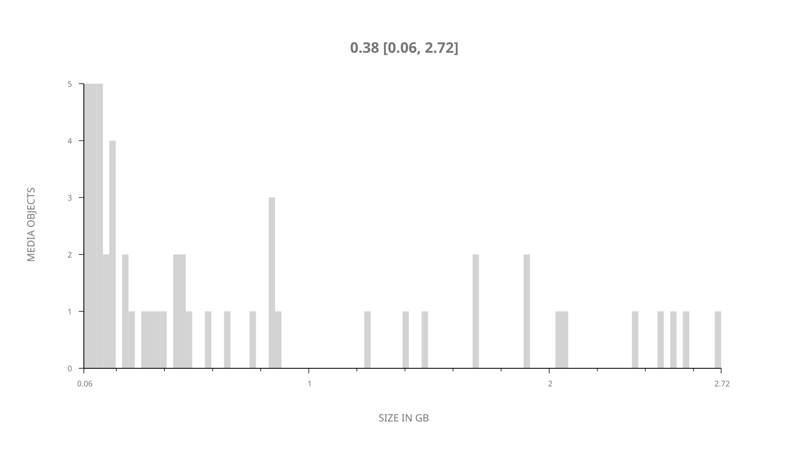
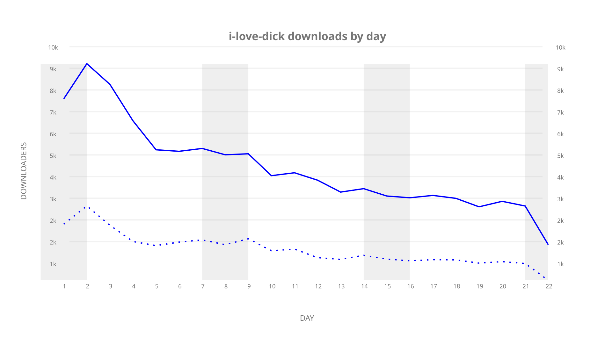
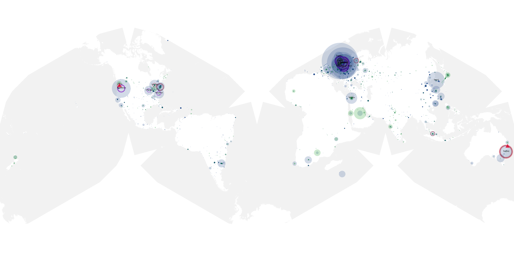
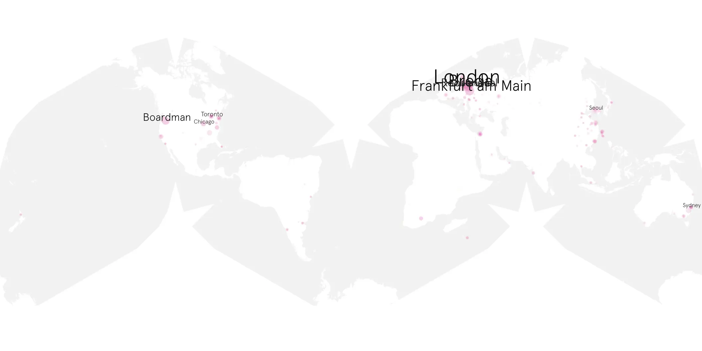
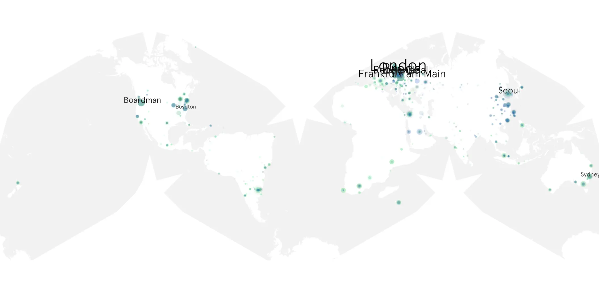

# i-love-dick sample cache audit

## 1. Media object

| Field | Value |
| --- | --- |
| Media object | I Love Dick |
| Collection key | `i-love-dick` |
| imdb_id | [tt5478730](https://www.imdb.com/title/tt5478730/) |
| wikipedia_url | [I Love Dick (TV series)](https://en.wikipedia.org/wiki/I_Love_Dick_(TV_series)) |
| Sample dates | 2017-05-13-to-2017-06-03 |
| Sample days | 22 |
| BTIH count | 54 |
| Unique BTIH count | 54 |
| Downloaders total | 68,305 |
| Uploaders total | 27,643 |
| Data version | `2026-08-05` |
| IP geolocation version | `6:1777968300` |

## 2. Sample coverage report

- Generated: 2026-09-09T01:10:36Z
- Sample archive directory: `/mnt/gold/src/alpha60-samples-raw.gold/i-love-dick.xz`
- Hour directories: 126
- Zero-length sample files: 0
- Other unparsable sample files: 0
- Hourly discontinuities: 125 (374 missing hours)
- Missing days: 0

### Sample archive discontinuities

- hourly gap: last `2017-05-13 10:00`, resumed `2017-05-13 14:00` — missing 3 hour(s)
- hourly gap: last `2017-05-13 14:00`, resumed `2017-05-13 18:00` — missing 3 hour(s)
- hourly gap: last `2017-05-13 18:00`, resumed `2017-05-13 22:00` — missing 3 hour(s)
- hourly gap: last `2017-05-13 22:00`, resumed `2017-05-14 02:00` — missing 3 hour(s)
- hourly gap: last `2017-05-14 02:00`, resumed `2017-05-14 06:00` — missing 3 hour(s)
- hourly gap: last `2017-05-14 06:00`, resumed `2017-05-14 10:00` — missing 3 hour(s)
- hourly gap: last `2017-05-14 10:00`, resumed `2017-05-14 14:00` — missing 3 hour(s)
- hourly gap: last `2017-05-14 14:00`, resumed `2017-05-14 18:00` — missing 3 hour(s)
- hourly gap: last `2017-05-14 18:00`, resumed `2017-05-14 22:00` — missing 3 hour(s)
- hourly gap: last `2017-05-14 22:00`, resumed `2017-05-15 02:00` — missing 3 hour(s)
- hourly gap: last `2017-05-15 02:00`, resumed `2017-05-15 06:00` — missing 3 hour(s)
- hourly gap: last `2017-05-15 06:00`, resumed `2017-05-15 10:00` — missing 3 hour(s)
- hourly gap: last `2017-05-15 10:00`, resumed `2017-05-15 14:00` — missing 3 hour(s)
- hourly gap: last `2017-05-15 14:00`, resumed `2017-05-15 18:00` — missing 3 hour(s)
- hourly gap: last `2017-05-15 18:00`, resumed `2017-05-15 22:00` — missing 3 hour(s)
- hourly gap: last `2017-05-15 22:00`, resumed `2017-05-16 02:00` — missing 3 hour(s)
- hourly gap: last `2017-05-16 02:00`, resumed `2017-05-16 06:00` — missing 3 hour(s)
- hourly gap: last `2017-05-16 06:00`, resumed `2017-05-16 10:00` — missing 3 hour(s)
- hourly gap: last `2017-05-16 10:00`, resumed `2017-05-16 14:00` — missing 3 hour(s)
- hourly gap: last `2017-05-16 14:00`, resumed `2017-05-16 18:00` — missing 3 hour(s)
- hourly gap: last `2017-05-16 18:00`, resumed `2017-05-16 22:00` — missing 3 hour(s)
- hourly gap: last `2017-05-16 22:00`, resumed `2017-05-17 02:00` — missing 3 hour(s)
- hourly gap: last `2017-05-17 02:00`, resumed `2017-05-17 06:00` — missing 3 hour(s)
- hourly gap: last `2017-05-17 06:00`, resumed `2017-05-17 10:00` — missing 3 hour(s)
- hourly gap: last `2017-05-17 10:00`, resumed `2017-05-17 14:00` — missing 3 hour(s)
- hourly gap: last `2017-05-17 14:00`, resumed `2017-05-17 18:00` — missing 3 hour(s)
- hourly gap: last `2017-05-17 18:00`, resumed `2017-05-17 22:00` — missing 3 hour(s)
- hourly gap: last `2017-05-17 22:00`, resumed `2017-05-18 02:00` — missing 3 hour(s)
- hourly gap: last `2017-05-18 02:00`, resumed `2017-05-18 06:00` — missing 3 hour(s)
- hourly gap: last `2017-05-18 06:00`, resumed `2017-05-18 09:03` — missing 2 hour(s)
- hourly gap: last `2017-05-18 09:03`, resumed `2017-05-18 13:03` — missing 3 hour(s)
- hourly gap: last `2017-05-18 13:03`, resumed `2017-05-18 17:03` — missing 3 hour(s)
- hourly gap: last `2017-05-18 17:03`, resumed `2017-05-18 21:03` — missing 3 hour(s)
- hourly gap: last `2017-05-18 21:03`, resumed `2017-05-19 01:03` — missing 3 hour(s)
- hourly gap: last `2017-05-19 01:03`, resumed `2017-05-19 05:03` — missing 3 hour(s)
- hourly gap: last `2017-05-19 05:03`, resumed `2017-05-19 09:03` — missing 3 hour(s)
- hourly gap: last `2017-05-19 09:03`, resumed `2017-05-19 13:03` — missing 3 hour(s)
- hourly gap: last `2017-05-19 13:03`, resumed `2017-05-19 17:03` — missing 3 hour(s)
- hourly gap: last `2017-05-19 17:03`, resumed `2017-05-19 21:03` — missing 3 hour(s)
- hourly gap: last `2017-05-19 21:03`, resumed `2017-05-20 01:03` — missing 3 hour(s)
- hourly gap: last `2017-05-20 01:03`, resumed `2017-05-20 05:03` — missing 3 hour(s)
- hourly gap: last `2017-05-20 05:03`, resumed `2017-05-20 09:03` — missing 3 hour(s)
- hourly gap: last `2017-05-20 09:03`, resumed `2017-05-20 13:03` — missing 3 hour(s)
- hourly gap: last `2017-05-20 13:03`, resumed `2017-05-20 17:03` — missing 3 hour(s)
- hourly gap: last `2017-05-20 17:03`, resumed `2017-05-20 21:03` — missing 3 hour(s)
- hourly gap: last `2017-05-20 21:03`, resumed `2017-05-21 01:03` — missing 3 hour(s)
- hourly gap: last `2017-05-21 01:03`, resumed `2017-05-21 05:03` — missing 3 hour(s)
- hourly gap: last `2017-05-21 05:03`, resumed `2017-05-21 09:03` — missing 3 hour(s)
- hourly gap: last `2017-05-21 09:03`, resumed `2017-05-21 13:03` — missing 3 hour(s)
- hourly gap: last `2017-05-21 13:03`, resumed `2017-05-21 17:03` — missing 3 hour(s)
- hourly gap: last `2017-05-21 17:03`, resumed `2017-05-21 21:03` — missing 3 hour(s)
- hourly gap: last `2017-05-21 21:03`, resumed `2017-05-22 01:03` — missing 3 hour(s)
- hourly gap: last `2017-05-22 01:03`, resumed `2017-05-22 05:03` — missing 3 hour(s)
- hourly gap: last `2017-05-22 05:03`, resumed `2017-05-22 09:03` — missing 3 hour(s)
- hourly gap: last `2017-05-22 09:03`, resumed `2017-05-22 13:03` — missing 3 hour(s)
- hourly gap: last `2017-05-22 13:03`, resumed `2017-05-22 17:03` — missing 3 hour(s)
- hourly gap: last `2017-05-22 17:03`, resumed `2017-05-22 21:03` — missing 3 hour(s)
- hourly gap: last `2017-05-22 21:03`, resumed `2017-05-23 01:03` — missing 3 hour(s)
- hourly gap: last `2017-05-23 01:03`, resumed `2017-05-23 05:03` — missing 3 hour(s)
- hourly gap: last `2017-05-23 05:03`, resumed `2017-05-23 09:03` — missing 3 hour(s)
- hourly gap: last `2017-05-23 09:03`, resumed `2017-05-23 13:03` — missing 3 hour(s)
- hourly gap: last `2017-05-23 13:03`, resumed `2017-05-23 17:03` — missing 3 hour(s)
- hourly gap: last `2017-05-23 17:03`, resumed `2017-05-23 21:03` — missing 3 hour(s)
- hourly gap: last `2017-05-23 21:03`, resumed `2017-05-24 01:03` — missing 3 hour(s)
- hourly gap: last `2017-05-24 01:03`, resumed `2017-05-24 05:03` — missing 3 hour(s)
- hourly gap: last `2017-05-24 05:03`, resumed `2017-05-24 09:03` — missing 3 hour(s)
- hourly gap: last `2017-05-24 09:03`, resumed `2017-05-24 13:03` — missing 3 hour(s)
- hourly gap: last `2017-05-24 13:03`, resumed `2017-05-24 17:03` — missing 3 hour(s)
- hourly gap: last `2017-05-24 17:03`, resumed `2017-05-24 21:03` — missing 3 hour(s)
- hourly gap: last `2017-05-24 21:03`, resumed `2017-05-25 01:03` — missing 3 hour(s)
- hourly gap: last `2017-05-25 01:03`, resumed `2017-05-25 05:03` — missing 3 hour(s)
- hourly gap: last `2017-05-25 05:03`, resumed `2017-05-25 09:03` — missing 3 hour(s)
- hourly gap: last `2017-05-25 09:03`, resumed `2017-05-25 13:03` — missing 3 hour(s)
- hourly gap: last `2017-05-25 13:03`, resumed `2017-05-25 17:03` — missing 3 hour(s)
- hourly gap: last `2017-05-25 17:03`, resumed `2017-05-25 21:03` — missing 3 hour(s)
- hourly gap: last `2017-05-25 21:03`, resumed `2017-05-26 01:03` — missing 3 hour(s)
- hourly gap: last `2017-05-26 01:03`, resumed `2017-05-26 05:03` — missing 3 hour(s)
- hourly gap: last `2017-05-26 05:03`, resumed `2017-05-26 09:03` — missing 3 hour(s)
- hourly gap: last `2017-05-26 09:03`, resumed `2017-05-26 13:03` — missing 3 hour(s)
- hourly gap: last `2017-05-26 13:03`, resumed `2017-05-26 17:03` — missing 3 hour(s)
- hourly gap: last `2017-05-26 17:03`, resumed `2017-05-26 21:03` — missing 3 hour(s)
- hourly gap: last `2017-05-26 21:03`, resumed `2017-05-27 01:03` — missing 3 hour(s)
- hourly gap: last `2017-05-27 01:03`, resumed `2017-05-27 05:03` — missing 3 hour(s)
- hourly gap: last `2017-05-27 05:03`, resumed `2017-05-27 09:03` — missing 3 hour(s)
- hourly gap: last `2017-05-27 09:03`, resumed `2017-05-27 13:03` — missing 3 hour(s)
- hourly gap: last `2017-05-27 13:03`, resumed `2017-05-27 17:03` — missing 3 hour(s)
- hourly gap: last `2017-05-27 17:03`, resumed `2017-05-27 21:03` — missing 3 hour(s)
- hourly gap: last `2017-05-27 21:03`, resumed `2017-05-28 01:03` — missing 3 hour(s)
- hourly gap: last `2017-05-28 01:03`, resumed `2017-05-28 05:03` — missing 3 hour(s)
- hourly gap: last `2017-05-28 05:03`, resumed `2017-05-28 09:03` — missing 3 hour(s)
- hourly gap: last `2017-05-28 09:03`, resumed `2017-05-28 13:03` — missing 3 hour(s)
- hourly gap: last `2017-05-28 13:03`, resumed `2017-05-28 17:03` — missing 3 hour(s)
- hourly gap: last `2017-05-28 17:03`, resumed `2017-05-28 21:03` — missing 3 hour(s)
- hourly gap: last `2017-05-28 21:03`, resumed `2017-05-29 01:03` — missing 3 hour(s)
- hourly gap: last `2017-05-29 01:03`, resumed `2017-05-29 05:03` — missing 3 hour(s)
- hourly gap: last `2017-05-29 05:03`, resumed `2017-05-29 09:03` — missing 3 hour(s)
- hourly gap: last `2017-05-29 09:03`, resumed `2017-05-29 13:03` — missing 3 hour(s)
- hourly gap: last `2017-05-29 13:03`, resumed `2017-05-29 17:03` — missing 3 hour(s)
- hourly gap: last `2017-05-29 17:03`, resumed `2017-05-29 21:03` — missing 3 hour(s)
- hourly gap: last `2017-05-29 21:03`, resumed `2017-05-30 01:03` — missing 3 hour(s)
- hourly gap: last `2017-05-30 01:03`, resumed `2017-05-30 05:03` — missing 3 hour(s)
- hourly gap: last `2017-05-30 05:03`, resumed `2017-05-30 10:00` — missing 3 hour(s)
- hourly gap: last `2017-05-30 10:00`, resumed `2017-05-30 14:00` — missing 3 hour(s)
- hourly gap: last `2017-05-30 14:00`, resumed `2017-05-30 18:00` — missing 3 hour(s)
- hourly gap: last `2017-05-30 18:00`, resumed `2017-05-30 22:00` — missing 3 hour(s)
- hourly gap: last `2017-05-30 22:00`, resumed `2017-05-31 02:00` — missing 3 hour(s)
- hourly gap: last `2017-05-31 02:00`, resumed `2017-05-31 06:00` — missing 3 hour(s)
- hourly gap: last `2017-05-31 06:00`, resumed `2017-05-31 10:00` — missing 3 hour(s)
- hourly gap: last `2017-05-31 10:00`, resumed `2017-05-31 14:00` — missing 3 hour(s)
- hourly gap: last `2017-05-31 14:00`, resumed `2017-05-31 18:00` — missing 3 hour(s)
- hourly gap: last `2017-05-31 18:00`, resumed `2017-05-31 22:00` — missing 3 hour(s)
- hourly gap: last `2017-05-31 22:00`, resumed `2017-06-01 02:00` — missing 3 hour(s)
- hourly gap: last `2017-06-01 02:00`, resumed `2017-06-01 06:00` — missing 3 hour(s)
- hourly gap: last `2017-06-01 06:00`, resumed `2017-06-01 10:00` — missing 3 hour(s)
- hourly gap: last `2017-06-01 10:00`, resumed `2017-06-01 14:00` — missing 3 hour(s)
- hourly gap: last `2017-06-01 14:00`, resumed `2017-06-01 18:00` — missing 3 hour(s)
- hourly gap: last `2017-06-01 18:00`, resumed `2017-06-01 22:00` — missing 3 hour(s)
- hourly gap: last `2017-06-01 22:00`, resumed `2017-06-02 02:00` — missing 3 hour(s)
- hourly gap: last `2017-06-02 02:00`, resumed `2017-06-02 06:00` — missing 3 hour(s)
- hourly gap: last `2017-06-02 06:00`, resumed `2017-06-02 10:00` — missing 3 hour(s)
- hourly gap: last `2017-06-02 10:00`, resumed `2017-06-02 14:00` — missing 3 hour(s)
- hourly gap: last `2017-06-02 14:00`, resumed `2017-06-02 18:00` — missing 3 hour(s)
- hourly gap: last `2017-06-02 18:00`, resumed `2017-06-02 22:00` — missing 3 hour(s)
- hourly gap: last `2017-06-02 22:00`, resumed `2017-06-03 02:00` — missing 3 hour(s)
- hourly gap: last `2017-06-03 02:00`, resumed `2017-06-03 06:00` — missing 3 hour(s)

## 3. Media objects file size histogram

## 4. Visualization pass — graphs

### Downloads by week cumulative (normalized start)



### Downloads by day, Saturday and Sunday in gray

## 5. Visualization pass — maps

### Cumulative geographic slices

| Africa | Americas | Asia | Europe | Oceania | Unknown |
| --- | --- | --- | --- | --- | --- |
| 4.38 | 23.00 | 21.40 | 38.87 | 4.37 | 2.23 |

### Cumulative network infrastructure

{:target="_blank" rel="noopener"}

### Cumulative data maps

**Cumulative >= 1080p**

{:target="_blank" rel="noopener"}

**Cumulative < 1080p**

{:target="_blank" rel="noopener"}
