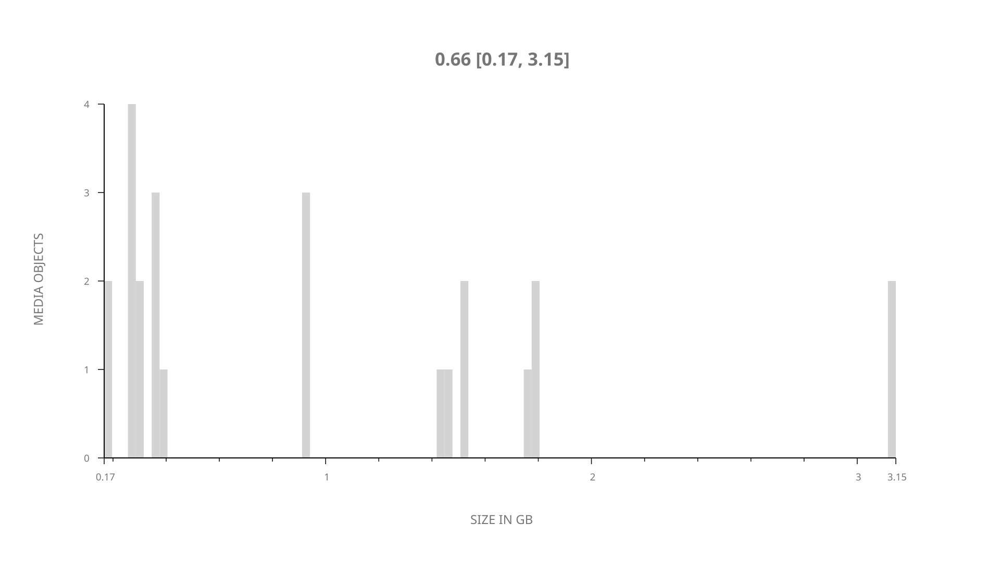
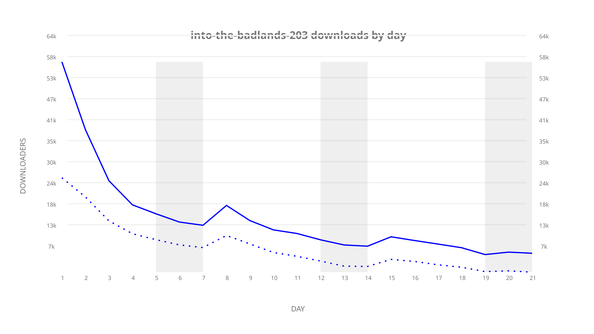
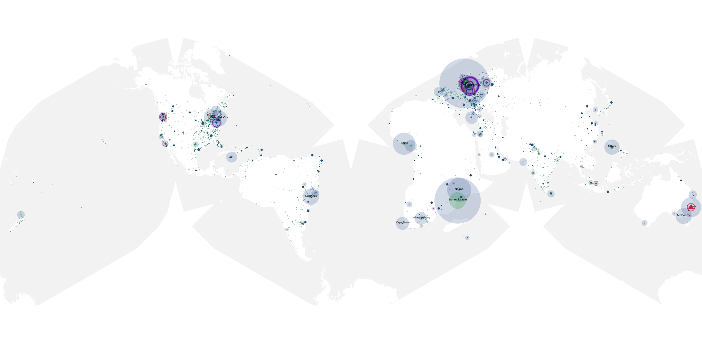
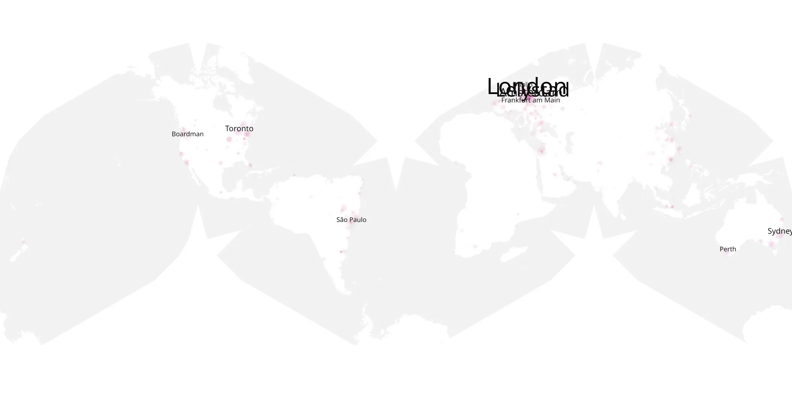
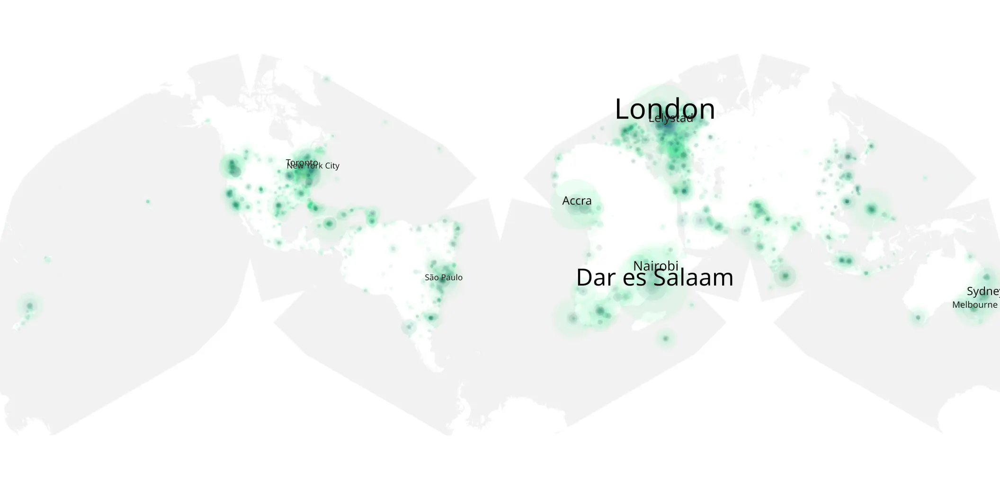

# into-the-badlands-203 sample cache audit

## 1. Media object

| Field | Value |
| --- | --- |
| Media object | Into The Badlands |
| Collection key | `into-the-badlands-203` |
| imdb_id | [tt3865236](https://www.imdb.com/title/tt3865236/) |
| wikipedia_url | [Into the Badlands (TV series)](https://en.wikipedia.org/wiki/Into_the_Badlands_(TV_series)) |
| Sample dates | 2017-04-03-to-2017-04-23 |
| Sample days | 21 |
| BTIH count | 25 |
| Unique BTIH count | 24 |
| Downloaders total | 319,937 |
| Uploaders total | 205,822 |
| Data version | `2026-08-05` |
| IP geolocation version | `6:1777968300` |

## 2. Sample coverage report

- Generated: 2026-09-09T01:10:36Z
- Sample archive directory: `/mnt/gold/src/alpha60-samples-raw.gold/into-the-badlands-203.xz`
- Hour directories: 125
- Zero-length sample files: 0
- Other unparsable sample files: 0
- Hourly discontinuities: 124 (376 missing hours)
- Missing days: 0

### Sample archive discontinuities

- hourly gap: last `2017-04-03 00:00`, resumed `2017-04-03 04:00` — missing 3 hour(s)
- hourly gap: last `2017-04-03 04:00`, resumed `2017-04-03 08:00` — missing 3 hour(s)
- hourly gap: last `2017-04-03 08:00`, resumed `2017-04-03 12:00` — missing 3 hour(s)
- hourly gap: last `2017-04-03 12:00`, resumed `2017-04-03 16:00` — missing 3 hour(s)
- hourly gap: last `2017-04-03 16:00`, resumed `2017-04-03 20:00` — missing 3 hour(s)
- hourly gap: last `2017-04-03 20:00`, resumed `2017-04-04 00:00` — missing 3 hour(s)
- hourly gap: last `2017-04-04 00:00`, resumed `2017-04-04 04:00` — missing 3 hour(s)
- hourly gap: last `2017-04-04 04:00`, resumed `2017-04-04 08:00` — missing 3 hour(s)
- hourly gap: last `2017-04-04 08:00`, resumed `2017-04-04 12:00` — missing 3 hour(s)
- hourly gap: last `2017-04-04 12:00`, resumed `2017-04-04 16:00` — missing 3 hour(s)
- hourly gap: last `2017-04-04 16:00`, resumed `2017-04-04 20:00` — missing 3 hour(s)
- hourly gap: last `2017-04-04 20:00`, resumed `2017-04-05 00:00` — missing 3 hour(s)
- hourly gap: last `2017-04-05 00:00`, resumed `2017-04-05 04:00` — missing 3 hour(s)
- hourly gap: last `2017-04-05 04:00`, resumed `2017-04-05 08:00` — missing 3 hour(s)
- hourly gap: last `2017-04-05 08:00`, resumed `2017-04-05 12:00` — missing 3 hour(s)
- hourly gap: last `2017-04-05 12:00`, resumed `2017-04-05 16:00` — missing 3 hour(s)
- hourly gap: last `2017-04-05 16:00`, resumed `2017-04-05 20:00` — missing 3 hour(s)
- hourly gap: last `2017-04-05 20:00`, resumed `2017-04-06 00:00` — missing 3 hour(s)
- hourly gap: last `2017-04-06 00:00`, resumed `2017-04-06 04:00` — missing 3 hour(s)
- hourly gap: last `2017-04-06 04:00`, resumed `2017-04-06 08:00` — missing 3 hour(s)
- hourly gap: last `2017-04-06 08:00`, resumed `2017-04-06 12:00` — missing 3 hour(s)
- hourly gap: last `2017-04-06 12:00`, resumed `2017-04-06 16:00` — missing 3 hour(s)
- hourly gap: last `2017-04-06 16:00`, resumed `2017-04-06 20:00` — missing 3 hour(s)
- hourly gap: last `2017-04-06 20:00`, resumed `2017-04-07 00:00` — missing 3 hour(s)
- hourly gap: last `2017-04-07 00:00`, resumed `2017-04-07 04:00` — missing 3 hour(s)
- hourly gap: last `2017-04-07 04:00`, resumed `2017-04-07 08:00` — missing 3 hour(s)
- hourly gap: last `2017-04-07 08:00`, resumed `2017-04-07 12:00` — missing 3 hour(s)
- hourly gap: last `2017-04-07 12:00`, resumed `2017-04-07 16:00` — missing 3 hour(s)
- hourly gap: last `2017-04-07 16:00`, resumed `2017-04-07 20:00` — missing 3 hour(s)
- hourly gap: last `2017-04-07 20:00`, resumed `2017-04-08 00:00` — missing 3 hour(s)
- hourly gap: last `2017-04-08 00:00`, resumed `2017-04-08 04:00` — missing 3 hour(s)
- hourly gap: last `2017-04-08 04:00`, resumed `2017-04-08 08:00` — missing 3 hour(s)
- hourly gap: last `2017-04-08 08:00`, resumed `2017-04-08 12:00` — missing 3 hour(s)
- hourly gap: last `2017-04-08 12:00`, resumed `2017-04-08 16:00` — missing 3 hour(s)
- hourly gap: last `2017-04-08 16:00`, resumed `2017-04-08 20:00` — missing 3 hour(s)
- hourly gap: last `2017-04-08 20:00`, resumed `2017-04-09 00:00` — missing 3 hour(s)
- hourly gap: last `2017-04-09 00:00`, resumed `2017-04-09 04:00` — missing 3 hour(s)
- hourly gap: last `2017-04-09 04:00`, resumed `2017-04-09 08:00` — missing 3 hour(s)
- hourly gap: last `2017-04-09 08:00`, resumed `2017-04-09 12:00` — missing 3 hour(s)
- hourly gap: last `2017-04-09 12:00`, resumed `2017-04-09 16:00` — missing 3 hour(s)
- hourly gap: last `2017-04-09 16:00`, resumed `2017-04-09 20:00` — missing 3 hour(s)
- hourly gap: last `2017-04-09 20:00`, resumed `2017-04-10 00:00` — missing 3 hour(s)
- hourly gap: last `2017-04-10 00:00`, resumed `2017-04-10 04:00` — missing 3 hour(s)
- hourly gap: last `2017-04-10 04:00`, resumed `2017-04-10 08:00` — missing 3 hour(s)
- hourly gap: last `2017-04-10 08:00`, resumed `2017-04-10 12:00` — missing 3 hour(s)
- hourly gap: last `2017-04-10 12:00`, resumed `2017-04-10 16:00` — missing 3 hour(s)
- hourly gap: last `2017-04-10 16:00`, resumed `2017-04-10 20:00` — missing 3 hour(s)
- hourly gap: last `2017-04-10 20:00`, resumed `2017-04-11 00:00` — missing 3 hour(s)
- hourly gap: last `2017-04-11 00:00`, resumed `2017-04-11 04:00` — missing 3 hour(s)
- hourly gap: last `2017-04-11 04:00`, resumed `2017-04-11 08:00` — missing 3 hour(s)
- hourly gap: last `2017-04-11 08:00`, resumed `2017-04-11 12:00` — missing 3 hour(s)
- hourly gap: last `2017-04-11 12:00`, resumed `2017-04-11 16:00` — missing 3 hour(s)
- hourly gap: last `2017-04-11 16:00`, resumed `2017-04-11 20:00` — missing 3 hour(s)
- hourly gap: last `2017-04-11 20:00`, resumed `2017-04-12 00:00` — missing 3 hour(s)
- hourly gap: last `2017-04-12 00:00`, resumed `2017-04-12 04:00` — missing 3 hour(s)
- hourly gap: last `2017-04-12 04:00`, resumed `2017-04-12 08:00` — missing 3 hour(s)
- hourly gap: last `2017-04-12 08:00`, resumed `2017-04-12 12:00` — missing 3 hour(s)
- hourly gap: last `2017-04-12 12:00`, resumed `2017-04-12 16:00` — missing 3 hour(s)
- hourly gap: last `2017-04-12 16:00`, resumed `2017-04-12 20:00` — missing 3 hour(s)
- hourly gap: last `2017-04-12 20:00`, resumed `2017-04-13 00:00` — missing 3 hour(s)
- hourly gap: last `2017-04-13 00:00`, resumed `2017-04-13 04:00` — missing 3 hour(s)
- hourly gap: last `2017-04-13 04:00`, resumed `2017-04-13 08:00` — missing 3 hour(s)
- hourly gap: last `2017-04-13 08:00`, resumed `2017-04-13 12:00` — missing 3 hour(s)
- hourly gap: last `2017-04-13 12:00`, resumed `2017-04-13 16:00` — missing 3 hour(s)
- hourly gap: last `2017-04-13 16:00`, resumed `2017-04-13 20:00` — missing 3 hour(s)
- hourly gap: last `2017-04-13 20:00`, resumed `2017-04-14 00:00` — missing 3 hour(s)
- hourly gap: last `2017-04-14 00:00`, resumed `2017-04-14 04:00` — missing 3 hour(s)
- hourly gap: last `2017-04-14 04:00`, resumed `2017-04-14 08:00` — missing 3 hour(s)
- hourly gap: last `2017-04-14 08:00`, resumed `2017-04-14 12:00` — missing 3 hour(s)
- hourly gap: last `2017-04-14 12:00`, resumed `2017-04-14 16:00` — missing 3 hour(s)
- hourly gap: last `2017-04-14 16:00`, resumed `2017-04-14 20:00` — missing 3 hour(s)
- hourly gap: last `2017-04-14 20:00`, resumed `2017-04-15 00:00` — missing 3 hour(s)
- hourly gap: last `2017-04-15 00:00`, resumed `2017-04-15 04:00` — missing 3 hour(s)
- hourly gap: last `2017-04-15 04:00`, resumed `2017-04-15 08:00` — missing 3 hour(s)
- hourly gap: last `2017-04-15 08:00`, resumed `2017-04-15 12:00` — missing 3 hour(s)
- hourly gap: last `2017-04-15 12:00`, resumed `2017-04-15 16:00` — missing 3 hour(s)
- hourly gap: last `2017-04-15 16:00`, resumed `2017-04-15 20:00` — missing 3 hour(s)
- hourly gap: last `2017-04-15 20:00`, resumed `2017-04-16 00:00` — missing 3 hour(s)
- hourly gap: last `2017-04-16 00:00`, resumed `2017-04-16 04:00` — missing 3 hour(s)
- hourly gap: last `2017-04-16 04:00`, resumed `2017-04-16 08:00` — missing 3 hour(s)
- hourly gap: last `2017-04-16 08:00`, resumed `2017-04-16 12:00` — missing 3 hour(s)
- hourly gap: last `2017-04-16 12:00`, resumed `2017-04-16 16:00` — missing 3 hour(s)
- hourly gap: last `2017-04-16 16:00`, resumed `2017-04-16 20:00` — missing 3 hour(s)
- hourly gap: last `2017-04-16 20:00`, resumed `2017-04-17 00:00` — missing 3 hour(s)
- hourly gap: last `2017-04-17 00:00`, resumed `2017-04-17 04:00` — missing 3 hour(s)
- hourly gap: last `2017-04-17 04:00`, resumed `2017-04-17 08:00` — missing 3 hour(s)
- hourly gap: last `2017-04-17 08:00`, resumed `2017-04-17 12:00` — missing 3 hour(s)
- hourly gap: last `2017-04-17 12:00`, resumed `2017-04-17 16:00` — missing 3 hour(s)
- hourly gap: last `2017-04-17 16:00`, resumed `2017-04-17 20:00` — missing 3 hour(s)
- hourly gap: last `2017-04-17 20:00`, resumed `2017-04-18 00:00` — missing 3 hour(s)
- hourly gap: last `2017-04-18 00:00`, resumed `2017-04-18 04:00` — missing 3 hour(s)
- hourly gap: last `2017-04-18 04:00`, resumed `2017-04-18 08:00` — missing 3 hour(s)
- hourly gap: last `2017-04-18 08:00`, resumed `2017-04-18 12:00` — missing 3 hour(s)
- hourly gap: last `2017-04-18 12:00`, resumed `2017-04-18 16:00` — missing 3 hour(s)
- hourly gap: last `2017-04-18 16:00`, resumed `2017-04-18 20:00` — missing 3 hour(s)
- hourly gap: last `2017-04-18 20:00`, resumed `2017-04-19 00:00` — missing 3 hour(s)
- hourly gap: last `2017-04-19 00:00`, resumed `2017-04-19 04:00` — missing 3 hour(s)
- hourly gap: last `2017-04-19 04:00`, resumed `2017-04-19 08:00` — missing 3 hour(s)
- hourly gap: last `2017-04-19 08:00`, resumed `2017-04-19 12:00` — missing 3 hour(s)
- hourly gap: last `2017-04-19 12:00`, resumed `2017-04-19 16:00` — missing 3 hour(s)
- hourly gap: last `2017-04-19 16:00`, resumed `2017-04-19 20:00` — missing 3 hour(s)
- hourly gap: last `2017-04-19 20:00`, resumed `2017-04-20 00:00` — missing 3 hour(s)
- hourly gap: last `2017-04-20 00:00`, resumed `2017-04-20 04:00` — missing 3 hour(s)
- hourly gap: last `2017-04-20 04:00`, resumed `2017-04-20 08:00` — missing 3 hour(s)
- hourly gap: last `2017-04-20 08:00`, resumed `2017-04-20 12:00` — missing 3 hour(s)
- hourly gap: last `2017-04-20 12:00`, resumed `2017-04-20 16:00` — missing 3 hour(s)
- hourly gap: last `2017-04-20 16:00`, resumed `2017-04-20 20:00` — missing 3 hour(s)
- hourly gap: last `2017-04-20 20:00`, resumed `2017-04-21 00:00` — missing 3 hour(s)
- hourly gap: last `2017-04-21 00:00`, resumed `2017-04-21 04:00` — missing 3 hour(s)
- hourly gap: last `2017-04-21 04:00`, resumed `2017-04-21 08:00` — missing 3 hour(s)
- hourly gap: last `2017-04-21 08:00`, resumed `2017-04-21 12:00` — missing 3 hour(s)
- hourly gap: last `2017-04-21 12:00`, resumed `2017-04-21 16:00` — missing 3 hour(s)
- hourly gap: last `2017-04-21 16:00`, resumed `2017-04-22 00:00` — missing 7 hour(s)
- hourly gap: last `2017-04-22 00:00`, resumed `2017-04-22 04:00` — missing 3 hour(s)
- hourly gap: last `2017-04-22 04:00`, resumed `2017-04-22 08:00` — missing 3 hour(s)
- hourly gap: last `2017-04-22 08:00`, resumed `2017-04-22 12:00` — missing 3 hour(s)
- hourly gap: last `2017-04-22 12:00`, resumed `2017-04-22 16:00` — missing 3 hour(s)
- hourly gap: last `2017-04-22 16:00`, resumed `2017-04-22 20:00` — missing 3 hour(s)
- hourly gap: last `2017-04-22 20:00`, resumed `2017-04-23 00:00` — missing 3 hour(s)
- hourly gap: last `2017-04-23 00:00`, resumed `2017-04-23 04:00` — missing 3 hour(s)
- hourly gap: last `2017-04-23 04:00`, resumed `2017-04-23 08:00` — missing 3 hour(s)
- hourly gap: last `2017-04-23 08:00`, resumed `2017-04-23 12:00` — missing 3 hour(s)
- hourly gap: last `2017-04-23 12:00`, resumed `2017-04-23 16:00` — missing 3 hour(s)
- hourly gap: last `2017-04-23 16:00`, resumed `2017-04-23 20:00` — missing 3 hour(s)

## 3. Media objects file size histogram

## 4. Visualization pass — graphs

### Downloads by week cumulative (normalized start)



### Downloads by day, Saturday and Sunday in gray

## 5. Visualization pass — maps

### Cumulative geographic slices

| Africa | Americas | Asia | Europe | Oceania | Unknown |
| --- | --- | --- | --- | --- | --- |
| 9.61 | 21.51 | 10.30 | 19.76 | 3.71 | 0.30 |

### Cumulative network infrastructure

{:target="_blank" rel="noopener"}

### Cumulative data maps

**Cumulative >= 1080p**

{:target="_blank" rel="noopener"}

**Cumulative < 1080p**

{:target="_blank" rel="noopener"}
