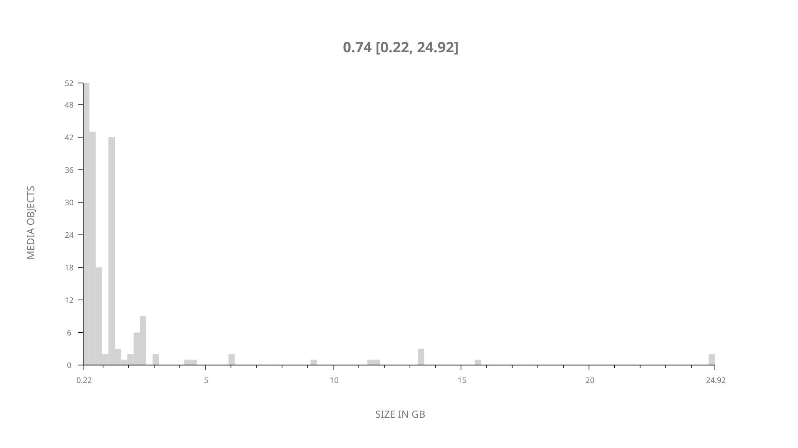
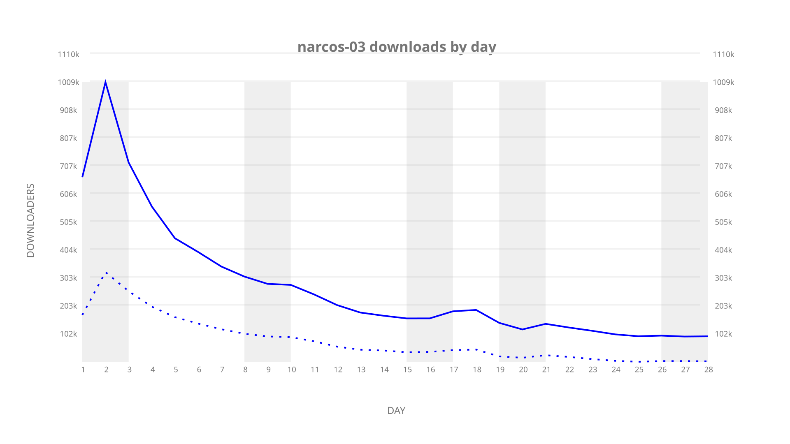
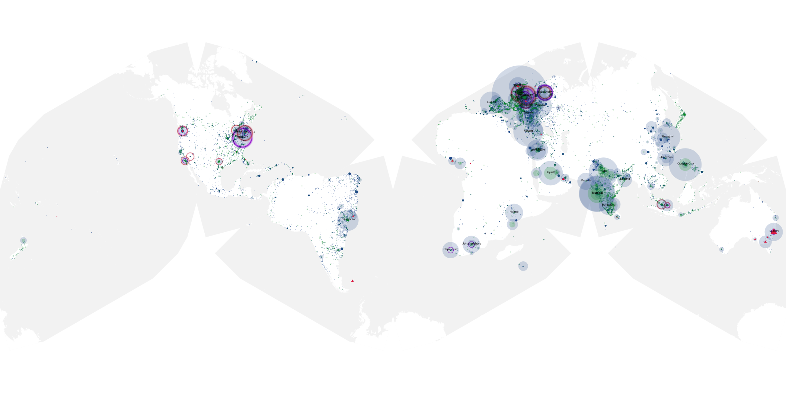
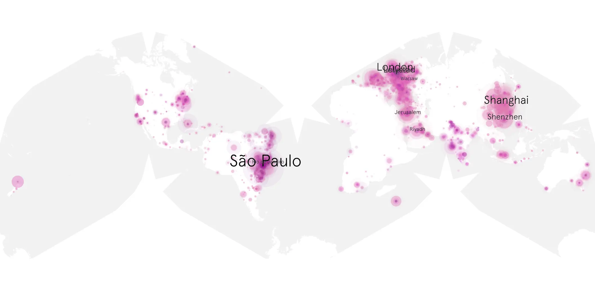
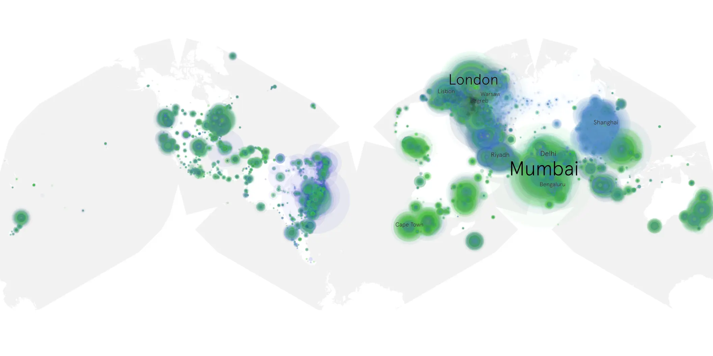

# narcos-03 sample cache audit

## 1. Media object

| Field | Value |
| --- | --- |
| Media object | Narcos |
| Collection key | `narcos-03` |
| imdb_id | [tt2707408](https://www.imdb.com/title/tt2707408/) |
| wikipedia_url | [Narcos](https://en.wikipedia.org/wiki/Narcos) |
| Sample dates | 2017-09-01-to-2017-10-01 |
| Sample days | 31 |
| BTIH count | 204 |
| Unique BTIH count | 193 |
| Downloaders total | 6,686,786 |
| Uploaders total | 3,251,712 |
| Data version | `2026-08-05` |
| IP geolocation version | `6:1777968300` |

## 2. Coverage report

- Generated: 2026-09-08T01:09:27Z
- Sample archive directory: `/mnt/gold/src/alpha60-samples-raw.gold/narcos-03.xz`
- Hour directories: 657
- Zero-length sample files: 0
- Other unparsable sample files: 0
- Hourly discontinuities: 1 (77 missing hours)
- Missing days: 3

### Sample archive discontinuities

- hourly gap: last `2017-09-19 20:00`, resumed `2017-09-23 02:00` — missing 77 hour(s)
- missing day: `2017-09-20`
- missing day: `2017-09-21`
- missing day: `2017-09-22`

## 3. File sizes histogram *median[lowest, highest]*

## 4. Graphs

### Downloads by week cumulative (normalized start)



### Downloads by day, Saturday and Sunday in gray

## 5. Cumulative Maps

<!-- https://raw.githubusercontent.com/alpha60-devops/alpha60-results-2017/refs/heads/main/data/ -->

### <a href="https://raw.githubusercontent.com/alpha60-devops/alpha60-results-2017/refs/heads/main/data/geojson.cumulative/narcos-03-cumulative-aggregate.geojson.gz" data-map-title="Narcos — narcos-03" onclick="leaflet_map_open_window(this.href, this.dataset.mapTitle); return false;" class="table-link" aria-label="Open Narcos (narcos-03) cumulative data map in new window" title="Opens interactive map for Narcos (narcos-03) data">Swarm Detail</a>

### Geographic Regions

| Africa | Americas | Asia | Europe | Oceania | Unknown |
| --- | --- | --- | --- | --- | --- |
| 8.66 | 14.98 | 36.98 | 33.08 | 2.61 | 0.46 |

### Network infrastructure

{:target="_blank" rel="noopener"}

### Resolution >= 1080p

{:target="_blank" rel="noopener"}

### Resolution < 1080p

{:target="_blank" rel="noopener"}
