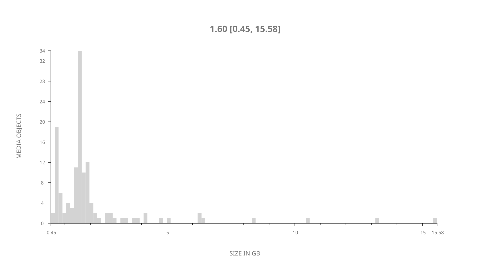
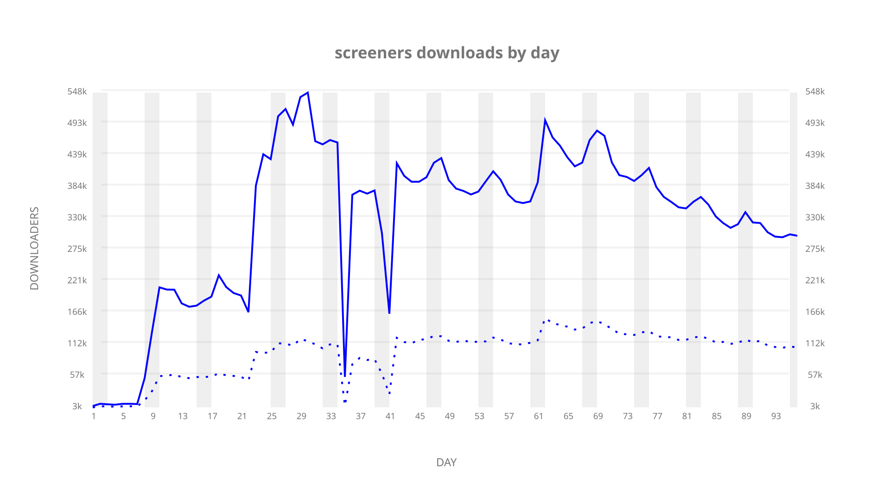
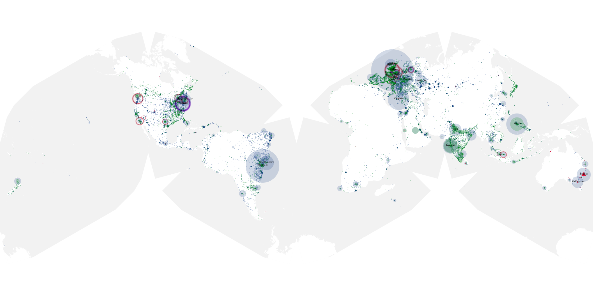
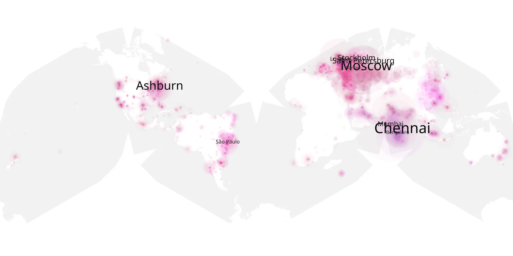
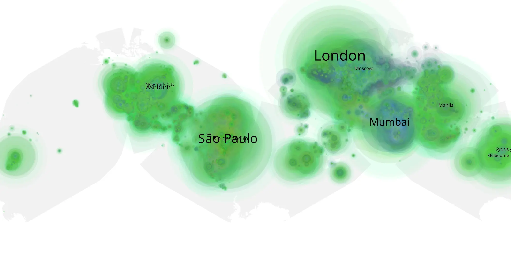

# screeners sample cache audit

## 1. Media object

| Field | Value |
| --- | --- |
| Media object | Screeners 2017-2018 |
| Collection key | `screeners` |
| imdb_id | UNAVAILABLE |
| wikipedia_url | UNAVAILABLE — no English Wikipedia page exists |
| Sample dates | 2017-12-22-to-2018-03-31 |
| Sample days | 100 |
| BTIH count | 147 |
| Unique BTIH count | 130 |
| Downloaders total | 15,285,853 |
| Uploaders total | 4,265,104 |
| Data version | `2026-08-05` |
| IP geolocation version | `6:1777968300` |

## 2. Sample coverage report

- Generated: 2026-09-08T01:10:00Z
- Sample archive directory: `/mnt/gold/src/alpha60-samples-raw.gold/eoy-2017-2018.xz`
- Hour directories: 3575
- Zero-length sample files: 0
- Other unparsable sample files: 0
- Hourly discontinuities: 2 (125 missing hours)
- Missing days: 4

### Sample archive discontinuities

- hourly gap: last `2018-01-12 19:00`, resumed `2018-01-17 01:34` — missing 101 hour(s)
- hourly gap: last `2018-01-28 22:00`, resumed `2018-01-29 23:00` — missing 24 hour(s)
- missing day: `2018-01-13`
- missing day: `2018-01-14`
- missing day: `2018-01-15`
- missing day: `2018-01-16`

## 3. Media objects file size histogram

## 4. Visualization pass — graphs

### Downloads by week cumulative (normalized start)



### Downloads by day, Saturday and Sunday in gray

## 5. Visualization pass — maps

### Cumulative geographic slices

| Africa | Americas | Asia | Europe | Oceania | Unknown |
| --- | --- | --- | --- | --- | --- |
| 4.27 | 29.49 | 22.71 | 29.53 | 3.33 | 1.08 |

### Cumulative network infrastructure

{:target="_blank" rel="noopener"}

### Cumulative data maps

**Cumulative >= 1080p**

{:target="_blank" rel="noopener"}

**Cumulative < 1080p**

{:target="_blank" rel="noopener"}
