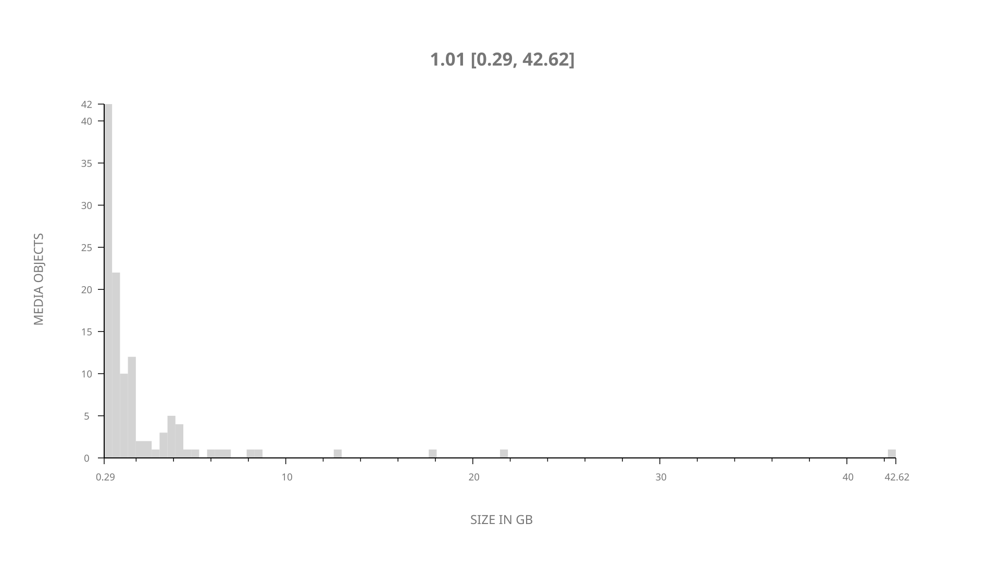
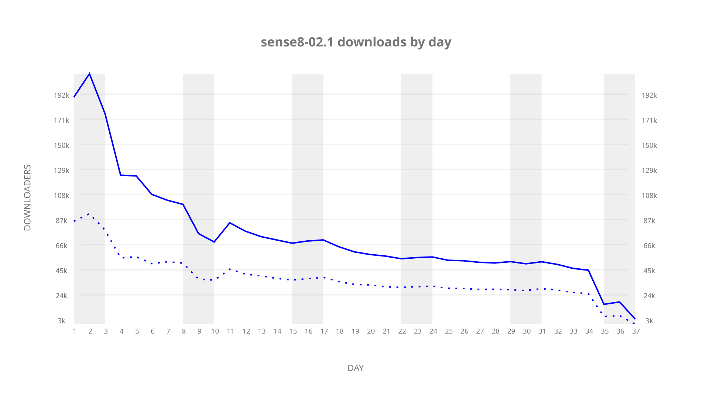
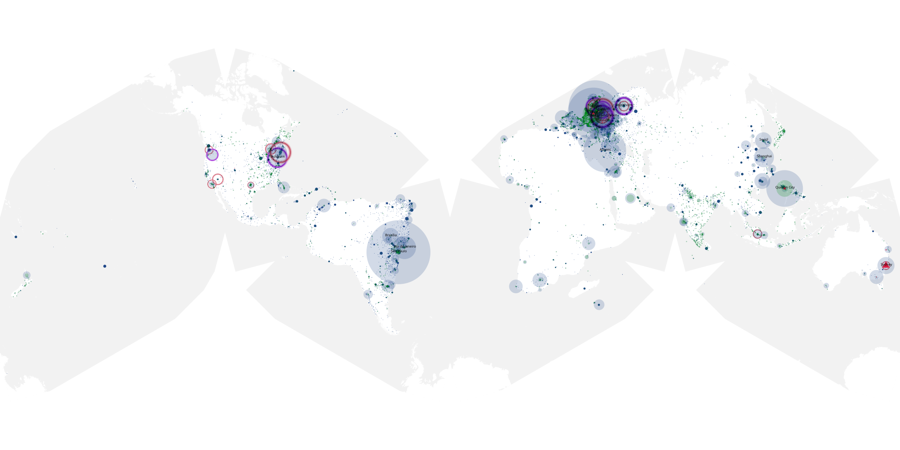
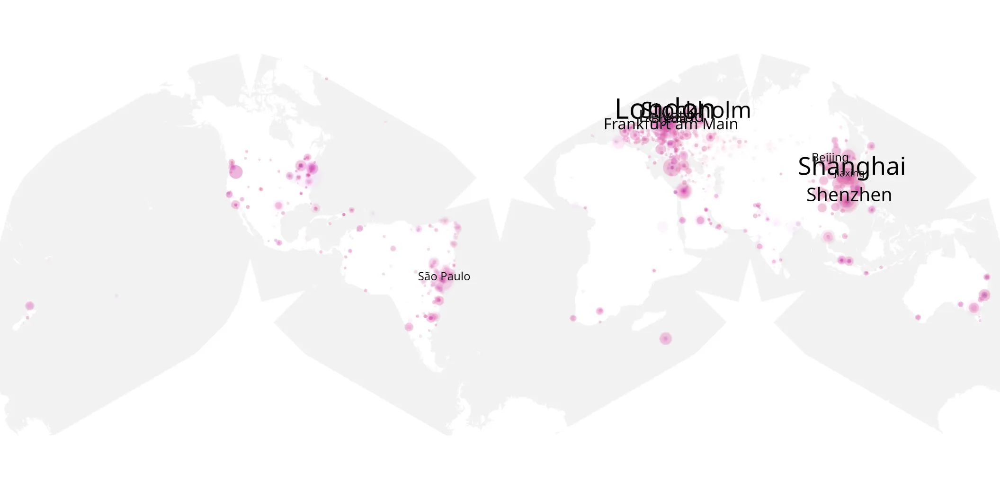
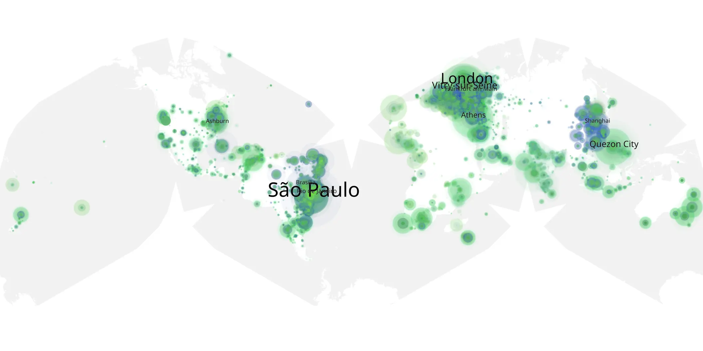

# sense8-02.1 sample cache audit

## 1. Media object

| Field | Value |
| --- | --- |
| Media object | Sense8 |
| Collection key | `sense8-02.1` |
| imdb_id | [tt2431438](https://www.imdb.com/title/tt2431438/) |
| wikipedia_url | [Sense8](https://en.wikipedia.org/wiki/Sense8) |
| Sample dates | 2017-05-05-to-2017-08-27 |
| Sample days | 115 |
| BTIH count | 118 |
| Unique BTIH count | 114 |
| Downloaders total | 1,764,590 |
| Uploaders total | 956,316 |
| Data version | `2026-08-05` |
| IP geolocation version | `6:1777968300` |

## 2. Sample coverage report

- Generated: 2026-09-08T01:09:27Z
- Sample archive directory: `/mnt/gold/src/alpha60-samples-raw.gold/sense8-02.1.xz`
- Hour directories: 209
- Zero-length sample files: 0
- Other unparsable sample files: 0
- Hourly discontinuities: 208 (2514 missing hours)
- Missing days: 78

### Sample archive discontinuities

- hourly gap: last `2017-05-05 11:00`, resumed `2017-05-05 15:00` — missing 3 hour(s)
- hourly gap: last `2017-05-05 15:00`, resumed `2017-05-05 18:59` — missing 2 hour(s)
- hourly gap: last `2017-05-05 18:59`, resumed `2017-05-05 22:59` — missing 3 hour(s)
- hourly gap: last `2017-05-05 22:59`, resumed `2017-05-06 02:59` — missing 3 hour(s)
- hourly gap: last `2017-05-06 02:59`, resumed `2017-05-06 06:59` — missing 3 hour(s)
- hourly gap: last `2017-05-06 06:59`, resumed `2017-05-06 10:59` — missing 3 hour(s)
- hourly gap: last `2017-05-06 10:59`, resumed `2017-05-06 14:59` — missing 3 hour(s)
- hourly gap: last `2017-05-06 14:59`, resumed `2017-05-06 18:59` — missing 3 hour(s)
- hourly gap: last `2017-05-06 18:59`, resumed `2017-05-06 22:58` — missing 2 hour(s)
- hourly gap: last `2017-05-06 22:58`, resumed `2017-05-07 02:58` — missing 3 hour(s)
- hourly gap: last `2017-05-07 02:58`, resumed `2017-05-07 06:58` — missing 3 hour(s)
- hourly gap: last `2017-05-07 06:58`, resumed `2017-05-07 10:58` — missing 3 hour(s)
- hourly gap: last `2017-05-07 10:58`, resumed `2017-05-07 14:58` — missing 3 hour(s)
- hourly gap: last `2017-05-07 14:58`, resumed `2017-05-07 18:58` — missing 3 hour(s)
- hourly gap: last `2017-05-07 18:58`, resumed `2017-05-07 22:58` — missing 3 hour(s)
- hourly gap: last `2017-05-07 22:58`, resumed `2017-05-08 07:11` — missing 7 hour(s)
- hourly gap: last `2017-05-08 07:11`, resumed `2017-05-08 10:59` — missing 2 hour(s)
- hourly gap: last `2017-05-08 10:59`, resumed `2017-05-08 14:58` — missing 2 hour(s)
- hourly gap: last `2017-05-08 14:58`, resumed `2017-05-08 18:58` — missing 3 hour(s)
- hourly gap: last `2017-05-08 18:58`, resumed `2017-05-08 22:58` — missing 3 hour(s)
- hourly gap: last `2017-05-08 22:58`, resumed `2017-05-09 02:58` — missing 3 hour(s)
- hourly gap: last `2017-05-09 02:58`, resumed `2017-05-09 06:58` — missing 3 hour(s)
- hourly gap: last `2017-05-09 06:58`, resumed `2017-05-09 10:58` — missing 3 hour(s)
- hourly gap: last `2017-05-09 10:58`, resumed `2017-05-09 14:58` — missing 3 hour(s)
- hourly gap: last `2017-05-09 14:58`, resumed `2017-05-09 18:58` — missing 3 hour(s)
- hourly gap: last `2017-05-09 18:58`, resumed `2017-05-09 22:58` — missing 3 hour(s)
- hourly gap: last `2017-05-09 22:58`, resumed `2017-05-10 02:58` — missing 3 hour(s)
- hourly gap: last `2017-05-10 02:58`, resumed `2017-05-10 06:58` — missing 3 hour(s)
- hourly gap: last `2017-05-10 06:58`, resumed `2017-05-10 10:59` — missing 3 hour(s)
- hourly gap: last `2017-05-10 10:59`, resumed `2017-05-10 15:00` — missing 3 hour(s)
- hourly gap: last `2017-05-10 15:00`, resumed `2017-05-10 19:00` — missing 3 hour(s)
- hourly gap: last `2017-05-10 19:00`, resumed `2017-05-10 23:00` — missing 3 hour(s)
- hourly gap: last `2017-05-10 23:00`, resumed `2017-05-11 03:00` — missing 3 hour(s)
- hourly gap: last `2017-05-11 03:00`, resumed `2017-05-11 07:00` — missing 3 hour(s)
- hourly gap: last `2017-05-11 07:00`, resumed `2017-05-11 11:00` — missing 3 hour(s)
- hourly gap: last `2017-05-11 11:00`, resumed `2017-05-11 15:00` — missing 3 hour(s)
- hourly gap: last `2017-05-11 15:00`, resumed `2017-05-11 19:00` — missing 3 hour(s)
- hourly gap: last `2017-05-11 19:00`, resumed `2017-05-11 23:00` — missing 3 hour(s)
- hourly gap: last `2017-05-11 23:00`, resumed `2017-05-12 03:00` — missing 3 hour(s)
- hourly gap: last `2017-05-12 03:00`, resumed `2017-05-12 07:00` — missing 3 hour(s)
- hourly gap: last `2017-05-12 07:00`, resumed `2017-05-12 11:00` — missing 3 hour(s)
- hourly gap: last `2017-05-12 11:00`, resumed `2017-05-12 15:00` — missing 3 hour(s)
- hourly gap: last `2017-05-12 15:00`, resumed `2017-05-12 19:00` — missing 3 hour(s)
- hourly gap: last `2017-05-12 19:00`, resumed `2017-05-12 23:00` — missing 3 hour(s)
- hourly gap: last `2017-05-12 23:00`, resumed `2017-05-13 03:00` — missing 3 hour(s)
- hourly gap: last `2017-05-13 03:00`, resumed `2017-05-13 07:00` — missing 3 hour(s)
- hourly gap: last `2017-05-13 07:00`, resumed `2017-05-13 11:00` — missing 3 hour(s)
- hourly gap: last `2017-05-13 11:00`, resumed `2017-05-13 15:00` — missing 3 hour(s)
- hourly gap: last `2017-05-13 15:00`, resumed `2017-05-14 11:00` — missing 19 hour(s)
- hourly gap: last `2017-05-14 11:00`, resumed `2017-05-14 15:00` — missing 3 hour(s)
- hourly gap: last `2017-05-14 15:00`, resumed `2017-05-14 19:00` — missing 3 hour(s)
- hourly gap: last `2017-05-14 19:00`, resumed `2017-05-14 23:00` — missing 3 hour(s)
- hourly gap: last `2017-05-14 23:00`, resumed `2017-05-15 03:00` — missing 3 hour(s)
- hourly gap: last `2017-05-15 03:00`, resumed `2017-05-15 07:00` — missing 3 hour(s)
- hourly gap: last `2017-05-15 07:00`, resumed `2017-05-15 11:00` — missing 3 hour(s)
- hourly gap: last `2017-05-15 11:00`, resumed `2017-05-15 15:00` — missing 3 hour(s)
- hourly gap: last `2017-05-15 15:00`, resumed `2017-05-15 19:00` — missing 3 hour(s)
- hourly gap: last `2017-05-15 19:00`, resumed `2017-05-15 23:00` — missing 3 hour(s)
- hourly gap: last `2017-05-15 23:00`, resumed `2017-05-16 03:00` — missing 3 hour(s)
- hourly gap: last `2017-05-16 03:00`, resumed `2017-05-16 07:00` — missing 3 hour(s)
- hourly gap: last `2017-05-16 07:00`, resumed `2017-05-16 11:00` — missing 3 hour(s)
- hourly gap: last `2017-05-16 11:00`, resumed `2017-05-16 15:00` — missing 3 hour(s)
- hourly gap: last `2017-05-16 15:00`, resumed `2017-05-16 19:00` — missing 3 hour(s)
- hourly gap: last `2017-05-16 19:00`, resumed `2017-05-16 23:00` — missing 3 hour(s)
- hourly gap: last `2017-05-16 23:00`, resumed `2017-05-17 03:00` — missing 3 hour(s)
- hourly gap: last `2017-05-17 03:00`, resumed `2017-05-17 07:00` — missing 3 hour(s)
- hourly gap: last `2017-05-17 07:00`, resumed `2017-05-17 11:00` — missing 3 hour(s)
- hourly gap: last `2017-05-17 11:00`, resumed `2017-05-17 15:00` — missing 3 hour(s)
- hourly gap: last `2017-05-17 15:00`, resumed `2017-05-17 19:00` — missing 3 hour(s)
- hourly gap: last `2017-05-17 19:00`, resumed `2017-05-17 23:00` — missing 3 hour(s)
- hourly gap: last `2017-05-17 23:00`, resumed `2017-05-18 03:00` — missing 3 hour(s)
- hourly gap: last `2017-05-18 03:00`, resumed `2017-05-18 07:00` — missing 3 hour(s)
- hourly gap: last `2017-05-18 07:00`, resumed `2017-05-18 10:08` — missing 2 hour(s)
- hourly gap: last `2017-05-18 10:08`, resumed `2017-05-18 14:08` — missing 3 hour(s)
- hourly gap: last `2017-05-18 14:08`, resumed `2017-05-18 18:08` — missing 3 hour(s)
- hourly gap: last `2017-05-18 18:08`, resumed `2017-05-18 22:08` — missing 3 hour(s)
- hourly gap: last `2017-05-18 22:08`, resumed `2017-05-19 02:08` — missing 3 hour(s)
- hourly gap: last `2017-05-19 02:08`, resumed `2017-05-19 06:08` — missing 3 hour(s)
- hourly gap: last `2017-05-19 06:08`, resumed `2017-05-19 10:08` — missing 3 hour(s)
- hourly gap: last `2017-05-19 10:08`, resumed `2017-05-19 14:08` — missing 3 hour(s)
- hourly gap: last `2017-05-19 14:08`, resumed `2017-05-19 18:08` — missing 3 hour(s)
- hourly gap: last `2017-05-19 18:08`, resumed `2017-05-19 22:08` — missing 3 hour(s)
- hourly gap: last `2017-05-19 22:08`, resumed `2017-05-20 02:08` — missing 3 hour(s)
- hourly gap: last `2017-05-20 02:08`, resumed `2017-05-20 06:08` — missing 3 hour(s)
- hourly gap: last `2017-05-20 06:08`, resumed `2017-05-20 10:08` — missing 3 hour(s)
- hourly gap: last `2017-05-20 10:08`, resumed `2017-05-20 14:08` — missing 3 hour(s)
- hourly gap: last `2017-05-20 14:08`, resumed `2017-05-20 18:08` — missing 3 hour(s)
- hourly gap: last `2017-05-20 18:08`, resumed `2017-05-20 22:08` — missing 3 hour(s)
- hourly gap: last `2017-05-20 22:08`, resumed `2017-05-21 02:08` — missing 3 hour(s)
- hourly gap: last `2017-05-21 02:08`, resumed `2017-05-21 06:08` — missing 3 hour(s)
- hourly gap: last `2017-05-21 06:08`, resumed `2017-05-21 10:08` — missing 3 hour(s)
- hourly gap: last `2017-05-21 10:08`, resumed `2017-05-21 14:08` — missing 3 hour(s)
- hourly gap: last `2017-05-21 14:08`, resumed `2017-05-21 18:08` — missing 3 hour(s)
- hourly gap: last `2017-05-21 18:08`, resumed `2017-05-21 22:08` — missing 3 hour(s)
- hourly gap: last `2017-05-21 22:08`, resumed `2017-05-22 02:08` — missing 3 hour(s)
- hourly gap: last `2017-05-22 02:08`, resumed `2017-05-22 06:08` — missing 3 hour(s)
- hourly gap: last `2017-05-22 06:08`, resumed `2017-05-22 10:08` — missing 3 hour(s)
- hourly gap: last `2017-05-22 10:08`, resumed `2017-05-22 14:08` — missing 3 hour(s)
- hourly gap: last `2017-05-22 14:08`, resumed `2017-05-22 18:08` — missing 3 hour(s)
- hourly gap: last `2017-05-22 18:08`, resumed `2017-05-22 22:08` — missing 3 hour(s)
- hourly gap: last `2017-05-22 22:08`, resumed `2017-05-23 02:08` — missing 3 hour(s)
- hourly gap: last `2017-05-23 02:08`, resumed `2017-05-23 06:08` — missing 3 hour(s)
- hourly gap: last `2017-05-23 06:08`, resumed `2017-05-23 10:08` — missing 3 hour(s)
- hourly gap: last `2017-05-23 10:08`, resumed `2017-05-23 14:08` — missing 3 hour(s)
- hourly gap: last `2017-05-23 14:08`, resumed `2017-05-23 18:08` — missing 3 hour(s)
- hourly gap: last `2017-05-23 18:08`, resumed `2017-05-23 22:08` — missing 3 hour(s)
- hourly gap: last `2017-05-23 22:08`, resumed `2017-05-24 02:08` — missing 3 hour(s)
- hourly gap: last `2017-05-24 02:08`, resumed `2017-05-24 06:08` — missing 3 hour(s)
- hourly gap: last `2017-05-24 06:08`, resumed `2017-05-24 10:08` — missing 3 hour(s)
- hourly gap: last `2017-05-24 10:08`, resumed `2017-05-24 14:08` — missing 3 hour(s)
- hourly gap: last `2017-05-24 14:08`, resumed `2017-05-24 18:08` — missing 3 hour(s)
- hourly gap: last `2017-05-24 18:08`, resumed `2017-05-24 22:08` — missing 3 hour(s)
- hourly gap: last `2017-05-24 22:08`, resumed `2017-05-25 02:08` — missing 3 hour(s)
- hourly gap: last `2017-05-25 02:08`, resumed `2017-05-25 06:08` — missing 3 hour(s)
- hourly gap: last `2017-05-25 06:08`, resumed `2017-05-25 10:08` — missing 3 hour(s)
- hourly gap: last `2017-05-25 10:08`, resumed `2017-05-25 14:08` — missing 3 hour(s)
- hourly gap: last `2017-05-25 14:08`, resumed `2017-05-25 18:08` — missing 3 hour(s)
- hourly gap: last `2017-05-25 18:08`, resumed `2017-05-25 22:08` — missing 3 hour(s)
- hourly gap: last `2017-05-25 22:08`, resumed `2017-05-26 02:08` — missing 3 hour(s)
- hourly gap: last `2017-05-26 02:08`, resumed `2017-05-26 06:08` — missing 3 hour(s)
- hourly gap: last `2017-05-26 06:08`, resumed `2017-05-26 10:08` — missing 3 hour(s)
- hourly gap: last `2017-05-26 10:08`, resumed `2017-05-26 14:08` — missing 3 hour(s)
- hourly gap: last `2017-05-26 14:08`, resumed `2017-05-26 18:08` — missing 3 hour(s)
- hourly gap: last `2017-05-26 18:08`, resumed `2017-05-26 22:08` — missing 3 hour(s)
- hourly gap: last `2017-05-26 22:08`, resumed `2017-05-27 02:08` — missing 3 hour(s)
- hourly gap: last `2017-05-27 02:08`, resumed `2017-05-27 06:08` — missing 3 hour(s)
- hourly gap: last `2017-05-27 06:08`, resumed `2017-05-27 10:08` — missing 3 hour(s)
- hourly gap: last `2017-05-27 10:08`, resumed `2017-05-27 14:08` — missing 3 hour(s)
- hourly gap: last `2017-05-27 14:08`, resumed `2017-05-27 18:08` — missing 3 hour(s)
- hourly gap: last `2017-05-27 18:08`, resumed `2017-05-27 22:08` — missing 3 hour(s)
- hourly gap: last `2017-05-27 22:08`, resumed `2017-05-28 02:08` — missing 3 hour(s)
- hourly gap: last `2017-05-28 02:08`, resumed `2017-05-28 06:08` — missing 3 hour(s)
- hourly gap: last `2017-05-28 06:08`, resumed `2017-05-28 10:08` — missing 3 hour(s)
- hourly gap: last `2017-05-28 10:08`, resumed `2017-05-28 14:08` — missing 3 hour(s)
- hourly gap: last `2017-05-28 14:08`, resumed `2017-05-28 18:08` — missing 3 hour(s)
- hourly gap: last `2017-05-28 18:08`, resumed `2017-05-28 22:08` — missing 3 hour(s)
- hourly gap: last `2017-05-28 22:08`, resumed `2017-05-29 02:08` — missing 3 hour(s)
- hourly gap: last `2017-05-29 02:08`, resumed `2017-05-29 06:08` — missing 3 hour(s)
- hourly gap: last `2017-05-29 06:08`, resumed `2017-05-29 10:08` — missing 3 hour(s)
- hourly gap: last `2017-05-29 10:08`, resumed `2017-05-29 14:08` — missing 3 hour(s)
- hourly gap: last `2017-05-29 14:08`, resumed `2017-05-29 18:08` — missing 3 hour(s)
- hourly gap: last `2017-05-29 18:08`, resumed `2017-05-29 22:08` — missing 3 hour(s)
- hourly gap: last `2017-05-29 22:08`, resumed `2017-05-30 02:08` — missing 3 hour(s)
- hourly gap: last `2017-05-30 02:08`, resumed `2017-05-30 06:03` — missing 2 hour(s)
- hourly gap: last `2017-05-30 06:03`, resumed `2017-05-30 09:00` — missing 1 hour(s)
- hourly gap: last `2017-05-30 09:00`, resumed `2017-05-30 13:00` — missing 3 hour(s)
- hourly gap: last `2017-05-30 13:00`, resumed `2017-05-30 17:00` — missing 3 hour(s)
- hourly gap: last `2017-05-30 17:00`, resumed `2017-05-30 21:00` — missing 3 hour(s)
- hourly gap: last `2017-05-30 21:00`, resumed `2017-05-31 01:00` — missing 3 hour(s)
- hourly gap: last `2017-05-31 01:00`, resumed `2017-05-31 05:00` — missing 3 hour(s)
- hourly gap: last `2017-05-31 05:00`, resumed `2017-05-31 09:00` — missing 3 hour(s)
- hourly gap: last `2017-05-31 09:00`, resumed `2017-05-31 13:00` — missing 3 hour(s)
- hourly gap: last `2017-05-31 13:00`, resumed `2017-05-31 17:00` — missing 3 hour(s)
- hourly gap: last `2017-05-31 17:00`, resumed `2017-05-31 21:00` — missing 3 hour(s)
- hourly gap: last `2017-05-31 21:00`, resumed `2017-06-01 01:00` — missing 3 hour(s)
- hourly gap: last `2017-06-01 01:00`, resumed `2017-06-01 05:00` — missing 3 hour(s)
- hourly gap: last `2017-06-01 05:00`, resumed `2017-06-01 09:00` — missing 3 hour(s)
- hourly gap: last `2017-06-01 09:00`, resumed `2017-06-01 13:00` — missing 3 hour(s)
- hourly gap: last `2017-06-01 13:00`, resumed `2017-06-01 17:00` — missing 3 hour(s)
- hourly gap: last `2017-06-01 17:00`, resumed `2017-06-01 21:00` — missing 3 hour(s)
- hourly gap: last `2017-06-01 21:00`, resumed `2017-06-02 01:00` — missing 3 hour(s)
- hourly gap: last `2017-06-02 01:00`, resumed `2017-06-02 05:00` — missing 3 hour(s)
- hourly gap: last `2017-06-02 05:00`, resumed `2017-06-02 09:00` — missing 3 hour(s)
- hourly gap: last `2017-06-02 09:00`, resumed `2017-06-02 13:00` — missing 3 hour(s)
- hourly gap: last `2017-06-02 13:00`, resumed `2017-06-02 17:00` — missing 3 hour(s)
- hourly gap: last `2017-06-02 17:00`, resumed `2017-06-02 21:00` — missing 3 hour(s)
- hourly gap: last `2017-06-02 21:00`, resumed `2017-06-03 01:00` — missing 3 hour(s)
- hourly gap: last `2017-06-03 01:00`, resumed `2017-06-03 05:00` — missing 3 hour(s)
- hourly gap: last `2017-06-03 05:00`, resumed `2017-06-03 09:00` — missing 3 hour(s)
- hourly gap: last `2017-06-03 09:00`, resumed `2017-06-03 13:00` — missing 3 hour(s)
- hourly gap: last `2017-06-03 13:00`, resumed `2017-06-03 17:00` — missing 3 hour(s)
- hourly gap: last `2017-06-03 17:00`, resumed `2017-06-03 21:00` — missing 3 hour(s)
- hourly gap: last `2017-06-03 21:00`, resumed `2017-06-04 01:00` — missing 3 hour(s)
- hourly gap: last `2017-06-04 01:00`, resumed `2017-06-04 05:00` — missing 3 hour(s)
- hourly gap: last `2017-06-04 05:00`, resumed `2017-06-04 09:00` — missing 3 hour(s)
- hourly gap: last `2017-06-04 09:00`, resumed `2017-06-04 13:00` — missing 3 hour(s)
- hourly gap: last `2017-06-04 13:00`, resumed `2017-06-04 17:00` — missing 3 hour(s)
- hourly gap: last `2017-06-04 17:00`, resumed `2017-06-04 21:00` — missing 3 hour(s)
- hourly gap: last `2017-06-04 21:00`, resumed `2017-06-05 01:00` — missing 3 hour(s)
- hourly gap: last `2017-06-05 01:00`, resumed `2017-06-05 05:00` — missing 3 hour(s)
- hourly gap: last `2017-06-05 05:00`, resumed `2017-06-05 09:00` — missing 3 hour(s)
- hourly gap: last `2017-06-05 09:00`, resumed `2017-06-05 13:00` — missing 3 hour(s)
- hourly gap: last `2017-06-05 13:00`, resumed `2017-06-05 17:00` — missing 3 hour(s)
- hourly gap: last `2017-06-05 17:00`, resumed `2017-06-05 21:00` — missing 3 hour(s)
- hourly gap: last `2017-06-05 21:00`, resumed `2017-06-06 01:00` — missing 3 hour(s)
- hourly gap: last `2017-06-06 01:00`, resumed `2017-06-06 05:00` — missing 3 hour(s)
- hourly gap: last `2017-06-06 05:00`, resumed `2017-06-06 09:00` — missing 3 hour(s)
- hourly gap: last `2017-06-06 09:00`, resumed `2017-06-06 13:00` — missing 3 hour(s)
- hourly gap: last `2017-06-06 13:00`, resumed `2017-06-06 17:00` — missing 3 hour(s)
- hourly gap: last `2017-06-06 17:00`, resumed `2017-06-06 21:00` — missing 3 hour(s)
- hourly gap: last `2017-06-06 21:00`, resumed `2017-06-07 01:00` — missing 3 hour(s)
- hourly gap: last `2017-06-07 01:00`, resumed `2017-06-07 05:00` — missing 3 hour(s)
- hourly gap: last `2017-06-07 05:00`, resumed `2017-06-07 09:00` — missing 3 hour(s)
- hourly gap: last `2017-06-07 09:00`, resumed `2017-06-07 13:00` — missing 3 hour(s)
- hourly gap: last `2017-06-07 13:00`, resumed `2017-06-07 17:00` — missing 3 hour(s)
- hourly gap: last `2017-06-07 17:00`, resumed `2017-06-07 21:00` — missing 3 hour(s)
- hourly gap: last `2017-06-07 21:00`, resumed `2017-08-25 07:30` — missing 1881 hour(s)
- hourly gap: last `2017-08-25 07:30`, resumed `2017-08-25 11:30` — missing 3 hour(s)
- hourly gap: last `2017-08-25 11:30`, resumed `2017-08-25 15:30` — missing 3 hour(s)
- hourly gap: last `2017-08-25 15:30`, resumed `2017-08-25 19:30` — missing 3 hour(s)
- hourly gap: last `2017-08-25 19:30`, resumed `2017-08-25 23:30` — missing 3 hour(s)
- hourly gap: last `2017-08-25 23:30`, resumed `2017-08-26 03:30` — missing 3 hour(s)
- hourly gap: last `2017-08-26 03:30`, resumed `2017-08-26 07:30` — missing 3 hour(s)
- hourly gap: last `2017-08-26 07:30`, resumed `2017-08-26 11:30` — missing 3 hour(s)
- hourly gap: last `2017-08-26 11:30`, resumed `2017-08-26 15:30` — missing 3 hour(s)
- hourly gap: last `2017-08-26 15:30`, resumed `2017-08-26 19:30` — missing 3 hour(s)
- hourly gap: last `2017-08-26 19:30`, resumed `2017-08-26 23:30` — missing 3 hour(s)
- hourly gap: last `2017-08-26 23:30`, resumed `2017-08-27 03:30` — missing 3 hour(s)
- missing day: `2017-06-08`
- missing day: `2017-06-09`
- missing day: `2017-06-10`
- missing day: `2017-06-11`
- missing day: `2017-06-12`
- missing day: `2017-06-13`
- missing day: `2017-06-14`
- missing day: `2017-06-15`
- missing day: `2017-06-16`
- missing day: `2017-06-17`
- missing day: `2017-06-18`
- missing day: `2017-06-19`
- missing day: `2017-06-20`
- missing day: `2017-06-21`
- missing day: `2017-06-22`
- missing day: `2017-06-23`
- missing day: `2017-06-24`
- missing day: `2017-06-25`
- missing day: `2017-06-26`
- missing day: `2017-06-27`
- missing day: `2017-06-28`
- missing day: `2017-06-29`
- missing day: `2017-06-30`
- missing day: `2017-07-01`
- missing day: `2017-07-02`
- missing day: `2017-07-03`
- missing day: `2017-07-04`
- missing day: `2017-07-05`
- missing day: `2017-07-06`
- missing day: `2017-07-07`
- missing day: `2017-07-08`
- missing day: `2017-07-09`
- missing day: `2017-07-10`
- missing day: `2017-07-11`
- missing day: `2017-07-12`
- missing day: `2017-07-13`
- missing day: `2017-07-14`
- missing day: `2017-07-15`
- missing day: `2017-07-16`
- missing day: `2017-07-17`
- missing day: `2017-07-18`
- missing day: `2017-07-19`
- missing day: `2017-07-20`
- missing day: `2017-07-21`
- missing day: `2017-07-22`
- missing day: `2017-07-23`
- missing day: `2017-07-24`
- missing day: `2017-07-25`
- missing day: `2017-07-26`
- missing day: `2017-07-27`
- missing day: `2017-07-28`
- missing day: `2017-07-29`
- missing day: `2017-07-30`
- missing day: `2017-07-31`
- missing day: `2017-08-01`
- missing day: `2017-08-02`
- missing day: `2017-08-03`
- missing day: `2017-08-04`
- missing day: `2017-08-05`
- missing day: `2017-08-06`
- missing day: `2017-08-07`
- missing day: `2017-08-08`
- missing day: `2017-08-09`
- missing day: `2017-08-10`
- missing day: `2017-08-11`
- missing day: `2017-08-12`
- missing day: `2017-08-13`
- missing day: `2017-08-14`
- missing day: `2017-08-15`
- missing day: `2017-08-16`
- missing day: `2017-08-17`
- missing day: `2017-08-18`
- missing day: `2017-08-19`
- missing day: `2017-08-20`
- missing day: `2017-08-21`
- missing day: `2017-08-22`
- missing day: `2017-08-23`
- missing day: `2017-08-24`

## 3. Media objects file size histogram

## 4. Visualization pass — graphs

### Downloads by week cumulative (normalized start)



### Downloads by day, Saturday and Sunday in gray

## 5. Visualization pass — maps

### Cumulative geographic slices

| Africa | Americas | Asia | Europe | Oceania | Unknown |
| --- | --- | --- | --- | --- | --- |
| 8.43 | 27.92 | 19.01 | 33.25 | 2.88 | 0.79 |

### Cumulative network infrastructure

{:target="_blank" rel="noopener"}

### Cumulative data maps

**Cumulative >= 1080p**

{:target="_blank" rel="noopener"}

**Cumulative < 1080p**

{:target="_blank" rel="noopener"}
