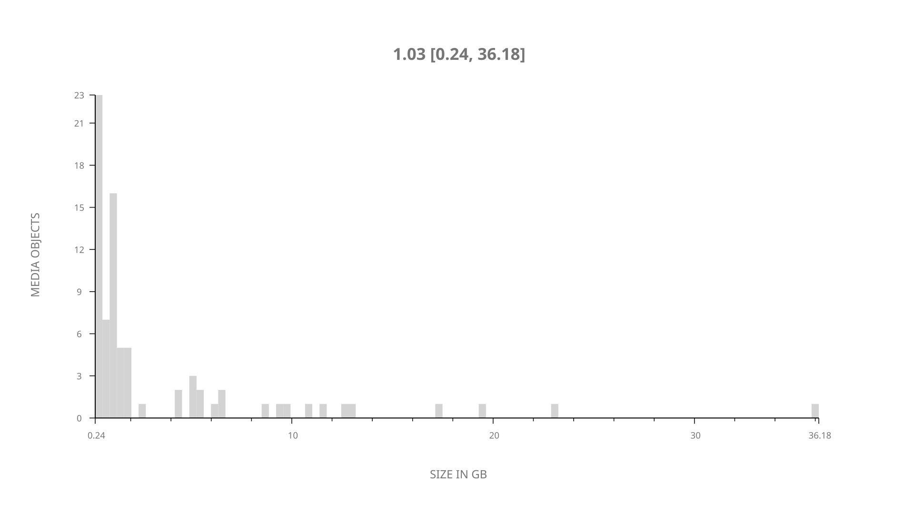
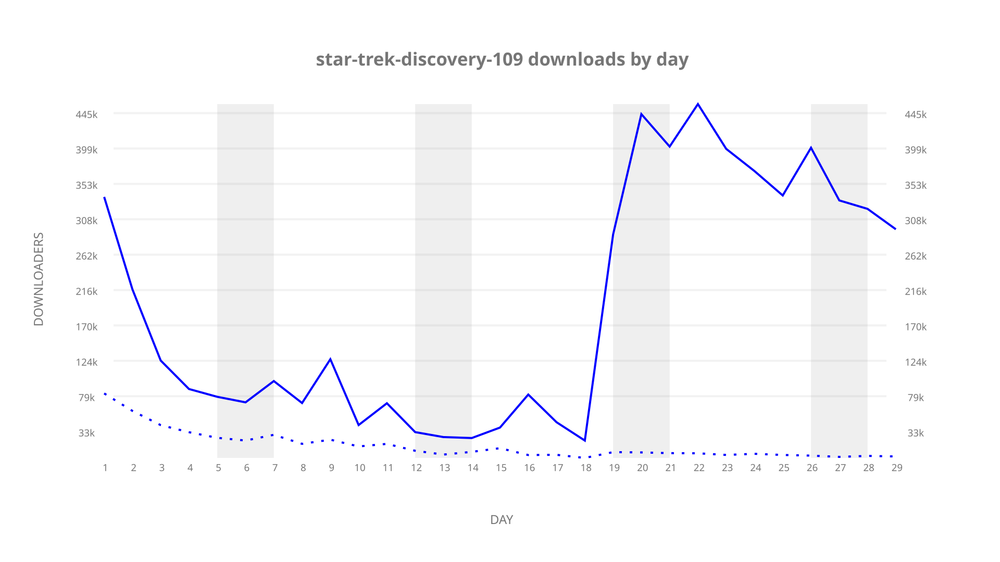
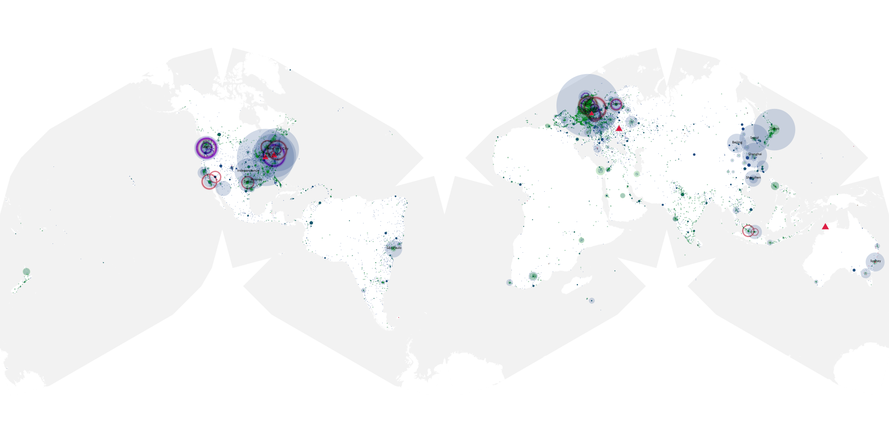
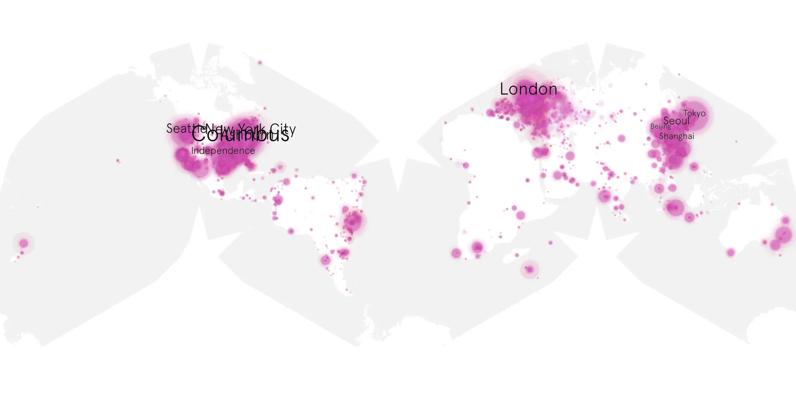
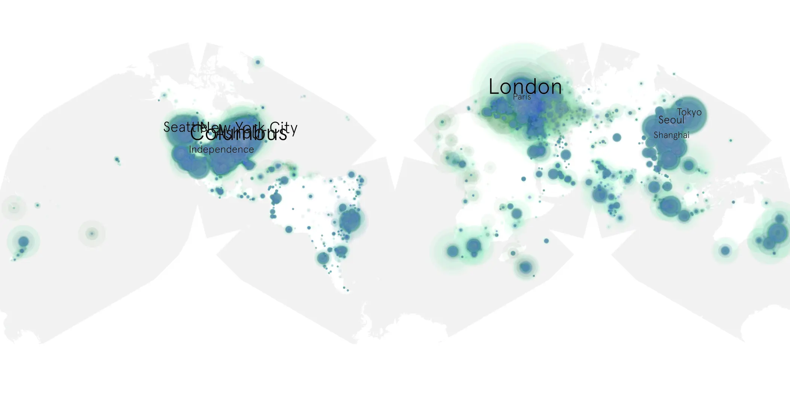

# star-trek-discovery-109 sample cache audit

## 1. Media object

| Field | Value |
| --- | --- |
| Media object | Star Trek Discovery |
| Collection key | `star-trek-discovery-109` |
| imdb_id | [tt5171438](https://www.imdb.com/title/tt5171438/) |
| wikipedia_url | [Star Trek: Discovery](https://en.wikipedia.org/wiki/Star_Trek:_Discovery) |
| Sample dates | 2017-11-13-to-2017-12-11 |
| Sample days | 29 |
| BTIH count | 100 |
| Unique BTIH count | 78 |
| Downloaders total | 4,840,256 |
| Uploaders total | 927,602 |
| Data version | `2026-08-05` |
| IP geolocation version | `6:1777968300` |

## 2. Sample coverage report

- Generated: 2026-09-09T01:10:36Z
- Sample archive directory: `/mnt/gold/src/alpha60-samples-raw.gold/star-trek-discovery-109.xz`
- Hour directories: 681
- Zero-length sample files: 0
- Other unparsable sample files: 0
- Hourly discontinuities: 4 (12 missing hours)
- Missing days: 0

### Sample archive discontinuities

- hourly gap: last `2017-11-22 22:00`, resumed `2017-11-23 00:00` — missing 1 hour(s)
- hourly gap: last `2017-11-25 14:00`, resumed `2017-11-25 23:01` — missing 8 hour(s)
- hourly gap: last `2017-11-26 16:00`, resumed `2017-11-26 18:00` — missing 1 hour(s)
- hourly gap: last `2017-11-28 00:00`, resumed `2017-11-28 03:00` — missing 2 hour(s)

## 3. Media objects file size histogram

## 4. Visualization pass — graphs

### Downloads by week cumulative (normalized start)



### Downloads by day, Saturday and Sunday in gray

## 5. Visualization pass — maps

### Cumulative geographic slices

| Africa | Americas | Asia | Europe | Oceania | Unknown |
| --- | --- | --- | --- | --- | --- |
| 3.25 | 36.46 | 17.74 | 24.79 | 2.15 | 10.10 |

### Cumulative network infrastructure

{:target="_blank" rel="noopener"}

### Cumulative data maps

**Cumulative >= 1080p**

{:target="_blank" rel="noopener"}

**Cumulative < 1080p**

{:target="_blank" rel="noopener"}
