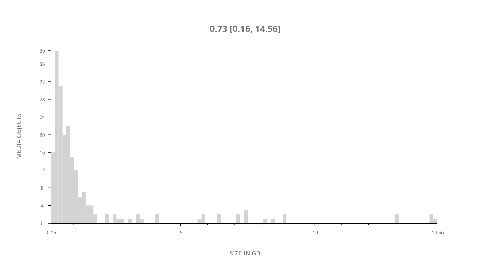
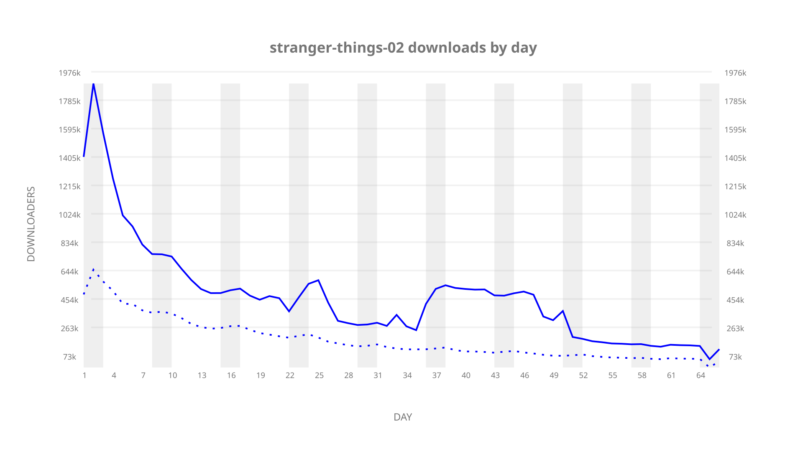
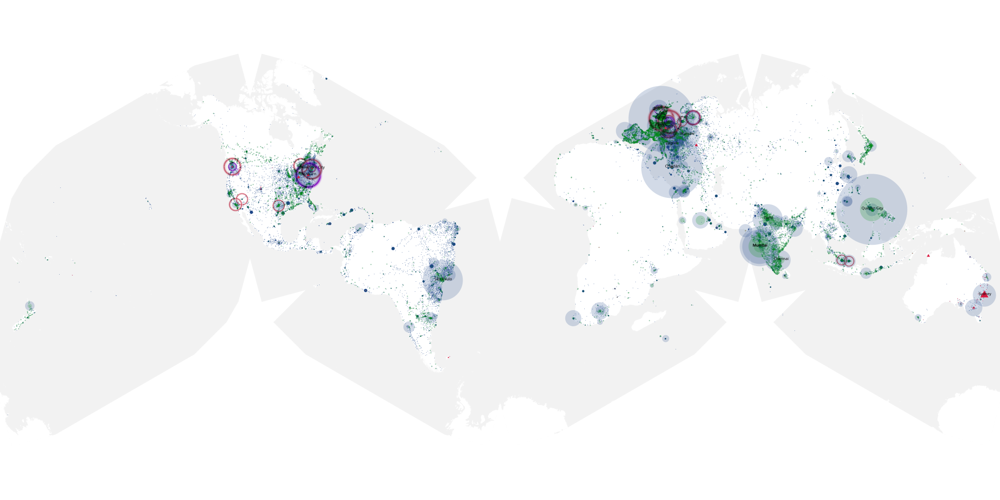
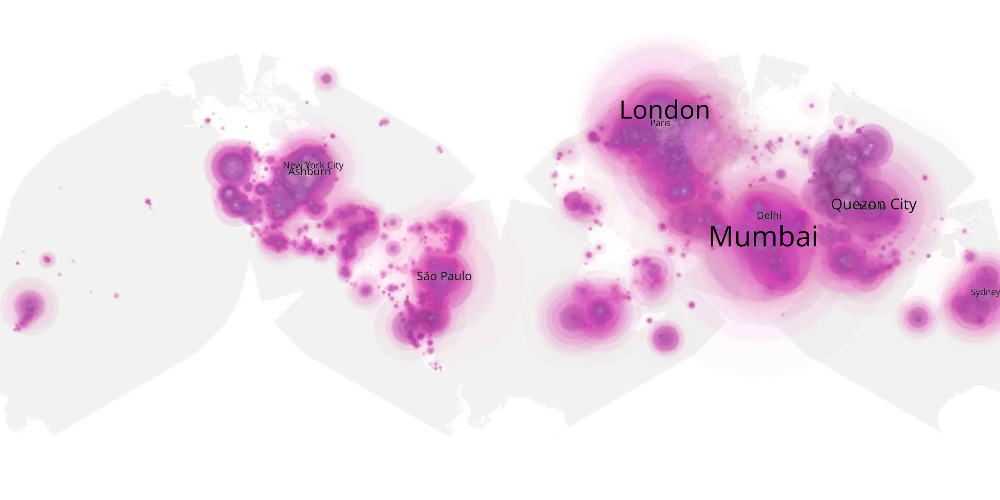
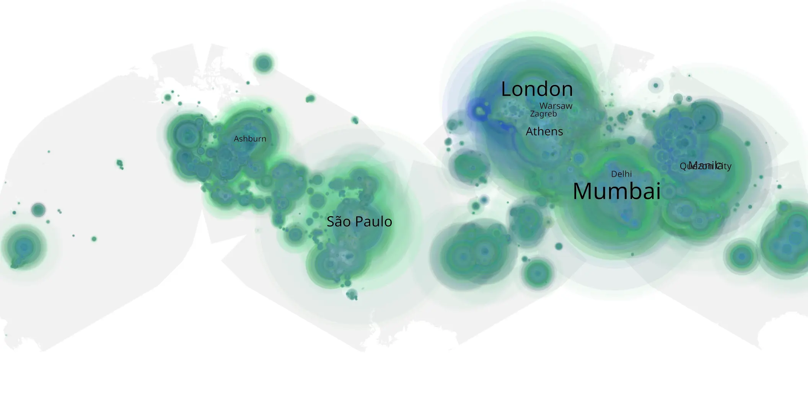

# stranger-things-02 sample cache audit

## 1. Media object

| Field | Value |
| --- | --- |
| Media object | Stranger Things |
| Collection key | `stranger-things-02` |
| imdb_id | [tt4574334](https://www.imdb.com/title/tt4574334/) |
| wikipedia_url | [Stranger Things](https://en.wikipedia.org/wiki/Stranger_Things) |
| Sample dates | 2017-10-27-to-2017-12-31 |
| Sample days | 66 |
| BTIH count | 274 |
| Unique BTIH count | 209 |
| Downloaders total | 33,765,789 |
| Uploaders total | 13,814,398 |
| Data version | `2026-08-05` |
| IP geolocation version | `6:1777968300` |

## 2. Sample coverage report

- Generated: 2026-09-08T01:09:32Z
- Sample archive directory: `/mnt/gold/src/alpha60-samples-raw.gold/stranger-things-02.xz`
- Hour directories: 1564
- Zero-length sample files: 0
- Other unparsable sample files: 0
- Hourly discontinuities: 1 (11 missing hours)
- Missing days: 0

### Sample archive discontinuities

- hourly gap: last `2017-12-30 12:00`, resumed `2017-12-31 00:22` — missing 11 hour(s)

## 3. Media objects file size histogram

## 4. Visualization pass — graphs

### Downloads by week cumulative (normalized start)



### Downloads by day, Saturday and Sunday in gray

## 5. Visualization pass — maps

### Cumulative geographic slices

| Africa | Americas | Asia | Europe | Oceania | Unknown |
| --- | --- | --- | --- | --- | --- |
| 4.99 | 24.65 | 30.09 | 31.81 | 2.83 | 2.06 |

### Cumulative network infrastructure

{:target="_blank" rel="noopener"}

### Cumulative data maps

**Cumulative >= 1080p**

{:target="_blank" rel="noopener"}

**Cumulative < 1080p**

{:target="_blank" rel="noopener"}
