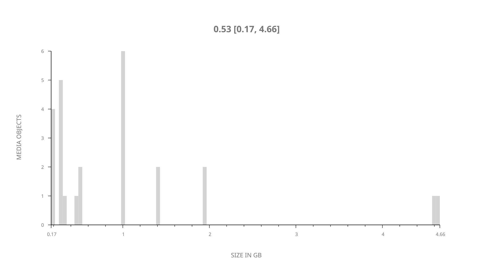
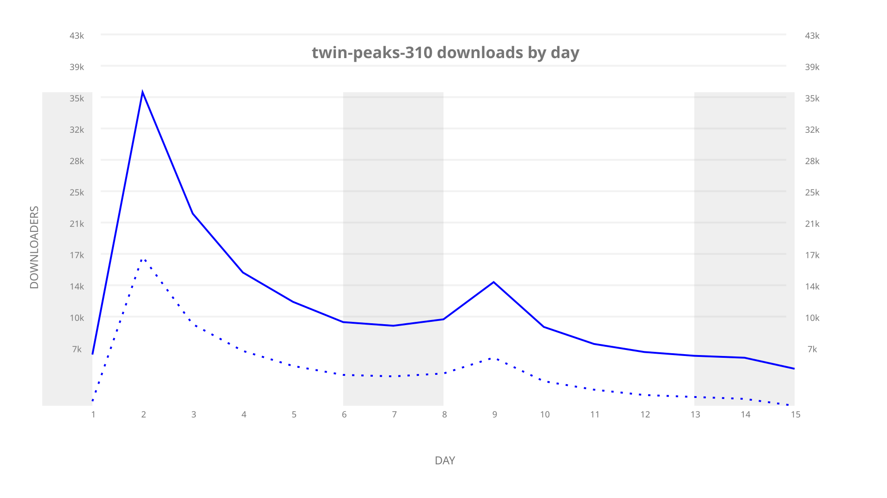
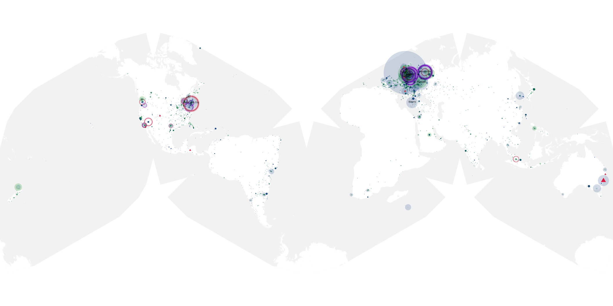
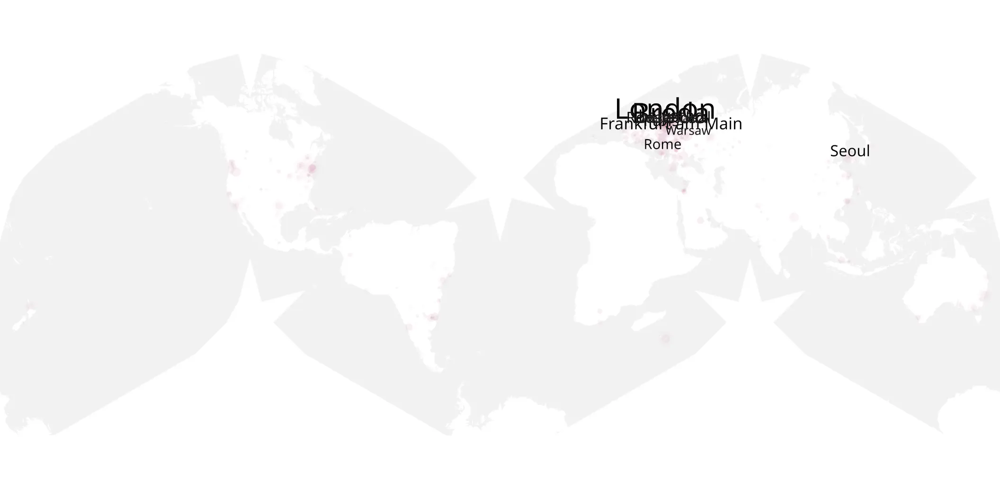
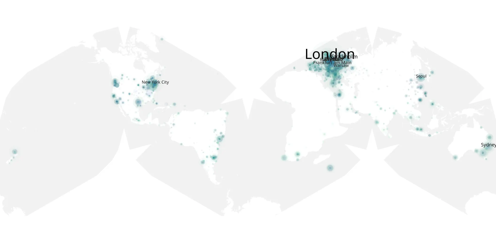

# twin-peaks-310 sample cache audit

## 1. Media object

| Field | Value |
| --- | --- |
| Media object | Twin Peaks |
| Collection key | `twin-peaks-310` |
| imdb_id | [tt4093826](https://www.imdb.com/title/tt4093826/) |
| wikipedia_url | [Twin Peaks](https://en.wikipedia.org/wiki/Twin_Peaks) |
| Sample dates | 2017-07-16-to-2017-07-30 |
| Sample days | 15 |
| BTIH count | 29 |
| Unique BTIH count | 25 |
| Downloaders total | 175,995 |
| Uploaders total | 101,800 |
| Data version | `2026-08-05` |
| IP geolocation version | `6:1777968300` |

## 2. Sample coverage report

- Generated: 2026-09-09T01:10:36Z
- Sample archive directory: `/mnt/gold/src/alpha60-samples-raw.gold/twin-peaks-310.xz`
- Hour directories: 83
- Zero-length sample files: 0
- Other unparsable sample files: 0
- Hourly discontinuities: 82 (247 missing hours)
- Missing days: 0

### Sample archive discontinuities

- hourly gap: last `2017-07-16 21:00`, resumed `2017-07-17 01:00` — missing 3 hour(s)
- hourly gap: last `2017-07-17 01:00`, resumed `2017-07-17 05:00` — missing 3 hour(s)
- hourly gap: last `2017-07-17 05:00`, resumed `2017-07-17 09:00` — missing 3 hour(s)
- hourly gap: last `2017-07-17 09:00`, resumed `2017-07-17 13:00` — missing 3 hour(s)
- hourly gap: last `2017-07-17 13:00`, resumed `2017-07-17 17:00` — missing 3 hour(s)
- hourly gap: last `2017-07-17 17:00`, resumed `2017-07-17 21:00` — missing 3 hour(s)
- hourly gap: last `2017-07-17 21:00`, resumed `2017-07-18 01:00` — missing 3 hour(s)
- hourly gap: last `2017-07-18 01:00`, resumed `2017-07-18 05:00` — missing 3 hour(s)
- hourly gap: last `2017-07-18 05:00`, resumed `2017-07-18 09:00` — missing 3 hour(s)
- hourly gap: last `2017-07-18 09:00`, resumed `2017-07-18 13:00` — missing 3 hour(s)
- hourly gap: last `2017-07-18 13:00`, resumed `2017-07-18 17:00` — missing 3 hour(s)
- hourly gap: last `2017-07-18 17:00`, resumed `2017-07-18 21:00` — missing 3 hour(s)
- hourly gap: last `2017-07-18 21:00`, resumed `2017-07-19 01:00` — missing 3 hour(s)
- hourly gap: last `2017-07-19 01:00`, resumed `2017-07-19 05:00` — missing 3 hour(s)
- hourly gap: last `2017-07-19 05:00`, resumed `2017-07-19 09:00` — missing 3 hour(s)
- hourly gap: last `2017-07-19 09:00`, resumed `2017-07-19 13:00` — missing 3 hour(s)
- hourly gap: last `2017-07-19 13:00`, resumed `2017-07-19 17:00` — missing 3 hour(s)
- hourly gap: last `2017-07-19 17:00`, resumed `2017-07-19 21:00` — missing 3 hour(s)
- hourly gap: last `2017-07-19 21:00`, resumed `2017-07-20 01:00` — missing 3 hour(s)
- hourly gap: last `2017-07-20 01:00`, resumed `2017-07-20 05:00` — missing 3 hour(s)
- hourly gap: last `2017-07-20 05:00`, resumed `2017-07-20 09:00` — missing 3 hour(s)
- hourly gap: last `2017-07-20 09:00`, resumed `2017-07-20 13:00` — missing 3 hour(s)
- hourly gap: last `2017-07-20 13:00`, resumed `2017-07-20 17:00` — missing 3 hour(s)
- hourly gap: last `2017-07-20 17:00`, resumed `2017-07-20 21:00` — missing 3 hour(s)
- hourly gap: last `2017-07-20 21:00`, resumed `2017-07-21 01:00` — missing 3 hour(s)
- hourly gap: last `2017-07-21 01:00`, resumed `2017-07-21 05:00` — missing 3 hour(s)
- hourly gap: last `2017-07-21 05:00`, resumed `2017-07-21 09:00` — missing 3 hour(s)
- hourly gap: last `2017-07-21 09:00`, resumed `2017-07-21 13:00` — missing 3 hour(s)
- hourly gap: last `2017-07-21 13:00`, resumed `2017-07-21 17:00` — missing 3 hour(s)
- hourly gap: last `2017-07-21 17:00`, resumed `2017-07-21 21:00` — missing 3 hour(s)
- hourly gap: last `2017-07-21 21:00`, resumed `2017-07-22 01:00` — missing 3 hour(s)
- hourly gap: last `2017-07-22 01:00`, resumed `2017-07-22 05:00` — missing 3 hour(s)
- hourly gap: last `2017-07-22 05:00`, resumed `2017-07-22 09:00` — missing 3 hour(s)
- hourly gap: last `2017-07-22 09:00`, resumed `2017-07-22 13:00` — missing 3 hour(s)
- hourly gap: last `2017-07-22 13:00`, resumed `2017-07-22 17:00` — missing 3 hour(s)
- hourly gap: last `2017-07-22 17:00`, resumed `2017-07-22 21:00` — missing 3 hour(s)
- hourly gap: last `2017-07-22 21:00`, resumed `2017-07-23 01:00` — missing 3 hour(s)
- hourly gap: last `2017-07-23 01:00`, resumed `2017-07-23 05:00` — missing 3 hour(s)
- hourly gap: last `2017-07-23 05:00`, resumed `2017-07-23 09:00` — missing 3 hour(s)
- hourly gap: last `2017-07-23 09:00`, resumed `2017-07-23 13:00` — missing 3 hour(s)
- hourly gap: last `2017-07-23 13:00`, resumed `2017-07-23 17:00` — missing 3 hour(s)
- hourly gap: last `2017-07-23 17:00`, resumed `2017-07-23 22:00` — missing 4 hour(s)
- hourly gap: last `2017-07-23 22:00`, resumed `2017-07-24 02:00` — missing 3 hour(s)
- hourly gap: last `2017-07-24 02:00`, resumed `2017-07-24 06:00` — missing 3 hour(s)
- hourly gap: last `2017-07-24 06:00`, resumed `2017-07-24 10:00` — missing 3 hour(s)
- hourly gap: last `2017-07-24 10:00`, resumed `2017-07-24 14:00` — missing 3 hour(s)
- hourly gap: last `2017-07-24 14:00`, resumed `2017-07-24 18:00` — missing 3 hour(s)
- hourly gap: last `2017-07-24 18:00`, resumed `2017-07-24 22:00` — missing 3 hour(s)
- hourly gap: last `2017-07-24 22:00`, resumed `2017-07-25 02:00` — missing 3 hour(s)
- hourly gap: last `2017-07-25 02:00`, resumed `2017-07-25 06:00` — missing 3 hour(s)
- hourly gap: last `2017-07-25 06:00`, resumed `2017-07-25 10:00` — missing 3 hour(s)
- hourly gap: last `2017-07-25 10:00`, resumed `2017-07-25 14:00` — missing 3 hour(s)
- hourly gap: last `2017-07-25 14:00`, resumed `2017-07-25 18:00` — missing 3 hour(s)
- hourly gap: last `2017-07-25 18:00`, resumed `2017-07-25 22:00` — missing 3 hour(s)
- hourly gap: last `2017-07-25 22:00`, resumed `2017-07-26 02:00` — missing 3 hour(s)
- hourly gap: last `2017-07-26 02:00`, resumed `2017-07-26 06:00` — missing 3 hour(s)
- hourly gap: last `2017-07-26 06:00`, resumed `2017-07-26 10:00` — missing 3 hour(s)
- hourly gap: last `2017-07-26 10:00`, resumed `2017-07-26 14:00` — missing 3 hour(s)
- hourly gap: last `2017-07-26 14:00`, resumed `2017-07-26 18:00` — missing 3 hour(s)
- hourly gap: last `2017-07-26 18:00`, resumed `2017-07-26 22:00` — missing 3 hour(s)
- hourly gap: last `2017-07-26 22:00`, resumed `2017-07-27 02:00` — missing 3 hour(s)
- hourly gap: last `2017-07-27 02:00`, resumed `2017-07-27 06:00` — missing 3 hour(s)
- hourly gap: last `2017-07-27 06:00`, resumed `2017-07-27 10:00` — missing 3 hour(s)
- hourly gap: last `2017-07-27 10:00`, resumed `2017-07-27 14:00` — missing 3 hour(s)
- hourly gap: last `2017-07-27 14:00`, resumed `2017-07-27 18:00` — missing 3 hour(s)
- hourly gap: last `2017-07-27 18:00`, resumed `2017-07-27 22:00` — missing 3 hour(s)
- hourly gap: last `2017-07-27 22:00`, resumed `2017-07-28 02:00` — missing 3 hour(s)
- hourly gap: last `2017-07-28 02:00`, resumed `2017-07-28 06:00` — missing 3 hour(s)
- hourly gap: last `2017-07-28 06:00`, resumed `2017-07-28 10:00` — missing 3 hour(s)
- hourly gap: last `2017-07-28 10:00`, resumed `2017-07-28 14:00` — missing 3 hour(s)
- hourly gap: last `2017-07-28 14:00`, resumed `2017-07-28 18:00` — missing 3 hour(s)
- hourly gap: last `2017-07-28 18:00`, resumed `2017-07-28 22:00` — missing 3 hour(s)
- hourly gap: last `2017-07-28 22:00`, resumed `2017-07-29 02:00` — missing 3 hour(s)
- hourly gap: last `2017-07-29 02:00`, resumed `2017-07-29 06:00` — missing 3 hour(s)
- hourly gap: last `2017-07-29 06:00`, resumed `2017-07-29 10:00` — missing 3 hour(s)
- hourly gap: last `2017-07-29 10:00`, resumed `2017-07-29 14:00` — missing 3 hour(s)
- hourly gap: last `2017-07-29 14:00`, resumed `2017-07-29 18:00` — missing 3 hour(s)
- hourly gap: last `2017-07-29 18:00`, resumed `2017-07-29 22:00` — missing 3 hour(s)
- hourly gap: last `2017-07-29 22:00`, resumed `2017-07-30 02:00` — missing 3 hour(s)
- hourly gap: last `2017-07-30 02:00`, resumed `2017-07-30 06:00` — missing 3 hour(s)
- hourly gap: last `2017-07-30 06:00`, resumed `2017-07-30 10:00` — missing 3 hour(s)
- hourly gap: last `2017-07-30 10:00`, resumed `2017-07-30 14:00` — missing 3 hour(s)

## 3. Media objects file size histogram

## 4. Visualization pass — graphs

### Downloads by week cumulative (normalized start)



### Downloads by day, Saturday and Sunday in gray

## 5. Visualization pass — maps

### Cumulative geographic slices

| Africa | Americas | Asia | Europe | Oceania | Unknown |
| --- | --- | --- | --- | --- | --- |
| 1.94 | 17.30 | 7.98 | 37.02 | 3.49 | 0.49 |

### Cumulative network infrastructure

{:target="_blank" rel="noopener"}

### Cumulative data maps

**Cumulative >= 1080p**

{:target="_blank" rel="noopener"}

**Cumulative < 1080p**

{:target="_blank" rel="noopener"}
