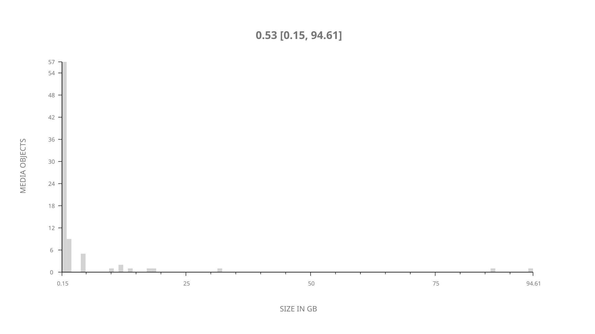
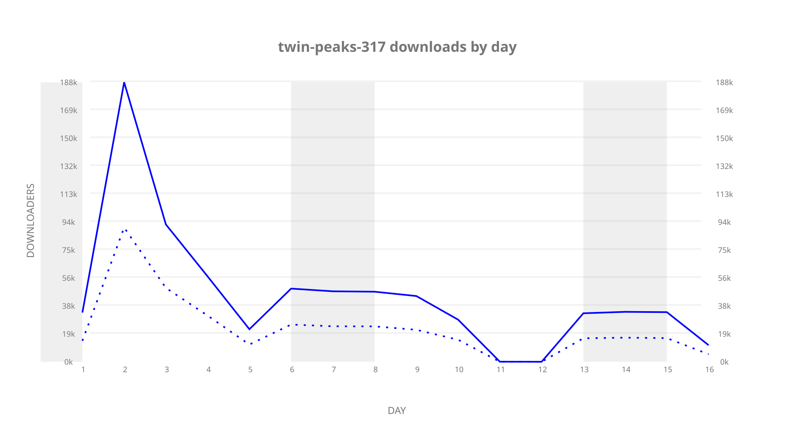
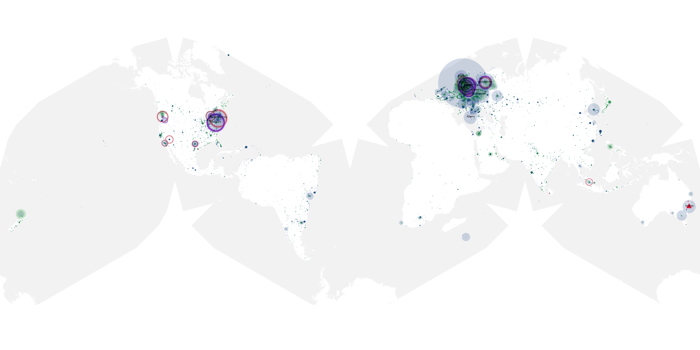
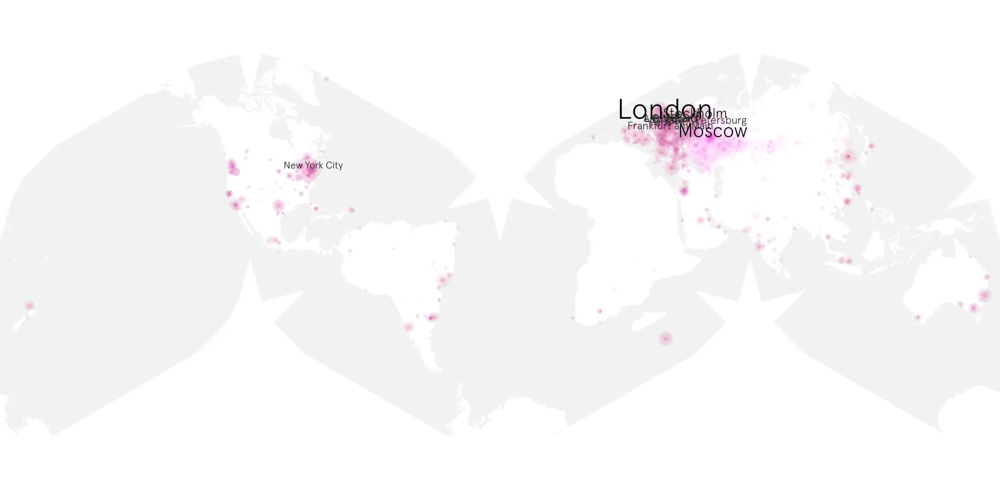
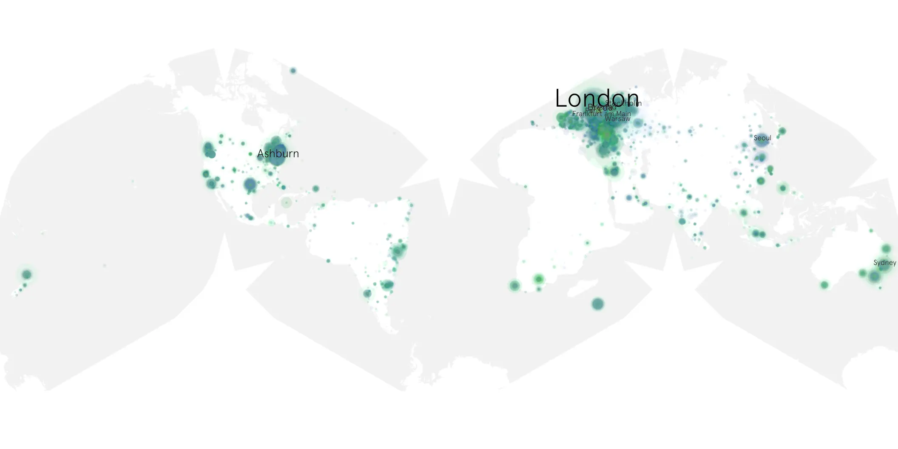

# twin-peaks-317 sample cache audit

## 1. Media object

| Field | Value |
| --- | --- |
| Media object | Twin Peaks |
| Collection key | `twin-peaks-317` |
| imdb_id | [tt4093826](https://www.imdb.com/title/tt4093826/) |
| wikipedia_url | [Twin Peaks](https://en.wikipedia.org/wiki/Twin_Peaks) |
| Sample dates | 2017-09-03-to-2017-09-18 |
| Sample days | 16 |
| BTIH count | 89 |
| Unique BTIH count | 80 |
| Downloaders total | 543,168 |
| Uploaders total | 266,353 |
| Data version | `2026-08-05` |
| IP geolocation version | `6:1777968300` |

## 2. Sample coverage report

- Generated: 2026-09-09T01:10:36Z
- Sample archive directory: `/mnt/gold/src/alpha60-samples-raw.gold/twin-peaks-317.xz`
- Hour directories: 159
- Zero-length sample files: 0
- Other unparsable sample files: 0
- Hourly discontinuities: 157 (181 missing hours)
- Missing days: 0

### Sample archive discontinuities

- hourly gap: last `2017-09-03 22:30`, resumed `2017-09-04 00:30` — missing 1 hour(s)
- hourly gap: last `2017-09-04 00:30`, resumed `2017-09-04 02:30` — missing 1 hour(s)
- hourly gap: last `2017-09-04 02:30`, resumed `2017-09-04 04:30` — missing 1 hour(s)
- hourly gap: last `2017-09-04 04:30`, resumed `2017-09-04 06:30` — missing 1 hour(s)
- hourly gap: last `2017-09-04 06:30`, resumed `2017-09-04 08:30` — missing 1 hour(s)
- hourly gap: last `2017-09-04 08:30`, resumed `2017-09-04 10:30` — missing 1 hour(s)
- hourly gap: last `2017-09-04 10:30`, resumed `2017-09-04 12:30` — missing 1 hour(s)
- hourly gap: last `2017-09-04 12:30`, resumed `2017-09-04 14:30` — missing 1 hour(s)
- hourly gap: last `2017-09-04 14:30`, resumed `2017-09-04 16:30` — missing 1 hour(s)
- hourly gap: last `2017-09-04 16:30`, resumed `2017-09-04 18:30` — missing 1 hour(s)
- hourly gap: last `2017-09-04 18:30`, resumed `2017-09-04 20:30` — missing 1 hour(s)
- hourly gap: last `2017-09-04 20:30`, resumed `2017-09-04 22:30` — missing 1 hour(s)
- hourly gap: last `2017-09-05 00:00`, resumed `2017-09-05 02:00` — missing 1 hour(s)
- hourly gap: last `2017-09-05 02:00`, resumed `2017-09-05 04:00` — missing 1 hour(s)
- hourly gap: last `2017-09-05 04:00`, resumed `2017-09-05 06:00` — missing 1 hour(s)
- hourly gap: last `2017-09-05 06:00`, resumed `2017-09-05 08:00` — missing 1 hour(s)
- hourly gap: last `2017-09-05 08:00`, resumed `2017-09-05 10:00` — missing 1 hour(s)
- hourly gap: last `2017-09-05 10:00`, resumed `2017-09-05 12:00` — missing 1 hour(s)
- hourly gap: last `2017-09-05 12:00`, resumed `2017-09-05 14:00` — missing 1 hour(s)
- hourly gap: last `2017-09-05 14:00`, resumed `2017-09-05 16:00` — missing 1 hour(s)
- hourly gap: last `2017-09-05 16:00`, resumed `2017-09-05 18:00` — missing 1 hour(s)
- hourly gap: last `2017-09-05 18:00`, resumed `2017-09-05 20:00` — missing 1 hour(s)
- hourly gap: last `2017-09-05 20:00`, resumed `2017-09-05 22:00` — missing 1 hour(s)
- hourly gap: last `2017-09-05 22:00`, resumed `2017-09-06 00:00` — missing 1 hour(s)
- hourly gap: last `2017-09-06 00:00`, resumed `2017-09-06 02:00` — missing 1 hour(s)
- hourly gap: last `2017-09-06 02:00`, resumed `2017-09-06 04:00` — missing 1 hour(s)
- hourly gap: last `2017-09-06 04:00`, resumed `2017-09-06 06:00` — missing 1 hour(s)
- hourly gap: last `2017-09-06 06:00`, resumed `2017-09-06 08:00` — missing 1 hour(s)
- hourly gap: last `2017-09-06 08:00`, resumed `2017-09-06 10:00` — missing 1 hour(s)
- hourly gap: last `2017-09-06 10:00`, resumed `2017-09-06 12:00` — missing 1 hour(s)
- hourly gap: last `2017-09-06 12:00`, resumed `2017-09-06 14:00` — missing 1 hour(s)
- hourly gap: last `2017-09-06 14:00`, resumed `2017-09-07 16:00` — missing 25 hour(s)
- hourly gap: last `2017-09-07 16:00`, resumed `2017-09-07 18:00` — missing 1 hour(s)
- hourly gap: last `2017-09-07 18:00`, resumed `2017-09-07 20:00` — missing 1 hour(s)
- hourly gap: last `2017-09-07 20:00`, resumed `2017-09-07 22:00` — missing 1 hour(s)
- hourly gap: last `2017-09-07 22:00`, resumed `2017-09-08 00:00` — missing 1 hour(s)
- hourly gap: last `2017-09-08 00:00`, resumed `2017-09-08 02:00` — missing 1 hour(s)
- hourly gap: last `2017-09-08 02:00`, resumed `2017-09-08 04:00` — missing 1 hour(s)
- hourly gap: last `2017-09-08 04:00`, resumed `2017-09-08 06:00` — missing 1 hour(s)
- hourly gap: last `2017-09-08 06:00`, resumed `2017-09-08 08:00` — missing 1 hour(s)
- hourly gap: last `2017-09-08 08:00`, resumed `2017-09-08 10:00` — missing 1 hour(s)
- hourly gap: last `2017-09-08 10:00`, resumed `2017-09-08 12:00` — missing 1 hour(s)
- hourly gap: last `2017-09-08 12:00`, resumed `2017-09-08 14:00` — missing 1 hour(s)
- hourly gap: last `2017-09-08 14:00`, resumed `2017-09-08 16:00` — missing 1 hour(s)
- hourly gap: last `2017-09-08 16:00`, resumed `2017-09-08 18:00` — missing 1 hour(s)
- hourly gap: last `2017-09-08 18:00`, resumed `2017-09-08 20:00` — missing 1 hour(s)
- hourly gap: last `2017-09-08 20:00`, resumed `2017-09-08 22:00` — missing 1 hour(s)
- hourly gap: last `2017-09-08 22:00`, resumed `2017-09-09 00:00` — missing 1 hour(s)
- hourly gap: last `2017-09-09 00:00`, resumed `2017-09-09 02:00` — missing 1 hour(s)
- hourly gap: last `2017-09-09 02:00`, resumed `2017-09-09 04:00` — missing 1 hour(s)
- hourly gap: last `2017-09-09 04:00`, resumed `2017-09-09 06:00` — missing 1 hour(s)
- hourly gap: last `2017-09-09 06:00`, resumed `2017-09-09 08:00` — missing 1 hour(s)
- hourly gap: last `2017-09-09 08:00`, resumed `2017-09-09 10:00` — missing 1 hour(s)
- hourly gap: last `2017-09-09 10:00`, resumed `2017-09-09 12:00` — missing 1 hour(s)
- hourly gap: last `2017-09-09 12:00`, resumed `2017-09-09 14:00` — missing 1 hour(s)
- hourly gap: last `2017-09-09 14:00`, resumed `2017-09-09 16:00` — missing 1 hour(s)
- hourly gap: last `2017-09-09 16:00`, resumed `2017-09-09 18:00` — missing 1 hour(s)
- hourly gap: last `2017-09-09 18:00`, resumed `2017-09-09 20:00` — missing 1 hour(s)
- hourly gap: last `2017-09-09 20:00`, resumed `2017-09-09 22:00` — missing 1 hour(s)
- hourly gap: last `2017-09-09 22:00`, resumed `2017-09-10 00:00` — missing 1 hour(s)
- hourly gap: last `2017-09-10 00:00`, resumed `2017-09-10 02:00` — missing 1 hour(s)
- hourly gap: last `2017-09-10 02:00`, resumed `2017-09-10 04:00` — missing 1 hour(s)
- hourly gap: last `2017-09-10 04:00`, resumed `2017-09-10 06:00` — missing 1 hour(s)
- hourly gap: last `2017-09-10 06:00`, resumed `2017-09-10 08:00` — missing 1 hour(s)
- hourly gap: last `2017-09-10 08:00`, resumed `2017-09-10 10:00` — missing 1 hour(s)
- hourly gap: last `2017-09-10 10:00`, resumed `2017-09-10 12:00` — missing 1 hour(s)
- hourly gap: last `2017-09-10 12:00`, resumed `2017-09-10 14:00` — missing 1 hour(s)
- hourly gap: last `2017-09-10 14:00`, resumed `2017-09-10 16:00` — missing 1 hour(s)
- hourly gap: last `2017-09-10 16:00`, resumed `2017-09-10 18:00` — missing 1 hour(s)
- hourly gap: last `2017-09-10 18:00`, resumed `2017-09-10 20:00` — missing 1 hour(s)
- hourly gap: last `2017-09-10 20:00`, resumed `2017-09-10 22:00` — missing 1 hour(s)
- hourly gap: last `2017-09-10 22:00`, resumed `2017-09-11 00:00` — missing 1 hour(s)
- hourly gap: last `2017-09-11 00:00`, resumed `2017-09-11 02:00` — missing 1 hour(s)
- hourly gap: last `2017-09-11 02:00`, resumed `2017-09-11 04:00` — missing 1 hour(s)
- hourly gap: last `2017-09-11 04:00`, resumed `2017-09-11 06:00` — missing 1 hour(s)
- hourly gap: last `2017-09-11 06:00`, resumed `2017-09-11 08:00` — missing 1 hour(s)
- hourly gap: last `2017-09-11 08:00`, resumed `2017-09-11 10:00` — missing 1 hour(s)
- hourly gap: last `2017-09-11 10:00`, resumed `2017-09-11 12:00` — missing 1 hour(s)
- hourly gap: last `2017-09-11 12:00`, resumed `2017-09-11 14:00` — missing 1 hour(s)
- hourly gap: last `2017-09-11 14:00`, resumed `2017-09-11 16:00` — missing 1 hour(s)
- hourly gap: last `2017-09-11 16:00`, resumed `2017-09-11 18:00` — missing 1 hour(s)
- hourly gap: last `2017-09-11 18:00`, resumed `2017-09-11 20:00` — missing 1 hour(s)
- hourly gap: last `2017-09-11 20:00`, resumed `2017-09-11 22:00` — missing 1 hour(s)
- hourly gap: last `2017-09-11 22:00`, resumed `2017-09-12 00:00` — missing 1 hour(s)
- hourly gap: last `2017-09-12 00:00`, resumed `2017-09-12 02:00` — missing 1 hour(s)
- hourly gap: last `2017-09-12 02:00`, resumed `2017-09-12 04:00` — missing 1 hour(s)
- hourly gap: last `2017-09-12 04:00`, resumed `2017-09-12 06:00` — missing 1 hour(s)
- hourly gap: last `2017-09-12 06:00`, resumed `2017-09-12 08:00` — missing 1 hour(s)
- hourly gap: last `2017-09-12 08:00`, resumed `2017-09-12 10:00` — missing 1 hour(s)
- hourly gap: last `2017-09-12 10:00`, resumed `2017-09-12 12:00` — missing 1 hour(s)
- hourly gap: last `2017-09-12 12:00`, resumed `2017-09-12 14:00` — missing 1 hour(s)
- hourly gap: last `2017-09-12 14:00`, resumed `2017-09-12 16:00` — missing 1 hour(s)
- hourly gap: last `2017-09-12 16:00`, resumed `2017-09-12 18:00` — missing 1 hour(s)
- hourly gap: last `2017-09-12 18:00`, resumed `2017-09-12 20:00` — missing 1 hour(s)
- hourly gap: last `2017-09-12 20:00`, resumed `2017-09-12 22:00` — missing 1 hour(s)
- hourly gap: last `2017-09-12 22:00`, resumed `2017-09-13 00:00` — missing 1 hour(s)
- hourly gap: last `2017-09-13 00:00`, resumed `2017-09-13 02:00` — missing 1 hour(s)
- hourly gap: last `2017-09-13 02:00`, resumed `2017-09-13 04:00` — missing 1 hour(s)
- hourly gap: last `2017-09-13 04:00`, resumed `2017-09-13 06:00` — missing 1 hour(s)
- hourly gap: last `2017-09-13 06:00`, resumed `2017-09-13 08:00` — missing 1 hour(s)
- hourly gap: last `2017-09-13 08:00`, resumed `2017-09-13 10:00` — missing 1 hour(s)
- hourly gap: last `2017-09-13 10:00`, resumed `2017-09-13 12:00` — missing 1 hour(s)
- hourly gap: last `2017-09-13 12:00`, resumed `2017-09-13 14:00` — missing 1 hour(s)
- hourly gap: last `2017-09-13 14:00`, resumed `2017-09-13 16:00` — missing 1 hour(s)
- hourly gap: last `2017-09-13 16:00`, resumed `2017-09-13 18:00` — missing 1 hour(s)
- hourly gap: last `2017-09-13 18:00`, resumed `2017-09-13 20:00` — missing 1 hour(s)
- hourly gap: last `2017-09-13 20:00`, resumed `2017-09-13 22:00` — missing 1 hour(s)
- hourly gap: last `2017-09-13 22:00`, resumed `2017-09-14 00:00` — missing 1 hour(s)
- hourly gap: last `2017-09-14 00:00`, resumed `2017-09-14 02:00` — missing 1 hour(s)
- hourly gap: last `2017-09-14 02:00`, resumed `2017-09-14 04:00` — missing 1 hour(s)
- hourly gap: last `2017-09-14 04:00`, resumed `2017-09-14 06:00` — missing 1 hour(s)
- hourly gap: last `2017-09-14 06:00`, resumed `2017-09-14 08:00` — missing 1 hour(s)
- hourly gap: last `2017-09-14 08:00`, resumed `2017-09-14 10:00` — missing 1 hour(s)
- hourly gap: last `2017-09-14 10:00`, resumed `2017-09-14 12:00` — missing 1 hour(s)
- hourly gap: last `2017-09-14 12:00`, resumed `2017-09-14 14:00` — missing 1 hour(s)
- hourly gap: last `2017-09-14 14:00`, resumed `2017-09-14 16:00` — missing 1 hour(s)
- hourly gap: last `2017-09-14 16:00`, resumed `2017-09-14 18:00` — missing 1 hour(s)
- hourly gap: last `2017-09-14 18:00`, resumed `2017-09-14 20:00` — missing 1 hour(s)
- hourly gap: last `2017-09-14 20:00`, resumed `2017-09-14 22:00` — missing 1 hour(s)
- hourly gap: last `2017-09-14 22:00`, resumed `2017-09-15 00:00` — missing 1 hour(s)
- hourly gap: last `2017-09-15 00:00`, resumed `2017-09-15 02:00` — missing 1 hour(s)
- hourly gap: last `2017-09-15 02:00`, resumed `2017-09-15 04:00` — missing 1 hour(s)
- hourly gap: last `2017-09-15 04:00`, resumed `2017-09-15 06:00` — missing 1 hour(s)
- hourly gap: last `2017-09-15 06:00`, resumed `2017-09-15 08:00` — missing 1 hour(s)
- hourly gap: last `2017-09-15 08:00`, resumed `2017-09-15 10:00` — missing 1 hour(s)
- hourly gap: last `2017-09-15 10:00`, resumed `2017-09-15 12:00` — missing 1 hour(s)
- hourly gap: last `2017-09-15 12:00`, resumed `2017-09-15 14:00` — missing 1 hour(s)
- hourly gap: last `2017-09-15 14:00`, resumed `2017-09-15 16:00` — missing 1 hour(s)
- hourly gap: last `2017-09-15 16:00`, resumed `2017-09-15 18:00` — missing 1 hour(s)
- hourly gap: last `2017-09-15 18:00`, resumed `2017-09-15 20:00` — missing 1 hour(s)
- hourly gap: last `2017-09-15 20:00`, resumed `2017-09-15 22:00` — missing 1 hour(s)
- hourly gap: last `2017-09-15 22:00`, resumed `2017-09-16 00:00` — missing 1 hour(s)
- hourly gap: last `2017-09-16 00:00`, resumed `2017-09-16 02:00` — missing 1 hour(s)
- hourly gap: last `2017-09-16 02:00`, resumed `2017-09-16 04:00` — missing 1 hour(s)
- hourly gap: last `2017-09-16 04:00`, resumed `2017-09-16 06:00` — missing 1 hour(s)
- hourly gap: last `2017-09-16 06:00`, resumed `2017-09-16 08:00` — missing 1 hour(s)
- hourly gap: last `2017-09-16 08:00`, resumed `2017-09-16 10:00` — missing 1 hour(s)
- hourly gap: last `2017-09-16 10:00`, resumed `2017-09-16 12:00` — missing 1 hour(s)
- hourly gap: last `2017-09-16 12:00`, resumed `2017-09-16 14:00` — missing 1 hour(s)
- hourly gap: last `2017-09-16 14:00`, resumed `2017-09-16 16:00` — missing 1 hour(s)
- hourly gap: last `2017-09-16 16:00`, resumed `2017-09-16 18:00` — missing 1 hour(s)
- hourly gap: last `2017-09-16 18:00`, resumed `2017-09-16 20:00` — missing 1 hour(s)
- hourly gap: last `2017-09-16 20:00`, resumed `2017-09-16 22:00` — missing 1 hour(s)
- hourly gap: last `2017-09-16 22:00`, resumed `2017-09-17 00:00` — missing 1 hour(s)
- hourly gap: last `2017-09-17 00:00`, resumed `2017-09-17 02:00` — missing 1 hour(s)
- hourly gap: last `2017-09-17 02:00`, resumed `2017-09-17 04:00` — missing 1 hour(s)
- hourly gap: last `2017-09-17 04:00`, resumed `2017-09-17 06:00` — missing 1 hour(s)
- hourly gap: last `2017-09-17 06:00`, resumed `2017-09-17 08:00` — missing 1 hour(s)
- hourly gap: last `2017-09-17 08:00`, resumed `2017-09-17 10:00` — missing 1 hour(s)
- hourly gap: last `2017-09-17 10:00`, resumed `2017-09-17 12:00` — missing 1 hour(s)
- hourly gap: last `2017-09-17 12:00`, resumed `2017-09-17 14:00` — missing 1 hour(s)
- hourly gap: last `2017-09-17 14:00`, resumed `2017-09-17 16:00` — missing 1 hour(s)
- hourly gap: last `2017-09-17 16:00`, resumed `2017-09-17 18:00` — missing 1 hour(s)
- hourly gap: last `2017-09-17 18:00`, resumed `2017-09-17 20:00` — missing 1 hour(s)
- hourly gap: last `2017-09-17 20:00`, resumed `2017-09-17 22:00` — missing 1 hour(s)
- hourly gap: last `2017-09-17 22:00`, resumed `2017-09-18 00:00` — missing 1 hour(s)
- hourly gap: last `2017-09-18 00:00`, resumed `2017-09-18 02:00` — missing 1 hour(s)

## 3. Media objects file size histogram

## 4. Visualization pass — graphs

### Downloads by week cumulative (normalized start)



### Downloads by day, Saturday and Sunday in gray

## 5. Visualization pass — maps

### Cumulative geographic slices

| Africa | Americas | Asia | Europe | Oceania | Unknown |
| --- | --- | --- | --- | --- | --- |
| 2.19 | 20.58 | 10.26 | 51.95 | 3.78 | 0.71 |

### Cumulative network infrastructure

{:target="_blank" rel="noopener"}

### Cumulative data maps

**Cumulative >= 1080p**

{:target="_blank" rel="noopener"}

**Cumulative < 1080p**

{:target="_blank" rel="noopener"}
