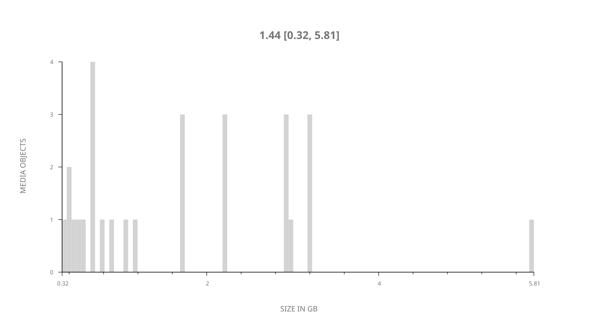
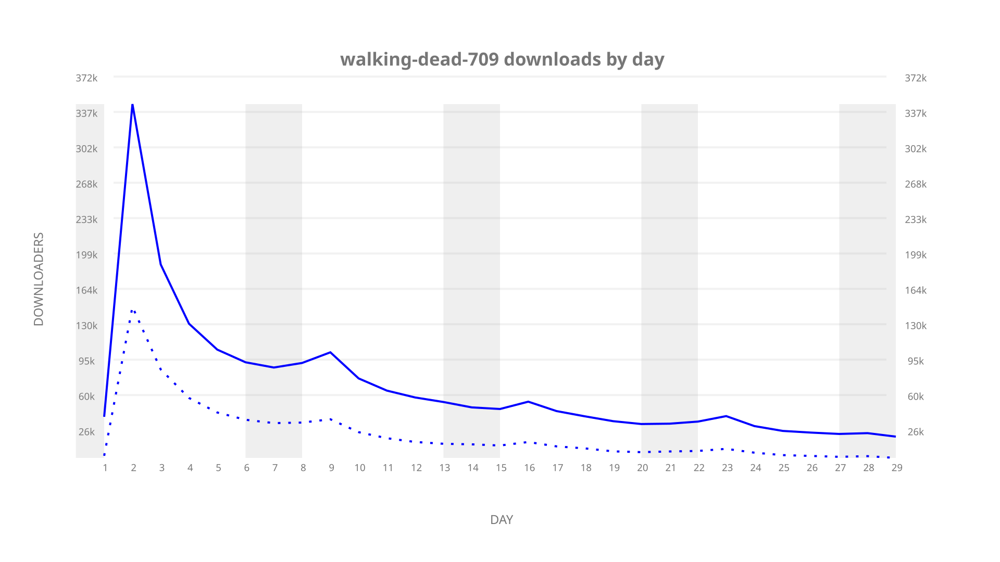
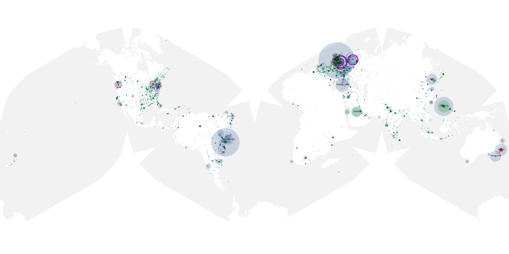
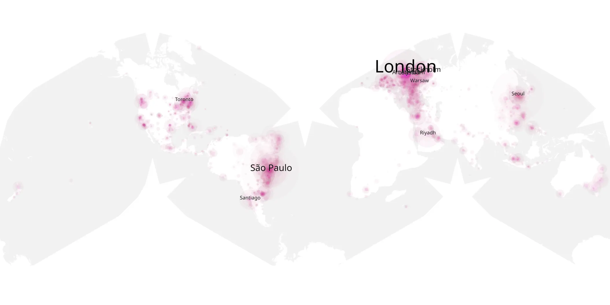
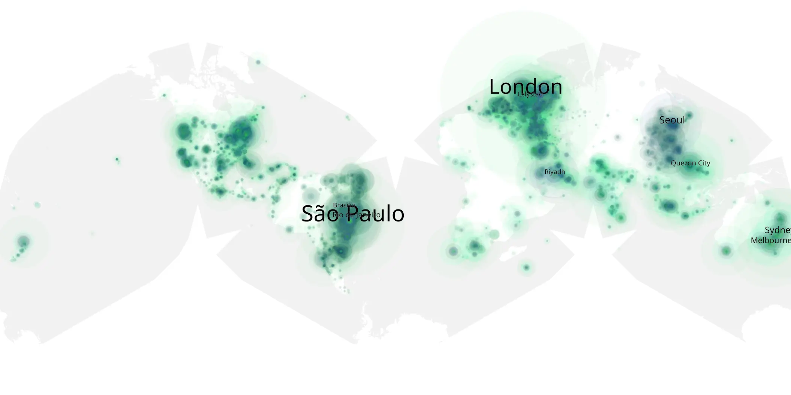

# walking-dead-709 sample cache audit

## 1. Media object

| Field | Value |
| --- | --- |
| Media object | The Walking Dead |
| Collection key | `walking-dead-709` |
| imdb_id | [tt1520211](https://www.imdb.com/title/tt1520211/) |
| wikipedia_url | [The Walking Dead (TV series)](https://en.wikipedia.org/wiki/The_Walking_Dead_(TV_series)) |
| Sample dates | 2017-02-12-to-2017-03-12 |
| Sample days | 29 |
| BTIH count | 29 |
| Unique BTIH count | 28 |
| Downloaders total | 1,567,628 |
| Uploaders total | 833,302 |
| Data version | `2026-08-05` |
| IP geolocation version | `6:1777968300` |

## 2. Sample coverage report

- Generated: 2026-09-09T01:10:36Z
- Sample archive directory: `/mnt/gold/src/alpha60-samples-raw.gold/walking-dead-709.xz`
- Hour directories: 168
- Zero-length sample files: 0
- Other unparsable sample files: 0
- Hourly discontinuities: 167 (501 missing hours)
- Missing days: 0

### Sample archive discontinuities

- hourly gap: last `2017-02-12 20:55`, resumed `2017-02-13 00:55` — missing 3 hour(s)
- hourly gap: last `2017-02-13 00:55`, resumed `2017-02-13 04:55` — missing 3 hour(s)
- hourly gap: last `2017-02-13 04:55`, resumed `2017-02-13 08:55` — missing 3 hour(s)
- hourly gap: last `2017-02-13 08:55`, resumed `2017-02-13 12:55` — missing 3 hour(s)
- hourly gap: last `2017-02-13 12:55`, resumed `2017-02-13 16:55` — missing 3 hour(s)
- hourly gap: last `2017-02-13 16:55`, resumed `2017-02-13 20:55` — missing 3 hour(s)
- hourly gap: last `2017-02-13 20:55`, resumed `2017-02-14 00:55` — missing 3 hour(s)
- hourly gap: last `2017-02-14 00:55`, resumed `2017-02-14 04:55` — missing 3 hour(s)
- hourly gap: last `2017-02-14 04:55`, resumed `2017-02-14 08:55` — missing 3 hour(s)
- hourly gap: last `2017-02-14 08:55`, resumed `2017-02-14 12:55` — missing 3 hour(s)
- hourly gap: last `2017-02-14 12:55`, resumed `2017-02-14 16:55` — missing 3 hour(s)
- hourly gap: last `2017-02-14 16:55`, resumed `2017-02-14 20:55` — missing 3 hour(s)
- hourly gap: last `2017-02-14 20:55`, resumed `2017-02-15 00:55` — missing 3 hour(s)
- hourly gap: last `2017-02-15 00:55`, resumed `2017-02-15 04:55` — missing 3 hour(s)
- hourly gap: last `2017-02-15 04:55`, resumed `2017-02-15 08:55` — missing 3 hour(s)
- hourly gap: last `2017-02-15 08:55`, resumed `2017-02-15 12:55` — missing 3 hour(s)
- hourly gap: last `2017-02-15 12:55`, resumed `2017-02-15 16:55` — missing 3 hour(s)
- hourly gap: last `2017-02-15 16:55`, resumed `2017-02-15 21:00` — missing 3 hour(s)
- hourly gap: last `2017-02-15 21:00`, resumed `2017-02-16 01:00` — missing 3 hour(s)
- hourly gap: last `2017-02-16 01:00`, resumed `2017-02-16 05:00` — missing 3 hour(s)
- hourly gap: last `2017-02-16 05:00`, resumed `2017-02-16 09:00` — missing 3 hour(s)
- hourly gap: last `2017-02-16 09:00`, resumed `2017-02-16 13:00` — missing 3 hour(s)
- hourly gap: last `2017-02-16 13:00`, resumed `2017-02-16 17:00` — missing 3 hour(s)
- hourly gap: last `2017-02-16 17:00`, resumed `2017-02-16 21:00` — missing 3 hour(s)
- hourly gap: last `2017-02-16 21:00`, resumed `2017-02-17 01:00` — missing 3 hour(s)
- hourly gap: last `2017-02-17 01:00`, resumed `2017-02-17 05:00` — missing 3 hour(s)
- hourly gap: last `2017-02-17 05:00`, resumed `2017-02-17 09:00` — missing 3 hour(s)
- hourly gap: last `2017-02-17 09:00`, resumed `2017-02-17 13:00` — missing 3 hour(s)
- hourly gap: last `2017-02-17 13:00`, resumed `2017-02-17 17:00` — missing 3 hour(s)
- hourly gap: last `2017-02-17 17:00`, resumed `2017-02-17 21:00` — missing 3 hour(s)
- hourly gap: last `2017-02-17 21:00`, resumed `2017-02-18 01:00` — missing 3 hour(s)
- hourly gap: last `2017-02-18 01:00`, resumed `2017-02-18 05:00` — missing 3 hour(s)
- hourly gap: last `2017-02-18 05:00`, resumed `2017-02-18 09:00` — missing 3 hour(s)
- hourly gap: last `2017-02-18 09:00`, resumed `2017-02-18 13:00` — missing 3 hour(s)
- hourly gap: last `2017-02-18 13:00`, resumed `2017-02-18 17:00` — missing 3 hour(s)
- hourly gap: last `2017-02-18 17:00`, resumed `2017-02-18 21:00` — missing 3 hour(s)
- hourly gap: last `2017-02-18 21:00`, resumed `2017-02-19 01:00` — missing 3 hour(s)
- hourly gap: last `2017-02-19 01:00`, resumed `2017-02-19 05:00` — missing 3 hour(s)
- hourly gap: last `2017-02-19 05:00`, resumed `2017-02-19 09:00` — missing 3 hour(s)
- hourly gap: last `2017-02-19 09:00`, resumed `2017-02-19 13:00` — missing 3 hour(s)
- hourly gap: last `2017-02-19 13:00`, resumed `2017-02-19 17:00` — missing 3 hour(s)
- hourly gap: last `2017-02-19 17:00`, resumed `2017-02-19 21:00` — missing 3 hour(s)
- hourly gap: last `2017-02-19 21:00`, resumed `2017-02-20 01:00` — missing 3 hour(s)
- hourly gap: last `2017-02-20 01:00`, resumed `2017-02-20 05:00` — missing 3 hour(s)
- hourly gap: last `2017-02-20 05:00`, resumed `2017-02-20 09:00` — missing 3 hour(s)
- hourly gap: last `2017-02-20 09:00`, resumed `2017-02-20 13:00` — missing 3 hour(s)
- hourly gap: last `2017-02-20 13:00`, resumed `2017-02-20 17:00` — missing 3 hour(s)
- hourly gap: last `2017-02-20 17:00`, resumed `2017-02-20 21:00` — missing 3 hour(s)
- hourly gap: last `2017-02-20 21:00`, resumed `2017-02-21 01:00` — missing 3 hour(s)
- hourly gap: last `2017-02-21 01:00`, resumed `2017-02-21 05:00` — missing 3 hour(s)
- hourly gap: last `2017-02-21 05:00`, resumed `2017-02-21 09:00` — missing 3 hour(s)
- hourly gap: last `2017-02-21 09:00`, resumed `2017-02-21 13:00` — missing 3 hour(s)
- hourly gap: last `2017-02-21 13:00`, resumed `2017-02-21 17:00` — missing 3 hour(s)
- hourly gap: last `2017-02-21 17:00`, resumed `2017-02-21 21:00` — missing 3 hour(s)
- hourly gap: last `2017-02-21 21:00`, resumed `2017-02-22 01:00` — missing 3 hour(s)
- hourly gap: last `2017-02-22 01:00`, resumed `2017-02-22 05:00` — missing 3 hour(s)
- hourly gap: last `2017-02-22 05:00`, resumed `2017-02-22 09:00` — missing 3 hour(s)
- hourly gap: last `2017-02-22 09:00`, resumed `2017-02-22 13:00` — missing 3 hour(s)
- hourly gap: last `2017-02-22 13:00`, resumed `2017-02-22 17:00` — missing 3 hour(s)
- hourly gap: last `2017-02-22 17:00`, resumed `2017-02-22 21:00` — missing 3 hour(s)
- hourly gap: last `2017-02-22 21:00`, resumed `2017-02-23 01:00` — missing 3 hour(s)
- hourly gap: last `2017-02-23 01:00`, resumed `2017-02-23 05:00` — missing 3 hour(s)
- hourly gap: last `2017-02-23 05:00`, resumed `2017-02-23 09:00` — missing 3 hour(s)
- hourly gap: last `2017-02-23 09:00`, resumed `2017-02-23 13:00` — missing 3 hour(s)
- hourly gap: last `2017-02-23 13:00`, resumed `2017-02-23 17:00` — missing 3 hour(s)
- hourly gap: last `2017-02-23 17:00`, resumed `2017-02-23 21:00` — missing 3 hour(s)
- hourly gap: last `2017-02-23 21:00`, resumed `2017-02-24 01:00` — missing 3 hour(s)
- hourly gap: last `2017-02-24 01:00`, resumed `2017-02-24 05:00` — missing 3 hour(s)
- hourly gap: last `2017-02-24 05:00`, resumed `2017-02-24 09:00` — missing 3 hour(s)
- hourly gap: last `2017-02-24 09:00`, resumed `2017-02-24 13:00` — missing 3 hour(s)
- hourly gap: last `2017-02-24 13:00`, resumed `2017-02-24 17:00` — missing 3 hour(s)
- hourly gap: last `2017-02-24 17:00`, resumed `2017-02-24 21:00` — missing 3 hour(s)
- hourly gap: last `2017-02-24 21:00`, resumed `2017-02-25 01:00` — missing 3 hour(s)
- hourly gap: last `2017-02-25 01:00`, resumed `2017-02-25 05:00` — missing 3 hour(s)
- hourly gap: last `2017-02-25 05:00`, resumed `2017-02-25 09:00` — missing 3 hour(s)
- hourly gap: last `2017-02-25 09:00`, resumed `2017-02-25 13:00` — missing 3 hour(s)
- hourly gap: last `2017-02-25 13:00`, resumed `2017-02-25 17:00` — missing 3 hour(s)
- hourly gap: last `2017-02-25 17:00`, resumed `2017-02-25 21:00` — missing 3 hour(s)
- hourly gap: last `2017-02-25 21:00`, resumed `2017-02-26 01:00` — missing 3 hour(s)
- hourly gap: last `2017-02-26 01:00`, resumed `2017-02-26 05:00` — missing 3 hour(s)
- hourly gap: last `2017-02-26 05:00`, resumed `2017-02-26 09:00` — missing 3 hour(s)
- hourly gap: last `2017-02-26 09:00`, resumed `2017-02-26 13:00` — missing 3 hour(s)
- hourly gap: last `2017-02-26 13:00`, resumed `2017-02-26 17:00` — missing 3 hour(s)
- hourly gap: last `2017-02-26 17:00`, resumed `2017-02-26 21:00` — missing 3 hour(s)
- hourly gap: last `2017-02-26 21:00`, resumed `2017-02-27 01:00` — missing 3 hour(s)
- hourly gap: last `2017-02-27 01:00`, resumed `2017-02-27 05:00` — missing 3 hour(s)
- hourly gap: last `2017-02-27 05:00`, resumed `2017-02-27 09:00` — missing 3 hour(s)
- hourly gap: last `2017-02-27 09:00`, resumed `2017-02-27 13:00` — missing 3 hour(s)
- hourly gap: last `2017-02-27 13:00`, resumed `2017-02-27 17:00` — missing 3 hour(s)
- hourly gap: last `2017-02-27 17:00`, resumed `2017-02-27 21:00` — missing 3 hour(s)
- hourly gap: last `2017-02-27 21:00`, resumed `2017-02-28 01:00` — missing 3 hour(s)
- hourly gap: last `2017-02-28 01:00`, resumed `2017-02-28 05:00` — missing 3 hour(s)
- hourly gap: last `2017-02-28 05:00`, resumed `2017-02-28 09:00` — missing 3 hour(s)
- hourly gap: last `2017-02-28 09:00`, resumed `2017-02-28 13:00` — missing 3 hour(s)
- hourly gap: last `2017-02-28 13:00`, resumed `2017-02-28 17:00` — missing 3 hour(s)
- hourly gap: last `2017-02-28 17:00`, resumed `2017-02-28 21:00` — missing 3 hour(s)
- hourly gap: last `2017-02-28 21:00`, resumed `2017-03-01 01:00` — missing 3 hour(s)
- hourly gap: last `2017-03-01 01:00`, resumed `2017-03-01 05:00` — missing 3 hour(s)
- hourly gap: last `2017-03-01 05:00`, resumed `2017-03-01 09:00` — missing 3 hour(s)
- hourly gap: last `2017-03-01 09:00`, resumed `2017-03-01 13:00` — missing 3 hour(s)
- hourly gap: last `2017-03-01 13:00`, resumed `2017-03-01 17:00` — missing 3 hour(s)
- hourly gap: last `2017-03-01 17:00`, resumed `2017-03-01 21:00` — missing 3 hour(s)
- hourly gap: last `2017-03-01 21:00`, resumed `2017-03-02 01:00` — missing 3 hour(s)
- hourly gap: last `2017-03-02 01:00`, resumed `2017-03-02 05:00` — missing 3 hour(s)
- hourly gap: last `2017-03-02 05:00`, resumed `2017-03-02 09:00` — missing 3 hour(s)
- hourly gap: last `2017-03-02 09:00`, resumed `2017-03-02 13:00` — missing 3 hour(s)
- hourly gap: last `2017-03-02 13:00`, resumed `2017-03-02 17:00` — missing 3 hour(s)
- hourly gap: last `2017-03-02 17:00`, resumed `2017-03-02 21:00` — missing 3 hour(s)
- hourly gap: last `2017-03-02 21:00`, resumed `2017-03-03 01:00` — missing 3 hour(s)
- hourly gap: last `2017-03-03 01:00`, resumed `2017-03-03 05:00` — missing 3 hour(s)
- hourly gap: last `2017-03-03 05:00`, resumed `2017-03-03 09:00` — missing 3 hour(s)
- hourly gap: last `2017-03-03 09:00`, resumed `2017-03-03 13:00` — missing 3 hour(s)
- hourly gap: last `2017-03-03 13:00`, resumed `2017-03-03 17:00` — missing 3 hour(s)
- hourly gap: last `2017-03-03 17:00`, resumed `2017-03-03 21:00` — missing 3 hour(s)
- hourly gap: last `2017-03-03 21:00`, resumed `2017-03-04 01:00` — missing 3 hour(s)
- hourly gap: last `2017-03-04 01:00`, resumed `2017-03-04 05:00` — missing 3 hour(s)
- hourly gap: last `2017-03-04 05:00`, resumed `2017-03-04 09:00` — missing 3 hour(s)
- hourly gap: last `2017-03-04 09:00`, resumed `2017-03-04 13:00` — missing 3 hour(s)
- hourly gap: last `2017-03-04 13:00`, resumed `2017-03-04 17:00` — missing 3 hour(s)
- hourly gap: last `2017-03-04 17:00`, resumed `2017-03-04 21:00` — missing 3 hour(s)
- hourly gap: last `2017-03-04 21:00`, resumed `2017-03-05 01:00` — missing 3 hour(s)
- hourly gap: last `2017-03-05 01:00`, resumed `2017-03-05 05:00` — missing 3 hour(s)
- hourly gap: last `2017-03-05 05:00`, resumed `2017-03-05 09:00` — missing 3 hour(s)
- hourly gap: last `2017-03-05 09:00`, resumed `2017-03-05 13:00` — missing 3 hour(s)
- hourly gap: last `2017-03-05 13:00`, resumed `2017-03-05 17:00` — missing 3 hour(s)
- hourly gap: last `2017-03-05 17:00`, resumed `2017-03-05 21:00` — missing 3 hour(s)
- hourly gap: last `2017-03-05 21:00`, resumed `2017-03-06 01:00` — missing 3 hour(s)
- hourly gap: last `2017-03-06 01:00`, resumed `2017-03-06 05:00` — missing 3 hour(s)
- hourly gap: last `2017-03-06 05:00`, resumed `2017-03-06 09:00` — missing 3 hour(s)
- hourly gap: last `2017-03-06 09:00`, resumed `2017-03-06 13:00` — missing 3 hour(s)
- hourly gap: last `2017-03-06 13:00`, resumed `2017-03-06 17:00` — missing 3 hour(s)
- hourly gap: last `2017-03-06 17:00`, resumed `2017-03-06 21:00` — missing 3 hour(s)
- hourly gap: last `2017-03-06 21:00`, resumed `2017-03-07 01:00` — missing 3 hour(s)
- hourly gap: last `2017-03-07 01:00`, resumed `2017-03-07 05:00` — missing 3 hour(s)
- hourly gap: last `2017-03-07 05:00`, resumed `2017-03-07 09:00` — missing 3 hour(s)
- hourly gap: last `2017-03-07 09:00`, resumed `2017-03-07 13:00` — missing 3 hour(s)
- hourly gap: last `2017-03-07 13:00`, resumed `2017-03-07 17:00` — missing 3 hour(s)
- hourly gap: last `2017-03-07 17:00`, resumed `2017-03-07 21:00` — missing 3 hour(s)
- hourly gap: last `2017-03-07 21:00`, resumed `2017-03-08 01:00` — missing 3 hour(s)
- hourly gap: last `2017-03-08 01:00`, resumed `2017-03-08 05:00` — missing 3 hour(s)
- hourly gap: last `2017-03-08 05:00`, resumed `2017-03-08 09:00` — missing 3 hour(s)
- hourly gap: last `2017-03-08 09:00`, resumed `2017-03-08 13:00` — missing 3 hour(s)
- hourly gap: last `2017-03-08 13:00`, resumed `2017-03-08 17:00` — missing 3 hour(s)
- hourly gap: last `2017-03-08 17:00`, resumed `2017-03-08 21:00` — missing 3 hour(s)
- hourly gap: last `2017-03-08 21:00`, resumed `2017-03-09 01:00` — missing 3 hour(s)
- hourly gap: last `2017-03-09 01:00`, resumed `2017-03-09 05:00` — missing 3 hour(s)
- hourly gap: last `2017-03-09 05:00`, resumed `2017-03-09 09:00` — missing 3 hour(s)
- hourly gap: last `2017-03-09 09:00`, resumed `2017-03-09 13:00` — missing 3 hour(s)
- hourly gap: last `2017-03-09 13:00`, resumed `2017-03-09 17:00` — missing 3 hour(s)
- hourly gap: last `2017-03-09 17:00`, resumed `2017-03-09 21:00` — missing 3 hour(s)
- hourly gap: last `2017-03-09 21:00`, resumed `2017-03-10 01:00` — missing 3 hour(s)
- hourly gap: last `2017-03-10 01:00`, resumed `2017-03-10 05:00` — missing 3 hour(s)
- hourly gap: last `2017-03-10 05:00`, resumed `2017-03-10 09:00` — missing 3 hour(s)
- hourly gap: last `2017-03-10 09:00`, resumed `2017-03-10 13:00` — missing 3 hour(s)
- hourly gap: last `2017-03-10 13:00`, resumed `2017-03-10 17:00` — missing 3 hour(s)
- hourly gap: last `2017-03-10 17:00`, resumed `2017-03-10 21:00` — missing 3 hour(s)
- hourly gap: last `2017-03-10 21:00`, resumed `2017-03-11 01:00` — missing 3 hour(s)
- hourly gap: last `2017-03-11 01:00`, resumed `2017-03-11 05:00` — missing 3 hour(s)
- hourly gap: last `2017-03-11 05:00`, resumed `2017-03-11 09:00` — missing 3 hour(s)
- hourly gap: last `2017-03-11 09:00`, resumed `2017-03-11 13:00` — missing 3 hour(s)
- hourly gap: last `2017-03-11 13:00`, resumed `2017-03-11 17:00` — missing 3 hour(s)
- hourly gap: last `2017-03-11 17:00`, resumed `2017-03-11 21:00` — missing 3 hour(s)
- hourly gap: last `2017-03-11 21:00`, resumed `2017-03-12 01:00` — missing 3 hour(s)
- hourly gap: last `2017-03-12 01:00`, resumed `2017-03-12 06:00` — missing 4 hour(s)
- hourly gap: last `2017-03-12 06:00`, resumed `2017-03-12 10:00` — missing 3 hour(s)
- hourly gap: last `2017-03-12 10:00`, resumed `2017-03-12 14:00` — missing 3 hour(s)
- hourly gap: last `2017-03-12 14:00`, resumed `2017-03-12 17:00` — missing 2 hour(s)

## 3. Media objects file size histogram

## 4. Visualization pass — graphs

### Downloads by week cumulative (normalized start)



### Downloads by day, Saturday and Sunday in gray

## 5. Visualization pass — maps

### Cumulative geographic slices

| Africa | Americas | Asia | Europe | Oceania | Unknown |
| --- | --- | --- | --- | --- | --- |
| 2.12 | 24.63 | 14.19 | 15.34 | 2.80 | 0.46 |

### Cumulative network infrastructure

{:target="_blank" rel="noopener"}

### Cumulative data maps

**Cumulative >= 1080p**

{:target="_blank" rel="noopener"}

**Cumulative < 1080p**

{:target="_blank" rel="noopener"}
