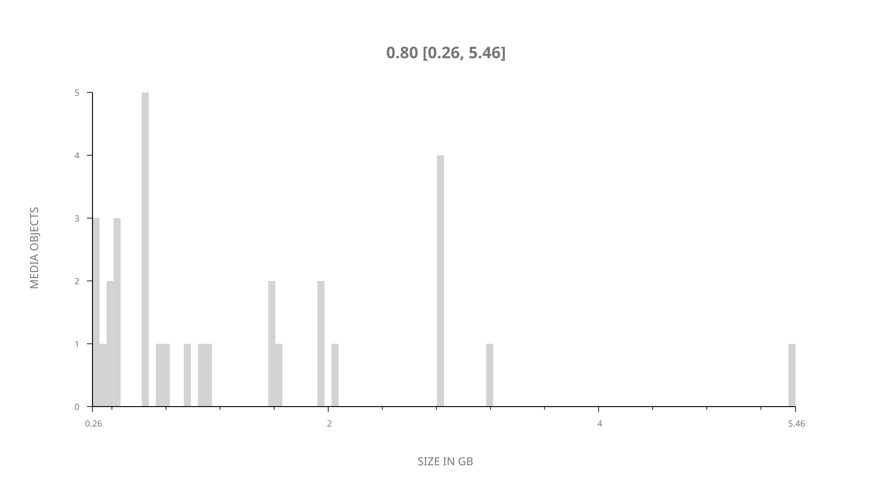
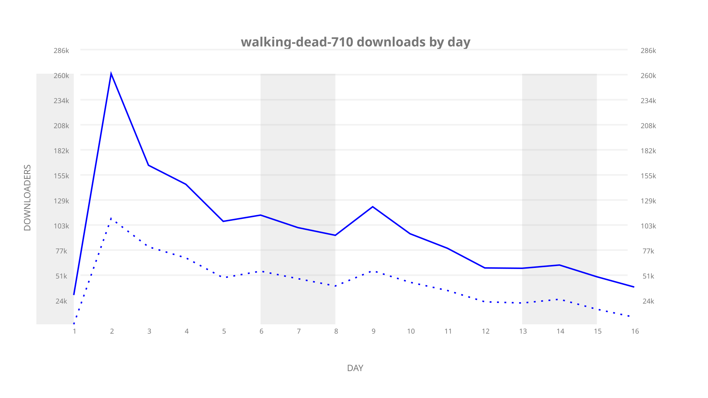
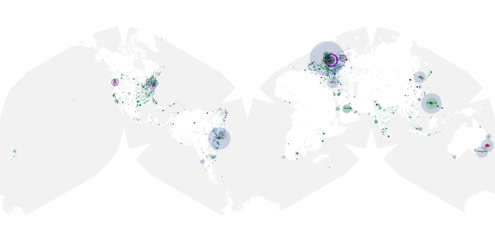
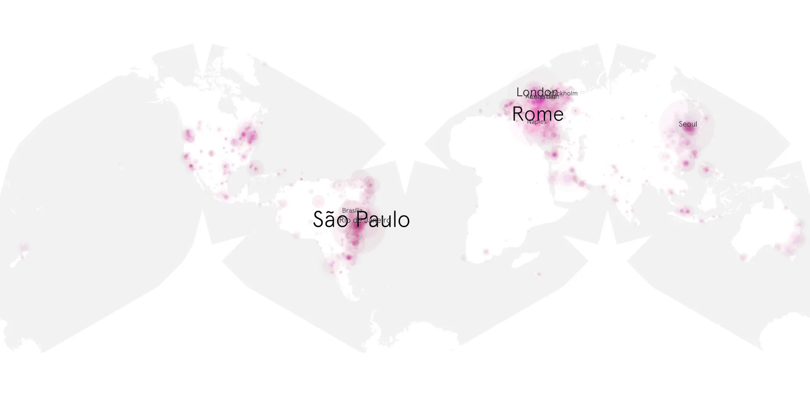
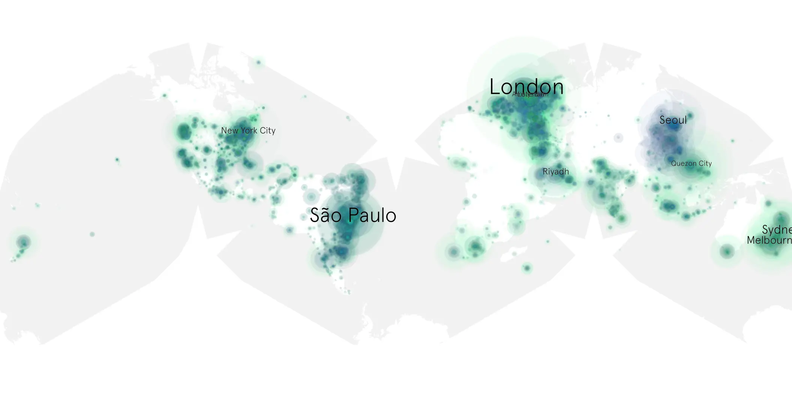

# walking-dead-710 sample cache audit

## 1. Media object

| Field | Value |
| --- | --- |
| Media object | The Walking Dead |
| Collection key | `walking-dead-710` |
| imdb_id | [tt1520211](https://www.imdb.com/title/tt1520211/) |
| wikipedia_url | [The Walking Dead (TV series)](https://en.wikipedia.org/wiki/The_Walking_Dead_(TV_series)) |
| Sample dates | 2017-02-19-to-2017-03-06 |
| Sample days | 16 |
| BTIH count | 31 |
| Unique BTIH count | 31 |
| Downloaders total | 1,168,029 |
| Uploaders total | 647,702 |
| Data version | `2026-08-05` |
| IP geolocation version | `6:1777968300` |

## 2. Sample coverage report

- Generated: 2026-09-09T01:10:36Z
- Sample archive directory: `/mnt/gold/src/alpha60-samples-raw.gold/walking-dead-710.xz`
- Hour directories: 84
- Zero-length sample files: 0
- Other unparsable sample files: 0
- Hourly discontinuities: 83 (262 missing hours)
- Missing days: 0

### Sample archive discontinuities

- hourly gap: last `2017-02-19 22:00`, resumed `2017-02-20 02:00` — missing 3 hour(s)
- hourly gap: last `2017-02-20 02:00`, resumed `2017-02-20 06:00` — missing 3 hour(s)
- hourly gap: last `2017-02-20 06:00`, resumed `2017-02-20 10:00` — missing 3 hour(s)
- hourly gap: last `2017-02-20 10:00`, resumed `2017-02-20 14:00` — missing 3 hour(s)
- hourly gap: last `2017-02-20 14:00`, resumed `2017-02-20 18:00` — missing 3 hour(s)
- hourly gap: last `2017-02-20 18:00`, resumed `2017-02-20 22:00` — missing 3 hour(s)
- hourly gap: last `2017-02-20 22:00`, resumed `2017-02-21 02:00` — missing 3 hour(s)
- hourly gap: last `2017-02-21 02:00`, resumed `2017-02-21 06:00` — missing 3 hour(s)
- hourly gap: last `2017-02-21 06:00`, resumed `2017-02-21 10:00` — missing 3 hour(s)
- hourly gap: last `2017-02-21 10:00`, resumed `2017-02-21 14:00` — missing 3 hour(s)
- hourly gap: last `2017-02-21 14:00`, resumed `2017-02-21 18:00` — missing 3 hour(s)
- hourly gap: last `2017-02-21 18:00`, resumed `2017-02-21 22:00` — missing 3 hour(s)
- hourly gap: last `2017-02-21 22:00`, resumed `2017-02-22 02:00` — missing 3 hour(s)
- hourly gap: last `2017-02-22 02:00`, resumed `2017-02-22 06:00` — missing 3 hour(s)
- hourly gap: last `2017-02-22 06:00`, resumed `2017-02-22 10:00` — missing 3 hour(s)
- hourly gap: last `2017-02-22 10:00`, resumed `2017-02-22 14:00` — missing 3 hour(s)
- hourly gap: last `2017-02-22 14:00`, resumed `2017-02-22 18:00` — missing 3 hour(s)
- hourly gap: last `2017-02-22 18:00`, resumed `2017-02-22 22:00` — missing 3 hour(s)
- hourly gap: last `2017-02-22 22:00`, resumed `2017-02-23 02:00` — missing 3 hour(s)
- hourly gap: last `2017-02-23 02:00`, resumed `2017-02-23 06:00` — missing 3 hour(s)
- hourly gap: last `2017-02-23 06:00`, resumed `2017-02-23 14:08` — missing 7 hour(s)
- hourly gap: last `2017-02-23 14:08`, resumed `2017-02-23 18:00` — missing 2 hour(s)
- hourly gap: last `2017-02-23 18:00`, resumed `2017-02-23 22:00` — missing 3 hour(s)
- hourly gap: last `2017-02-23 22:00`, resumed `2017-02-24 02:00` — missing 3 hour(s)
- hourly gap: last `2017-02-24 02:00`, resumed `2017-02-24 06:00` — missing 3 hour(s)
- hourly gap: last `2017-02-24 06:00`, resumed `2017-02-24 10:00` — missing 3 hour(s)
- hourly gap: last `2017-02-24 10:00`, resumed `2017-02-24 14:00` — missing 3 hour(s)
- hourly gap: last `2017-02-24 14:00`, resumed `2017-02-24 18:00` — missing 3 hour(s)
- hourly gap: last `2017-02-24 18:00`, resumed `2017-02-24 22:00` — missing 3 hour(s)
- hourly gap: last `2017-02-24 22:00`, resumed `2017-02-25 02:00` — missing 3 hour(s)
- hourly gap: last `2017-02-25 02:00`, resumed `2017-02-25 06:00` — missing 3 hour(s)
- hourly gap: last `2017-02-25 06:00`, resumed `2017-02-25 10:00` — missing 3 hour(s)
- hourly gap: last `2017-02-25 10:00`, resumed `2017-02-25 14:00` — missing 3 hour(s)
- hourly gap: last `2017-02-25 14:00`, resumed `2017-02-25 18:00` — missing 3 hour(s)
- hourly gap: last `2017-02-25 18:00`, resumed `2017-02-25 22:00` — missing 3 hour(s)
- hourly gap: last `2017-02-25 22:00`, resumed `2017-02-26 02:00` — missing 3 hour(s)
- hourly gap: last `2017-02-26 02:00`, resumed `2017-02-26 10:01` — missing 7 hour(s)
- hourly gap: last `2017-02-26 10:01`, resumed `2017-02-26 14:01` — missing 3 hour(s)
- hourly gap: last `2017-02-26 14:01`, resumed `2017-02-26 18:00` — missing 2 hour(s)
- hourly gap: last `2017-02-26 18:00`, resumed `2017-02-26 22:00` — missing 3 hour(s)
- hourly gap: last `2017-02-26 22:00`, resumed `2017-02-27 02:00` — missing 3 hour(s)
- hourly gap: last `2017-02-27 02:00`, resumed `2017-02-27 06:00` — missing 3 hour(s)
- hourly gap: last `2017-02-27 06:00`, resumed `2017-02-27 10:00` — missing 3 hour(s)
- hourly gap: last `2017-02-27 10:00`, resumed `2017-02-27 14:00` — missing 3 hour(s)
- hourly gap: last `2017-02-27 14:00`, resumed `2017-02-27 18:00` — missing 3 hour(s)
- hourly gap: last `2017-02-27 18:00`, resumed `2017-02-27 22:00` — missing 3 hour(s)
- hourly gap: last `2017-02-27 22:00`, resumed `2017-02-28 02:00` — missing 3 hour(s)
- hourly gap: last `2017-02-28 02:00`, resumed `2017-02-28 06:00` — missing 3 hour(s)
- hourly gap: last `2017-02-28 06:00`, resumed `2017-02-28 10:00` — missing 3 hour(s)
- hourly gap: last `2017-02-28 10:00`, resumed `2017-02-28 14:00` — missing 3 hour(s)
- hourly gap: last `2017-02-28 14:00`, resumed `2017-02-28 18:00` — missing 3 hour(s)
- hourly gap: last `2017-02-28 18:00`, resumed `2017-02-28 22:00` — missing 3 hour(s)
- hourly gap: last `2017-02-28 22:00`, resumed `2017-03-01 02:00` — missing 3 hour(s)
- hourly gap: last `2017-03-01 02:00`, resumed `2017-03-01 06:00` — missing 3 hour(s)
- hourly gap: last `2017-03-01 06:00`, resumed `2017-03-01 10:00` — missing 3 hour(s)
- hourly gap: last `2017-03-01 10:00`, resumed `2017-03-01 14:00` — missing 3 hour(s)
- hourly gap: last `2017-03-01 14:00`, resumed `2017-03-01 18:00` — missing 3 hour(s)
- hourly gap: last `2017-03-01 18:00`, resumed `2017-03-01 22:00` — missing 3 hour(s)
- hourly gap: last `2017-03-01 22:00`, resumed `2017-03-02 02:00` — missing 3 hour(s)
- hourly gap: last `2017-03-02 02:00`, resumed `2017-03-02 10:00` — missing 7 hour(s)
- hourly gap: last `2017-03-02 10:00`, resumed `2017-03-02 14:00` — missing 3 hour(s)
- hourly gap: last `2017-03-02 14:00`, resumed `2017-03-02 18:00` — missing 3 hour(s)
- hourly gap: last `2017-03-02 18:00`, resumed `2017-03-02 22:00` — missing 3 hour(s)
- hourly gap: last `2017-03-02 22:00`, resumed `2017-03-03 02:00` — missing 3 hour(s)
- hourly gap: last `2017-03-03 02:00`, resumed `2017-03-03 06:00` — missing 3 hour(s)
- hourly gap: last `2017-03-03 06:00`, resumed `2017-03-03 10:00` — missing 3 hour(s)
- hourly gap: last `2017-03-03 10:00`, resumed `2017-03-03 14:00` — missing 3 hour(s)
- hourly gap: last `2017-03-03 14:00`, resumed `2017-03-03 18:00` — missing 3 hour(s)
- hourly gap: last `2017-03-03 18:00`, resumed `2017-03-03 22:00` — missing 3 hour(s)
- hourly gap: last `2017-03-03 22:00`, resumed `2017-03-04 02:00` — missing 3 hour(s)
- hourly gap: last `2017-03-04 02:00`, resumed `2017-03-04 06:00` — missing 3 hour(s)
- hourly gap: last `2017-03-04 06:00`, resumed `2017-03-04 10:00` — missing 3 hour(s)
- hourly gap: last `2017-03-04 10:00`, resumed `2017-03-04 14:00` — missing 3 hour(s)
- hourly gap: last `2017-03-04 14:00`, resumed `2017-03-04 18:00` — missing 3 hour(s)
- hourly gap: last `2017-03-04 18:00`, resumed `2017-03-04 22:00` — missing 3 hour(s)
- hourly gap: last `2017-03-04 22:00`, resumed `2017-03-05 02:00` — missing 3 hour(s)
- hourly gap: last `2017-03-05 02:00`, resumed `2017-03-05 06:00` — missing 3 hour(s)
- hourly gap: last `2017-03-05 06:00`, resumed `2017-03-05 14:24` — missing 7 hour(s)
- hourly gap: last `2017-03-05 14:24`, resumed `2017-03-05 18:00` — missing 2 hour(s)
- hourly gap: last `2017-03-05 18:00`, resumed `2017-03-05 22:00` — missing 3 hour(s)
- hourly gap: last `2017-03-05 22:00`, resumed `2017-03-06 02:00` — missing 3 hour(s)
- hourly gap: last `2017-03-06 02:00`, resumed `2017-03-06 06:00` — missing 3 hour(s)
- hourly gap: last `2017-03-06 06:00`, resumed `2017-03-06 10:00` — missing 3 hour(s)

## 3. Media objects file size histogram

## 4. Visualization pass — graphs

### Downloads by week cumulative (normalized start)



### Downloads by day, Saturday and Sunday in gray

## 5. Visualization pass — maps

### Cumulative geographic slices

| Africa | Americas | Asia | Europe | Oceania | Unknown |
| --- | --- | --- | --- | --- | --- |
| 2.96 | 29.76 | 18.27 | 24.46 | 4.14 | 0.50 |

### Cumulative network infrastructure

{:target="_blank" rel="noopener"}

### Cumulative data maps

**Cumulative >= 1080p**

{:target="_blank" rel="noopener"}

**Cumulative < 1080p**

{:target="_blank" rel="noopener"}
