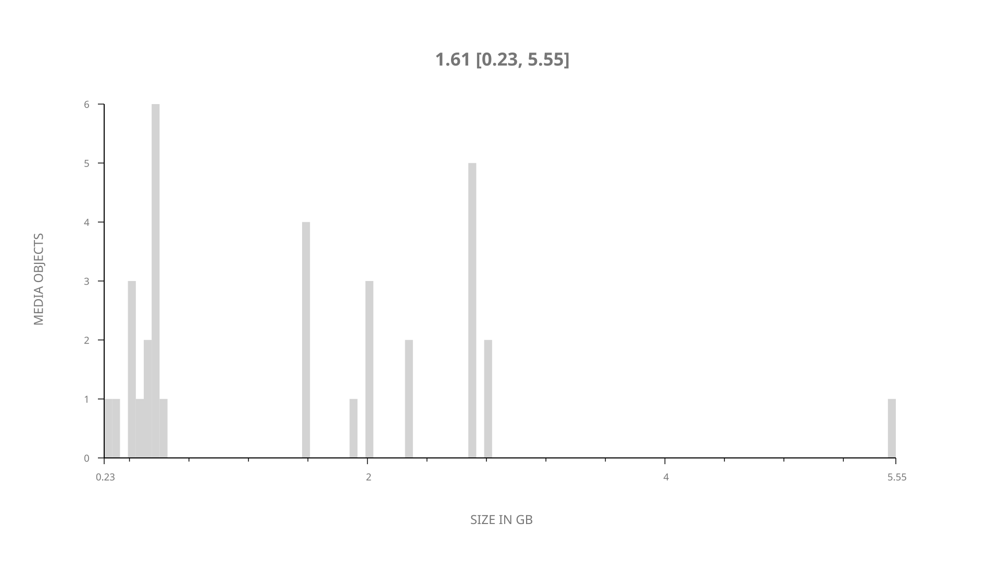
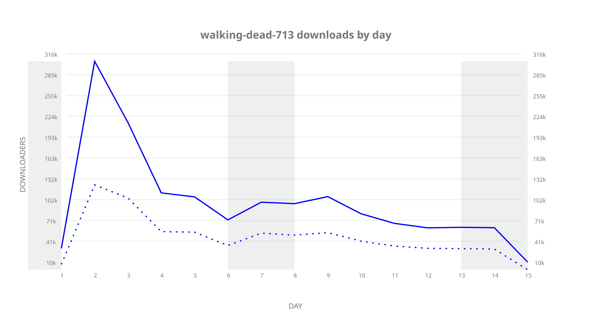
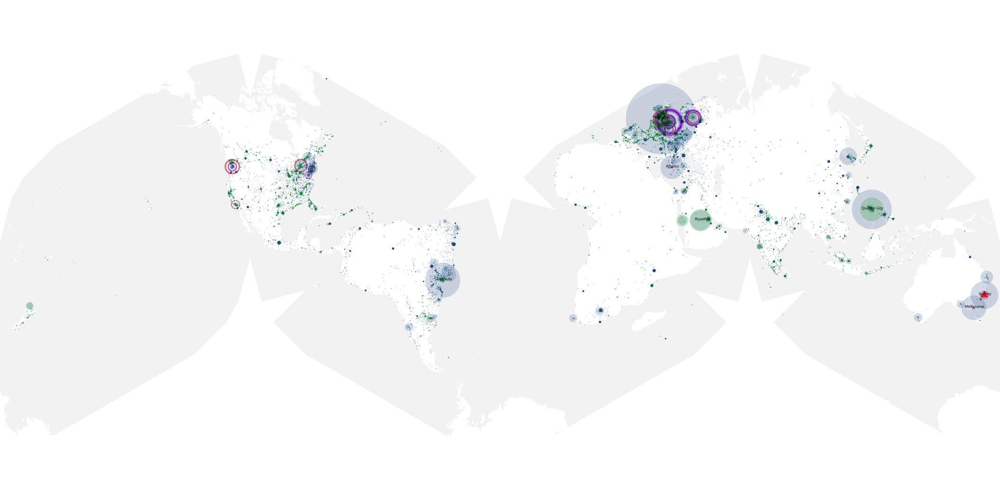
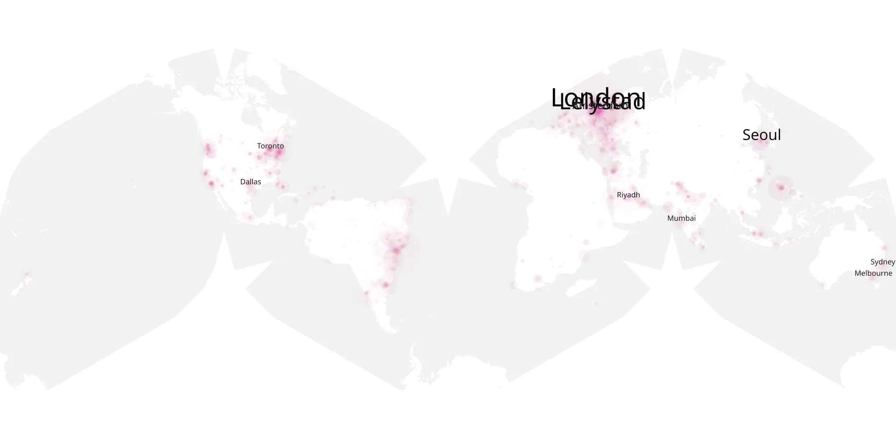
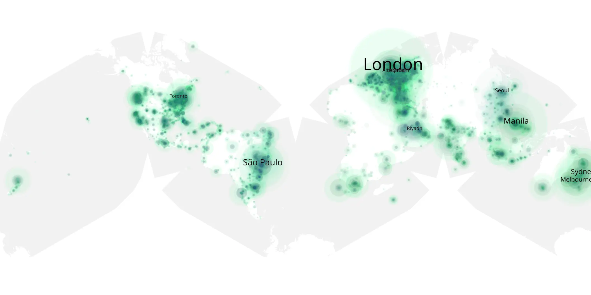

# walking-dead-713 sample cache audit

## 1. Media object

| Field | Value |
| --- | --- |
| Media object | The Walking Dead |
| Collection key | `walking-dead-713` |
| imdb_id | [tt1520211](https://www.imdb.com/title/tt1520211/) |
| wikipedia_url | [The Walking Dead (TV series)](https://en.wikipedia.org/wiki/The_Walking_Dead_(TV_series)) |
| Sample dates | 2017-03-12-to-2017-03-26 |
| Sample days | 15 |
| BTIH count | 34 |
| Unique BTIH count | 33 |
| Downloaders total | 987,474 |
| Uploaders total | 522,840 |
| Data version | `2026-08-05` |
| IP geolocation version | `6:1777968300` |

## 2. Sample coverage report

- Generated: 2026-09-09T01:10:36Z
- Sample archive directory: `/mnt/gold/src/alpha60-samples-raw.gold/walking-dead-713.xz`
- Hour directories: 77
- Zero-length sample files: 0
- Other unparsable sample files: 0
- Hourly discontinuities: 76 (239 missing hours)
- Missing days: 0

### Sample archive discontinuities

- hourly gap: last `2017-03-12 21:01`, resumed `2017-03-13 01:01` — missing 3 hour(s)
- hourly gap: last `2017-03-13 01:01`, resumed `2017-03-13 05:01` — missing 3 hour(s)
- hourly gap: last `2017-03-13 05:01`, resumed `2017-03-13 09:00` — missing 2 hour(s)
- hourly gap: last `2017-03-13 09:00`, resumed `2017-03-13 13:00` — missing 3 hour(s)
- hourly gap: last `2017-03-13 13:00`, resumed `2017-03-13 17:00` — missing 3 hour(s)
- hourly gap: last `2017-03-13 17:00`, resumed `2017-03-13 21:00` — missing 3 hour(s)
- hourly gap: last `2017-03-13 21:00`, resumed `2017-03-14 01:00` — missing 3 hour(s)
- hourly gap: last `2017-03-14 01:00`, resumed `2017-03-14 05:00` — missing 3 hour(s)
- hourly gap: last `2017-03-14 05:00`, resumed `2017-03-14 09:00` — missing 3 hour(s)
- hourly gap: last `2017-03-14 09:00`, resumed `2017-03-14 13:00` — missing 3 hour(s)
- hourly gap: last `2017-03-14 13:00`, resumed `2017-03-14 17:00` — missing 3 hour(s)
- hourly gap: last `2017-03-14 17:00`, resumed `2017-03-14 21:00` — missing 3 hour(s)
- hourly gap: last `2017-03-14 21:00`, resumed `2017-03-15 09:00` — missing 11 hour(s)
- hourly gap: last `2017-03-15 09:00`, resumed `2017-03-15 13:00` — missing 3 hour(s)
- hourly gap: last `2017-03-15 13:00`, resumed `2017-03-15 17:00` — missing 3 hour(s)
- hourly gap: last `2017-03-15 17:00`, resumed `2017-03-15 21:00` — missing 3 hour(s)
- hourly gap: last `2017-03-15 21:00`, resumed `2017-03-16 01:00` — missing 3 hour(s)
- hourly gap: last `2017-03-16 01:00`, resumed `2017-03-16 05:00` — missing 3 hour(s)
- hourly gap: last `2017-03-16 05:00`, resumed `2017-03-16 09:00` — missing 3 hour(s)
- hourly gap: last `2017-03-16 09:00`, resumed `2017-03-16 13:00` — missing 3 hour(s)
- hourly gap: last `2017-03-16 13:00`, resumed `2017-03-16 21:00` — missing 7 hour(s)
- hourly gap: last `2017-03-16 21:00`, resumed `2017-03-17 01:00` — missing 3 hour(s)
- hourly gap: last `2017-03-17 01:00`, resumed `2017-03-17 05:00` — missing 3 hour(s)
- hourly gap: last `2017-03-17 05:00`, resumed `2017-03-17 09:00` — missing 3 hour(s)
- hourly gap: last `2017-03-17 09:00`, resumed `2017-03-17 13:00` — missing 3 hour(s)
- hourly gap: last `2017-03-17 13:00`, resumed `2017-03-17 17:00` — missing 3 hour(s)
- hourly gap: last `2017-03-17 17:00`, resumed `2017-03-17 21:00` — missing 3 hour(s)
- hourly gap: last `2017-03-17 21:00`, resumed `2017-03-18 01:00` — missing 3 hour(s)
- hourly gap: last `2017-03-18 01:00`, resumed `2017-03-18 05:00` — missing 3 hour(s)
- hourly gap: last `2017-03-18 05:00`, resumed `2017-03-18 09:00` — missing 3 hour(s)
- hourly gap: last `2017-03-18 09:00`, resumed `2017-03-18 13:00` — missing 3 hour(s)
- hourly gap: last `2017-03-18 13:00`, resumed `2017-03-18 17:00` — missing 3 hour(s)
- hourly gap: last `2017-03-18 17:00`, resumed `2017-03-18 21:00` — missing 3 hour(s)
- hourly gap: last `2017-03-18 21:00`, resumed `2017-03-19 01:00` — missing 3 hour(s)
- hourly gap: last `2017-03-19 01:00`, resumed `2017-03-19 05:00` — missing 3 hour(s)
- hourly gap: last `2017-03-19 05:00`, resumed `2017-03-19 09:00` — missing 3 hour(s)
- hourly gap: last `2017-03-19 09:00`, resumed `2017-03-19 13:00` — missing 3 hour(s)
- hourly gap: last `2017-03-19 13:00`, resumed `2017-03-19 17:00` — missing 3 hour(s)
- hourly gap: last `2017-03-19 17:00`, resumed `2017-03-19 21:00` — missing 3 hour(s)
- hourly gap: last `2017-03-19 21:00`, resumed `2017-03-20 01:00` — missing 3 hour(s)
- hourly gap: last `2017-03-20 01:00`, resumed `2017-03-20 05:00` — missing 3 hour(s)
- hourly gap: last `2017-03-20 05:00`, resumed `2017-03-20 09:00` — missing 3 hour(s)
- hourly gap: last `2017-03-20 09:00`, resumed `2017-03-20 13:00` — missing 3 hour(s)
- hourly gap: last `2017-03-20 13:00`, resumed `2017-03-20 17:00` — missing 3 hour(s)
- hourly gap: last `2017-03-20 17:00`, resumed `2017-03-20 21:00` — missing 3 hour(s)
- hourly gap: last `2017-03-20 21:00`, resumed `2017-03-21 01:00` — missing 3 hour(s)
- hourly gap: last `2017-03-21 01:00`, resumed `2017-03-21 05:00` — missing 3 hour(s)
- hourly gap: last `2017-03-21 05:00`, resumed `2017-03-21 09:00` — missing 3 hour(s)
- hourly gap: last `2017-03-21 09:00`, resumed `2017-03-21 13:00` — missing 3 hour(s)
- hourly gap: last `2017-03-21 13:00`, resumed `2017-03-21 17:00` — missing 3 hour(s)
- hourly gap: last `2017-03-21 17:00`, resumed `2017-03-21 21:00` — missing 3 hour(s)
- hourly gap: last `2017-03-21 21:00`, resumed `2017-03-22 01:00` — missing 3 hour(s)
- hourly gap: last `2017-03-22 01:00`, resumed `2017-03-22 05:00` — missing 3 hour(s)
- hourly gap: last `2017-03-22 05:00`, resumed `2017-03-22 09:00` — missing 3 hour(s)
- hourly gap: last `2017-03-22 09:00`, resumed `2017-03-22 13:00` — missing 3 hour(s)
- hourly gap: last `2017-03-22 13:00`, resumed `2017-03-22 17:00` — missing 3 hour(s)
- hourly gap: last `2017-03-22 17:00`, resumed `2017-03-22 21:00` — missing 3 hour(s)
- hourly gap: last `2017-03-22 21:00`, resumed `2017-03-23 01:00` — missing 3 hour(s)
- hourly gap: last `2017-03-23 01:00`, resumed `2017-03-23 05:00` — missing 3 hour(s)
- hourly gap: last `2017-03-23 05:00`, resumed `2017-03-23 09:00` — missing 3 hour(s)
- hourly gap: last `2017-03-23 09:00`, resumed `2017-03-23 13:00` — missing 3 hour(s)
- hourly gap: last `2017-03-23 13:00`, resumed `2017-03-23 17:00` — missing 3 hour(s)
- hourly gap: last `2017-03-23 17:00`, resumed `2017-03-23 21:00` — missing 3 hour(s)
- hourly gap: last `2017-03-23 21:00`, resumed `2017-03-24 01:00` — missing 3 hour(s)
- hourly gap: last `2017-03-24 01:00`, resumed `2017-03-24 05:00` — missing 3 hour(s)
- hourly gap: last `2017-03-24 05:00`, resumed `2017-03-24 09:00` — missing 3 hour(s)
- hourly gap: last `2017-03-24 09:00`, resumed `2017-03-24 13:00` — missing 3 hour(s)
- hourly gap: last `2017-03-24 13:00`, resumed `2017-03-24 17:00` — missing 3 hour(s)
- hourly gap: last `2017-03-24 17:00`, resumed `2017-03-24 21:00` — missing 3 hour(s)
- hourly gap: last `2017-03-24 21:00`, resumed `2017-03-25 01:00` — missing 3 hour(s)
- hourly gap: last `2017-03-25 01:00`, resumed `2017-03-25 05:00` — missing 3 hour(s)
- hourly gap: last `2017-03-25 05:00`, resumed `2017-03-25 09:00` — missing 3 hour(s)
- hourly gap: last `2017-03-25 09:00`, resumed `2017-03-25 13:00` — missing 3 hour(s)
- hourly gap: last `2017-03-25 13:00`, resumed `2017-03-25 17:00` — missing 3 hour(s)
- hourly gap: last `2017-03-25 17:00`, resumed `2017-03-25 21:00` — missing 3 hour(s)
- hourly gap: last `2017-03-25 21:00`, resumed `2017-03-26 01:00` — missing 3 hour(s)

## 3. Media objects file size histogram

## 4. Visualization pass — graphs

### Downloads by week cumulative (normalized start)



### Downloads by day, Saturday and Sunday in gray

## 5. Visualization pass — maps

### Cumulative geographic slices

| Africa | Americas | Asia | Europe | Oceania | Unknown |
| --- | --- | --- | --- | --- | --- |
| 3.14 | 25.84 | 17.00 | 22.77 | 4.55 | 0.47 |

### Cumulative network infrastructure

{:target="_blank" rel="noopener"}

### Cumulative data maps

**Cumulative >= 1080p**

{:target="_blank" rel="noopener"}

**Cumulative < 1080p**

{:target="_blank" rel="noopener"}
