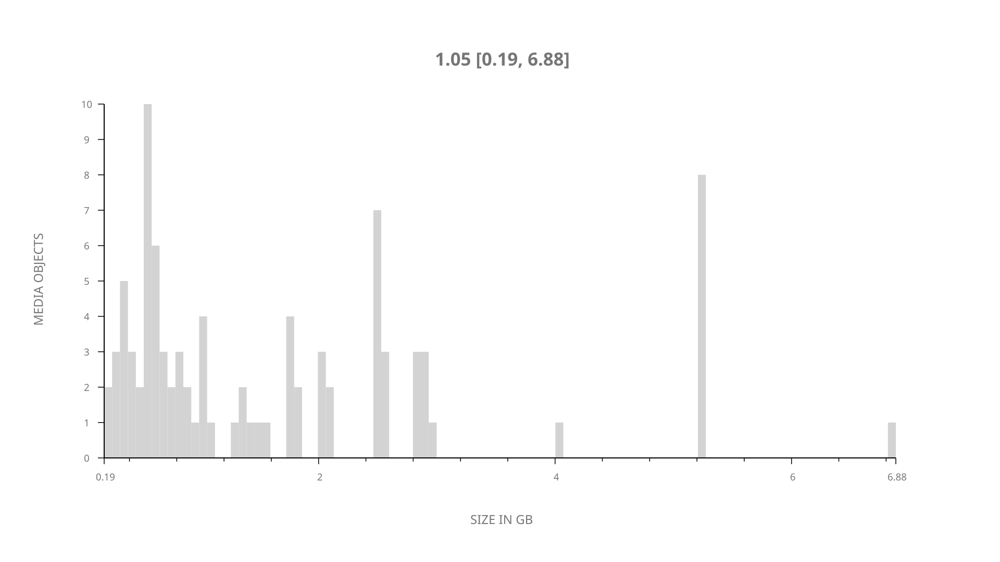
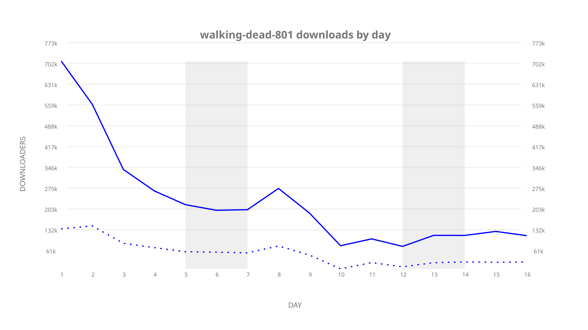
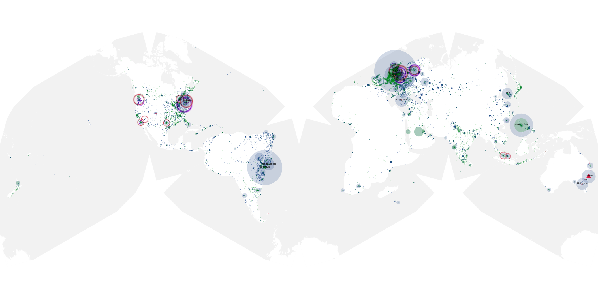
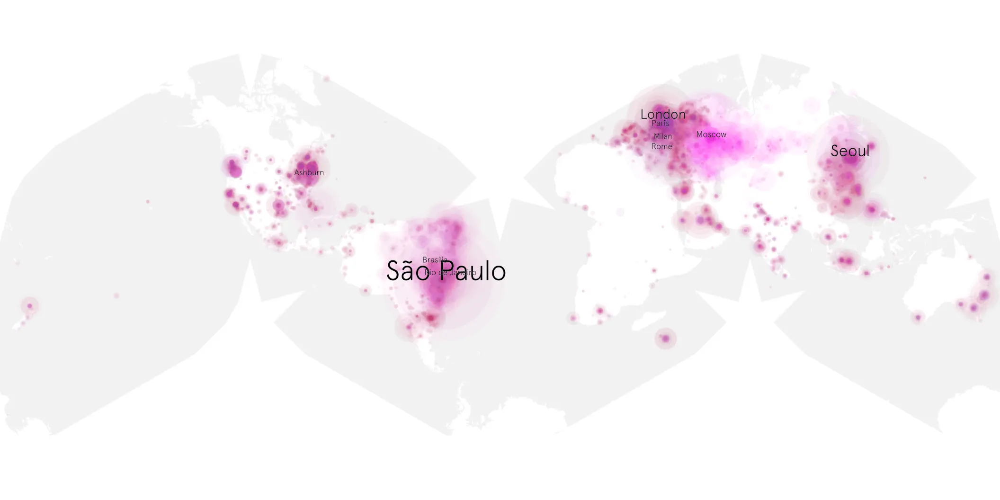
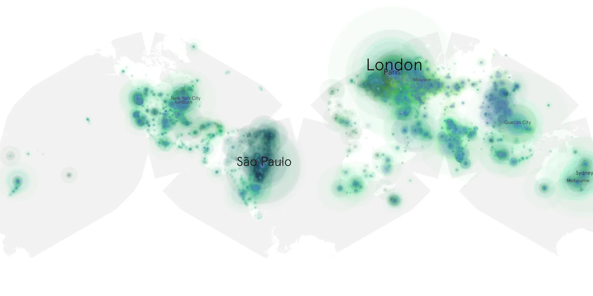

# walking-dead-801 sample cache audit

## 1. Media object

| Field | Value |
| --- | --- |
| Media object | The Walking Dead |
| Collection key | `walking-dead-801` |
| imdb_id | [tt1520211](https://www.imdb.com/title/tt1520211/) |
| wikipedia_url | [The Walking Dead (TV series)](https://en.wikipedia.org/wiki/The_Walking_Dead_(TV_series)) |
| Sample dates | 2017-10-23-to-2017-11-07 |
| Sample days | 16 |
| BTIH count | 110 |
| Unique BTIH count | 91 |
| Downloaders total | 4,294,781 |
| Uploaders total | 1,381,997 |
| Data version | `2026-08-05` |
| IP geolocation version | `6:1777968300` |

## 2. Sample coverage report

- Generated: 2026-09-09T01:10:36Z
- Sample archive directory: `/mnt/gold/src/alpha60-samples-raw.gold/walking-dead-801.xz`
- Hour directories: 355
- Zero-length sample files: 0
- Other unparsable sample files: 0
- Hourly discontinuities: 4 (25 missing hours)
- Missing days: 0

### Sample archive discontinuities

- hourly gap: last `2017-10-29 04:00`, resumed `2017-10-29 06:00` — missing 1 hour(s)
- hourly gap: last `2017-11-01 12:00`, resumed `2017-11-02 04:00` — missing 15 hour(s)
- hourly gap: last `2017-11-02 07:00`, resumed `2017-11-02 10:00` — missing 2 hour(s)
- hourly gap: last `2017-11-03 11:00`, resumed `2017-11-03 19:00` — missing 7 hour(s)

## 3. Media objects file size histogram

## 4. Visualization pass — graphs

### Downloads by week cumulative (normalized start)



### Downloads by day, Saturday and Sunday in gray

## 5. Visualization pass — maps

### Cumulative geographic slices

| Africa | Americas | Asia | Europe | Oceania | Unknown |
| --- | --- | --- | --- | --- | --- |
| 3.13 | 27.28 | 14.46 | 27.47 | 2.79 | 0.69 |

### Cumulative network infrastructure

{:target="_blank" rel="noopener"}

### Cumulative data maps

**Cumulative >= 1080p**

{:target="_blank" rel="noopener"}

**Cumulative < 1080p**

{:target="_blank" rel="noopener"}
